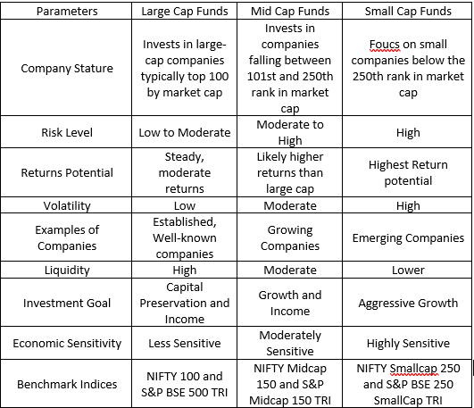

## Table of Contents

## What is an All-Cap Fund?

An All-Cap Fund is a type of mutual fund or investment fund that can invest in companies of any size. This means it can buy stocks from small, medium, and large companies. The main advantage of an All-Cap Fund is that it gives the fund manager the flexibility to pick the best stocks, no matter the size of the company. This can potentially lead to higher returns because the manager can choose from a wider range of investment options.

However, with this flexibility comes more risk. Because the fund can invest in smaller companies, which are often riskier than larger ones, the value of the fund can go up and down more than a fund that only invests in big companies. It's important for investors to understand this risk before putting their money into an All-Cap Fund. Overall, an All-Cap Fund can be a good choice for someone looking for a diverse investment that can adapt to different market conditions.

## How does an All-Cap Fund differ from other types of funds?

An All-Cap Fund is different from other types of funds because it can invest in companies of any size. Other funds might only focus on small companies, or just big companies. For example, a Small-Cap Fund only buys stocks from small companies, and a Large-Cap Fund only buys stocks from big companies. But an All-Cap Fund can pick stocks from small, medium, and large companies all at the same time. This gives the fund manager more choices and the ability to find the best opportunities no matter the size of the company.

This flexibility can be good because it allows the fund to adapt to different market conditions. If small companies are doing well, the fund can invest more in them. If big companies are doing better, the fund can shift its investments there. However, this also means that All-Cap Funds can be riskier than funds that stick to one size of company. Small companies can be more unpredictable, so an All-Cap Fund might go up and down more than a fund that only invests in big, stable companies. This is something investors need to think about when choosing where to put their money.

## What are the benefits of investing in an All-Cap Fund?

Investing in an All-Cap Fund has several benefits. One big advantage is the flexibility it gives to the fund manager. They can pick the best stocks from small, medium, and large companies. This means they can find great investment opportunities no matter the size of the company. If small companies are doing well, the manager can invest more in them. If big companies are doing better, they can shift their investments there. This flexibility can help the fund perform better over time.

Another benefit is diversification. By investing in companies of all sizes, an All-Cap Fund spreads out the risk. If one part of the market isn't doing well, the fund can still do okay because it has investments in other areas. This can help protect your money and make your investment more stable. Overall, an All-Cap Fund can be a good choice if you want a diverse investment that can adapt to different market conditions.

## What are the potential risks associated with All-Cap Funds?

One risk of investing in an All-Cap Fund is that it can be more unpredictable than other types of funds. Because these funds can invest in small companies, which are often riskier than big ones, the value of the fund can go up and down a lot. If the small companies the fund has invested in don't do well, it can hurt the overall performance of the fund. This means that if you're someone who doesn't like a lot of ups and downs in your investments, an All-Cap Fund might not be the best choice for you.

Another risk is that the flexibility of an All-Cap Fund can sometimes work against it. The fund manager has a lot of choices, and if they make bad decisions about which stocks to buy, it can lead to poor performance. Also, because the fund can invest in companies of all sizes, it might be harder to predict how the fund will do compared to a fund that focuses on just one size of company. This unpredictability can be a concern for investors who want to know what to expect from their investments.

## How do All-Cap Funds select their investments?

All-Cap Funds select their investments by looking at companies of all sizes. The fund manager has the freedom to pick stocks from small, medium, and large companies. They do this by analyzing different things like how much the company is growing, how much profit it makes, and what its future looks like. The goal is to find the best opportunities no matter the size of the company. This means they might invest more in small companies if they think they will do well, or they might focus on big companies if they see more potential there.

The selection process also involves looking at the overall market and economic conditions. If the economy is doing well and small companies are growing fast, the fund manager might decide to invest more in those smaller companies. On the other hand, if big companies are doing better and seem more stable, the fund might shift its focus to those. The key is flexibility and the ability to adapt to what's happening in the market. This way, the fund can try to get the best returns possible by [picking](/wiki/asset-class-picking) the right mix of investments from all different sizes of companies.

## Can you provide examples of well-known All-Cap Funds?

One well-known All-Cap Fund is the Vanguard U.S. Growth Fund (VWUSX). This fund aims to grow over time by investing in companies of all sizes that show strong growth potential. The fund managers look at things like how fast a company is growing and how much profit it makes. They pick stocks from small, medium, and large companies to try to get the best returns for investors.

Another example is the T. Rowe Price Capital Appreciation Fund (PRWCX). This fund also invests in companies of all sizes but focuses on finding high-quality stocks that can provide steady growth. The fund managers at T. Rowe Price look for companies that are well-managed and have a good chance of increasing in value over time. This fund is known for its careful approach to picking investments, trying to balance growth with stability.

Both of these funds show how All-Cap Funds work by giving their managers the freedom to choose the best stocks from any size of company. This flexibility helps them adapt to different market conditions and try to find the best opportunities for growth.

## What is the typical asset allocation in an All-Cap Fund?

The typical asset allocation in an All-Cap Fund can vary a lot because these funds have the flexibility to invest in companies of any size. Usually, an All-Cap Fund will have a mix of small, medium, and large company stocks. The exact mix depends on what the fund manager thinks will do well in the market. For example, if small companies are growing fast, the fund might have more money in small company stocks. If big companies seem more stable, the fund might put more money into large company stocks.

The goal of the asset allocation in an All-Cap Fund is to balance growth and risk. By spreading investments across different sizes of companies, the fund tries to find the best opportunities for growth while also managing risk. This means the fund might have a bit more in one size of company at one time and then change as market conditions change. The key is to keep the portfolio flexible so the fund can adapt and try to perform well no matter what's happening in the market.

## How do All-Cap Funds perform compared to market benchmarks?

All-Cap Funds can perform differently compared to market benchmarks. Market benchmarks, like the S&P 500, are made up of big companies. Because All-Cap Funds can invest in small, medium, and large companies, their performance can be different from these benchmarks. Sometimes, All-Cap Funds do better than the benchmarks if the fund manager picks good stocks from small and medium companies that grow fast. Other times, they might not do as well if those smaller companies don't do well.

The performance of All-Cap Funds compared to market benchmarks depends a lot on how the fund manager chooses to invest the fund's money. If the manager is good at finding the best opportunities in all sizes of companies, the fund can beat the benchmarks. But if the manager makes bad choices, especially in the smaller companies, the fund might not do as well as the benchmarks. So, the success of an All-Cap Fund compared to market benchmarks really comes down to the skill of the fund manager and the choices they make.

## What role do All-Cap Funds play in a diversified investment portfolio?

All-Cap Funds can be a good part of a diversified investment portfolio because they give you a mix of small, medium, and large company stocks. This mix helps spread out the risk. If one size of company isn't doing well, the other sizes might do better and help balance things out. This way, your money isn't all in one type of company, which can make your investments more stable. By including an All-Cap Fund, you get to benefit from the growth of different kinds of companies, which can lead to better overall returns.

Another reason All-Cap Funds are useful in a diversified portfolio is their flexibility. The fund manager can change where the money goes based on what's happening in the market. If small companies are growing fast, they can put more money there. If big companies are doing better, they can shift the money to those. This adaptability can help the fund do well no matter what's going on in the economy. So, by adding an All-Cap Fund to your portfolio, you're not only spreading your risk but also giving your investments a chance to grow in different ways.

## How can an investor evaluate the performance of an All-Cap Fund?

To evaluate the performance of an All-Cap Fund, an investor should look at how it has done over time compared to other funds and market benchmarks. One way to do this is by checking the fund's returns over different periods, like one year, three years, or five years. If the fund has done better than the S&P 500 or other similar funds, that's a good sign. Also, look at the fund's risk, which you can see in its standard deviation. A fund with high returns but also high risk might not be as good as one with slightly lower returns but less risk.

Another important thing to consider is the fund manager's track record. A good manager can make a big difference in how well an All-Cap Fund does. Look at how long the manager has been in charge and how the fund has performed during their time. It's also helpful to read the fund's prospectus and any reports to understand what the fund is investing in and how it's managed. By looking at all these things, an investor can get a good idea of whether an All-Cap Fund is a good choice for their portfolio.

## What are the tax implications of investing in All-Cap Funds?

When you invest in an All-Cap Fund, you need to think about taxes. These funds can have different types of income, like dividends and capital gains. Dividends are payments companies make to shareholders, and they are usually taxed at a lower rate than regular income. Capital gains happen when the fund sells stocks for more than it paid for them. If the fund holds the stocks for more than a year before selling, the gains are taxed at a long-term capital gains rate, which is usually lower than the short-term rate for stocks held less than a year.

The tax you pay on an All-Cap Fund can change depending on how often the fund manager buys and sells stocks. If the fund trades a lot, it might have more capital gains, which means more taxes for you. Also, if you sell your shares in the fund, you'll have to pay taxes on any profit you made. It's a good idea to talk to a tax advisor to understand how investing in an All-Cap Fund might affect your taxes. They can help you plan and maybe find ways to lower what you owe.

## How do regulatory changes impact the management and performance of All-Cap Funds?

Regulatory changes can have a big effect on how All-Cap Funds are managed and how well they do. When the rules change, fund managers might have to change what they can invest in or how they do it. For example, new rules might limit how much they can invest in certain kinds of companies or make them report more about their investments. This can mean more work for the managers and might make them change their strategy to follow the new rules. If the rules make it harder to invest in small companies, the fund might have to focus more on bigger ones, which could change how the fund performs.

Also, regulatory changes can affect the costs of running an All-Cap Fund. New rules might make it more expensive to manage the fund because of extra reporting or compliance work. These higher costs can eat into the fund's returns, making it harder for the fund to do well. Sometimes, changes in regulations can also make the market more unpredictable, which can make it tougher for the fund manager to pick the right stocks. So, when the rules change, it can shake things up for All-Cap Funds and affect how they perform over time.

## What is the understanding of Investment Funds and Mutual Funds?

Investment funds are an essential component of modern financial markets, providing a means for investors to pool their resources with the aim of purchasing a diversified portfolio of securities. These funds are collectively managed by professional investment managers who make decisions on behalf of the investors. The fundamental advantage of investment funds lies in their ability to offer access to a broad range of assets, enabling investors to benefit from professional management and economies of scale. 

Mutual funds represent a specific type of investment fund where investors purchase shares that correspond to a proportional interest in the fund's holdings. This structure allows investors to gain exposure to a diversified portfolio without needing to buy the individual securities themselves. Mutual funds cater to a wide array of investment objectives and strategies, offering varying degrees of focus on different asset classes such as stocks, bonds, or a combination thereof. Such diversification often mitigates risk when compared to investing in individual securities since the performance of the fund is not overly reliant on a single investment.

The principal of diversification, a core concept in portfolio management, is articulated through the mutual fund structure. By pooling investor funds to purchase a collection of assets, mutual funds mitigate the unsystematic risk associated with individual investments. This is mathematically represented in portfolio theory, where the total risk ($\sigma_p$) of a diversified portfolio is generally less than the weighted average of the risks ($\sigma_i$) of the individual assets:

$$
\sigma_p = \sqrt{\sum (w_i \cdot \sigma_i)^2 + 2 \sum (w_i \cdot w_j \cdot \text{Cov}(i, j))}
$$

where $w_i$ is the weight of the i-th asset in the portfolio and $\text{Cov}(i, j)$ represents the covariance between the returns of asset $i$ and asset $j$.

Mutual funds employ different strategies based on market opportunities and investor demand. For instance, equity funds focus primarily on stocks, bond funds on fixed-income securities, and balanced funds aim for a mix of both for stable returns. Furthermore, there are sectoral funds, index funds, and international funds, each offering its specific set of advantages and tailored risk-reward profiles.

In summary, investment funds, and particularly mutual funds, provide investors with an array of options for achieving diversification, access to professional management, and potential for favorable returns, albeit they also necessitate an understanding of associated fees and market risks.

## References & Further Reading

[1]: Bergstra, J., Bardenet, R., Bengio, Y., & Kégl, B. (2011). ["Algorithms for Hyper-Parameter Optimization."](https://dl.acm.org/doi/10.5555/2986459.2986743) Advances in Neural Information Processing Systems 24.

[2]: ["Advances in Financial Machine Learning"](https://www.amazon.com/Advances-Financial-Machine-Learning-Marcos/dp/1119482089) by Marcos Lopez de Prado

[3]: ["Evidence-Based Technical Analysis: Applying the Scientific Method and Statistical Inference to Trading Signals"](https://www.amazon.com/Evidence-Based-Technical-Analysis-Scientific-Statistical/dp/0470008741) by David Aronson

[4]: ["Machine Learning for Algorithmic Trading"](https://github.com/stefan-jansen/machine-learning-for-trading) by Stefan Jansen

[5]: ["Quantitative Trading: How to Build Your Own Algorithmic Trading Business"](https://www.amazon.com/Quantitative-Trading-Build-Algorithmic-Business/dp/1119800064) by Ernest P. Chan