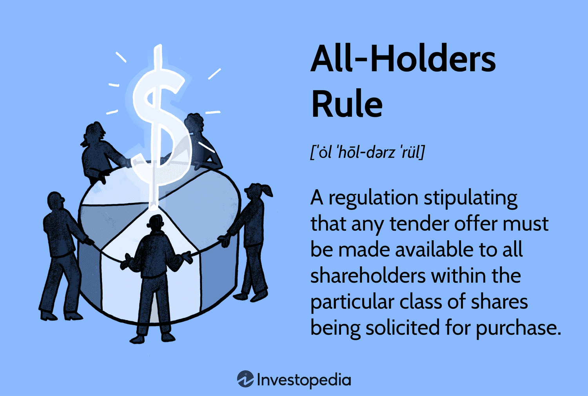

In the intricate world of investment regulation, understanding key rules and practices is essential for investors and firms alike. Navigating this complex environment involves a mastery of several foundational elements, such as securities law, the all-holders rule, investment regulations, and algorithmic trading. Each of these components plays a vital role in ensuring market integrity and safeguarding investor interests.

Securities law acts as the cornerstone for financial markets, establishing the transparency and fairness necessary for the trading of stocks, bonds, and other financial instruments. It provides a structured framework within which companies must operate, fostering trust and mitigating fraudulent activities. Complementing these laws, the all-holders rule ensures equitable treatment of shareholders during tender offers by mandating that offers be made available to all holders of a particular class of shares. This becomes particularly important in scenarios such as mergers and acquisitions, where shareholder equity is paramount.



Investment regulations further reinforce the market's stability, outlining ethical trading practices and enforcing transparency to maintain order and protect investors. These regulations are designed to mitigate risks associated with market volatility and misinformation, offering investors a more predictable and fair marketplace.

The advent of algorithmic trading has introduced new dynamics to financial markets, leveraging technology-driven strategies to enhance trading efficiency. However, with these advancements come new regulatory challenges. Entities like the SEC and FINRA have implemented guidelines to regulate algorithmic trading, ensuring safe and sound trading environments. These regulations require firms to practice effective supervision and risk management, crucial in preventing disruptions and maintaining system integrity.

This article examines how these elements collectively influence modern investing, helping market participants navigate an increasingly complex financial landscape. By understanding the interplay between these factors, investors and firms can better adapt to and succeed within this framework while contributing to a robust and fair financial environment.

## Table of Contents

## Understanding Securities Law and Its Impact

Securities law is foundational to the integrity and functioning of financial markets, aimed at ensuring transparency and fairness during the trading process. These laws are designed to regulate the issuance and trading of various financial instruments such as stocks, bonds, and derivatives, thereby minimizing the risks of fraud and market manipulation.

At its core, securities law in the United States is governed by key statutes such as the Securities Act of 1933 and the Securities Exchange Act of 1934. The primary goal is to mandate disclosure of pertinent financial information, allowing investors to make informed decisions. The Securities Act of 1933 requires that investors receive financial and other significant information concerning securities being offered for public sale. It prohibits deceit, misrepresentations, and other fraud in the sale of securities. Complementing this, the Securities Exchange Act of 1934 focuses on regulating the secondary trading of securities—stocks, bonds, and debentures—through exchanges and over-the-counter markets. This act also established the Securities and Exchange Commission (SEC), the body charged with overseeing and enforcing federal securities laws.

To foster investor trust, securities law imposes rigorous compliance requirements on firms. This includes mandatory registration of securities, adherence to strict disclosure obligations, and periodic financial reporting. These obligations ensure that companies provide transparent and consistent information about their financial health and operational strategies, thus allowing investors to assess their true value and associated risks.

Fraud prevention is a major objective of securities law, which includes mechanisms such as the prohibition of insider trading and other fraudulent activities. Insider trading, which involves trading based on non-public, material information, is illegal under the Securities Exchange Act and is punishable by severe penalties including fines and imprisonment. By addressing insider trading and other dishonest practices, securities law aims to level the playing field for all investors, fostering a fairer trading environment.

Overall, compliance with securities law is crucial not only for legal and ethical reasons but also for maintaining market stability and investor confidence. The transparency and accountability enforced by these laws are vital components that contribute to the robustness and credibility of financial markets worldwide.

## Decoding the All-Holders Rule

The all-holders rule is a significant component of securities regulation, primarily designed to ensure equitable treatment of shareholders during tender offers. A tender offer is a public proposal by an individual or entity to purchase some or all shareholders' shares at a specified price, generally at a premium over the current market price. These tenders often occur in the context of mergers and acquisitions, where equity and fairness are of utmost importance.

The Securities and Exchange Commission (SEC) formulated the all-holders rule to prevent discriminatory practices in such offers. It stipulates that any tender offer must be extended uniformly to all holders of the same class of shares. This provision ensures that no individual shareholder is favored over others and that all shareholders have an equal opportunity to evaluate and respond to the offer. By obligating the offeror to communicate the tender offer to each shareholder, the rule protects minority shareholders from being excluded or receiving less favorable terms.

This rule is particularly critical in maintaining shareholder confidence and market integrity during corporate takeovers. It limits the potential for insider advantage and promotes transparency, allowing shareholders to base their decisions on complete and unbiased information. By mandating equal access to tender offers, the rule also facilitates more democratic corporate consolidate processes.

Compliance with the all-holders rule is not merely a recommendation but a legal requirement under U.S. securities law. Violations can result in enforcement actions from regulatory bodies, financial penalties, and an erosion of trust from investors and the broader market. Thus, this rule is a cornerstone in the structure of fair market practices, reinforcing equitable treatment and investor protection in corporate transactions.

## Investment Regulations: Ensuring Fair Play

Investment regulations play a significant role in maintaining market order and safeguarding investor interests. These regulations are designed to ensure that investment firms operate within a framework that emphasizes ethical trading practices and transparency. By upholding these principles, regulatory bodies aim to foster a fair trading environment, mitigate risks associated with market [volatility](/wiki/volatility-trading-strategies), and prevent the dissemination of misinformation.

Investment firms are required to comply with a diverse range of guidelines that dictate their operational conduct. This includes adherence to ethical standards, which involve avoiding conflicts of interest and ensuring that all transactions are conducted with the utmost integrity. Transparency, another pivotal component, mandates that firms disclose essential information about financial products, potential risks, and fees, enabling investors to make informed decisions.

Regulatory bodies such as the U.S. Securities and Exchange Commission (SEC) and the Financial Industry Regulatory Authority (FINRA) enforce these regulations to stabilize financial markets. These organizations monitor trading activities to detect and prevent fraudulent practices, insider trading, and other forms of market manipulation. By establishing stringent reporting requirements, they ensure that accurate and timely information is available to all market participants, thus leveling the playing field.

In addition to ethical and transparency mandates, investment regulations often encompass measures aimed at controlling systemic risk. This involves setting capital requirements for firms and implementing rules to limit extreme leverage usage, which can amplify losses during market downturns. These precautions help maintain market stability and protect investors from potential financial crises.

These foundational principles and regulatory mechanisms collectively mitigate the risks associated with market volatility and misinformation. By enforcing strict compliance with ethical trading practices and ensuring transparency, regulatory bodies aim to protect investors and uphold the integrity of the financial markets. Thus, adhering to investment regulations is crucial for market participants seeking to maintain trust and ensure fair play in the financial arena.

## The Rise of Algorithmic Trading

Algorithmic trading has significantly altered financial markets by utilizing advanced computer algorithms to execute trades. These automated trading strategies analyze large data sets at high speeds, enabling traders to capitalize on market inefficiencies more efficiently than traditional methods. The rise of [algorithmic trading](/wiki/algorithmic-trading) has introduced both opportunities and challenges to market participants and regulatory bodies.

The U.S. Securities and Exchange Commission (SEC) and the Financial Industry Regulatory Authority (FINRA) have actively developed guidelines to regulate algorithmic trading, aiming to maintain the stability and integrity of financial markets. These guidelines focus on ensuring that trading systems operate in a manner that minimizes the risk of market disruption and increases transparency.

Effective supervision and risk management are critical in algorithmic trading to ensure system integrity. This involves the implementation of robust risk controls that can prevent erroneous trades and detect any malfunctions in the trading algorithms. For instance, many firms use real-time monitoring systems to track algorithm performance and market conditions. This allows for the quick identification of anomalies that might indicate system failures or unintended trading patterns.

To gain insights into market trends, algorithmic trading often leverages statistical models and [machine learning](/wiki/machine-learning) algorithms. These models help in predicting price movements and optimizing trading strategies. For example, a simple moving average crossover strategy, which signals buy or sell triggers based on two moving averages, can be effectively backtested and implemented using machine learning techniques.

Here is an example of a simple moving average crossover strategy implemented in Python:

```python
import pandas as pd

# Load historical stock data
data = pd.read_csv('stock_data.csv')

# Calculate the short and long moving averages
data['SMA_50'] = data['Close'].rolling(window=50).mean()
data['SMA_200'] = data['Close'].rolling(window=200).mean()

# Generate buy/sell signals
data['Signal'] = 0
data.loc[data['SMA_50'] > data['SMA_200'], 'Signal'] = 1
data.loc[data['SMA_50'] < data['SMA_200'], 'Signal'] = -1

# Print the first few rows of the data
print(data.head())
```

While algorithmic trading offers advantages in terms of speed and efficiency, it is also associated with risks such as flash crashes, where rapid trading can lead to dramatic market swings. Hence, measures like circuit breakers are implemented by exchanges to temporarily halt trading in such events. 

In summary, as algorithmic trading continues to evolve, both traders and regulatory bodies must remain vigilant. Adherence to regulatory standards and ongoing technological advancements are essential to safeguard market integrity and harness the potential of algorithmic trading.

## Navigating Regulatory Compliance in Algorithmic Trading

Firms involved in algorithmic trading are required to comply with stringent regulatory frameworks to manage and mitigate associated risks effectively. This is primarily regulated by organizations such as the Securities and Exchange Commission (SEC) and the Financial Industry Regulatory Authority (FINRA). These regulations are designed to ensure that algorithmic trading does not disrupt market stability or compromise the integrity of financial systems.

A critical component for achieving compliance in algorithmic trading involves implementing comprehensive supervision and control measures. This includes the establishment of protocols to monitor trading activities continuously and systems to detect any anomalies or irregularities. Firms must incorporate thorough risk assessments into their supervisory procedures, focusing on identifying potential vulnerabilities in trading algorithms that could be exploited.

Software development practices are a fundamental aspect of regulatory compliance. Firms should employ rigorous development methodologies, such as Agile or DevOps, to ensure that trading algorithms are robust, secure, and capable of handling high-frequency trading requirements without errors. An essential part of the development process is software testing. Algorithms must undergo extensive testing before deployment, including stress testing under various market conditions to assess their performance and resilience.

Continuously maintaining and updating trading systems is another crucial area of focus. As markets evolve and new data becomes available, trading algorithms need regular updates to accommodate these changes and maintain competitiveness. The update process should be seamless and integrated with existing compliance and control frameworks.

Ongoing compliance involves a commitment to adhere to all relevant regulatory standards and best practices. This includes regular audits of trading systems and processes, documentation of all development and trading activities, and transparent reporting mechanisms for regulatory reviews. Firms must also ensure that all personnel involved in algorithmic trading are adequately trained and aware of the regulatory requirements and ethical standards expected of them.

In summary, navigating regulatory compliance in algorithmic trading requires a multifaceted approach involving rigorous supervision, effective risk management strategies, and adherence to regulatory frameworks. By focusing on software development, testing, system maintenance, and ongoing compliance, firms can mitigate the risks associated with algorithmic trading and maintain market integrity.

## Conclusion

Understanding the nuances of securities law, the all-holders rule, investment regulations, and algorithmic trading is imperative for market participants. These elements collectively ensure that financial markets function with a high degree of fairness and transparency. Securities law establishes a framework that enforces standards for issuers and trading, preventing fraudulent activities and promoting investor confidence. The all-holders rule provides equitable treatment to all shareholders in events like tender offers, fostering fairness during mergers and acquisitions.

Investment regulations encompass a broad range of guidelines aimed at maintaining market stability by fostering ethical practices and transparency. These rules mitigate the inherent risks associated with rapid market movements and misinformation, thus protecting investor interests.

With the rise of technology, algorithmic trading has become a significant force in financial markets, transforming how trades are executed. Regulatory bodies like the Securities and Exchange Commission (SEC) and the Financial Industry Regulatory Authority (FINRA) have established frameworks to address the specific challenges associated with algorithmic trading. Effective risk management and diligent compliance with these regulations are essential to prevent systemic disruptions, which could have widespread implications for market integrity.

For market participants, staying informed and compliant with these evolving regulations is not just a legal responsibility but a strategic advantage. As the financial landscape continues to evolve, adapting to new regulatory requirements ensures not only compliance but also the safeguarding of market positions and investments. Embracing this regulatory environment positions firms and investors to successfully navigate the complexities of modern financial markets, ultimately contributing to a robust and resilient investment ecosystem.

## References & Further Reading

[1]: ["Securities Regulation in a Nutshell"](https://www.amazon.com/Securities-Regulation-Nutshell-Nutshells-Thomas/dp/0314187987) by Thomas Lee Hazen

[2]: ["The Law of Securities Regulation"](https://faculty.westacademic.com/Book/Detail?id=304544) by Thomas Lee Hazen

[3]: ["Investment Valuation: Tools and Techniques for Determining the Value of Any Asset"](https://archive.org/details/investmentvaluat0000damo_n6k9) by Aswath Damodaran

[4]: ["Flash Boys: A Wall Street Revolt"](https://en.wikipedia.org/wiki/Flash_Boys) by Michael Lewis

[5]: Lhabitant, Francois-Serge. ["Handbook of Hedge Funds"](https://www.amazon.com/Handbook-Hedge-Funds-Fran%C3%A7ois-Serge-Lhabitant/dp/0470026634) 

[6]: U.S. Securities and Exchange Commission. ["Fast Answers: Tender Offers"](https://www.sec.gov/taxonomy/term/9)

[7]: U.S. Securities and Exchange Commission. ["Algorithmic Trading"](https://www.sec.gov/files/Algo_Trading_Report_2020.pdf) 

[8]: Financial Industry Regulatory Authority. ["About FINRA"](https://www.finra.org/about)