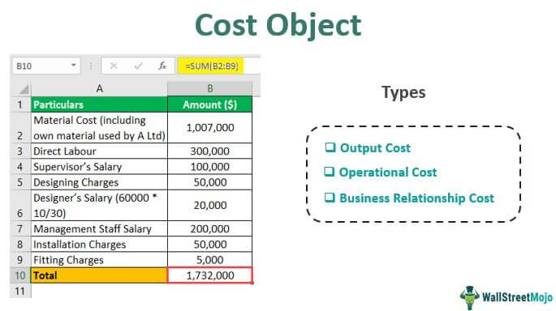

## Table of Contents

## What is the all-in cost?

The all-in cost is the total amount of money you need to spend to buy something or start a project. It includes the price of the item or service, plus any extra fees, taxes, and other costs that come with it. For example, if you're buying a car, the all-in cost would include the car's price, sales tax, registration fees, and any other charges.

Understanding the all-in cost is important because it helps you know the true cost of what you're buying. Sometimes, the listed price might look good, but when you add up all the extra costs, it can be much higher. By knowing the all-in cost, you can make better decisions and avoid surprises later on.

## Why is understanding the all-in cost important for businesses?

Understanding the all-in cost is very important for businesses because it helps them know exactly how much money they need to spend on things like buying materials, hiring workers, or starting new projects. If a business only looks at the basic price and doesn't think about extra costs like taxes, shipping, or maintenance, they might end up spending more money than they planned. This can lead to financial problems and make it hard for the business to make a profit.

Also, knowing the all-in cost helps businesses make better decisions about what to buy and when to buy it. For example, if a business is choosing between two suppliers, looking at the all-in cost can show which one is actually cheaper once all the extra fees are added up. This way, the business can save money and use its resources more wisely. By always thinking about the all-in cost, businesses can avoid unexpected expenses and plan their budgets more accurately.

## How is the all-in cost calculated?

To calculate the all-in cost, you start with the basic price of what you're buying. This could be the price of a product, a service, or something you need for your business. After you know the basic price, you need to add all the extra costs that come with it. These extra costs can include things like taxes, shipping fees, installation charges, and any other fees that you have to pay to get the item or service.

For example, if you're buying a new computer for your business, the all-in cost would be more than just the price of the computer. You would need to add the sales tax, the cost to ship it to your office, and maybe even a fee for setting it up. By adding up all these costs, you get the all-in cost, which tells you the total amount of money you'll need to spend. Knowing this helps businesses plan their budgets better and avoid surprises.

## What are the different types of all-in costs?

All-in costs can be divided into different types based on what they are used for. One type is the all-in cost for buying things, like equipment or supplies. This includes the price of the item, plus taxes, shipping, and any other fees needed to get the item and start using it. Another type is the all-in cost for starting a project, which includes not just the materials and tools, but also the cost of labor, permits, and any other expenses needed to get the project going.

Another type of all-in cost is for services, like hiring a consultant or a contractor. This includes the fee for the service, plus any travel expenses, materials they might need, and other costs that come with using their services. Knowing these different types of all-in costs helps businesses understand the full cost of what they are buying or starting, so they can plan their budgets better and avoid unexpected expenses.

## Can you explain direct all-in costs with examples?

Direct all-in costs are the total costs of something that you can easily connect to a specific product, project, or service. These costs include the price you pay for the thing itself, plus any extra fees and expenses that come with it. For example, if a business buys a new machine for their factory, the direct all-in cost would include the price of the machine, the sales tax, the cost to ship it to the factory, and the fee to set it up and start using it. All these costs are directly linked to buying and using the machine.

Another example of direct all-in costs is when a business hires a contractor to build a new office. The direct all-in cost would include the contractor's fee, the cost of the materials they use, any permits needed for the construction, and the cost of any tools or equipment they need to rent. These costs are all directly related to the project of building the new office. By knowing the direct all-in costs, businesses can understand exactly how much they need to spend on a specific item or project, which helps them plan their budgets better and avoid surprises.

## What are indirect all-in costs and how do they differ from direct costs?

Indirect all-in costs are costs that are not directly linked to a specific product, project, or service. These costs are more general and can be hard to connect to just one thing. For example, the cost of electricity to run a factory is an indirect cost because it helps all the machines in the factory, not just one specific machine. Other examples of indirect costs include rent for the office, salaries for managers who work on many projects, and the cost of general supplies like paper and cleaning materials.

The main difference between indirect and direct all-in costs is how easy it is to connect them to a specific item or project. Direct costs are easy to link because they are only for one thing, like the price of a new machine or the cost of materials for a project. Indirect costs, on the other hand, are shared across many things, so it's harder to say exactly how much of the cost belongs to each one. Understanding both types of costs helps businesses know the true total cost of what they are doing and plan their budgets better.

## How do fixed all-in costs impact business planning?

Fixed all-in costs are costs that stay the same no matter how much a business makes or sells. These can include things like rent for the office, salaries for employees, and insurance. When businesses plan, they need to think about these fixed costs because they have to pay them every month, even if they don't make a lot of money. Knowing the fixed all-in costs helps businesses figure out how much money they need just to keep going, which is called the break-even point.

Understanding fixed all-in costs also helps businesses make decisions about growing or changing. For example, if a business wants to open a new store, they need to think about the new rent and other fixed costs that will come with it. If these costs are too high, the business might decide to wait or find a cheaper place. By planning around fixed all-in costs, businesses can make sure they have enough money to cover these costs and still have money left over to grow or save for the future.

## What role do variable all-in costs play in pricing strategies?

Variable all-in costs are costs that change depending on how much a business makes or sells. These can include things like the cost of materials, shipping fees, and labor costs that go up or down with how much the business is producing. When businesses set their prices, they need to think about these variable costs because they directly affect how much it costs to make each item or provide each service. If variable costs go up, businesses might need to raise their prices to cover these costs and still make a profit.

Understanding variable all-in costs also helps businesses decide on the best pricing strategy. For example, if a business can buy materials cheaper when they buy more, they might lower their prices to sell more and take advantage of the lower costs. On the other hand, if variable costs are high, a business might set higher prices to make sure they cover these costs and make enough money. By keeping an eye on variable all-in costs, businesses can adjust their prices to stay profitable and competitive in the market.

## How can businesses manage and reduce their all-in costs?

Businesses can manage and reduce their all-in costs by carefully looking at both their direct and indirect costs. One way to do this is by finding cheaper suppliers for materials or services. If a business can buy things for less money, their direct costs go down. They can also look at their indirect costs, like rent or utilities, and see if they can find ways to spend less. For example, they might move to a smaller office or switch to a cheaper electricity plan. By keeping track of all their costs and looking for ways to save money, businesses can lower their all-in costs and keep more money for themselves.

Another way businesses can reduce their all-in costs is by being smart about their fixed and variable costs. Fixed costs, like rent or salaries, stay the same no matter how much the business sells. Businesses can try to lower these costs by negotiating better deals or finding cheaper options. Variable costs, like materials or shipping, change with how much the business makes. If a business can find ways to use less materials or get better deals on shipping, they can lower these costs too. By understanding and managing both fixed and variable costs, businesses can make sure they are spending their money wisely and keeping their all-in costs as low as possible.

## What are some common challenges in accurately determining all-in costs?

One common challenge in accurately determining all-in costs is that some costs can be hard to see or predict. For example, a business might know the price of a machine they want to buy, but they might not think about the cost of fixing it if it breaks or the cost of training people to use it. These hidden costs can add up and make the all-in cost much higher than expected. Also, some costs can change over time, like the price of materials or shipping fees. If a business doesn't keep an eye on these changing costs, they might not have the right all-in cost.

Another challenge is figuring out how to divide indirect costs among different projects or products. Indirect costs, like rent or the salary of a manager who works on many things, are not easy to connect to just one thing. A business might have to guess how much of these costs should be added to the all-in cost of each project or product. If they guess wrong, the all-in cost might not be accurate. This can make it hard for the business to plan their budget and make good decisions about what to buy or start.

## How does the all-in cost affect investment decisions?

The all-in cost is really important when businesses are thinking about making investments. An investment could be buying new machines, starting a new project, or even buying another company. When businesses know the all-in cost, they can see how much money they need to spend and if the investment is worth it. If the all-in cost is too high, the business might decide not to make the investment because it might not make enough money back. Knowing the all-in cost helps businesses avoid spending too much and losing money.

Another way the all-in cost affects investment decisions is by helping businesses plan their budgets. When they know the all-in cost, they can see if they have enough money to make the investment without running out of cash. This is important because businesses need to keep some money for everyday costs and emergencies. If the all-in cost is too high and the business can't afford it, they might have to wait until they have more money or find a cheaper way to make the investment. By understanding the all-in cost, businesses can make smarter investment choices and keep their finances healthy.

## What advanced techniques can be used to analyze and optimize all-in costs in large corporations?

Large corporations can use advanced techniques like activity-based costing (ABC) to analyze and optimize their all-in costs. ABC helps businesses see exactly where their money is going by looking at the cost of each activity they do. For example, if a company makes cars, ABC can show how much it costs to make each part of the car, like the engine or the seats. By knowing these costs, the company can find ways to make things cheaper, like using less material or finding a cheaper supplier. This helps them lower their all-in costs and make more money.

Another technique is using data analytics and [machine learning](/wiki/machine-learning) to predict and manage costs. Big companies can collect a lot of data about their costs and use computers to find patterns and make predictions. For example, they might see that the cost of shipping goes up in the summer and plan for it. They can also use machine learning to look at past data and predict future costs, which helps them make better budgets and find ways to save money. By using these advanced techniques, large corporations can keep their all-in costs under control and stay competitive.

## What are the types of all-in costs?

All-in costs are a comprehensive measure of expenses associated with financial transactions. They provide critical insights into the true cost of various financial products. Depending on the context, these costs can significantly influence decision-making and strategy formulation. 

### Examining Types of All-In Costs in Loans

In the context of loans, all-in costs represent the total expenses incurred by the borrower, inclusive of interest rates, fees, and any additional charges. These costs are crucial for borrowers to assess the affordability and overall cost-effectiveness of a loan. The formula to calculate the all-in cost of a loan can be depicted as follows:

$$
\text{All-In Cost} = \text{Interest Charges} + \text{Origination Fees} + \text{Other Charges}
$$

For instance, a mortgage might include the nominal [interest rate](/wiki/interest-rate-trading-strategies), points, private mortgage insurance, and other fees that contribute to the total cost of borrowing.

### Exploring All-In Costs in Financing via Credit Cards

Credit cards represent a unique form of financing where the all-in costs encompass not only the interest rates but also fees such as annual charges, late payment fees, and cash advance fees. Understanding these costs is essential for consumers to manage credit effectively and avoid financial pitfalls. For example, a credit card with a low-interest rate but high annual fees may not be cost-effective if not utilized regularly.

### Understanding All-In Costs from a Business Operational Perspective

From a business perspective, all-in costs include a wide range of expenses associated with operations, such as raw materials, manufacturing costs, and distribution expenses. Businesses must account for these costs to set competitive pricing and achieve profitability. For example, in product manufacturing, all-in costs might include direct labor, materials, and overhead.

Here's a simple representation in Python for calculating all-in costs in a business context:

```python
def calculate_all_in_cost(material_cost, labor_cost, overhead_cost):
    return material_cost + labor_cost + overhead_cost

# Example usage
material_cost = 50000
labor_cost = 30000
overhead_cost = 20000

total_cost = calculate_all_in_cost(material_cost, labor_cost, overhead_cost)
print(f"All-In Cost: ${total_cost}")
```

### Comparisons and Implications of All-In Costs in Various Financial Products

All-in costs vary significantly across different financial products, affecting their appeal and suitability for investors or consumers. For example, the all-in costs of a bond issuance would typically include underwriting fees, legal expenses, and registration fees—costs that significantly impact its yield. Comparatively, investment in mutual funds may involve management fees, entry and [exit](/wiki/exit-strategy) loads, and other charges, which can dilute returns.

The implications of all-in costs extend beyond mere financial evaluation. They influence decisions by determining the feasibility and desirability of investments, lending, or business strategies. Hence, a thorough understanding of these costs is vital for optimizing financial decisions and enhancing profitability across different financial landscapes.

## References & Further Reading

1. **Books**:
   - *Algorithmic Trading: Winning Strategies and Their Rationale* by Ernest P. Chan. This book provides insights into designing and implementing successful algorithmic trading strategies while considering various cost factors.
   - *All About High-Frequency Trading* by Michael Durbin. A comprehensive guide to high-frequency trading, including discussions on transaction and market impact costs.
   - *Quantitative Trading: How to Build Your Own Algorithmic Trading Business* by Ernie Chan. It covers essential aspects of quant trading, including cost management.

2. **Articles**:
   - "Transaction Cost Analysis for Financial Markets" – A scholarly article from the Journal of Finance that explores the significance of transaction costs.
   - "Algorithmic and High-Frequency Trading: An Overview" by Albert J. Menkveld, published in the Annual Review of Financial Economics. It provides an overview of the landscape of algorithmic trading and associated costs.
   - "The Impact of Algorithmic Trading on Market Liquidity" – This research paper published in the Financial Review discusses how algorithmic trading affects market liquidity and transaction costs.

3. **Online Resources**:
   - Investopedia: Offers detailed guides on financial terms including all-in costs and transaction costs associated with algorithmic trading.
   - Khan Academy: Provides educational modules on finance and trading, which include discussions on cost management strategies.

4. **Industry Reports**:
   - Bloomberg Terminal reports on financial markets provide real-time data on costs associated with trading various securities.
   - Deloitte's annual reports on risk management and cost optimization in financial trading.

5. **Software and Tools**:
   - Python libraries such as `zipline` and `quantlib`, which can be used to simulate trading strategies and estimate associated costs.
   - Reuters Eikon, a tool for financial analytics, often includes cost analysis features based on real trading data.

These resources offer a broad spectrum of information ranging from theoretical frameworks to practical applications and can equip readers with the knowledge necessary for effective cost management in financial and [algorithmic trading](/wiki/algorithmic-trading).

