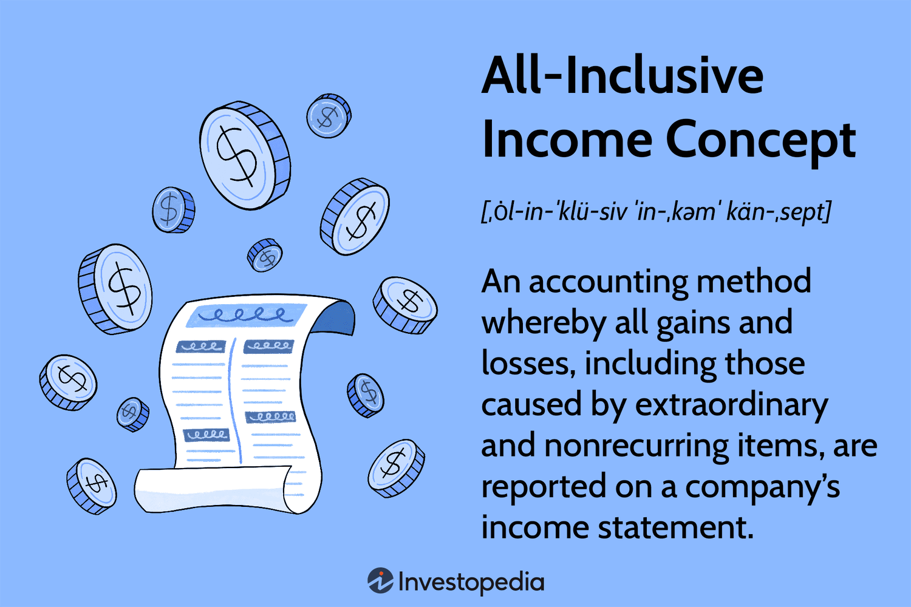

Income is a fundamental concept in economics, representing the monetary gain an individual or entity accrues over a period of time. It is essential for understanding economic performance and is a key indicator in assessing an organization’s financial health. Income is typically classified into different types, such as earned income, investment income, and passive income, each playing a unique role in economic analysis and policy-making.

The all-inclusive income concept is an accounting approach that broadens the scope of income measurement. Unlike traditional income reporting, which often focuses on realized and recurring earnings, the all-inclusive concept incorporates all changes in equity not resulting from transactions with owners. This encompasses not just net income from operations but also other comprehensive income (OCI) elements such as foreign currency translation adjustments, unrealized gains and losses on available-for-sale securities, and changes in pension liabilities. By accounting for these additional components, the all-inclusive income concept aims to provide a more comprehensive view of an entity’s total earnings over a period.



The article you are about to read is structured to provide a detailed exploration of the all-inclusive income concept. Initially, we will define and explain this approach, distinguishing it from traditional income reporting. Key components and principles of this comprehensive accounting method will be highlighted. Following this, we will delve into economic criticisms surrounding the concept, such as its potential to inflate income volatility and limit its reliability due to non-recurring gains or losses. The historical evolution of the approach will be discussed, including the roles of major accounting bodies like the Securities and Exchange Commission (SEC) and the American Institute of Certified Public Accountants (AICPA). Furthermore, we will investigate the relevance of this income concept within algorithmic trading, emphasizing the importance of comprehensive financial data for informed trading strategies. Finally, the conclusion will synthesize insights from the article, considering the future of comprehensive income reporting in economic analysis and financial trading.

## Table of Contents

## Understanding the All-Inclusive Income Concept

The all-inclusive income concept in accounting represents a comprehensive approach to income reporting, capturing all changes in equity from non-owner sources over a specific period. This includes not only typical revenue streams and expenses that impact net income, as seen in traditional income reporting, but also items that bypass net income, directly affecting shareholder equity. Such items often include unrealized gains and losses on certain types of investments, foreign currency translation adjustments, and pension liability adjustments. 

Traditional income reporting typically focuses on net income, which is derived from operational profits and losses within an entity. This succinct perspective is not without drawbacks, primarily due to its exclusion of other comprehensive income (OCI) components that influence a company's financial status. Net income could, for instance, overlook certain market movements affecting asset valuations, which are not realized until a transaction occurs. 

The all-inclusive income approach addresses these limitations by encompassing these broader, often market-driven discrepancies, offering a more holistic financial narrative. Financial statements in this model present both net income and OCI, aggregating them into a comprehensive income figure. This bifurcation allows stakeholders to distinguish recurring operational performance from fluctuating market or policy-driven impacts.

Key components of the all-inclusive income method include:

1. **Net Income:** Core earnings from standard business functions minus expenses, taxes, and costs.

2. **Other Comprehensive Income (OCI):** Elements not captured in net income, reflecting unrealized gains and losses, such as:
   - Unrealized gains or losses on available-for-sale securities.
   - Foreign currency translation adjustments (arising from translating foreign subsidiaries' financial statements).
   - Adjustments in post-retirement benefit plans.
   - Cash flow hedging instruments.

The principle underpinning the all-inclusive income concept is transparency, offering clarity and a full spectrum view of an enterprise’s financial activities and their impacts over a fiscal period. By articulating these various layers of income and expense, the method aims to provide investors and analysts with a nuanced understanding of both short-term performance and long-term viability, essential for accurate financial analysis and forecasting.

In summary, the all-inclusive income concept broadens the understanding of a company's financial performance beyond traditional income reporting. By incorporating OCI alongside net income, it allows for an enriched perspective on both the operational efficiency and standing economic strategies of a business, proving its indispensability in contemporary financial reporting.

## Economic Criticism of the All-Inclusive Income Concept

The all-inclusive income concept, while comprehensive, has been subject to various criticisms from economists and investors. One of the primary concerns is the increased income [volatility](/wiki/volatility-trading-strategies) that may result from its implementation. Traditional income statements often focus on operational earnings, which are seen as more stable and indicative of an entity’s ongoing performance. In contrast, the all-inclusive income approach includes irregular and non-recurring gains and losses, such as foreign currency translation adjustments, unrealized gains or losses on available-for-sale securities, and pension liability adjustments. This comprehensive recording can cause significant fluctuations in the reported income, making it more challenging for stakeholders to assess the core profitability of a business.

These fluctuations may lead to misleading representations of a company's financial health. Investors and analysts often seek consistency and predictability in earnings to forecast future performance. A one-time gain, such as a substantial asset sale, could inflate income temporarily, while uncommon losses might unduly depress it, neither of which reflect the ongoing economic reality of a business. Sustainable income is regarded as a more reliable indicator of future performance, emphasizing the persistence of earnings and cash flows generated through regular operations.

The focus on non-recurring items in all-inclusive income reporting underscores the necessity for stakeholders to discern between sustainable and temporary components of income. For instance, a company might report a substantial income due to a favorable legal settlement—a result not likely to recur. Evaluating such a financial statement without distinguishing these one-off events might lead investors and analysts to make erroneous predictions regarding a company’s ongoing profitability.

The emphasis on sustainable income is not only a critique but also an insight that highlights a critical aspect of financial analysis. Analysts often adjust earnings to exclude extraordinary items to ascertain a business's true [earning](/wiki/earning-announcement) power, ensuring that forecasts and valuations are based on more stable and predictable income streams. This practice illustrates the broader financial community’s preference for sustainable income over the potentially misleading comprehensive figures presented under the all-inclusive income concept.

## History of the All-Inclusive Income Concept

The all-inclusive income concept has undergone significant historical evolution, shaping the way entities report financial performance. This concept emerged as a response to the limitations of traditional income reporting, which often failed to provide a comprehensive view of an entity's financial status. Traditional income often excluded certain items, such as unrealized gains or losses and foreign currency translations, leading to an incomplete picture of a company's financial health.

The historical development of the all-inclusive income concept can be traced back to various initiatives and reforms instigated by key accounting bodies, such as the Securities and Exchange Commission (SEC) and the American Institute of Certified Public Accountants (AICPA). These organizations have played a pivotal role in refining and promoting the framework to ensure broader and more meaningful disclosure of financial information.

In the early 20th century, financial reporting focused primarily on net income. However, the economic tumult of the Great Depression underscored the need for more comprehensive financial reporting. The SEC, established in 1934, began advocating for clearer and more complete reporting standards. Over time, the need to address financial anomalies and provide stakeholders with a fuller understanding of financial performance led to increased consideration of encompassing all financial components in income reporting.

AICPA, through various committees and collaborations, has significantly contributed to the development and refinement of the all-inclusive income approach. During the mid-to-late 20th century, initiatives to improve accounting standards resulted in the adoption of practices that allowed for broader inclusion of financial items in income statements. These efforts culminated in the issuance of guidelines that supported the reporting of comprehensive income, including items typically excluded from net income calculations.

Key milestones in the adoption of the all-inclusive income concept include the introduction of the Financial Accounting Standards Board (FASB) Statement No. 130 in 1997, which mandated the reporting of comprehensive income for entities in the United States. This statement required entities to present all components of comprehensive income, either within a single continuous financial statement or in a separate statement of comprehensive income. This marked a critical step in standardizing and formalizing the inclusion of all relevant financial components, enhancing the transparency and completeness of financial statements.

The evolution of the all-inclusive income concept continues as global accounting standards converge and refine their approaches. The International Accounting Standards Board (IASB) and other regulatory bodies globally are working toward harmonizing comprehensive income standards to ensure consistency and comparability across jurisdictions.

In summary, the historical development of the all-inclusive income concept reflects a concerted effort by accounting bodies to enhance the transparency, accuracy, and reliability of financial reporting. Through initiatives spearheaded by organizations such as the SEC and AICPA, the concept has been formalized, providing investors and stakeholders with a more inclusive and informative view of an entity's financial performance.

## Relevance of All-Inclusive Income Concept in Algo Trading

The all-inclusive income concept plays a critical role in [algorithmic trading](/wiki/algorithmic-trading), providing a comprehensive financial dataset that enhances the effectiveness of trading algorithms. Algorithmic trading, which relies on pre-programmed instructions to execute trades at high speeds and frequencies, benefits substantially from detailed financial information offered by the all-inclusive income approach. This approach entails the reporting of all revenue streams, gains, expenses, and losses, ensuring a thorough representation of a company's financial position. 

**Importance of Comprehensive Financial Data for Trading Algorithms**

Comprehensive financial data serves as the backbone of algorithmic trading. It allows traders to design algorithms that can analyze vast datasets, identify trends, and make informed trading decisions. The all-inclusive income concept aids in providing detailed data, such as one-time gains or losses, foreign currency translations, and other comprehensive income, that might not be apparent in traditional income statements. By considering these additional financial indicators, trading algorithms can enhance their predictive accuracy and performance.

For instance, the Python code below can be used to perform a basic analysis of comprehensive income components to adjust trading strategies:

```python
import pandas as pd

# Assume 'financial_data.csv' contains columns 'Net Income', 'Other Comprehensive Income'
df = pd.read_csv('financial_data.csv')

# Calculate Total Comprehensive Income
df['Total Comprehensive Income'] = df['Net Income'] + df['Other Comprehensive Income']

# Generate a trade signal based on positive comprehensive income
df['Trade Signal'] = df['Total Comprehensive Income'].apply(lambda x: 'Buy' if x > 0 else 'Sell')

print(df[['Net Income', 'Other Comprehensive Income', 'Total Comprehensive Income', 'Trade Signal']])
```

**How Traders Leverage This Concept for Strategic Decisions**

Traders utilize the all-inclusive income data to tailor strategies that can react to both anticipated and unanticipated market events. By scrutinizing these additional layers of financial data, traders can distinguish between sustainable operational performance and performance driven by extraordinary items. This distinction is essential for making strategic decisions, such as holding onto a stock with solid operational performance or selling a stock whose profitability hinges heavily on non-recurring gains.

Moreover, in the development of trading algorithms, quantitative analysts can identify correlations and build models that [factor](/wiki/factor-investing) in comprehensive income metrics. For example, algorithms can incorporate variance in comprehensive income to assess the volatility and risk associated with a particular investment. Thus, the integration of the all-inclusive income concept within the framework of algorithmic trading significantly refines the quality of insights and decisions executed by trading algorithms, ultimately achieving improved investment outcomes.

## Conclusion

The all-inclusive income concept represents a comprehensive approach to accounting and financial reporting, encompassing all changes in equity during a period except those resulting from investments by owners and distributions to owners. Unlike traditional methods that often separate operating and non-operating income, this concept provides a complete picture of a company’s performance by including all income and expenses, both recurring and non-recurring. However, this breadth is also its primary point of criticism, as it can introduce significant volatility into reported earnings. Economists and investors have raised concerns about this volatility potentially misleading stakeholders by masking a company's sustainable operating performance with transient gains or losses.

In economic analysis, the all-inclusive income concept is valuable for providing a more holistic understanding of a company’s operational efficiency and value creation over time. Its wide-ranging view allows analysts to better assess the impact of market conditions and strategic decisions on overall financial health. In the context of algorithmic trading, this comprehensive insight becomes crucial. Trading algorithms thrive on datasets that offer multifaceted financial information, allowing for more informed and strategic decision-making processes. By using all-inclusive income data, traders can improve their models' predictive accuracy and responsiveness to market dynamics.

As financial markets and technologies evolve, the future of comprehensive income reporting is likely to embrace further integration of detailed financial metrics into analytical and decision-making frameworks. With advances in data analytics and AI technology, the ability to process and interpret vast amounts of financial data, including all-inclusive income components, will enhance the capability for targeted financial strategies. This approach will support a precision-oriented trading environment, thereby optimizing resource management and investment returns. The challenge will be in balancing the richness of detailed financial insights with the clarity and relevance of information presented to stakeholders, ensuring comprehensive income reporting evolves to meet the needs of diverse user groups effectively.

## References & Further Reading

[1]: ["Conceptual Framework for Financial Reporting"](https://www.ifrs.org/content/dam/ifrs/publications/pdf-standards/english/2021/issued/part-a/conceptual-framework-for-financial-reporting.pdf) by IFRS Foundation

[2]: ["Comprehensive Income – FASB"](https://fasb.org/page/PageContent?pageId=/reference-library/superseded-standards/summary-of-statement-no-130.html&bcpath=tff) by Financial Accounting Standards Board

[3]: Einhorn, H. (1976). "The Role of Comprehensive Income in Performance Evaluation," The Accounting Review, American Accounting Association.

[4]: ["The Future of Accounting and Disclosure — Focusing on Comprehensive Income"](https://egrove.olemiss.edu/cgi/viewcontent.cgi?article=2611&context=wcpa) by American Institute of Certified Public Accountants

[5]: ["Trading and Exchanges: Market Microstructure for Practitioners"](https://www.amazon.com/Trading-Exchanges-Market-Microstructure-Practitioners/dp/0195144708) by Larry Harris

[6]: ["Accounting for Derivatives and Hedging"](https://rsmus.com/insights/financial-reporting/a-guide-to-accounting-for-derivatives-and-hedge-accounting.html) by Mark A. Trombley