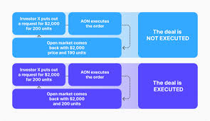

## Table of Contents

## What is an All Or None (AON) trading order?

An All Or None (AON) trading order is a type of order where you tell your broker that you want to buy or sell all of the shares you asked for, or none at all. If the broker can't fill the entire order at once, they won't do anything. This is useful if you need a specific number of shares for your strategy and don't want to buy or sell a smaller amount.

For example, if you want to buy 1,000 shares of a company, you would use an AON order to make sure you get all 1,000 shares or none. This can be helpful in situations where getting a partial amount of shares wouldn't work for your investment plan. However, using an AON order might make it harder to complete your trade because it needs to meet the exact number of shares you want.

## How does an AON order differ from other types of orders?

An AON order is different from other types of orders because it requires the entire order to be filled at once, or not at all. With other types of orders, like a market order, you might get only part of the shares you want right away, and the rest later. But with an AON order, if the broker can't find all the shares you need at the same time, they won't buy or sell any of them.

For example, if you place a limit order, you're saying you want to buy or sell at a specific price or better, but you might still get only part of your order filled if there aren't enough shares available at that price. An AON order is stricter because it won't let any part of the order go through unless all of it can be filled. This can be useful if you need a certain number of shares for your plan, but it might also make it harder to complete your trade because it has to meet your exact requirements.

## In what situations would a trader use an AON order?

A trader might use an AON order when they need to buy or sell a specific number of shares for their strategy to work. For example, if a trader wants to buy 500 shares of a stock to complete a specific investment plan, they would use an AON order to make sure they get all 500 shares at once. If they only got 400 shares, their plan wouldn't work, so they'd rather wait until they can get all 500.

Another situation where a trader might use an AON order is when they're trying to buy or sell a large block of shares without moving the market price too much. If a trader placed a regular order for a large number of shares, it could drive the price up or down before the order is fully filled. By using an AON order, the trader can wait until there's enough [liquidity](/wiki/liquidity-risk-premium) to fill the entire order at once, which can help keep the price more stable.

## What are the potential benefits of using an AON order?

Using an AON order can help a trader make sure they get exactly the number of shares they need. If a trader's plan depends on having a certain number of shares, an AON order makes sure they don't end up with too few or too many. This can be really helpful if having the right number of shares is important for their strategy to work.

Another benefit is that AON orders can help keep the market price stable when buying or selling a lot of shares. If a trader tries to buy or sell a big block of shares all at once, it might change the price a lot. But with an AON order, the trader waits until there are enough shares available to fill the whole order at once. This can help keep the price from moving too much, which is good if the trader wants to avoid big price swings.

## What are the potential drawbacks of using an AON order?

Using an AON order can make it harder to complete a trade. Since the order needs all the shares to be available at the same time, it might take longer to fill. If the market doesn't have enough shares to meet the order right away, the trader might have to wait a long time or not get the trade done at all. This can be frustrating if the trader needs to make the trade quickly.

Another problem with AON orders is that they might miss out on good prices. If the market price is good for a while but there aren't enough shares to fill the whole order, the trader has to wait. By the time enough shares are available, the price might have changed, and the trader could end up paying more or getting less than they wanted. So, using an AON order can mean missing out on chances to trade at better prices.

## How does an AON order work in practice?

When a trader uses an AON order, they tell their broker they want to buy or sell a specific number of shares all at once, or not at all. For example, if a trader wants to buy 1,000 shares of a company, they would use an AON order to make sure they get all 1,000 shares at the same time. If the broker can't find all 1,000 shares right away, they won't buy any of them. This means the trader has to wait until there are enough shares available to fill the entire order.

Using an AON order can be helpful if a trader needs a certain number of shares for their plan to work. It also helps keep the market price stable when trading a large number of shares because the order waits until there's enough liquidity to fill it all at once. However, AON orders can also make it harder to complete a trade because they need all the shares to be available at the same time. This might mean waiting a long time or missing out on good prices if the market changes before the order can be filled.

## Can you provide examples of when an AON order might be used?

A trader might use an AON order when they need to buy a specific number of shares for their plan to work. For example, imagine a trader wants to buy 500 shares of a company to complete a strategy. They use an AON order to make sure they get all 500 shares at once. If they only got 400 shares, their plan wouldn't work, so they'd rather wait until they can get all 500.

Another situation where an AON order might be used is when a trader wants to sell a large block of shares without moving the market price too much. For instance, if a trader has 10,000 shares to sell, using a regular order could drive the price down before the whole order is filled. By using an AON order, the trader waits until there's enough demand to sell all 10,000 shares at once, which can help keep the price more stable.

## How do brokers handle AON orders?

When a trader places an AON order, they tell their broker they want to buy or sell a specific number of shares all at once. The broker then looks for enough shares to fill the entire order. If the broker can't find all the shares right away, they won't buy or sell any of them. The broker keeps looking until they can fill the whole order or until the trader cancels it.

Brokers handle AON orders carefully because they need to make sure they meet the trader's exact requirements. This can be tricky if there aren't enough shares available in the market at the same time. The broker might have to wait a long time to find enough shares, which can be frustrating for the trader. But it's important for the broker to follow the trader's instructions and only complete the order when all the shares can be bought or sold at once.

## What impact does an AON order have on market liquidity?

An AON order can affect market liquidity because it requires all the shares to be available at the same time before the trade can happen. If a trader wants to buy or sell a lot of shares with an AON order, it might take a while for the market to have enough shares to fill the whole order. This can make the market seem less liquid because the order isn't filled right away.

On the other hand, AON orders can help keep the market stable when trading large blocks of shares. If a trader used a regular order to buy or sell a lot of shares, it could change the price a lot. But with an AON order, the trader waits until there's enough liquidity to fill the whole order at once. This can help keep the price from moving too much, which is good for the market's overall stability.

## Are there specific regulations or rules governing AON orders?

AON orders are handled like other types of orders, but there aren't special rules just for them. The rules that apply to all orders, like those from the Securities and Exchange Commission (SEC) or stock exchanges, also apply to AON orders. These rules make sure that trading is fair and that brokers follow what their clients want.

Brokers have to be careful with AON orders because they need to find all the shares at the same time. If they can't, they have to wait or tell the trader. This can be tricky, but it's important for brokers to follow the rules and do what the trader asks.

## How can traders optimize the use of AON orders in their trading strategy?

Traders can optimize the use of AON orders by being clear about how many shares they need for their plan. If a trader knows they need a certain number of shares to make their strategy work, using an AON order helps make sure they get all the shares at once. This can be really helpful if having the right number of shares is important. Traders should also think about when to use AON orders. If they need to buy or sell a lot of shares, using an AON order can help keep the price from changing too much, which can be good for their strategy.

Another way to optimize AON orders is by understanding how they might affect the time it takes to complete a trade. Since AON orders need all the shares to be available at the same time, they might take longer to fill. Traders should be ready to wait if they use an AON order. They should also keep an eye on the market and be ready to change their plan if the price moves a lot while they're waiting. By being patient and flexible, traders can use AON orders to make sure they get the shares they need without causing big price changes.

## What advanced strategies involve the use of AON orders in combination with other order types?

One advanced strategy that involves AON orders is using them with limit orders to buy or sell a large block of shares at a specific price. A trader might place an AON order with a limit price to make sure they get all the shares they need at that price or better. This can be helpful if the trader wants to control the price they pay or get for the shares, while also making sure they get the whole block at once. If the market can't fill the entire order at the limit price right away, the trader waits until it can, which might take some time but can help keep the price stable.

Another strategy is using AON orders along with stop orders to manage risk. A trader could use a stop order to sell their shares if the price drops to a certain level, and then use an AON order to make sure all the shares are sold at once if the stop price is hit. This can be useful if the trader wants to make sure they sell all their shares quickly at a certain price to limit their losses. By combining these order types, the trader can protect their investment while making sure the whole order is filled at the right time.

## References & Further Reading

[1]: Bergstra, J., Bardenet, R., Bengio, Y., & Kégl, B. (2011). ["Algorithms for Hyper-Parameter Optimization."](https://dl.acm.org/doi/10.5555/2986459.2986743) Advances in Neural Information Processing Systems 24.

[2]: ["Advances in Financial Machine Learning"](https://www.amazon.com/Advances-Financial-Machine-Learning-Marcos/dp/1119482089) by Marcos Lopez de Prado

[3]: ["Evidence-Based Technical Analysis: Applying the Scientific Method and Statistical Inference to Trading Signals"](https://www.amazon.com/Evidence-Based-Technical-Analysis-Scientific-Statistical/dp/0470008741) by David Aronson

[4]: ["Machine Learning for Algorithmic Trading"](https://github.com/stefan-jansen/machine-learning-for-trading) by Stefan Jansen

[5]: ["Quantitative Trading: How to Build Your Own Algorithmic Trading Business"](https://github.com/LucindaYa/quant-resources/blob/master/Quantitative%20Trading%20How%20to%20Build%20Your%20Own%20Algorithmic%20Trading%20Business.pdf) by Ernest P. Chan