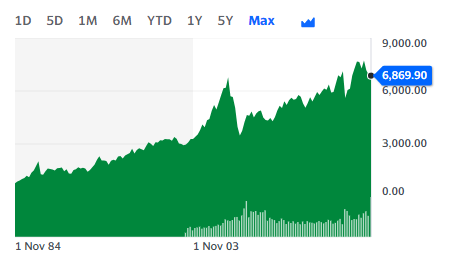

## Table of Contents

## What is the All-Ordinaries Index?

The All-Ordinaries Index, often called the All Ords, is a stock market index in Australia. It measures the performance of the top 500 companies listed on the Australian Securities Exchange (ASX). This index gives a good idea of how the overall Australian stock market is doing. Investors and financial analysts use it to see if the market is going up or down.

The All Ords is important because it shows the general health of the Australian economy. When the index goes up, it usually means that businesses are doing well and people are feeling confident about the future. When it goes down, it might mean that people are worried about the economy. By watching the All Ords, people can make better decisions about buying and selling stocks.

## How is the All-Ordinaries Index calculated?

The All-Ordinaries Index is calculated by taking the total market value of all the companies in the index and dividing it by a special number called the divisor. The market value of a company is found by multiplying the number of its shares by the price of each share. The divisor is used to keep the index stable even when companies are added or removed, or when they do things like stock splits. This way, the index shows the real changes in the market, not just changes because of the companies in it.

The index is updated every day when the market is open. Each day, the prices of the shares change, so the total market value changes too. By dividing this new total market value by the divisor, we get the new value of the All-Ordinaries Index. This gives investors a clear picture of how the Australian stock market is performing at any given time.

## What is the historical performance of the All-Ordinaries Index?

The All-Ordinaries Index has a long history that goes back to January 1980. Over the years, it has gone through many ups and downs. In the early 1980s, the index saw a big jump, reaching new highs. But then came a big drop in the late 1980s, known as the "Black Monday" crash in 1987, when the index fell sharply. After that, the 1990s were a time of recovery and growth, with the index reaching new peaks by the end of the decade.

The 2000s brought more challenges and changes. The early 2000s saw the index hit new highs, but then the Global Financial Crisis in 2008 caused a big drop. After the crisis, the index slowly started to recover. The 2010s were a bit up and down, with periods of growth and some smaller drops. By the end of 2020, despite the challenges of the COVID-19 pandemic, the index had bounced back and was doing well. Overall, the All-Ordinaries Index shows how the Australian stock market has grown over time, even with some big bumps along the way.

## Which companies are included in the All-Ordinaries Index?

The All-Ordinaries Index includes the top 500 companies listed on the Australian Securities Exchange (ASX). These companies come from different industries like mining, banking, retail, and technology. Some well-known companies in the index are BHP, Commonwealth Bank, and Woolworths. The index tries to represent a good mix of the Australian economy by including big and small companies from many different sectors.

The list of companies in the All-Ordinaries Index changes over time. Companies can be added or removed based on their market value and how they are doing in the market. For example, if a company grows a lot and becomes one of the top 500, it might be added to the index. On the other hand, if a company's value drops a lot, it might be taken out. This way, the index stays up-to-date and reflects the current state of the Australian stock market.

## How does the All-Ordinaries Index differ from other Australian indices?

The All-Ordinaries Index, or All Ords, is different from other Australian indices mainly because it includes the top 500 companies listed on the Australian Securities Exchange (ASX). This makes it a broad measure of the Australian stock market. In contrast, the S&P/ASX 200, another popular index, only includes the top 200 companies. So, the All Ords gives a more complete picture of the market because it includes more companies, including smaller ones that are not in the top 200.

Another difference is that the All-Ordinaries Index is not as widely followed by investors and media as the S&P/ASX 200. The S&P/ASX 200 is often used as the main benchmark for the Australian stock market, and many investment products are based on it. The All Ords, however, is still important because it gives a broader view of the market's performance. It can be useful for investors who want to understand how a wider range of companies are doing, not just the biggest ones.

## What are the criteria for inclusion in the All-Ordinaries Index?

The All-Ordinaries Index includes the top 500 companies listed on the Australian Securities Exchange (ASX). To be included, a company must have a high market value, which is found by multiplying the number of its shares by the price of each share. The index tries to show a good mix of the Australian economy, so it includes companies from many different industries like mining, banking, and retail. The companies in the index can change over time because the market is always moving.

Companies can be added to the All-Ordinaries Index if they grow and become one of the top 500 companies. On the other hand, if a company's value drops a lot, it might be taken out of the index. This keeps the index up-to-date and a good measure of the Australian stock market. The All Ords is different from other indices like the S&P/ASX 200 because it includes more companies, giving a broader view of the market.

## How does the All-Ordinaries Index reflect the Australian economy?

The All-Ordinaries Index, or All Ords, is like a big picture of the Australian stock market. It shows how well the top 500 companies in Australia are doing. These companies come from different parts of the economy, like mining, banking, and retail. When the All Ords goes up, it usually means that businesses are doing well and people feel good about the future. If it goes down, it might mean that people are worried about the economy.

By looking at the All Ords, we can see how the whole Australian economy is doing. It's a bit like checking the health of the country's businesses all at once. If the index is growing, it often means that the economy is strong and growing too. But if the index is falling, it might be a sign that the economy is facing some problems. So, the All Ords is a helpful tool for understanding the ups and downs of Australia's economy.

## What are the investment strategies related to the All-Ordinaries Index?

One way to invest using the All-Ordinaries Index is by buying an index fund or an exchange-traded fund ([ETF](/wiki/etf-trading-strategies)) that tracks the All Ords. These funds try to copy the performance of the index by holding the same companies in the same amounts. This is a good way for investors who want to own a piece of the whole Australian stock market without [picking](/wiki/asset-class-picking) individual stocks. It's also a way to spread out risk because the fund includes many different companies from various industries.

Another strategy is to use the All-Ordinaries Index as a benchmark to see how well other investments are doing. If an investor's portfolio is beating the All Ords, it might mean they are doing a good job picking stocks. On the other hand, if their portfolio is not doing as well as the index, they might need to change their strategy. Some investors also look at the All Ords to find trends and patterns in the market, which can help them decide when to buy or sell stocks.

A third approach is to use the All-Ordinaries Index to understand the health of different sectors in the economy. By looking at which sectors are doing well or poorly in the index, investors can make choices about where to put their money. For example, if the mining sector is doing well in the All Ords, an investor might decide to buy stocks in mining companies. This way, they can take advantage of the parts of the economy that are growing.

## How can investors use the All-Ordinaries Index to gauge market sentiment?

Investors can use the All-Ordinaries Index to understand how people feel about the Australian stock market. When the All Ords goes up, it often means that investors are feeling good and confident about the future. They might think that companies will do well and make more money. On the other hand, if the All Ords goes down, it can show that investors are worried. They might be concerned about the economy or think that companies will not do as well as expected.

By watching the All-Ordinaries Index, investors can see if the market is getting more positive or more negative. If the index keeps going up over time, it can mean that the market sentiment is bullish, or optimistic. But if the index keeps going down, it might mean that the market sentiment is bearish, or pessimistic. This information can help investors decide when to buy or sell stocks, based on how other people in the market are feeling.

## What are the key factors influencing the All-Ordinaries Index?

The All-Ordinaries Index, or All Ords, is affected by many things. One big [factor](/wiki/factor-investing) is how well the companies in the index are doing. If a lot of companies are making more money and growing, the index will usually go up. Another important thing is what's happening in the economy. If the economy is doing well, with more jobs and people spending more money, the All Ords will likely go up too. But if the economy is struggling, the index might go down.

Another factor is what's happening around the world. If there's a big event, like a financial crisis or a global health issue, it can make the All Ords go down because people get worried and sell their stocks. Interest rates also play a big role. When interest rates are low, borrowing money is cheaper, which can help companies grow and make the index go up. But when interest rates are high, borrowing is more expensive, which can slow down the economy and make the All Ords go down.

## How has the All-Ordinaries Index been affected by global economic events?

The All-Ordinaries Index, or All Ords, has felt the impact of big global events. For example, during the Global Financial Crisis in 2008, the index dropped a lot. This happened because the crisis made people worried about the economy, and they started selling their stocks. Another big event was the COVID-19 pandemic in 2020. When the pandemic started, the All Ords went down because people were scared and unsure about what would happen next. But then, as things got better and governments helped businesses, the index started to go up again.

Global events can also have a positive effect on the All Ords. For instance, when other countries' economies are doing well, it can make the Australian market feel more confident. This might lead to more people buying stocks, which pushes the index up. Also, when there is good news about trade deals or when global tensions ease, it can make investors feel safer and more willing to invest in the Australian market. So, the All Ords is not just about what happens in Australia; it's also influenced by what's happening all around the world.

## What are the future predictions for the All-Ordinaries Index based on current market trends?

Looking at the current market trends, many experts think the All-Ordinaries Index, or All Ords, will keep growing in the next few years. This is because the Australian economy is doing well, with more jobs and people spending more money. Also, the global economy is getting better, which makes investors feel confident about the future. If interest rates stay low, it will be easier for companies to borrow money and grow, which can help push the All Ords up.

However, there are also some worries that could affect the All Ords. Things like global trade tensions, changes in government policies, and unexpected events like natural disasters or health crises could make the index go down. Investors need to keep an eye on these things and be ready to change their plans if something big happens. Overall, while the future looks good for the All Ords, it's important to stay careful and watch what's happening in the world.

## References & Further Reading

[1]: ["ASX All Ordinaries Index - Historical Performance and Key Facts"](https://www.investing.com/indices/all-ordinaries-historical-data) by ASX

[2]: Mahida, C. (2021). ["The Impact of Algorithmic Trading On Financial Markets"](https://wjaets.com/content/algorithmic-trading-and-ai-review-strategies-and-market-impact) International Journal of Research and Analytical Reviews.

[3]: Narang, R. (2013). ["Inside the Black Box: A Simple Guide to Quantitative and High-Frequency Trading"](https://onlinelibrary.wiley.com/doi/book/10.1002/9781118662717) by Wiley Finance

[4]: Chlistalla, M. (26 Nov 2011). ["High-frequency trading: better than its reputation?"](https://c.mql5.com/forextsd/forum/168/high-frequency_trading_-_better_than_its_reputation.pdf) VoxEU.org.

[5]: Australian Securities and Investments Commission (ASIC). ["Regulatory Guidance on Automated Trading"](https://download.asic.gov.au/media/ylwpgqwm/rg265-published-2-august-2022-20240516.pdf)