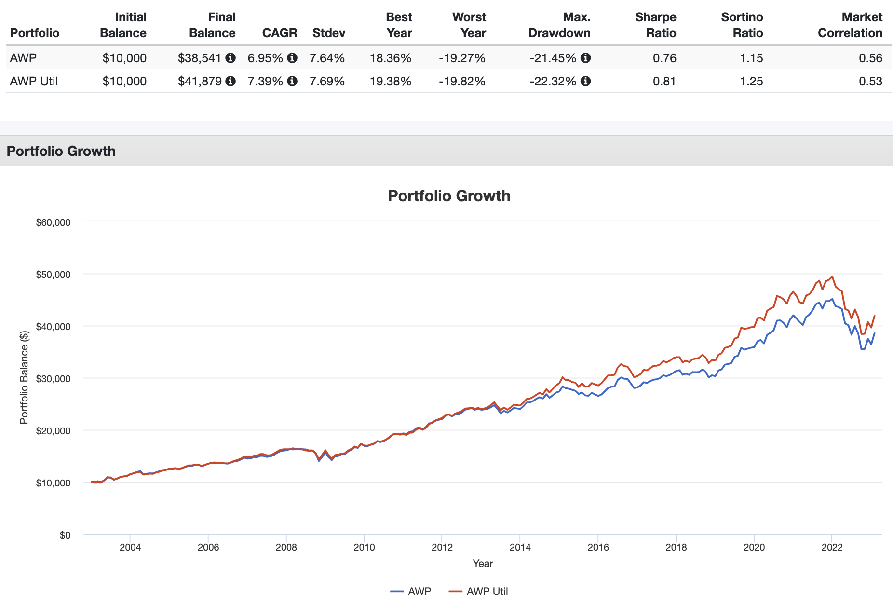

## Table of Contents

## What is an All Weather Fund?

An All Weather Fund is a type of investment fund designed to perform well in various market conditions, whether the economy is booming or facing a downturn. The idea behind these funds is to create a portfolio that can weather different economic climates by balancing investments across different asset classes, such as stocks, bonds, commodities, and sometimes even currencies. This diversification helps to reduce risk and smooth out returns over time, making the fund more stable and less vulnerable to sharp drops in any single market.

These funds often use a strategic asset allocation approach, which means they follow a set plan for how much to invest in each type of asset. This plan is based on historical data and economic theories about how different assets behave under various conditions. By sticking to this strategy, All Weather Funds aim to provide steady returns and protect investors' money, regardless of what's happening in the economy. This makes them an attractive option for investors who want to grow their wealth without taking on too much risk.

## How does an All Weather Fund differ from traditional investment funds?

An All Weather Fund is different from traditional investment funds because it is made to do well no matter what the economy is doing. Traditional funds often focus on one type of investment, like stocks or bonds, and can do really well when the market is good but might lose a lot of money when the market is bad. All Weather Funds, on the other hand, spread their money across many different types of investments. This way, if one type of investment does poorly, the others might do well and balance things out.

Another big difference is how All Weather Funds plan their investments. Traditional funds might change their investments a lot, trying to guess what will happen in the market. All Weather Funds use a plan that stays the same, based on what has happened in the past and what experts think will happen in different economic situations. This steady plan helps the fund stay safe and grow slowly over time, instead of going up and down a lot like traditional funds can.

## What are the primary goals of an All Weather Fund?

The main goal of an All Weather Fund is to make money for investors no matter what the economy is doing. It wants to grow the money slowly and steadily, without big ups and downs. This is different from other funds that might make a lot of money when the market is good but lose a lot when the market is bad.

To reach this goal, an All Weather Fund spreads its money across many different types of investments, like stocks, bonds, and commodities. This way, if one type of investment does badly, the others might do well and balance things out. The fund follows a set plan for how much to invest in each type, based on what has happened in the past and what experts think will happen in different economic situations. This steady plan helps keep the fund safe and helps it grow over time.

## Who typically invests in All Weather Funds?

People who invest in All Weather Funds are usually looking for a safe way to grow their money over time. They might be close to retiring or already retired and want to protect their savings from big drops in the market. These investors don't want to take a lot of risks but still want to see their money grow a bit more than if they just put it in a savings account.

Sometimes, younger investors who want to balance out riskier investments in their portfolio also put money into All Weather Funds. They might have some money in stocks or other things that can go up and down a lot, and they use All Weather Funds to make their overall investments more stable. This way, they can feel more secure about their money while still trying to make it grow.

## What asset classes are included in an All Weather Fund's portfolio?

An All Weather Fund's portfolio usually includes a mix of different types of investments to help it do well no matter what the economy is doing. The main types of investments you'll find in these funds are stocks, bonds, and commodities. Stocks are pieces of ownership in companies, and they can go up or down in value based on how the company is doing and what's happening in the economy. Bonds are like loans to companies or governments, and they usually pay back a steady amount of money over time. Commodities are things like gold, oil, or food that people need and use every day.

Sometimes, All Weather Funds also include other types of investments like real estate or even currencies from different countries. Real estate can be a good way to make money because people always need places to live and work. Currencies can help protect the fund from changes in the value of money in different countries. By spreading the money across all these different types of investments, an All Weather Fund tries to balance out the ups and downs so that it can grow steadily over time.

## How does an All Weather Fund manage risk?

An All Weather Fund manages risk by spreading its money across many different types of investments, like stocks, bonds, and commodities. This way, if one type of investment does badly, the others might do well and balance things out. It's like not putting all your eggs in one basket. By having a mix of investments, the fund can handle the ups and downs of the market better and keep the money safer.

The fund also follows a set plan for how much to invest in each type of asset. This plan is based on what has happened in the past and what experts think will happen in different economic situations. Instead of trying to guess what will happen in the market and changing investments a lot, the fund sticks to this steady plan. This helps the fund stay safe and grow slowly over time, without big ups and downs.

## What are the key strategies used by All Weather Funds to achieve consistent returns?

All Weather Funds use a strategy called asset allocation to achieve consistent returns. This means they spread their money across different types of investments like stocks, bonds, and commodities. By doing this, the fund can balance out the ups and downs of the market. If one type of investment does badly, the others might do well and keep the fund's value stable. This helps the fund grow slowly and steadily, without big drops in value.

Another key strategy is following a set plan for how much to invest in each type of asset. This plan is based on what has happened in the past and what experts think will happen in different economic situations. Instead of trying to guess what the market will do and changing investments a lot, the fund sticks to this steady plan. This helps keep the fund safe and makes it easier to achieve consistent returns over time, no matter what the economy is doing.

## Can you explain the role of diversification in an All Weather Fund?

Diversification is really important for an All Weather Fund. It means spreading the fund's money across different types of investments, like stocks, bonds, and commodities. By doing this, the fund can handle the ups and downs of the market better. If one type of investment does badly, the others might do well and balance things out. This helps keep the fund's value stable and protects it from big drops in the market.

The main goal of diversification in an All Weather Fund is to make sure the fund can grow slowly and steadily, no matter what the economy is doing. It's like not putting all your eggs in one basket. By having a mix of investments, the fund can weather different economic conditions and keep the money safer. This way, the fund can achieve consistent returns over time, which is what investors want when they choose an All Weather Fund.

## How do All Weather Funds adjust their portfolios in response to market conditions?

All Weather Funds don't change their portfolios a lot based on what's happening in the market right now. Instead, they follow a set plan for how much to invest in different types of assets like stocks, bonds, and commodities. This plan is made based on what has happened in the past and what experts think will happen in different economic situations. By sticking to this plan, the fund can stay steady and grow slowly over time, without big ups and downs.

If the market changes a lot, an All Weather Fund might make small changes to its portfolio, but it still follows its main plan. For example, if the economy is doing really well, the fund might put a little more money into stocks. But if the economy is doing badly, it might put a bit more into bonds or commodities. These small changes help the fund stay balanced and protect the money from big drops in the market. The main goal is always to keep the fund safe and growing steadily, no matter what the economy is doing.

## What historical performance data is available for All Weather Funds?

All Weather Funds have been around for a while, and people have looked at how they did over time. One famous All Weather Fund is the one made by Ray Dalio at Bridgewater Associates. It's called the All Weather Portfolio, and it started in the 1990s. From then until now, it has done pretty well. It made money even when the market was going up and down a lot. For example, during the big market drop in 2008, this fund lost less money than many other funds. Over the years, it has given investors steady returns, usually around 7-9% a year, which is good for a fund that tries to be safe.

There are other All Weather Funds too, and they all try to do the same thing: grow money slowly and steadily. Some of these funds have been around for 10 or 20 years. When you look at their records, you can see that they don't go up and down as much as other funds. They might not make as much money when the market is doing great, but they also don't lose as much when the market is doing badly. This makes them a good choice for people who want to keep their money safe and still see it grow a bit over time.

## What are the fees associated with investing in an All Weather Fund?

When you invest in an All Weather Fund, you usually have to pay fees. These fees can be different depending on which fund you choose. Most of the time, you'll see two main types of fees: management fees and expense ratios. Management fees are what you pay the people who run the fund for their work. These fees are often around 1% to 2% of the money you have in the fund every year. Expense ratios are the costs of running the fund, like paying for trading and keeping records. These can add another 0.5% to 1% to your costs each year.

Some All Weather Funds might also charge other fees, like performance fees. These are extra charges you pay if the fund does really well. For example, if the fund makes more money than it expected to, you might have to pay an extra 10% or 20% of the extra money as a performance fee. It's important to look at all these fees before you decide to invest because they can add up and take away from the money you make. Always read the fund's information carefully to know what you'll be paying.

## How can an investor evaluate the effectiveness of an All Weather Fund's strategy?

To evaluate how well an All Weather Fund's strategy works, an investor should look at how the fund has done over time, especially during different economic conditions. This means checking the fund's performance during good times, like when the stock market is going up, and during bad times, like when there's a big drop in the market. If the fund has made steady returns without big ups and downs, it shows that its strategy of spreading money across different types of investments is working well. Another thing to look at is how the fund compares to other funds. If it does better than other funds during tough times, it's a good sign that its strategy is effective.

Investors should also pay attention to the fees they have to pay for the fund. High fees can eat into the returns, so it's important to see if the fund's performance is worth the cost. Talking to a financial advisor can help too. They can explain how the fund's strategy works and if it fits with what the investor wants. By looking at all these things, an investor can decide if an All Weather Fund's strategy is a good choice for them.

## References & Further Reading

[1]: ["Principles for Navigating Big Debt Crises"](https://www.amazon.com/Principles-Navigating-Big-Debt-Crises/dp/1668009293) by Ray Dalio

[2]: ["Advances in Financial Machine Learning"](https://www.amazon.com/Advances-Financial-Machine-Learning-Marcos/dp/1119482089) by Marcos Lopez de Prado

[3]: ["Machine Learning for Algorithmic Trading"](https://github.com/stefan-jansen/machine-learning-for-trading) by Stefan Jansen

[4]: ["The All Weather Story: A New Approach to Diversified Asset Allocation"](https://www.theglobetrottinginvestor.com/post/should-you-consider-an-all-weather-portfolio) by Bridgewater Associates

[5]: ["Modern Portfolio Theory"](https://www.forbes.com/advisor/investing/modern-portfolio-theory/) on Investopedia

[6]: ["Quantitative Trading: How to Build Your Own Algorithmic Trading Business"](https://github.com/LucindaYa/quant-resources/blob/master/Quantitative%20Trading%20How%20to%20Build%20Your%20Own%20Algorithmic%20Trading%20Business.pdf) by Ernest P. Chan