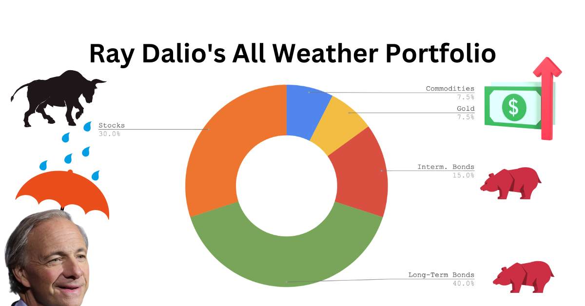
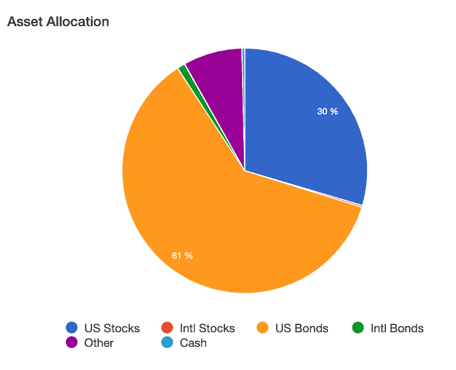
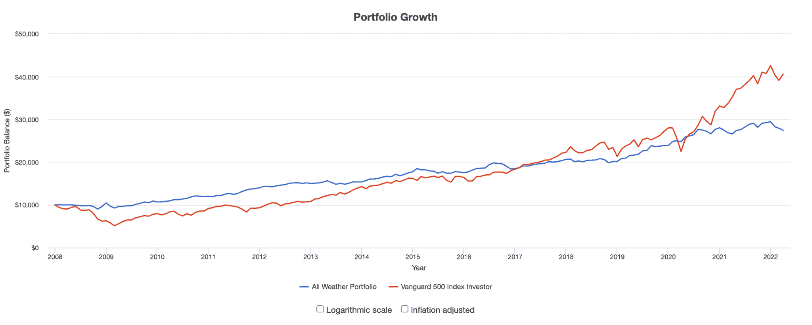
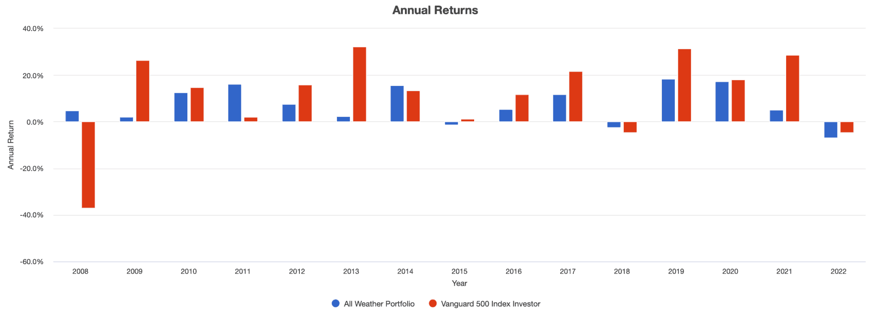

The concept of an all-weather portfolio isn't just an investment strategy, it's a comprehensive approach to asset allocation designed to weather the storms of economic change. This methodology aims to balance risk and reward by diversifying across a variety of asset classes, such that the portfolio can sustain positive returns under various market conditions, whether in times of prosperity or recession. It hinges on the idea that certain assets perform better in specific economic climates than others; hence, by mixing asset classes like stocks, bonds, commodities, and gold in a specific ratio, an investor can theoretically dampen volatility and mitigate losses without sacrificing too much potential gain.

Developed by Ray Dalio, the founder of Bridgewater Associates, one of the world's largest hedge funds, this strategy gained prominence as a blueprint for creating a balanced investment portfolio that could endure over time, regardless of economic downturns or booms. Its core principle is that it isn't designed to excel in any one particular environment, but rather to perform consistently across all environments.

👉 **The All Weather Portfolio can be further enhanced with algorithmic trading. Here are some sample strategies:**

- [**Risk Premia Harvesting Through Dual Momentum**](https://wiki.paperswithbacktest.com/trading-strategies/bonds-commodities-equities-reits/risk-premia-harvesting-through-dual-momentum)
- [**Protective Asset Allocation (PAA): A Simple Momentum-Based Alternative for Term Deposits**](https://wiki.paperswithbacktest.com/trading-strategies/bonds-commodities-equities-reits/protective-asset-allocation-paa-a-simple-momentum-based-alternative-for-term-deposits)
- [**The Trend is Our Friend: Risk Parity, Momentum and Trend Following in Global Asset Allocation**](https://wiki.paperswithbacktest.com/trading-strategies/bonds-commodities-equities-reits/the-trend-is-our-friend-risk-parity-momentum-and-trend-following-in-global-asset-allocation)

In today's economic landscape, with uncertainties ranging from fluctuating interest rates and geopolitical tensions to unprecedented global events like pandemics, the all-weather portfolio's philosophy has only grown more pertinent. Investors are increasingly seeking strategies that can survive and thrive in an economic climate that seems to change more rapidly and unpredictably than ever before. With traditional investment approaches being challenged by market dynamics, the all-weather portfolio presents itself as a resilient framework that could minimize the need for constant, active management, and potentially reduce the anxiety that comes with the market’s ups and downs.

# Unveiling the All Weather Portfolio

At its core, the All Weather Portfolio is a strategic investment approach with the overarching philosophy of enduring through any economic season—be it rain or shine. This portfolio framework is structured to mitigate risk and perform under various market conditions, aiming for consistent returns while managing losses during economic downturns. The All Weather Portfolio stands on the principles of diversification not just across asset classes, but also among different financial instruments that respond distinctly to market movements—stocks, long-term bonds, intermediate-term bonds, commodities, and precious metals like gold. Each asset class has a designated role, providing balance, as some assets may perform well when others falter due to changes in the economy like inflation or growth fluctuations.

Tracing the lineage of the All Weather Portfolio, we find the concept of diversification isn't novel; it is foundational in the world of finance. Historically, investors have sought to spread their risks through various means—buying stocks across different sectors, investing in bonds of varying maturities, or even geographic diversification. However, the All Weather Portfolio’s development marked a pivotal evolution in diversification strategies. It transcended the traditional mix of stocks and bonds, integrating assets like commodities and precious metals to hedge against different types of economic changes, such as inflation or deflation.

The origins of such a well-rounded diversification approach can be linked to the Modern Portfolio Theory (MPT) introduced by Harry Markowitz in the 1950s. MPT suggested that an investor could design an ‘efficient’ portfolio that offered the maximum expected return for a given level of risk. Yet, while MPT laid the groundwork, it was Ray Dalio’s insight that paved the way for what would become the All Weather strategy. Dalio’s pioneering approach was to create a portfolio that could perform well in any economic environment—thus, ‘all weather’—without needing to predict which environment would be prevalent at any given time[1][2].

This philosophy became institutionalized when Dalio founded Bridgewater Associates and introduced the All Weather Portfolio to the firm’s offerings. Bridgewater’s success with this strategy cemented its validity, demonstrating that a well-diversified portfolio could indeed weather economic storms and thrive across cycles, supporting the argument for its implementation as a fundamental investment strategy.

# Architect of Stability: Ray Dalio and Bridgewater

Ray Dalio, born on August 8, 1949, in Jackson Heights, Queens, New York, is an American billionaire investor, hedge fund manager, and philanthropist. Dalio attended Long Island University and later earned an MBA from Harvard Business School. He began his investment career as a commodities trader in the brokerage house Shearson Hayden Stone and later founded Bridgewater Associates out of his two-bedroom apartment in New York in 1975. Bridgewater Associates, under Dalio’s leadership, grew into the largest hedge fund in the world, with over $150 billion in assets under management as of the time of my last update in April 2023.

Dalio’s investment philosophy revolves around the principles of radical truth and radical transparency, fostering an idea-meritocratic culture at Bridgewater. He is a proponent of deep economic understanding and has conceptualized economic principles like the “economic machine,” which informs his investment strategies. Dalio’s approach is also heavily rooted in historical patterns and practical frameworks that aim to mitigate risk through diversification and strategic asset allocation.

The All Weather Portfolio is a direct product of Dalio’s deep understanding of economic cycles and his commitment to creating a balanced investment strategy that can perform well across all environments, a concept that is encapsulated in the portfolio’s name. The strategy was originally devised in 1996 when Dalio wanted to ensure that his trust assets would be well-cared for without active management. The philosophy behind it is that it doesn't predict the economic environment but instead prepares for any scenario—whether it's rising growth, falling growth, inflation, or deflation.

Bridgewater Associates applied the All Weather principles to institutional investing, which garnered substantial attention after its successful navigation of the 2008 financial crisis. Bridgewater’s All Weather fund was specifically designed to produce stable returns while minimizing the volatility and risk typically associated with market cycles and economic shifts. The strategy uses leverage to balance the portfolio’s risk among different asset classes, which is based on their relative volatility and correlation to each other rather than their expected returns.

The firm’s practical application of the All Weather strategy has had a considerable influence on the financial industry, encouraging both institutional and individual investors to consider risk parity and all-weather approaches when constructing their own portfolios. The strategy has been publicly detailed in various interviews with Dalio and in Bridgewater Associates’ published research, providing a blueprint for investors seeking to replicate the strategy’s principles.

# Components of an All Weather Portfolio

The All Weather Portfolio is structured to weather through various economic climates by balancing asset classes that respond differently to changes in economic growth and inflation. The goal is to maintain a relatively stable and consistent return across a variety of market environments. Here’s a detailed look at the composition of asset classes within the All Weather Portfolio and their general weighting:

**1. Stocks:**

- Typically represent 30% of the portfolio.
- Comprised of a diversified collection of equities from across market sectors and geographies.
- Stock allocation capitalizes on growth and is crucial during periods of economic expansion.

**2. Long-Term Bonds:**

- Usually form about 40% of the portfolio.
- Act as a counterbalance to stocks, generally performing well when growth is slowing.
- They can also serve as a hedge against deflation.

**3. Intermediate-Term Bonds:**

- Around 15% of the portfolio is dedicated to intermediate-term bonds.
- They offer a middle ground between stocks and long-term bonds, providing income and reducing volatility.

**4. Commodities:**

- Commodities typically make up 7.5% of the portfolio.
- They tend to do well during periods of inflation and help in preserving the purchasing power of the portfolio.

**5. Gold:**

- Gold also accounts for 7.5% of the total investment.
- Serves as a diversifier and a hedge against both inflation and geopolitical risks.

The specific weightings within the All Weather Portfolio are designed to balance the risk contribution of each asset class. Stocks, while offering growth potential, are more volatile than bonds; hence they constitute a smaller portion of the portfolio. Long-term bonds, with their greater sensitivity to interest rate changes, have a higher allocation to balance the equity risk. Gold and commodities provide a hedge against inflation, which can erode the purchasing power of traditional securities.

It's essential for investors to keep in mind that while the All Weather Portfolio aims to be resilient across different economic seasons, its components do not operate in isolation. The interplay between these asset classes is dynamic, influenced by ongoing economic developments, global events, and market sentiment. Investors need to monitor these trends and consider them when evaluating their portfolio's performance and making adjustments.

# Asset Allocation Dynamics

Asset allocation is the linchpin of the All Weather Portfolio, a strategy meticulously crafted by Ray Dalio to withstand economic fluctuations. The traditional model espoused by Dalio emphasizes diversification across asset classes that react differently to various economic environments. The aim is to balance the parts of the portfolio so that the overall investment is structured to be "all weather" — performing well across a range of economic scenarios without needing to predict which scenario will occur next.

At its core, the All Weather Portfolio is grounded in strategic risk distribution. Dalio's model doesn't merely allocate assets based on their expected returns or historical performance, but on the underlying economic factors that drive performance: inflation, deflation, rising growth, and declining growth. These factors influence asset classes in different ways:

- **Inflation**: Assets like Treasury Inflation-Protected Securities (TIPS) and commodities typically benefit from inflation.
- **Deflation**: Long-term bonds tend to do well during deflation as interest rates generally fall.
- **Rising Growth**: Equities often outperform during times of economic expansion.
- **Declining Growth**: In a slowing economy, counter-cyclical assets like gold and certain bonds can provide a hedge.

The beauty of the All Weather Portfolio is its use of a risk parity approach. Instead of allocating funds based solely on capital, it assigns weights according to the risk that each asset contributes to the portfolio. Dalio's model aims to equalize the risk from different asset classes. For example, although stocks are more volatile than bonds, they would not necessarily represent a larger portion of the risk in the portfolio. If one asset class becomes too volatile, its presence is scaled down to maintain the portfolio's risk balance.

Adjustments and variations to the asset allocation are crucial as economic cycles change. During a bear market or recession, an investor might increase the portfolio’s bond allocation to mitigate risk. Conversely, in a bull market, the equity allocation might be increased to capitalize on growth.

The All Weather Portfolio is dynamic, designed to be rebalanced periodically. Dalio suggests doing so annually to maintain the intended risk balance as market movements will naturally skew the original allocation over time. The portfolio may also be adjusted as major economic indicators signal a change in the economic season. For instance, leading indicators that suggest higher inflation ahead might prompt an investor to increase the allocation to TIPS or commodities.

To implement this dynamic asset allocation approach, investors can use various financial instruments, such as ETFs, to represent each asset class. They must remain vigilant about the changing correlations between assets, as these can shift during different economic conditions.

# Comparative Analysis: All Weather Portfolio vs. Other Diversification Strategies

The All Weather Portfolio (AWP) stands as a diversified investment strategy aimed at delivering steady, long-term returns regardless of market conditions. It distinguishes itself through a risk-balanced approach, designed to perform in any economic environment—be it inflation, deflation, or growth cycles. This section compares the AWP with other diversification strategies such as the Permanent Portfolio, Target-Date Funds, and Modern Portfolio Theory-based portfolios.

**Permanent Portfolio (PP)**

- The PP, crafted by Harry Browne in the 1980s, splits investments equally across four asset classes: stocks, long-term bonds, cash, and gold.
- Like the AWP, it’s designed to perform across various economic conditions, with each asset class thriving in specific environments.
- While both portfolios aim for non-correlated assets to ensure stability, the AWP has a more dynamic structure with varying allocations based on long-term risk parity rather than the PP’s equal weighting.

**Target-Date Funds (TDFs)**

- TDFs are structured to automatically shift towards more conservative investments as a target retirement date approaches.
- These funds employ diversification but do so with a glide path approach, becoming less exposed to equities over time.
- Unlike the AWP, TDFs don’t specifically allocate assets to perform under different economic conditions but rather to reduce risk as the investor ages.

**Modern Portfolio Theory (MPT) Portfolios**

- MPT emphasizes diversification and the efficient frontier to maximize returns for a given level of risk, primarily through a mix of stocks and bonds.
- Portfolios based on MPT typically adjust risk through the ratio of stocks to bonds and require ongoing rebalancing to maintain the desired risk level.
- The AWP differs in its core philosophy by not just looking to balance risk and return but to achieve steadiness across economic environments through strategic asset allocation.

**Statistical Performance Analysis**

- Over multiple decades, the AWP has demonstrated lower volatility and smaller drawdowns compared to a traditional 60/40 stock/bond portfolio, primarily due to its broader diversification and risk parity approach.
- During the 2008 financial crisis, the AWP outperformed many traditional diversified portfolios due to its lower exposure to equities and its inclusion of assets like gold and long-term bonds which increased in value.
- According to backtested data, from 1984 through 2013, the AWP had an average annual return of about 9.7%, with the worst year showing a slight gain, highlighting its defensive nature during downturns.

The effectiveness of each strategy largely depends on individual investor goals, risk tolerance, and investment horizon. While the AWP is designed to weather all economic seasons without the need for prediction or adjustment, it may underperform in strong bull markets compared to a high equity-exposed portfolio. Conversely, in downturns, its defensive posture can provide a cushion that more aggressive portfolios lack.

# Performance Metrics Across Decades

The All Weather Portfolio, constructed to withstand and prosper in any economic climate, has undergone various market cycles since its inception. This time-tested strategy is particularly known for its resilience during bear markets and its ability to capture upside during bull markets, albeit sometimes less than more aggressive portfolios.

Examining the performance metrics across decades, one can appreciate the All Weather Portfolio’s strength. In the 1990s, a period characterized by robust economic growth and a bull market, the portfolio produced solid returns, although it underperformed pure equity portfolios due to its conservative asset allocation. However, it was during the subsequent bear markets, including the dot-com bust in the early 2000s and the 2008 financial crisis, that the portfolio demonstrated its defensive attributes.

For instance, during the 2000-2002 bear market, the S&P 500 fell approximately 49%, while a classic All Weather Portfolio construct would have remained relatively flat or even slightly positive due to its exposure to bonds and commodities. Similarly, in 2008, while the S&P 500 experienced a decline of nearly 38%, the All Weather Portfolio's losses were significantly cushioned, largely avoiding the depths of the recession's impact on purely equity-focused strategies.

Beyond individual years, the decade from 2000 to 2009, often referred to as the "lost decade" for stocks, where the S&P 500 had an annualized return of -0.95%, the All Weather Portfolio provided a stark contrast with positive annualized returns, a testament to its diversification benefits.

More recently, in the bull market post the 2008 crisis, the All Weather Portfolio has provided moderate growth, with lower volatility compared to the S&P 500. While it doesn't typically capture the full extent of a bullish stock market’s returns due to its underweight position in equities, it remains attractive to investors seeking more stable and predictable performance metrics.

The above performance insights are supported by numerous backtesting studies and portfolio analyses. Interested readers and investors are encouraged to refer to research from Dalio's Bridgewater Associates and independent studies like those found in the Journal of Portfolio Management or the CFA Institute's Financial Analysts Journal, which often provide extensive backtesting and analysis of asset allocation strategies, including the All Weather Portfolio. For more contemporary performance metrics, investment platforms like Bloomberg and Morningstar offer data and tools for analyzing historical performance across various asset classes and market cycles.

# Constructing Your All Weather Portfolio

Constructing an All Weather Portfolio requires a strategic approach to asset allocation aimed at balancing the portfolio's performance across various economic conditions. Here’s how you can build one, step by step:

1. **Asset Allocation**: Begin by allocating your investment into the four core environment categories: stocks for rising growth, long-term bonds for falling growth, commodities for rising inflation, and treasury inflation-protected securities (TIPS) for falling inflation. Ray Dalio’s original All Weather Portfolio allocation is 30% stocks, 40% long-term bonds, 15% intermediate-term bonds, 7.5% gold, and 7.5% commodities.
2. **Selecting Instruments**:
    - **Stocks**: Consider broad market index funds or ETFs, such as the Vanguard Total Stock Market Index Fund (VTSMX) or the SPDR S&P 500 ETF Trust (SPY).
    - **Bonds**: For long-term bonds, ETFs like the iShares 20+ Year Treasury Bond ETF (TLT) can be appropriate. Intermediate bonds can be accessed through ETFs like the iShares 7-10 Year Treasury Bond ETF (IEF).
    - **Commodities**: Commodity ETFs, such as the PowerShares DB Commodity Index Tracking Fund (DBC), provide diversified exposure.
    - **Gold**: You can get exposure through ETFs like the SPDR Gold Shares (GLD) or by buying physical gold.
    - **TIPS**: ETFs like the iShares TIPS Bond ETF (TIP) offer an easy way to invest in inflation-protected securities.
3. **Rebalancing**: Rebalancing is crucial to maintain the risk level of the portfolio over time. The All Weather Portfolio typically rebalances annually, realigning to the target allocations. Some prefer to rebalance when asset classes deviate by a certain percentage from the target allocation (e.g., 5-10%).
4. **How to Rebalance**:
    - Assess the current portfolio value and calculate the percentage allocation of each asset class.
    - Compare the current allocations with the target allocations.
    - Buy or sell assets to reach the desired allocation, taking care to consider tax implications if the portfolio is not in a tax-advantaged account.
5. **When to Rebalance**: It's recommended to set a regular rebalancing schedule, whether it's annually, semi-annually, or quarterly. Some investors also rebalance whenever the portfolio drifts a certain percentage from the target allocation.
6. **Why Rebalance**: Rebalancing ensures that your portfolio does not overexpose to certain risks over time and adheres to the original risk/return profile that the All Weather strategy is designed to achieve.
7. **Using ETFs and Other Instruments**: ETFs are popular for building an All Weather Portfolio due to their low cost, tax efficiency, and ease of trading. However, other instruments like mutual funds or individual bonds can also be used, though they may have higher costs or require more active management.
8. **Monitoring and Adjustment**: Regular monitoring of the economic landscape is necessary to determine if a strategic adjustment in the asset allocation is warranted due to significant changes in economic conditions.

# Navigating Through Economic Seasons

The All Weather Portfolio, designed to perform across a variety of economic conditions, is structured to absorb shocks from inflation, deflation, and shifts in economic growth. The key is its strategic asset allocation, which is balanced to mitigate risks and capitalize on opportunities presented by different economic "seasons."

**Inflation**: During periods of inflation, the purchasing power of currency diminishes. Commodities and inflation-linked bonds, like TIPS, generally perform well in this environment. The All Weather Portfolio's allocation to gold and broader commodities serves as a hedge against inflation. As inflation data rises, which can be tracked through indicators such as the Consumer Price Index (CPI), investors may increase their holdings in these assets.

**Deflation**: In a deflationary environment, the value of currency increases but economic growth may stall. Long-term bonds tend to do well during deflation, as the real value of their fixed interest payments increases. Hence, the significant allocation to long-term bonds within the All Weather Portfolio serves as a protective measure. Monitoring indicators like the Producer Price Index (PPI) can signal deflationary trends, prompting a portfolio shift toward increased bond holdings.

**Rising Economic Growth**: When the economy grows, corporate profits usually rise, leading to better stock performance. Thus, the equity component of the All Weather Portfolio is positioned to capture this growth. Positive trends in Gross Domestic Product (GDP) growth rates and employment statistics can justify an increased weight in equities within the portfolio's framework.

**Falling Economic Growth**: In a slowing economy, traditionally, investors flee to safety, causing the value of high-quality bonds to rise. The All Weather Portfolio is structured with a mix of intermediate and long-term bonds to gain from this flight to safety. Economic indicators like declining GDP, increased unemployment rates, and lower consumer spending can be signals to verify the portfolio's bond allocation is adequate.

Adjusting the All Weather Portfolio in response to these economic indicators involves a disciplined approach. Rather than making frequent and reactive changes, adjustments are made with a careful analysis of long-term trends rather than short-term fluctuations. The portfolio's inherent diversification is designed to buffer against the need for constant changes.

Investors should note that while the All Weather Portfolio is designed to withstand various economic conditions, it is not immune to losses. Regularly reviewing economic indicators such as inflation rates, GDP, unemployment data, and commodity prices is essential to ensure the portfolio's allocations are aligned with current economic conditions.

For those seeking to dive deeper into the economic indicators that can guide these adjustments, resources such as the Federal Reserve Economic Data (FRED), provided by the Federal Reserve Bank of St. Louis, offer extensive datasets for analysis. Additionally, investment research platforms like Bloomberg and Thomson Reuters provide valuable insights into market conditions and asset performance in different economic climates.

# Risk Parity and Volatility Management

Risk parity is a sophisticated investment strategy at the heart of the All Weather Portfolio, aiming to balance the risk contributed by different asset classes, rather than allocating funds based on market capitalization or expected returns. The objective is to ensure that each asset class contributes equally to the overall risk and return of the portfolio.

In the context of the All Weather Portfolio, risk is typically quantified by volatility, which is often measured using standard deviation. This approach contrasts with a traditional portfolio, where asset allocation might heavily favor equities, inadvertently concentrating risk. Risk parity seeks to level this by spreading risk across diverse asset classes, including equities, long-term bonds, intermediate bonds, commodities, and gold.

This distribution means that during periods of equity market downturns, the bond and commodity components can provide a buffer, as they often behave differently from stocks during market stress. For example, when equities decline due to economic concerns, long-term bonds might rise as investors seek safer assets and as interest rates potentially fall.

To manage volatility within the All Weather Portfolio, investors often employ a combination of tactics:

1. **Diversification**: Beyond traditional stocks and bonds, including assets like commodities and inflation-linked bonds which may perform differently under various economic conditions.
2. **Rebalancing**: Regularly adjusting the portfolio to maintain the original risk parity asset allocation, which can involve selling portions of overperforming assets and buying more of the underperforming ones. This process, typically done annually or when the portfolio deviates significantly from its target allocation, harnesses volatility for risk control rather than performance chasing.
3. **Volatility Targeting**: Using leverage to increase exposure to less volatile assets or de-leveraging more volatile assets. This technique keeps the portfolio's overall volatility within the desired target range.
4. **Dynamic Risk Adjustment**: Modifying asset allocation in response to changing economic indicators, like inflation rates or interest rate trends, to preemptively adapt to different market environments.

Through the combination of these strategies, the All Weather Portfolio seeks to maintain a consistent level of risk exposure regardless of market conditions. This approach can help to protect capital during downturns while still participating in upside potential during more favorable economic times.

# All Weather Portfolio in the Era of Digital Assets

The integration of cryptocurrencies and digital assets into an All Weather Portfolio represents a significant evolution in diversification strategy, reflecting the rapid advancement and increased adoption of these assets. Cryptocurrencies, with Bitcoin and Ethereum at the forefront, have carved out a unique asset class that commands attention for their potential to enhance portfolio diversification due to their distinct behavior compared to traditional asset classes.

Cryptocurrencies have been characterized by their high volatility and relatively low correlation with traditional assets like stocks, bonds, and commodities, which can theoretically provide diversification benefits within a portfolio. According to the “2020 Cryptoasset Investment Thesis” published by Fidelity Digital Assets, the low correlation stems from the fact that cryptoassets derive their value from different factors than do traditional assets, such as technological adoption and network effects, rather than economic indicators[3].

When considering cryptocurrencies for an All Weather Portfolio, investors must assess their risk tolerance and understand the total risk contribution of these assets. Given their volatility, even a small allocation to digital assets can have a disproportionate impact on the portfolio's risk profile. Portfolio simulations can be conducted using tools like the Monte Carlo simulation to gauge the impact of including digital assets under various market conditions.

In practice, some proponents of the All Weather Portfolio have suggested a minor allocation to digital assets, treating them akin to alternative investments with a risk profile similar to commodities. For example, a white paper from Bitwise Asset Management noted that even a 2.5% allocation to Bitcoin significantly enhanced the return profile of a traditional 60/40 portfolio over certain time periods, without excessively increasing overall volatility.

However, the decision to include digital assets in an All Weather Portfolio must also consider the regulatory and technological risks unique to this asset class, such as security concerns, regulatory changes, and the potential for significant disruption from technological advancements within the crypto space itself.

Investors looking to incorporate digital assets into their All Weather Portfolio can do so through direct purchases of cryptocurrencies, blockchain technology-focused ETFs, or through other instruments such as digital asset trusts and funds that offer exposure without the need for direct ownership of the underlying assets.

# Advanced Techniques and Adjustments

Incorporating advanced techniques and adjustments such as leverage and alternative assets can potentially amplify the returns of an All Weather Portfolio, albeit with added complexities and risks.

Leverage, when used judiciously, can magnify an investor’s exposure to certain asset classes within an All Weather Portfolio. For instance, using leveraged ETFs or margin borrowing to increase exposure to bonds or equities can boost potential upside during favorable market conditions. However, leverage can also amplify losses, making the portfolio more susceptible to volatility. It's vital to assess the cost of leverage, including borrowing costs and the potential for margin calls, which can force liquidation at inopportune times. The work of economists like Robert Shiller, who have extensively studied market volatility, can offer insights into the judicious use of leverage in portfolio construction.

Alternative assets, such as private equity, hedge funds, real estate, and commodities, have been utilized to diversify portfolios and protect against the volatility of traditional markets. These assets can provide a hedge against inflation and offer uncorrelated returns that enhance overall portfolio stability. The introduction of such assets must be calibrated carefully due to their varying liquidity profiles and the complexities associated with valuation and due diligence. For example, real estate investment trusts (REITs) allow investors to include real estate in their portfolios without the need for direct property management, as noted by the National Association of Real Estate Investment Trusts (NAREIT).

When incorporating alternative assets, it’s also important to consider the long-term commitments and potential lock-up periods, which can be a significant consideration for liquidity management in an All Weather Portfolio. Moreover, the due diligence process for alternative investments can be more demanding, as these assets might not be as transparent or regulated as traditional securities.

# The Future of All Weather Investing

Global finance is poised to see increased integration of AI and machine learning, potentially leading to more sophisticated investment models. The All Weather strategy will likely evolve, utilizing AI to fine-tune asset allocation by analyzing vast datasets that cover economic indicators, market trends, sentiment analysis, and even geopolitical events. AI algorithms excel at identifying complex, non-linear patterns within data that are imperceptible to humans, which could be instrumental in optimizing asset allocation for better risk-adjusted returns.

Machine learning can provide ongoing optimization of an All Weather Portfolio, dynamically adjusting to market conditions much more quickly than traditional methods. For example, during periods of sudden market stress or euphoria, machine learning models can potentially recalibrate the asset mix to mitigate losses or capture upside, respectively, based on predictive analytics.

Moreover, AI-driven scenario analysis could become a key tool in stress-testing the All Weather Portfolio against a range of potential future states of the world. This might include simulations of rare but impactful events, like pandemics or major geopolitical conflicts, allowing investors to better prepare for extreme market scenarios.

The integration of alternative data sources, such as satellite imagery, social media trends, and consumer behavior analytics, could also provide a richer tapestry of inputs to inform All Weather Portfolio strategies. This data, processed through sophisticated algorithms, can reveal insights into economic growth, inflation trends, and other factors that drive asset performance.

Furthermore, as environmental, social, and governance (ESG) considerations become increasingly important, the All Weather Portfolio of the future will likely incorporate ESG scoring as a key criterion for asset selection, aligning long-term financial returns with sustainable and ethical impact.

# Overcoming Challenges and Common Pitfalls

Constructing and maintaining an All Weather Portfolio comes with its set of challenges and potential pitfalls. Understanding these common missteps is essential to ensure the robustness of the investment strategy over the long term.

One of the most frequent mistakes investors make is **misjudging their risk tolerance** and subsequently misaligning their asset allocation. The All Weather Portfolio is predicated on the balance of asset classes to weather different economic conditions. Overexposure to high-yield bonds or equities during bull markets, or an excessive defensive stance with too many bonds or gold, can undermine this balance. Investors must adhere to the core principles of risk parity and ensure their portfolio aligns with their long-term objectives and risk capacity.

Another pitfall is **neglecting to rebalance**. The All Weather Portfolio is not a set-and-forget strategy. It requires periodic rebalancing to maintain the intended asset allocation. Without rebalancing, the portfolio may drift away from its target allocation due to varying performances of different assets. This drift can significantly alter the risk/return profile of the portfolio, making it more susceptible to market volatility. A disciplined rebalancing strategy, whether time-based or threshold-based, can help maintain the desired allocation.

**Timing the market** is a common trap that can be particularly detrimental to the All Weather approach. Investors may be tempted to shift their portfolio composition in anticipation of market movements. However, this strategy often results in poor timing decisions and can lead to significant underperformance compared to a consistent, long-term approach.

**Inflation expectations** also present a challenge. The All Weather Portfolio includes assets like long-term bonds, which can be sensitive to inflation. When inflation is higher than expected, long-term bonds can suffer. Conversely, when inflation is low, these bonds can perform well. Investors should understand the inflation-protection mechanisms within the portfolio, such as TIPS (Treasury Inflation-Protected Securities) and commodities, and ensure they are adequately represented.

**Overlooking costs** is another hurdle. High management fees, transaction costs, and tax implications can all erode portfolio returns. Investors should use low-cost index funds or ETFs where possible and consider tax-efficient strategies for buying, holding, and selling assets.

**Misinterpreting volatility** is also common. While the All Weather Portfolio is designed to perform steadily, it is not immune to fluctuations. Investors should not mistake short-term volatility for a failure in the strategy. Staying the course during periods of market turbulence is crucial.

# Frequently Asked Questions

**What is an All Weather Portfolio?**

An All Weather Portfolio is a diversified investment portfolio designed to perform well across various economic conditions, including different stages of the economic cycle such as inflation, deflation, and growth or recession. It typically includes a mix of stocks, bonds, and commodities to balance the risks and returns.

**How often should I rebalance my All Weather Portfolio?**

Rebalancing frequency can depend on individual circumstances and market conditions, but a common practice is to rebalance annually or semi-annually. Some investors may choose to rebalance when their portfolio deviates from the target asset allocation by a predetermined percentage.

**Can the All Weather Portfolio strategy be applied with ETFs?**

Yes, the All Weather Portfolio can be constructed using exchange-traded funds (ETFs), which can provide the necessary diversification across different asset classes with lower expense ratios compared to mutual funds.

**Is the All Weather Portfolio suitable for retirement savings?**

The All Weather Portfolio can be suitable for retirement savings as it aims to reduce volatility and provide steady growth. However, individual retirement goals and timelines should be considered when designing the portfolio.

# Conclusion

The All Weather Portfolio stands as a testament to strategic diversification and risk parity, aiming to provide investors with a smoother investment journey across all economic climates.

Investors should remember that while the All Weather Portfolio is designed for stability, it requires regular maintenance and a long-term perspective. Common pitfalls can be avoided with disciplined rebalancing, vigilant monitoring, and a commitment to the portfolio's underlying principles. With these strategies in mind, investors are encouraged to consider the All Weather Portfolio as a foundational component of their investment journey, adaptable to both their individual goals and the ever-changing economic landscape.

💡 **Read more:**

- Trading strategies papers with code on [Equities](https://wiki.paperswithbacktest.com/trading-strategies/equities), [Cryptocurrencies](https://wiki.paperswithbacktest.com/trading-strategies/cryptocurrencies), [Commodities](https://wiki.paperswithbacktest.com/trading-strategies/commodities), [Currencies](https://wiki.paperswithbacktest.com/trading-strategies/currencies), [Bonds](https://wiki.paperswithbacktest.com/trading-strategies/bonds), [Options](https://wiki.paperswithbacktest.com/trading-strategies/options)
- [A curated list](https://github.com/paperswithbacktest/awesome-systematic-trading) of awesome libraries, packages, strategies, books, blogs, and tutorials for systematic trading
- [A bunch of datasets](https://huggingface.co/paperswithbacktest) for quantitative trading
- [A website to help you](https://paperswithbacktest.com/) become a quant trader and achieve financial independence

# References & Further Reading

[1]: ["Principles"](https://www.principles.com/), Ray Dalio

[2]: ["Portfolio Selection: Efficient Diversification of Investments"](https://www.jstor.org/stable/j.ctt1bh4c8h), Markowitz

[3]: [2020 Cryptoasset Investment Thesis](https://www.fidelitydigitalassets.com/sites/default/files/documents/1101895.1.0%20-%20FDAS%20ETH%20Investment%20Thesis%20%2808.14%29.pdf)