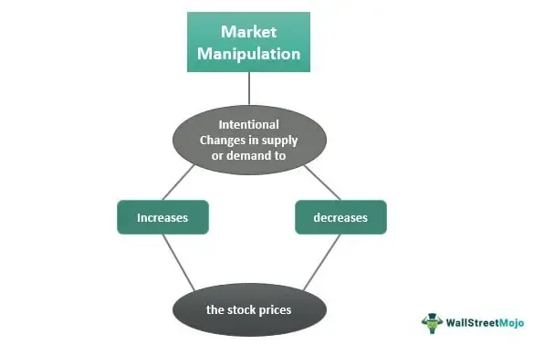

The financial markets have always been a fertile ground for innovation, with algorithmic trading being one of the latest technological advancements changing how we trade. This type of trading uses complex mathematical formulas and high-speed computing to execute trades at a pace and frequency that are difficult for human traders to mimic. By automating the trading process, algorithmic trading aims to capitalize on minor discrepancies in the market, thereby enhancing efficiency and reducing transaction costs.

Despite these benefits, algorithmic trading introduces concerns regarding potential manipulation and unfair advantages. Algorithms have the capacity to execute massive trades within microseconds, which could potentially disrupt market integrity. One notable concern is that sophisticated algorithms could manipulate market prices by engaging in practices like spoofing, where large orders are placed with no intention of execution to influence market prices.

This article examines the ecosystem of algorithmic trading, including its implications for market manipulation and its broader effects on retail investors and the overall market environment. Understanding these dynamics is crucial as stakeholders strive to balance innovation with the need to maintain fair and transparent markets. Regulatory bodies face the challenging task of ensuring that technological advancements do not compromise financial market integrity, thereby safeguarding the interests of all market participants.

## Table of Contents

## Understanding Algorithmic Trading

Algorithmic trading, often referred to as algo trading, represents a significant technological advancement in financial markets. It employs pre-programmed instructions to execute trades on stock exchanges at speeds and frequencies far exceeding human capabilities. These algorithms are comprehensive sets of rules for buying or selling an asset, defined by parameters such as timing, price, or volume.

The algorithms can be customized to achieve various trading objectives, including:

1. **Arbitrage**: This involves exploiting price discrepancies of the same asset in different markets. Algorithms can rapidly detect and act on these discrepancies to generate profit with minimal risk. For example, if a stock is priced lower on one exchange than another, an algorithm can purchase the stock at the lower price and sell it at the higher price simultaneously.

2. **Trend Following**: These strategies are based on technical indicators such as moving averages. An algorithm might be programmed to buy a stock when its 50-day moving average crosses above its 200-day moving average, indicating an upward trend, and sell when the reverse occurs.

3. **Market Making**: This involves providing liquidity to markets by placing buy and sell limit orders at specific spreads. Market-making algorithms profit from the bid-ask spread, incrementally earning from each transaction.

The primary advantage of [algorithmic trading](/wiki/algorithmic-trading) lies in its efficiency. Algorithms can process vast quantities of data at significantly higher speeds, reduce human error, and lower transaction costs by optimizing trade execution. Traders are thus able to capitalize on fleeting market opportunities that would be impossible to exploit manually.

However, this efficiency carries potential downsides. The swift nature of algorithmic trades can lead to market manipulation, such as "quote stuffing," where large volumes of orders are placed and then canceled to create confusion and move prices. This not only undermines market integrity but also disadvantages smaller investors, who may not have access to the same technological tools.

As such, while algorithmic trading enhances operational proficiency, it also necessitates scrutiny to ensure that its implementation does not compromise fairness or stability in financial markets.

## Stock Market Manipulation Through Algorithms

Algorithmic trading, despite its efficiency and speed, can inadvertently lead to market manipulation by engaging in strategies that resemble manipulative practices. These autonomous algorithms can significantly impact market prices, mimicking tactics such as pump-and-dump schemes or spoofing. In a pump-and-dump scenario, rapid buying by an algorithm can inflate the price of a security, which might lead retail investors to perceive it as a rising asset worth buying into. Subsequently, the algorithm may sell off the security at the inflated price, reaping profits while leaving uninformed investors with devalued assets. Similarly, spoofing involves placing large orders that the trader does not intend to execute in order to create false impressions of demand or supply, thus misleading other market participants about the actual state of the market.

Bid manipulation and price rigging are other areas where algorithms can traverse ethical boundaries, potentially violating legal norms. Bid manipulation involves placing orders to buy a security at successively higher prices without the intent to follow through, provoking artificial price hikes. Algorithms excel in speed and can deploy such strategies swiftly and on a large scale. Price rigging, where orders are strategically placed to secure favorable conditions for specific transactions, can also be exacerbated by the precision and rapidity of algorithms.

For financial regulators, the challenge of monitoring and mitigating these practices is immense. The complexity and speed at which these algorithms operate make it difficult to differentiate between legitimate trading strategies and manipulative ones. Regulators must therefore evolve their tools and methodologies to identify and address potential abuses in real-time. Advanced analytics and [machine learning](/wiki/machine-learning) techniques are increasingly being explored to enhance surveillance and detection capabilities for such manipulative activities. Yet, the balance between fostering technological advancement and maintaining market integrity remains a pressing concern for regulatory bodies worldwide.

## The Influence of Information Asymmetry

Information asymmetry in financial markets occurs when one party possesses more or superior information than another, significantly impacting trade dynamics. This imbalance is particularly pronounced with the advent of algorithmic trading used by large financial institutions. These institutions leverage sophisticated algorithms capable of processing and analyzing vast datasets at unprecedented speeds. This ability grants them a decisive edge over retail traders who often rely on delayed or less comprehensive market insights.

The rapid data mining and processing capabilities of institutional algorithms mean they can identify market trends, price fluctuations, and other trading signals far quicker than human traders. For instance, high-frequency trading algorithms can execute numerous trades within milliseconds, exploiting even the smallest price discrepancies before retail traders can react. This speed and efficiency translate into significant financial gains for institutions, highlighting a stark contrast in the market's playing field.

Such disparities raise significant concerns about the fairness and integrity of financial markets. If large institutions consistently access and act on superior information, it undermines the principle of equal opportunity, which is foundational to market trading. This imbalance not only disadvantages individual investors but can also diminish overall market confidence, leading to reduced participation from retail traders who may perceive the market as inherently biased.

Addressing information asymmetry involves understanding and regulating the flow of information within markets. Financial regulators and market operators must ensure that data dissemination occurs fairly and transparently. Measures such as implementing stricter controls on who can access certain types of information and promoting platforms that facilitate equal data access can help mitigate these disparities.

In conclusion, while algorithmic trading offers efficiency and speed, its use accentuates the issue of information asymmetry. Ensuring that financial markets remain equitable requires continuous efforts to level the informational playing field, thereby protecting smaller investors and preserving market integrity.

## Regulations and Oversight

Financial regulators, such as the U.S. Securities and Exchange Commission (SEC), are actively working to establish comprehensive policies to oversee algorithmic trading systems. Considering the rapid pace of technological innovations in trading, regulators face the challenge of creating adaptive frameworks that effectively prevent market manipulation while fostering transparency. As algorithm-driven trading evolves, current laws may fall short in addressing the unique characteristics and potential risks posed by these digital mechanisms.

Algorithmic systems operate at speeds and complexity levels that can be difficult for existing regulatory measures to track. This poses significant challenges, as traditional market surveillance and enforcement techniques may not be equipped to handle algorithm-driven nuances. The potential for these algorithms to unintentionally or deliberately manipulate market conditions necessitates an evolution in regulatory approaches. For instance, strategies akin to spoofing or layering, which can distort market perceptions and prices, require robust detection and prevention mechanisms.

To address these challenges, financial regulators are increasingly focusing on enhancing their technological capabilities. Modern surveillance systems capable of analyzing large datasets in real-time are essential for identifying suspicious trading patterns indicative of manipulation. Moreover, regulatory entities are advocating for greater transparency from market participants, necessitating disclosure of algorithmic strategies used in trading.

International cooperation is crucial in establishing unified standards and policies for algorithmic trading. Financial markets today are interconnected, with trades often spanning multiple jurisdictions. Global collaboration ensures that regulations are not only consistent across borders but also adaptable to the varying degrees of technological advancement in different markets. Initiatives such as the Financial Stability Board (FSB) and the International Organization of Securities Commissions (IOSCO) strive to harmonize regulatory efforts worldwide, aiming for comprehensive standards that uphold market integrity.

As algorithmic trading continues to grow, the balance between innovation and regulation will play a decisive role in shaping the future of global financial markets. By fostering a regulatory environment that embraces technological progress while mitigating risks, regulators can protect investors and maintain confidence in financial systems worldwide.

## Mitigation Strategies for Retail Investors

Retail investors can enhance their protection against the challenges posed by algorithmic trading by employing a few practical strategies. One effective approach is embracing automated trading systems that are accessible and suited to the needs of individual investors. Platforms offering such services enable retail investors to keep pace with institutional traders by executing trades with increased precision and efficiency. Additionally, staying informed about market trends through reliable sources helps investors make data-driven decisions, avoiding reactive moves based on sentiment rather than analysis.

A core strategy in risk mitigation is the use of stop-loss orders. These are automatic instructions to sell a security when it reaches a specified price, thus limiting potential losses. For instance, if an investor buys a stock at $100 and sets a stop-loss order at $90, the stock will be automatically sold if its price falls to $90, limiting the loss to 10%. This mechanism acts as a safety net during volatile market conditions, where sudden price swings due to algorithmic actions can otherwise result in significant losses.

Diversified index investing is another strategy that helps retail investors manage the risks associated with market manipulation. By investing in a broad array of assets, such as index funds or ETFs, investors dilute the impact of adverse movements in any single asset or sector. This approach reduces risk exposure and strengthens the investment portfolio’s resilience against market disruptions potentially caused by algorithmic trading.

Building financial literacy is vital for retail investors aiming to navigate markets dominated by algorithms. Understanding basic concepts, such as market orders, bid-ask spreads, and [liquidity](/wiki/liquidity-risk-premium), along with the mechanics of algorithmic trading, equips investors to make more informed decisions. Educational resources, online courses, and investment workshops are available, catering to individuals at various levels of expertise.

Collaborative platforms and forums offer retail investors avenues to exchange insights and strategies. Online communities, such as Reddit's r/stocks or the Bogleheads forum, provide spaces where individuals share experiences and tips about trading and investing. Engaging with such communities can enhance retail investors’ understanding and offer support in crafting strategies to mitigate potential risks posed by algorithmic trading practices.

In conclusion, by leveraging automated trading systems, applying prudent investment strategies, enhancing financial literacy, and utilizing collaborative resources, retail investors can bolster their defenses against the challenges and uncertainties introduced by algorithmic trading. These initiatives not only safeguard their interests but also empower them to participate more effectively in today’s fast-paced financial markets.

## The Future of Algorithmic Trading

AI and machine learning (ML) are at the forefront of innovations transforming algorithmic trading. These technologies bring forth a suite of opportunities, notably in enhancing the predictive accuracy of trading models and automating complex market strategies. Through adaptive learning, AI algorithms can analyze vast datasets, identifying patterns and trends that might elude human traders. This capability allows for the development of more sophisticated trading strategies which can potentially lead to increased profitability and reduced human error.

However, the incorporation of AI and ML in trading also poses significant challenges. One concern is the potential for algorithmic collusion, whereby separate algorithmic systems could unintentionally or intentionally collaborate to manipulate market conditions. While this is theoretically possible, substantial empirical evidence for widespread misuse remains sparse. Detecting such collusion depends on advanced monitoring systems and regulatory frameworks capable of analyzing algorithmic interactions at high speed and [volume](/wiki/volume-trading-strategy).

The evolving landscape of financial markets, fueled by technological advancements, requires traders and regulators to be highly adaptable. For traders, this means continuously updating their skills to navigate algorithm-driven platforms effectively and maintaining an in-depth understanding of AI advancements. For regulators, the challenge is to craft policies that ensure the ethical use of technology without stifling innovation. Regulatory bodies might need to employ AI themselves to keep pace with traders' technology.

Stakeholders, including traders, tech developers, and regulatory agencies, bear the responsibility of ensuring that technological advancements promote fair, efficient, and transparent markets. Collaboration among these stakeholders can lead to the development of standards and protocols that align technological growth with market integrity. Moreover, fostering a culture of transparency and accountability within automated trading systems is crucial to maintaining investor trust and sustaining market stability. As AI and ML continue to develop, the focus should remain on building robust systems that prioritize these tenets.

## Conclusion

Algorithmic trading, if employed with care, stands as a powerful tool in modern financial markets. Its core advantage lies in its ability to execute trades with unmatched efficiency, thereby reducing trading costs and maximizing profit opportunities without requiring intensive human intervention. This capability allows for optimizing trade executions, managing portfolios better, and ultimately contributing to more liquid markets.

Despite its numerous advantages, algorithmic trading is not without risk. The very automation that drives its efficiency also harbors potential dangers. This includes market manipulation tactics such as spoofing, where orders are placed with no intention of execution to manipulate stock prices, highlighting the ethical implications and concerns about market integrity. The speed and complexity of algorithms can lead to unintended consequences, creating vulnerabilities that could be exploited, hypothetically disrupting the market equilibrium.

The future of trading markets will be shaped by how well innovation is balanced against regulatory measures. Regulatory bodies are increasingly tasked with the challenge of designing frameworks that can effectively oversee the high-frequency and algorithm-driven market activities, maintaining transparency, and preventing unfair manipulation. This critical balance will determine whether the advancements in algorithmic trading contribute positively to the markets or undermine their integrity.

Ultimately, the goal of technology in financial markets should be to foster an equitable environment where all participants have the opportunity to succeed. This involves not only leveraging the benefits of innovation but also safeguarding against its potential pitfalls. As we advance, stakeholders—ranging from regulators to traders—must collaboratively ensure that the evolution of algorithmic trading leads to fair, efficient, and inclusive markets. Through judicious oversight and responsible use, algorithmic trading can indeed enhance market quality and drive economic growth.

## References & Further Reading

[1]: Cartea, Á., Jaimungal, S., & Penalva, J. (2015). ["Algorithmic and High-Frequency Trading."](https://assets.cambridge.org/97811070/91146/frontmatter/9781107091146_frontmatter.pdf) Cambridge University Press.

[2]: Hasbrouck, J. (2018). ["Empirical Market Microstructure: The Institutions, Economics, and Econometrics of Securities Trading."](https://archive.org/details/empiricalmarketm0000hasb) Oxford University Press.

[3]: Patterson, S. (2012). ["Dark Pools: The Rise of the Machine Traders and the Rigging of the U.S. Stock Market."](https://www.amazon.com/Dark-Pools-Machine-Traders-Rigging/dp/0307887189) Crown Business.

[4]: Aldridge, I. (2013). ["High-Frequency Trading: A Practical Guide to Algorithmic Strategies and Trading Systems."](https://www.amazon.com/High-Frequency-Trading-Practical-Algorithmic-Strategies/dp/1118343506) Wiley.

[5]: Lehalle, C.-A., & Laruelle, S. (Eds.). (2013). ["Market Microstructure in Practice."](https://www.semanticscholar.org/paper/Market-Microstructure-in-Practice-Lehalle-Laruelle/2df52569ee044db799cc9ae865de4689847d6f83) World Scientific Publishing Company.

[6]: Hendershott, T., & Moulton, P. (2011). ["Automation, Speed, and Stock Market Quality: The NYSE's Hybrid."](https://www.sciencedirect.com/science/article/pii/S138641811100005X) Journal of Financial Markets, 14(4), 568-604.