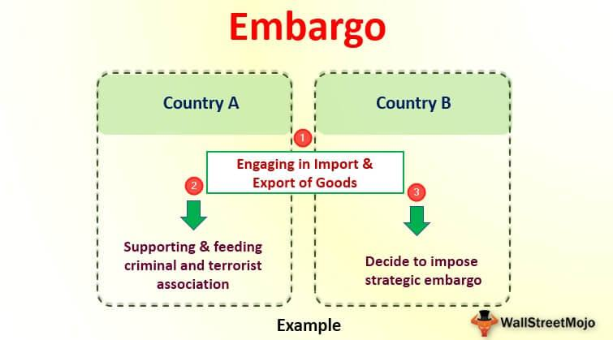

The insurance and finance sectors are foundational to managing risk and ensuring economic stability for individuals and organizations. Within these fields, specific terminology and concepts are pivotal to developing a comprehensive safety net. Understanding the nuanced language of insurance and trading is vital for informed decision-making and strategic risk management. This article will navigate essential insurance terms, examine various coverage options, and outline the critical function of allied lines. Furthermore, we will explore the intriguing relationship between these insurance components and algorithmic trading—an influential practice in modern financial markets. Algorithmic trading, often referred to as algo trading, facilitates efficient and accurate risk assessment and premium determination by leveraging powerful computational algorithms. This integration of insurance and trading embodies the evolving landscape of risk management, highlighting the dynamic tools and strategies shaping future financial and insurance products.

## Table of Contents



## Understanding Insurance Terms

Insurance involves specialized terminology that is essential for understanding policies and making informed decisions. Key terms include premiums, deductibles, and liability, each playing a critical role in defining the nature and scope of insurance agreements.

**Premiums**: A premium is a payment made by the insured to the insurer to cover the risk specified in the insurance policy. Typically paid monthly, quarterly, or annually, premiums are calculated based on various factors, including the type of coverage, risk profile of the insured, and the insurer's underwriting guidelines. For instance, a driver with an excellent safety record may pay lower auto insurance premiums compared to a high-risk driver. Insurers use complex algorithms and statistical models to assess risk and set appropriate premium rates.

**Deductibles**: The deductible is the amount the policyholder must pay out of pocket before the insurance coverage starts to pay. It acts as a form of risk-sharing between the insured and the insurer. Higher deductibles often result in lower premiums because they reduce the insurer's exposure to small claims, thereby encouraging policyholders to avoid filing minor claims and ultimately reducing administrative costs. For instance, if a policy has a deductible of $500 and the insured incurs a loss of $2,000, the insured would be responsible for the first $500, and the insurer would cover the remaining $1,500.

**Liability**: Liability insurance protects the insured against claims resulting from injuries and damage to other people or property. It covers legal costs and any payouts for which the insured is found liable, up to the policy limits. Liability insurance is crucial for individuals and businesses, providing coverage in case of negligence that results in harm to third parties. For example, general liability insurance for businesses can help cover medical expenses and legal fees associated with workplace accidents.

Understanding these terms equips individuals with the knowledge required to evaluate different insurance policies' advantages and drawbacks, ensuring they choose coverage that aligns with their needs and financial capabilities.

## Exploring Insurance Coverage

Insurance coverage, pivotal in safeguarding against financial uncertainties, comes in various forms tailored to meet diverse needs. These coverages primarily encompass health, life, auto, and property, each addressing specific risks and offering unique benefits to policyholders. A comprehensive understanding of these options enables individuals and businesses to choose suitable coverage to manage risks effectively.

### Health Insurance

Health insurance provides financial protection against medical expenses. Policies typically cover doctor visits, surgeries, prescription drugs, and sometimes dental or optical care. Health insurance can be acquired through employer-provided plans, government programs like Medicare and Medicaid, or private individual plans. Key components of health insurance include premiums, deductibles, copayments, and coinsurance. Premiums are regular payments made to maintain coverage, while deductibles represent out-of-pocket expenses before the insurance kicks in. Plans can vary significantly in terms of coverage limits and network restrictions, impacting the choice of healthcare providers and facilities.

### Life Insurance

Life insurance is designed to provide financial support to beneficiaries upon the policyholder's death. It serves as a crucial tool for income replacement, debt settlement, and estate planning. There are two primary types of life insurance: term life and permanent life insurance. Term life provides coverage for a specific period, usually ranging from 10 to 30 years. In contrast, permanent life insurance, which includes whole and universal life insurance, offers lifelong coverage and incorporates a savings component, allowing policyholders to accumulate cash value. Factors influencing life insurance premiums include age, health status, and lifestyle habits of the insured.

### Auto Insurance

Auto insurance protects against financial loss in the event of vehicle-related incidents. It typically covers liability for bodily injury and property damage to others, personal injury protection, collision damage to the policyholder's vehicle, and comprehensive coverage for non-collision-related incidents such as theft, fire, or natural disasters. Mandatory in most jurisdictions, auto insurance premiums are determined by factors like driving history, vehicle type, coverage level, and geographical location. Discounts may be available for safe driving records, multiple policy bundling, or the installation of anti-theft devices.

### Property Insurance

Property insurance shields against potential losses to one's home or personal property. It usually comprises homeowner's insurance, renter's insurance, and landlord insurance. Homeowner's insurance covers the home structure and personal belongings against perils like fire, theft, and natural disasters, while also providing liability coverage for accidents occurring on the property. Renter's insurance offers similar protections for tenants, excluding coverage for the building itself. Landlord insurance protects rental property owners against property damage and liability risks associated with renting out their properties. Property insurance policies typically feature deductibles and limits on covered perils, making it essential to assess risks and coverage needs accurately.

Understanding these core types of insurance coverage is fundamental to selecting policies that effectively mitigate potential risks. By evaluating personal and business needs, alongside the specific terms and conditions of available policies, stakeholders can secure optimal protection against unforeseen financial challenges.

## What Are Allied Lines?

Allied lines insurance, often purchased alongside fire insurance, forms a pivotal component of comprehensive risk management strategies for both individuals and businesses. Allied lines refer to various types of insurance coverage that address risks not usually covered by standard fire insurance policies. These supplementary coverages are designed to protect against losses from perils such as windstorms, hail, vandalism, explosion, and water damage.

The primary intention behind acquiring allied lines insurance is to fill the gaps left by traditional fire insurance policies. Fire insurance typically provides protection against damage directly caused by fire, but allied lines extend this protection by safeguarding against additional risks that buildings and properties face. This diverse range of coverage options ensures a more holistic approach to risk management, reducing financial vulnerabilities for policyholders.

For instance, vandalism coverage under allied lines can be crucial for property owners in urban or less secure areas where the risk of intentional property damage is higher. Water damage coverage, often excluded or limited in fire insurance, plays a critical role in protecting properties from incidents like pipe bursts, leaks, or flooding caused by storms. Such coverages are especially pertinent in regions prone to severe weather events, helping property owners mitigate potentially devastating financial losses.

Insurance providers structure these policies to cater to the specific needs and risk profiles of their clients. By diversifying the types of perils covered, allied lines insurance policies offer personalized solutions that align with the insured's requirements. This customization is vital for ensuring that proper protection is in place, as every property or business environment presents unique risks.

In summary, allied lines insurance is an essential facet of effective risk management, providing a broader spectrum of protection than fire insurance alone. The importance of allied lines lies in their ability to cover additional risks, thereby safeguarding assets and ensuring business continuity in the face of unforeseen events. As businesses and property owners aim to minimize potential losses, the role of allied lines in a well-rounded insurance strategy becomes increasingly significant.

## The Role of Algo Trading in Insurance

Algorithmic trading, commonly referred to as algo trading, has transformed numerous financial sectors, including insurance. By harnessing advanced algorithms, trading operations have become more efficient and accurate. In the insurance domain, algo trading increasingly influences product development, underwriting processes, and risk management.

Algo trading employs complex algorithms to analyze vast datasets and make quick, informed decisions. In insurance, these algorithms assess risk factors by evaluating historical data, financial trends, and market sentiment. This real-time analysis enables insurers to price premiums more accurately and develop personalized insurance products catering to diverse customer needs.

One significant advantage of integrating algo trading into insurance is the enhanced efficiency in risk assessment. Traditionally, risk assessment was a labor-intensive process, often involving manual data analysis and subjective judgment. With algo trading, these processes become more streamlined and objective. Algorithms evaluate risk by considering numerous variables, such as claimant history, environmental factors, and economic indicators, allowing insurers to predict potential claims more accurately.

Furthermore, algo trading can optimize the underwriting process. Underwriting involves evaluating the risk of insuring a client and determining the terms of the insurance policy. Algorithms can automate this process by analyzing large volumes of data to identify patterns and correlations, which helps underwriters set optimal policy conditions swiftly.

Insurance firms also leverage algo trading for real-time market surveillance. By continuously monitoring financial markets, algorithms can detect emerging trends and anomalies, allowing insurers to adjust their product offerings and pricing models promptly in response to market changes. This ability to respond swiftly to market dynamics helps minimize exposure to risks and improve overall financial stability.

Moreover, the insurance sector increasingly uses algo trading to hedge against various risks. Insurers can deploy algorithms to devise hedging strategies, which involve taking positions in financial markets to offset potential losses from insurance claims. These strategies become particularly valuable in volatile markets, where unexpected events can lead to significant claims.

For example, a Python-based model could be employed to analyze a dataset of historical claims and market conditions:

```python
import pandas as pd
from sklearn.model_selection import train_test_split
from sklearn.ensemble import RandomForestRegressor

# Load historical data with claims information and market indicators
data = pd.read_csv('insurance_data.csv')

# Features and target variable
X = data.drop('ClaimAmount', axis=1)
y = data['ClaimAmount']

# Split data into training and testing sets
X_train, X_test, y_train, y_test = train_test_split(X, y, test_size=0.2, random_state=42)

# Initialize and train a Random Forest Regressor
model = RandomForestRegressor(n_estimators=100, random_state=42)
model.fit(X_train, y_train)

# Model prediction
predictions = model.predict(X_test)
```

This code demonstrates how [machine learning](/wiki/machine-learning) algorithms, such as a Random Forest Regressor, can predict claims based on historical data. By doing so, insurers enhance their pricing models and risk assessments.

In conclusion, algo trading is redefining the landscape of the insurance industry. By incorporating advanced algorithms into risk assessment, underwriting, and market analysis, insurance companies enhance their operational efficiency, accuracy, and ability to respond to market dynamics. As technology and data analytics advance, the role of algo trading in insurance is expected to become even more pivotal, leading to innovative solutions for managing risks and enhancing financial performance.

## Interconnection Between Lines of Insurance and Trading

The integration of trading algorithms with insurance policies has ushered in a new era of dynamic and tailored insurance products. This synergy harnesses vast amounts of data generated through trading activities to develop insights that enhance the performance and responsiveness of insurance offerings. The process begins with the collection and analysis of real-time market data and historical trading patterns, which serve as input for sophisticated predictive models.

Incorporating algorithmic insights into insurance involves an intricate process of risk assessment. Algorithms analyze data to identify trends and potential risks, which allows insurers to adjust their underwriting parameters and pricing models effectively. This data-driven approach is crucial in crafting insurance policies that adapt to market [volatility](/wiki/volatility-trading-strategies) and changing customer needs.

For example, consider the use of predictive analytics in determining premiums. Algorithms can evaluate a series of risk factors, such as economic conditions, demographic changes, and even climate patterns. By processing this information, insurers can set premiums that accurately reflect the likelihood of future claims, providing both coverage stability for policyholders and profitability for insurers.

Moreover, trading algorithms can optimize the asset allocation within an insurer's portfolio. Insurers traditionally allocate a portion of their premium income to investments, balancing risk and return. Advanced algorithms can continuously analyze market conditions, ensuring optimal portfolio composition that aligns with risk management strategies and capitalizes on emerging opportunities.

This integration also extends to claims management. Algorithms can streamline the claims process by automating tasks such as initial assessment, fraud detection, and settlement procedures. By leveraging real-time data, insurers can expedite claim resolutions, thus enhancing customer satisfaction and reducing operational costs.

The intersection of trading algorithms and insurance is not without its challenges, notably data privacy and regulatory compliance. Ensuring that data exchange and algorithmic processing adhere to stringent privacy standards is critical. Additionally, as regulatory landscapes evolve, insurers must remain agile, updating their algorithmic frameworks to maintain compliance while leveraging market insights.

In summary, the collaboration of trading algorithms with insurance practices is a transformative development, enhancing the adaptability and effectiveness of insurance products in a rapidly changing market landscape. Through continuous data analysis and predictive modeling, insurers can offer more responsive, customized policies that meet the ever-evolving needs of stakeholders.

## Challenges and Opportunities

The integration of insurance and [algorithmic trading](/wiki/algorithmic-trading) strategies offers numerous advantages, yet it is accompanied by several challenges that must be addressed to fully realize its potential. One of the foremost challenges is regulatory compliance. Insurance and financial sectors are heavily regulated industries, and the intersection of these fields introduces additional layers of complexity. Regulators must balance promoting innovation with ensuring consumer protection and maintaining financial stability. This often leads to stringent compliance requirements that can slow down the adoption of new technologies in insurance and trading algorithms.

Data privacy is another significant concern. The use of big data analytics and machine learning in algo trading and insurance necessitates the collection and processing of vast amounts of personal and financial data. Ensuring the privacy and security of this data is crucial, as breaches could result in not only financial loss but also reputational damage to firms and loss of consumer trust. Implementing robust cybersecurity measures and adhering to data protection regulations such as the General Data Protection Regulation (GDPR) in Europe are non-negotiable for companies working at this intersection.

On the opportunity side, the integration of algorithmic trading strategies with insurance presents several avenues for innovation. For instance, the use of advanced analytics can improve risk assessment accuracy and enable more personalized insurance products. This customization allows insurers to offer competitive premiums while increasing customer satisfaction. Moreover, the real-time capabilities of algo trading can enhance the underwriting process, allowing for dynamic adjustments in policy terms and pricing based on current market conditions and emerging risks.

Additionally, the increasing availability of high-frequency trading data provides opportunities to develop predictive models that forecast risk events with greater precision. Insurance companies can leverage these insights to improve catastrophe modeling and financial risk management, potentially reducing losses from unforeseen events.

Collaboration between technology firms specializing in data analytics and traditional insurance providers can drive the development of innovative solutions that cater to evolving consumer needs. Exploring blockchain technology for automating claims processing and enhancing transparency in insurance contracts is another promising area.

In conclusion, while challenges such as regulatory compliance and data privacy persist, the potential for innovation in integrating insurance with algorithmic trading strategies is vast. By addressing these challenges, companies can unlock new opportunities for enhanced risk management and operational efficiency.

## Conclusion

In the rapidly evolving landscape of finance and insurance, possessing a thorough understanding of insurance terms and policies becomes increasingly vital when integrated with algorithmic trading. The fusion of these domains facilitates more efficient risk assessment and premium setting, maximizing benefits for stakeholders. Algorithmic trading, with its reliance on computational power and data analytics, enhances the precision and speed with which insurance products are tailored, responding to market changes with agility.

This synergy between insurance and advanced trading algorithms opens new avenues for innovation, leading to more dynamic insurance products that meet the nuanced demands of consumers. The ability to process vast amounts of data enables insurers to optimize policy offerings, addressing risk factors with a finer granularity and personalized accuracy. For instance, machine learning models can predict potential claim events, allowing insurers to adjust premiums in real-time based on calculated risk exposure, ultimately fostering a more balanced and fair insurance ecosystem.

As technology continues its relentless progression, the convergence of insurance and algorithmic trading promises further opportunities for enhanced risk management and financial stability. By leveraging data-driven insights, insurance providers can offer more competitive products, ensuring they remain at the forefront of adapting to the evolving financial environment. It is through this seamless integration of terms, policies, and technology that the industry can successfully navigate emerging challenges and seize future opportunities.

## References & Further Reading

[1]: Bergstra, J., Bardenet, R., Bengio, Y., & Kégl, B. (2011). ["Algorithms for Hyper-Parameter Optimization."](https://dl.acm.org/doi/10.5555/2986459.2986743) Advances in Neural Information Processing Systems 24.

[2]: ["Advances in Financial Machine Learning"](https://www.amazon.com/Advances-Financial-Machine-Learning-Marcos/dp/1119482089) by Marcos Lopez de Prado

[3]: ["Evidence-Based Technical Analysis: Applying the Scientific Method and Statistical Inference to Trading Signals"](https://www.amazon.com/Evidence-Based-Technical-Analysis-Scientific-Statistical/dp/0470008741) by David Aronson

[4]: ["Machine Learning for Algorithmic Trading"](https://github.com/stefan-jansen/machine-learning-for-trading) by Stefan Jansen

[5]: ["Quantitative Trading: How to Build Your Own Algorithmic Trading Business"](https://www.amazon.com/Quantitative-Trading-Build-Algorithmic-Business/dp/1119800064) by Ernest P. Chan