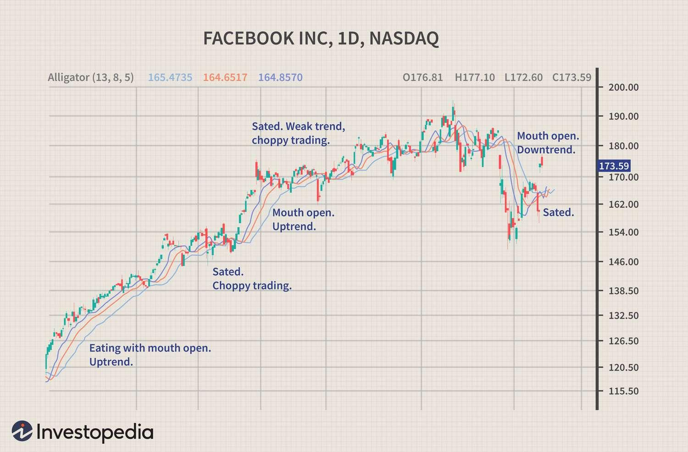

Options trading is characterized by an array of strategies, each catering to different market conditions and trader preferences. One such strategy that stands out for its complexity and intrigue is the alligator spread. Named metaphorically for its propensity to have potential profits "eaten up" by fees much like an alligator's voracious appetite, this strategy requires a nuanced understanding of the cost structures and positioning within the options market.

The evolution of trading has seen algorithmic methods redefine strategy implementation, and the alligator spread is no exception. Algorithmic trading, with its precision and speed, introduces an enhanced layer of sophistication to existing trading strategies. Through this lens, the application of the alligator spread can be optimized to achieve greater efficacy in decision-making and execution. This provides traders with the tools to potentially minimize risk and maximize their positions even in volatile market conditions.



In this article, we will explore the fundamentals of the alligator spread, unveiling both its structural intricacies and strategic applications. The benefits it offers, alongside the pitfalls it poses, will be examined to provide a comprehensive understanding. Through illustrative examples, we aim to elucidate how this sophisticated strategy can be effectively implemented within an algorithmic trading framework to capitalize on market movements. As options traders confront increasingly complex market landscapes, the alligator spread presents a compelling technique to explore, notwithstanding the challenges it brings.

## Table of Contents

## Understanding the Alligator Spread

The alligator spread is a warning emblem for traders within the options market, emphasizing how fees and costs can devour potential profits. Fundamentally, it involves constructing multi-legged options strategies, where each leg corresponds to buying or selling options at distinct strike prices. The complexity arises from the compounded transaction costs associated with each option leg, potentially overshadowing the anticipated gains.

The concept metaphorically likens an alligator consuming profits to fees that 'eat up' the potential for financial gain. This analogy underscores the critical nature of accounting for all trading costs when devising strategies. Traders may inadvertently create an alligator spread when they neglect transaction costs associated with executing multiple options contracts simultaneously.

A typical instance might involve purchasing both call and put options in a strategy known as a 'straddle' or combining different expiration dates and strike prices. Although such combinations are designed to capitalize on volatility and price movements, the accumulative fees can drastically reduce the net payoff. Each leg's transaction cost is compounded, impacting the overall viability of the trade.

For example, consider a scenario where a trader constructs a position with four different option contracts. Assuming the brokerage charges $1 fee per contract, the initial outlay for fees alone would be $4. If the expected profit margin is narrow, say $5, the net profit after deducting the fees remains a mere $1. This scenario vividly illustrates how the cost structure can severely impact profitability, transforming a potentially lucrative trade into a marginal gain — or even a loss if additional unforeseen expenses arise.

Understanding the alligator spread goes beyond recognizing how fees accumulate. It requires recognizing situations where such accumulation might occur and proactively configuring trading strategies to minimize unnecessary complexity and costs. Evaluating potential alligator spreads should be an integral part of crafting a coherent options strategy, ensuring that profitability is genuinely achievable after accounting for all associated trading costs.

## Example of an Alligator Spread

Consider Charlie, an experienced options trader who operates with shares of XYZ Corporation. Charlie, understanding the high [volatility](/wiki/volatility-trading-strategies) forecasted for XYZ's stock, decides to deploy a sophisticated options strategy with the expectation of capitalizing on significant price movements. He sets up a position comprising a mix of call and put options with different strike prices and expiration dates, aiming to benefit from the potential upswing in volatility.

Despite Charlie's careful structuring, as the options approach expiration, he notices a troubling trend: the expected profits from his strategy have been substantially diluted. After conducting a thorough review of his financial statements, it becomes evident that the transaction fees and other associated costs incurred from establishing and maintaining the position have overshadowed any potential gains. This classic scenario exemplifies an unintentional alligator spread, where profitability is metaphorically "eaten up" by cumulative trading expenses.

This situation provides a crucial lesson for traders like Charlie: the importance of accounting for all potential costs when planning an options trading strategy. Failure to include these costs can result in yields that fall short of expectations, even when market conditions are otherwise favorable. This case emphasizes the necessity for traders to meticulously assess transaction costs, management fees, and the cumulative effect these expenses have on net profitability.

In practice, the alligator spread serves as a cautionary tale against neglecting detailed cost analysis. Traders should rigorously evaluate not only the potential market scenarios and the prices of options themselves but also the less overt expenses involved in executing multi-leg options strategies. By doing so, they can better protect their positions from the profitability pitfalls that ensnared Charlie's strategy.

## Alligator Spread Trading Strategy

The alligator spread trading strategy involves complex options setups characterized by the use of straddles, strangles, or multiple-legged spreads. This sophisticated approach is particularly effective in environments of heightened market volatility, where prices are anticipated to experience significant fluctuations. Here, the goal is to construct a position that can capitalize on these price movements, ideally generating profits from mispriced options while also mitigating associated risks.

### Structuring Alligator Spreads

To understand the alligator spread, consider key options strategies often employed:

1. **Straddles**: This involves buying a call and a put option with the same strike price and expiration date. The primary benefit is that traders can profit if the stock price moves significantly in either direction. However, if the price remains stable, the premiums paid could become a loss.

2. **Strangles**: Similar to straddles but with different strike prices for the call and put options. This provides a cheaper alternative than a straddle but requires a larger price movement to be profitable.

3. **Complex Multi-Leg Spreads**: These might combine bull call spreads with bear put spreads to cover a range of potential market conditions, often adjusted based on expected volatility or specific market scenarios.

In the alligator spread, each leg of the strategy is carefully selected and combined to minimize upfront costs and maximize the potential for price movement capture. The trader aims to establish a "wide profit zone," within which any significant price swings lead to substantial returns, akin to an alligator’s jaws effectively closing on its prey.

### Benefits of Flexible Structures

The flexibility inherent in the alligator spread allows traders to:

- **Capture Mispricing Opportunities**: Options are often mispriced due to market inefficiencies, especially during volatile periods. By setting up alligator spreads, traders can quickly take advantage of these discrepancies for profit.

- **Risk Mitigation**: Unlike naked positions, where traders are exposed to unlimited risks, alligator spreads utilize combinations of options that provide a predefined loss limit. This helps traders protect themselves against adverse price movements.

- **Wide Profit Zone**: Strategically structuring the options can create scenarios where a broad range of price movements result in profitability. This way, even if the anticipated movement doesn't reach extreme levels, traders can still realize some gains.

### Visualizing an Alligator Spread

To visualize the effectiveness of an alligator spread, consider plotting potential profits and losses against possible underlying asset prices. Here’s an example Python code snippet to demonstrate this:

```python
import numpy as np
import matplotlib.pyplot as plt

# Parameters
strike_call = 50
strike_put = 50
premium_call = 5
premium_put = 5
underlying_prices = np.linspace(30, 70, 100)

# Profit/Loss calculation
def calculate_pnl(price, strike_call, premium_call, strike_put, premium_put):
    call_pnl = max(price - strike_call, 0) - premium_call
    put_pnl = max(strike_put - price, 0) - premium_put
    return call_pnl + put_pnl

pnl = [calculate_pnl(price, strike_call, premium_call, strike_put, premium_put) for price in underlying_prices]

# Plot
plt.plot(underlying_prices, pnl, label='Alligator Spread PnL')
plt.axhline(0, color='gray', linestyle='--')
plt.xlabel('Underlying Asset Price')
plt.ylabel('Profit/Loss')
plt.title('Alligator Spread Profit/Loss vs Underlying Price')
plt.legend()
plt.show()
```

This code calculates and plots the profit/loss of a hypothetical alligator spread, illustrating how traders can achieve a balance between potential gains and limited losses. By leveraging this strategy effectively, traders can further enhance their ability to navigate volatile markets and capture profitable opportunities.

## Algo Trading and Alligator Spreads

Algorithmic trading, also known as algo trading, has revolutionized how traders approach complex strategies such as the alligator spread. By leveraging computers to execute predefined instructions, traders can optimize decision-making and enhance efficiency.

### Integration of Algo Trading with Alligator Spreads

The integration of [algorithmic trading](/wiki/algorithmic-trading) into the execution of alligator spreads allows traders to overcome one of the primary challenges associated with this strategy - managing the multifaceted components of the spread. Traditional trading of alligator spreads involves manually orchestrating many different options contracts, each with its own set of variables such as strike price, expiration, and premium. Algorithmic trading simplifies this process by automating the execution based on predetermined criteria, reducing the likelihood of human error.

Advanced algorithms can scan markets for appropriate conditions to implement an alligator spread, adjusting the legs of the strategy as necessary. This reduces the latency involved in decision-making, a crucial advantage when aiming to capture fleeting opportunities in highly volatile markets.

### Automation, Speed, and Efficiency

The hallmarks of algorithmic trading—automation, speed, and efficiency—are particularly beneficial when executing complex options strategies like the alligator spread. Automation ensures that the trader's strategy is executed exactly as designed, without discrepancies caused by human intervention. This is essential for maintaining the delicate balance needed between the costs and potential profits inherent in an alligator spread.

Speed is another critical aspect. Market conditions can change rapidly, and the ability to quickly adapt by executing or modifying trades is facilitated by algorithms. This rapid execution can make the difference between a profitable trade and a loss, particularly in a high-frequency trading environment.

Efficiency refers to the ability to optimize resource use, including time and capital. Algorithms can handle vast amounts of data, analyzing market trends, and executing trades much faster than a human could, thus allowing traders to exploit mispricings effectively before they are corrected by the market.

### Protection Against Losses

One of the pivotal benefits of integrating algorithmic trading with alligator spreads is the enhanced ability to manage risks. Given the complex structure of an alligator spread, where transaction costs risk eroding profits, algorithms can dynamically adjust the spread's components to safeguard against adverse market moves. They achieve this by continuously monitoring market conditions and automatically recalibrating positions.

For example, an algorithm may include a stop-loss feature that triggers adjustments or a total [exit](/wiki/exit-strategy) from the strategy if losses exceed a certain threshold. This helps in preserving capital during tumultuous market conditions.

## Implementation Example

Here is an example of a simple algorithm in Python that sets up a basic structure for implementing an alligator spread strategy:

```python
import numpy as np

def execute_alligator_spread(prices, thresholds, max_loss):
    """
    Function to simulate execution of an alligator spread strategy.

    :param prices: Iterable of stock prices.
    :param thresholds: Tuple containing entry and exit threshold prices.
    :param max_loss: Maximum tolerable loss to trigger position exit.
    """
    entry_threshold, exit_threshold = thresholds
    position = None
    balance = 0

    for price in prices:
        if position is None and price < entry_threshold:
            # Enter the spread
            position = "entered"
            print(f"Entered spread at price {price}")
        elif position == "entered" and (price > exit_threshold or balance < -max_loss):
            # Exit the spread
            position = None
            print(f"Exited spread at price {price}")
        balance += calculate_profit_or_loss(price)

def calculate_profit_or_loss(price):
    # This function should calculate profit or loss based on the current price.
    # For demonstration, we simulate a profit/loss calculation.
    return np.random.normal(0, 1)

# Example usage
prices = np.random.normal(100, 5, 100)
execute_alligator_spread(prices, (95, 105), 10)
```

This code sample demonstrates a simplistic framework for executing an alligator spread strategy. It uses random price data to simulate entering and exiting an options strategy based on predefined price thresholds and a maximum loss condition. In a real-world application, traders would integrate data feeds and more sophisticated logic to cover various market scenarios and further refine their alligator spread execution.

Through combining algorithmic trading with options strategies like the alligator spread, traders can not only protect against potential losses but also optimize their strategy execution, positioning themselves to potentially gain from complex market movements effectively.

## Benefits and Risks of Alligator Spread

The alligator spread trading strategy offers several benefits amidst its complexity and associated risks. One of its primary advantages is the ability to profit from mispricing in options. This strategy can be particularly beneficial in volatile markets where mispriced options may present profitable opportunities. By combining multiple options positions, traders can create a constructed payoff that benefits from certain market conditions without requiring large price movements in the underlying asset. Also, the alligator spread reduces exposure compared to naked positions, thereby minimizing potential losses in situations of adverse market behavior.

However, the alligator spread also presents significant risks that need careful consideration. The inherent complexity of the strategy, involving multiple legs, can make it challenging to manage and monitor. Traders may face substantial transaction costs due to the numerous positions needed to form the spread, which can significantly eat into potential profits. Similarly, execution challenges arise as this strategy typically requires precise timing and management to ensure that the positions achieve their intended effect.

To mitigate these risks and leverage the benefits of the alligator spread, traders should focus on expert execution and market analysis. One effective approach to controlling costs is to use algorithmic trading systems which can quickly identify and execute the optimal entry and exit points, thereby minimizing the lag which often increases costs. Algorithms can be designed to scan the market for option mispricing swiftly, enabling traders to react efficiently to fleeting opportunities.

Additionally, robust risk management practices must be utilized to handle the complexities and execution risks of the alligator spread. This includes setting clear rules for entering and exiting trades, maintaining adequate [liquidity](/wiki/liquidity-risk-premium), and consistently monitoring positions. Tools like stop-loss orders can also be employed to protect against unexpected market shifts. Moreover, scenario analysis and stress testing can help traders understand how different market conditions might affect their strategy, allowing them to plan accordingly.

Overall, while the alligator spread can offer substantial opportunities for profit, it requires a sophisticated approach to balance the strategy's complexities and costs efficiently. Using algorithmic trading and rigorous risk management can empower traders to harness the full potential of this strategy.

## Example of Alligator Spread Trading Strategy

Executing an alligator spread involves a meticulous crafting of options positions to navigate potential market moves while being mindful of the accompanying costs that might diminish anticipated profits. To illustrate this strategy, let's examine a hypothetical scenario featuring Company ABC's stock, which currently trades at $100. 

The goal of the alligator spread is to leverage significant price movements, yet be wary of how trading costs can erode profitability. Consider the following strategic setup:

1. **Buying Call Options**: Purchase two call options with a strike price of $105, expiring in one month, with a premium of $3 per contract.

2. **Selling Call Options**: Simultaneously, sell two call options with a higher strike price of $110, expiring on the same date, with a premium of $1.50 per contract.

3. **Buying Put Options**: Purchase two put options with a strike price of $95, expiring in one month, at a premium of $4 per contract.

4. **Selling Put Options**: Sell two put options with a lower strike price of $90, expiring concurrently, with a premium of $2 per contract.

### Profit and Loss Scenarios

By structuring this alligator spread, the total cost involved in setting up this position is calculated as follows:

- **Total Premium Paid**: 
$$
  (2 \times 3) + (2 \times 4) = \$14

$$

- **Total Premium Received**: 
$$
  (2 \times 1.5) + (2 \times 2) = \$7

$$

- **Net Cost of the Spread**: 
$$
  \$14 - \$7 = \$7

$$

In this scenario, the trader incurs a net cost of $7 or $700 in real terms, as each option contract typically represents 100 shares.

Let's consider two situations based on ABC's stock price at expiration:

- **Scenario 1: Stock Price at $115 (High Movement)**
  1. **Call Options at $105**: Worth $10 each, leading to a profit of $2 \times (10 - 3) = \$14$.
  2. **Call Options at $110**: Worthless for the buyer, resulting in a gain of $2 \times 1.5 = \$3$ for the trader.
  3. **Put Options at $95 and $90**: Both expire worthless, offering no additional cost gain or loss.

  Total profit = $14 + $3 = $17

  Net profit after covering the spread cost = $17 - $7 = $10, or $1,000 for two contracts.

- **Scenario 2: Stock Price at $100 (Minimal Movement)**
  1. All options expire worthless, leading to a net loss equivalent to the initial cost of the spread.

### Visualization and Analysis

This strategy's success hinges on adequately forecasting significant price swings and accounting for transaction fees. When incorrectly executed in real market settings, the option premiums meant to hedge against losses might instead result in the alligator scenario, where profits are consumed by the costs of the position.

Using algorithmic trading systems to execute such complex strategies can aid in optimizing entry and exit points, as machines can swiftly react to market changes, further mitigating the risks associated with manual oversights or miscalculations.

In summary, the alligator spread, when applied with precision and supplemented by technology, can be a powerful instrument in a trader's toolkit, capable of capitalizing on stock volatility while remaining vigilant about its inherent cost implications.

## Conclusion: Harnessing the Alligator Spread in Algo Trading

The alligator spread trading strategy offers a compelling approach for traders operating in contemporary financial markets, particularly when leveraged with algorithmic trading tools. By recognizing the underlying principle that excessive fees can erode potential profits, traders are better positioned to optimize their strategies for higher efficiency and effectiveness. The use of algorithmic trading in executing alligator spreads transforms this complex strategy into a more manageable and possibly lucrative endeavor. Automated systems bring precision and speed that are essential for navigating the intricacies of options trading, especially when multiple legs and market conditions need constant monitoring.

Key takeaways for incorporating the alligator spread into a trading arsenal include understanding its structure as a method to mitigate risks, while being aware of its potential cost burdens. Algorithmic trading provides traders the advantage of executing trades with minimal delay, optimizing decision-making processes through predefined criteria and real-time data analysis. Python, in particular, can be employed to automate and refine this process. For instance, traders can use Python libraries such as NumPy and pandas for data handling and analysis, along with algorithms coded for high-frequency trading operations. An example script for detecting potential alligator spreads by evaluating transaction costs and potential ROI is shown below:

```python
import numpy as np
import pandas as pd

# Define trading parameters
fees = np.array([0.1, 0.15, 0.05])  # hypothetical fees for different legs
potential_profits = np.array([1.0, 0.5, 0.75])  # hypothetical profit values for each leg

# Calculate net profit considering fees
net_profit = potential_profits - fees

# Determine if average net profit justifies the position
if np.average(net_profit) > 0:
    print("Execute Alligator Spread")
else:
    print("Re-evaluate Strategy")
```

However, traders must remain vigilant regarding the complexities involved. The risks inherent to the alligator spread, such as the potential for significant transaction costs and the difficulty in managing multiple positions, necessitate a structured approach to analysis and implementation. Careful testing of strategies using historical data and simulated environments should precede any real-market application to ensure robust performance and adaptability to market conditions.

Ultimately, harnessing the alligator spread in conjunction with the technological capabilities of algorithmic trading empowers traders to navigate options markets more strategically. However, this demands a systematic evaluation of both the trading vehicle (the alligator spread itself) and the technological platform (algorithmic systems), urging a call to action for traders to thoroughly analyze and test before deployment, to truly optimize and utilize this advanced trading strategy.

## References & Further Reading

[1]: Bergstra, J., Bardenet, R., Bengio, Y., & Kégl, B. (2011). ["Algorithms for Hyper-Parameter Optimization."](https://proceedings.neurips.cc/paper/2011/file/86e8f7ab32cfd12577bc2619bc635690-Paper.pdf) Advances in Neural Information Processing Systems 24.

[2]: ["Advances in Financial Machine Learning"](https://www.amazon.com/Advances-Financial-Machine-Learning-Marcos/dp/1119482089) by Marcos Lopez de Prado

[3]: ["Evidence-Based Technical Analysis: Applying the Scientific Method and Statistical Inference to Trading Signals"](https://www.amazon.com/Evidence-Based-Technical-Analysis-Scientific-Statistical/dp/0470008741) by David Aronson

[4]: ["Machine Learning for Algorithmic Trading"](https://github.com/PacktPublishing/Machine-Learning-for-Algorithmic-Trading-Second-Edition) by Stefan Jansen

[5]: ["Quantitative Trading: How to Build Your Own Algorithmic Trading Business"](https://books.google.com/books/about/Quantitative_Trading.html?id=j70yEAAAQBAJ) by Ernest P. Chan