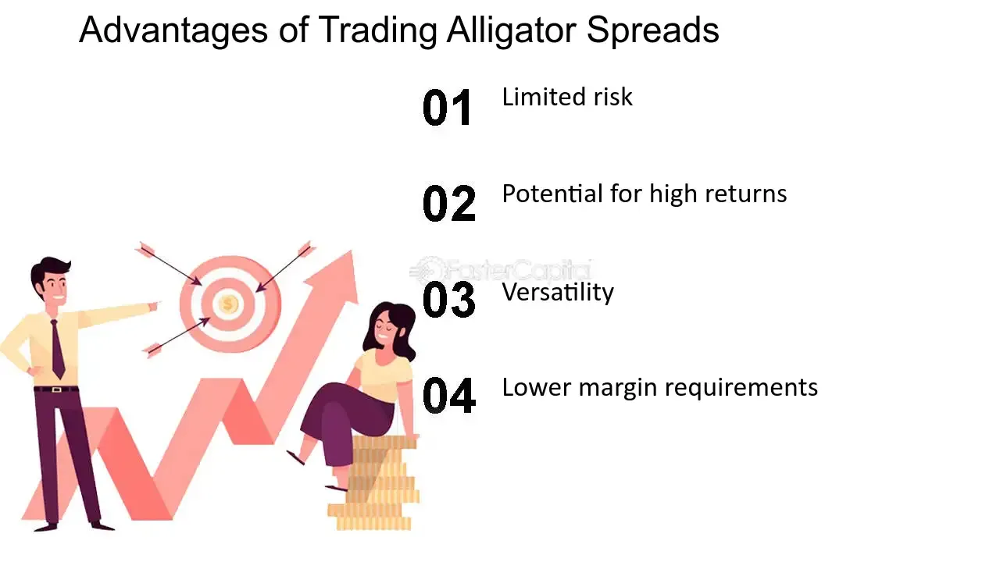

## Table of Contents

## What is an alligator spread in trading?

An alligator spread is a type of options trading strategy that involves buying and selling options with different expiration dates. The goal is to make a profit from the difference in the prices of these options. It is called an alligator spread because it can be risky, like an alligator, and might "bite" the trader if the market moves in the wrong direction.

Traders use this strategy when they think the price of the underlying asset, like a stock, will stay the same or move just a little. They buy options that are cheaper and sell options that are more expensive. If the price stays steady, they can make money from the difference in the option prices. But if the price moves a lot, the trader could lose money, so it's important to be careful with this strategy.

## How does an alligator spread differ from other types of options spreads?

An alligator spread is different from other options spreads because it uses options with different expiration dates. Most other spreads, like vertical spreads or calendar spreads, use options with the same expiration date or the same strike price. With an alligator spread, a trader buys a longer-term option and sells a shorter-term option. This makes it unique because it tries to take advantage of the time difference between the options.

Another way an alligator spread differs is that it can be riskier. Other spreads might be safer because they are more predictable. For example, a bull call spread is used when someone thinks the price will go up, and it has a clear way to make money if that happens. But an alligator spread can be tricky because it depends on the price staying the same or moving just a little. If the price moves a lot, the trader could lose money, which is why it's called an alligator spread - it can "bite" you if you're not careful.

## What are the key components of an alligator spread?

The key parts of an alligator spread are the long-term option and the short-term option. A trader buys a long-term option, which means it will expire later. This option is usually cheaper because it gives the trader more time for the price to move in their favor. At the same time, the trader sells a short-term option, which will expire sooner. This option is usually more expensive because it has less time for the price to move, so the seller gets a higher premium.

The difference in the expiration dates is what makes an alligator spread work. The trader hopes that the price of the underlying asset, like a stock, will stay the same or move just a little bit until the short-term option expires. If this happens, the trader keeps the money from selling the short-term option and still has the long-term option, which could be worth something later. But if the price moves a lot, the trader could lose money because the short-term option might end up costing more than the long-term option is worth.

## What is the purpose of using an alligator spread in trading?

The main reason traders use an alligator spread is to make money from the difference in the prices of options that expire at different times. When a trader thinks the price of a stock or other asset won't change much, they can use this strategy. They buy a long-term option, which is cheaper, and sell a short-term option, which is more expensive. If the price stays steady until the short-term option expires, the trader keeps the money from selling that option and still has the long-term option, which might be worth something later.

However, using an alligator spread can be risky. It's called an alligator spread because, like an alligator, it can be dangerous if it doesn't go the way the trader planned. If the price of the stock moves a lot before the short-term option expires, the trader could lose money. The short-term option might end up costing more than the long-term option is worth, which means the trader could lose more than they gained. So, it's important for traders to be careful and understand the risks when using this strategy.

## How do you set up an alligator spread?

To set up an alligator spread, you need to choose two options on the same stock or asset, but with different expiration dates. First, you buy a long-term option. This is the option that will expire later, and it's usually cheaper because you have more time for the stock price to move in your favor. Then, you sell a short-term option. This option will expire sooner and is usually more expensive because there's less time for the stock price to move, so the person selling it gets a higher premium.

Once you have chosen your options, you place the trades at the same time. You pay for the long-term option and receive money from selling the short-term option. The goal is for the stock price to stay the same or move just a little bit until the short-term option expires. If this happens, you keep the money from selling the short-term option and still have the long-term option, which could be worth something later. But if the stock price moves a lot, you could lose money because the short-term option might end up costing more than the long-term option is worth.

## What are the risks associated with an alligator spread?

An alligator spread can be risky because it depends on the stock price not moving too much. If the price stays the same or moves just a little until the short-term option expires, you can make money. But if the price moves a lot, you could lose money. The short-term option might end up costing more than the long-term option is worth, which means you could lose more than you gained from selling the short-term option.

Another risk is that the alligator spread uses options with different expiration dates. This makes it harder to predict how things will go compared to other options strategies. If the stock price moves a lot before the short-term option expires, you might have to buy back that option at a higher price, which could be expensive. So, it's important to understand these risks and be careful when using an alligator spread.

## Can you explain the profit and loss potential of an alligator spread?

The profit potential of an alligator spread comes from the difference in the prices of the long-term and short-term options. When you set up an alligator spread, you buy a long-term option, which is cheaper, and sell a short-term option, which is more expensive. If the stock price stays the same or moves just a little bit until the short-term option expires, you keep the money from selling that option. This money is your profit, and you still have the long-term option, which might be worth something later.

The loss potential of an alligator spread is higher if the stock price moves a lot. If the price goes up or down a lot before the short-term option expires, you might have to buy back that option at a higher price. This could cost more than the money you got from selling it, and more than the long-term option is worth. So, you could lose money if the stock price moves too much. That's why an alligator spread can be risky, like an alligator that might bite you if you're not careful.

## What market conditions are ideal for implementing an alligator spread?

The best time to use an alligator spread is when you think the stock price will stay the same or move just a little bit. If you believe the stock won't change much until the short-term option expires, this strategy can work well. You buy a long-term option, which is cheaper, and sell a short-term option, which is more expensive. If the stock price stays steady, you keep the money from selling the short-term option, and that's your profit. You also still have the long-term option, which might be worth something later.

But if the stock price moves a lot, an alligator spread can be risky. If the price goes up or down a lot before the short-term option expires, you might have to buy back that option at a higher price. This could cost more than the money you got from selling it, and more than the long-term option is worth. So, you could lose money if the stock price moves too much. That's why it's important to use an alligator spread when you think the market will be calm, and not when you expect big changes.

## How does the expiration date affect an alligator spread?

The expiration date is really important for an alligator spread because it uses two options with different times they will end. One option, the long-term one, will expire later. This one is usually cheaper because you have more time for the stock price to move in your favor. The other option, the short-term one, will expire sooner. This one is usually more expensive because there's less time for the stock price to move, so the person selling it gets a higher price. The difference in these expiration dates is what makes an alligator spread work.

If the stock price stays the same or moves just a little bit until the short-term option expires, you keep the money from selling that option. That's your profit, and you still have the long-term option, which might be worth something later. But if the stock price moves a lot before the short-term option expires, you might have to buy back that option at a higher price. This could cost more than the money you got from selling it, and more than the long-term option is worth. So, the expiration dates can make an alligator spread risky if the stock price doesn't stay calm.

## What are some common mistakes traders make when using an alligator spread?

One common mistake traders make when using an alligator spread is not understanding how the stock price might move. They might think the price will stay the same, but if it moves a lot, they could lose money. The short-term option might become more expensive than the long-term option is worth, and they might have to buy it back at a higher price. This can lead to losses, so it's important to think about how the stock might move before setting up an alligator spread.

Another mistake is not paying attention to the expiration dates. The alligator spread uses options that expire at different times, and if traders forget about this, they might miss out on the best time to make a profit. If the short-term option expires and the stock price moved a lot, they could lose money. Traders need to keep track of when each option will expire and be ready to act if the stock price doesn't stay calm.

## How can an alligator spread be adjusted if the market moves against the position?

If the market starts moving a lot and goes against your alligator spread, you might need to make some changes to your trade. One way to adjust is by buying back the short-term option you sold. If the stock price has moved a lot, this option might be more expensive now, but it can stop you from losing more money. Another way to adjust is by selling the long-term option you bought. If the stock price has moved too much, the long-term option might not be worth as much, but selling it can help you cut your losses.

It's important to keep an eye on the market and be ready to act if things don't go as planned. If you see the stock price moving a lot, you might want to close your alligator spread early to avoid bigger losses. Remember, an alligator spread can be risky, so being ready to adjust your trade can help you manage that risk better.

## What advanced strategies can be combined with an alligator spread to enhance returns?

One way to boost returns with an alligator spread is by using a strategy called a delta hedge. A delta hedge means you buy or sell shares of the stock to balance out the changes in the price of your options. If the stock price starts moving a lot, you can buy or sell the stock to make your alligator spread less risky. This can help you keep more of your profits if the stock price stays calm, and it can also stop you from losing too much if the stock price moves a lot.

Another strategy you can use is called a calendar spread. A calendar spread is when you buy and sell options with different expiration dates, just like an alligator spread. But with a calendar spread, you use options with the same strike price. By combining an alligator spread with a calendar spread, you can make money from the difference in the prices of the options and from the time difference between them. This can help you make more money if the stock price stays the same or moves just a little bit.

## What is an Example of Alligator Spread Trading Strategy?

Executing an alligator spread involves a meticulous crafting of options positions to navigate potential market moves while being mindful of the accompanying costs that might diminish anticipated profits. To illustrate this strategy, let's examine a hypothetical scenario featuring Company ABC's stock, which currently trades at $100. 

The goal of the alligator spread is to leverage significant price movements, yet be wary of how trading costs can erode profitability. Consider the following strategic setup:

1. **Buying Call Options**: Purchase two call options with a strike price of $105, expiring in one month, with a premium of $3 per contract.

2. **Selling Call Options**: Simultaneously, sell two call options with a higher strike price of $110, expiring on the same date, with a premium of $1.50 per contract.

3. **Buying Put Options**: Purchase two put options with a strike price of $95, expiring in one month, at a premium of $4 per contract.

4. **Selling Put Options**: Sell two put options with a lower strike price of $90, expiring concurrently, with a premium of $2 per contract.

### Profit and Loss Scenarios

By structuring this alligator spread, the total cost involved in setting up this position is calculated as follows:

- **Total Premium Paid**: 
$$
  (2 \times 3) + (2 \times 4) = \$14

$$

- **Total Premium Received**: 
$$
  (2 \times 1.5) + (2 \times 2) = \$7

$$

- **Net Cost of the Spread**: 
$$
  \$14 - \$7 = \$7

$$

In this scenario, the trader incurs a net cost of $7 or $700 in real terms, as each option contract typically represents 100 shares.

Let's consider two situations based on ABC's stock price at expiration:

- **Scenario 1: Stock Price at $115 (High Movement)**
  1. **Call Options at $105**: Worth $10 each, leading to a profit of $2 \times (10 - 3) = \$14$.
  2. **Call Options at $110**: Worthless for the buyer, resulting in a gain of $2 \times 1.5 = \$3$ for the trader.
  3. **Put Options at $95 and $90**: Both expire worthless, offering no additional cost gain or loss.

  Total profit = $14 + $3 = $17

  Net profit after covering the spread cost = $17 - $7 = $10, or $1,000 for two contracts.

- **Scenario 2: Stock Price at $100 (Minimal Movement)**
  1. All options expire worthless, leading to a net loss equivalent to the initial cost of the spread.

### Visualization and Analysis

This strategy's success hinges on adequately forecasting significant price swings and accounting for transaction fees. When incorrectly executed in real market settings, the option premiums meant to hedge against losses might instead result in the alligator scenario, where profits are consumed by the costs of the position.

Using [algorithmic trading](/wiki/algorithmic-trading) systems to execute such complex strategies can aid in optimizing entry and [exit](/wiki/exit-strategy) points, as machines can swiftly react to market changes, further mitigating the risks associated with manual oversights or miscalculations.

In summary, the alligator spread, when applied with precision and supplemented by technology, can be a powerful instrument in a trader's toolkit, capable of capitalizing on stock [volatility](/wiki/volatility-trading-strategies) while remaining vigilant about its inherent cost implications.

## References & Further Reading

[1]: Bergstra, J., Bardenet, R., Bengio, Y., & Kégl, B. (2011). ["Algorithms for Hyper-Parameter Optimization."](https://proceedings.neurips.cc/paper/2011/file/86e8f7ab32cfd12577bc2619bc635690-Paper.pdf) Advances in Neural Information Processing Systems 24.

[2]: ["Advances in Financial Machine Learning"](https://www.amazon.com/Advances-Financial-Machine-Learning-Marcos/dp/1119482089) by Marcos Lopez de Prado

[3]: ["Evidence-Based Technical Analysis: Applying the Scientific Method and Statistical Inference to Trading Signals"](https://www.amazon.com/Evidence-Based-Technical-Analysis-Scientific-Statistical/dp/0470008741) by David Aronson

[4]: ["Machine Learning for Algorithmic Trading"](https://github.com/PacktPublishing/Machine-Learning-for-Algorithmic-Trading-Second-Edition) by Stefan Jansen

[5]: ["Quantitative Trading: How to Build Your Own Algorithmic Trading Business"](https://books.google.com/books/about/Quantitative_Trading.html?id=j70yEAAAQBAJ) by Ernest P. Chan