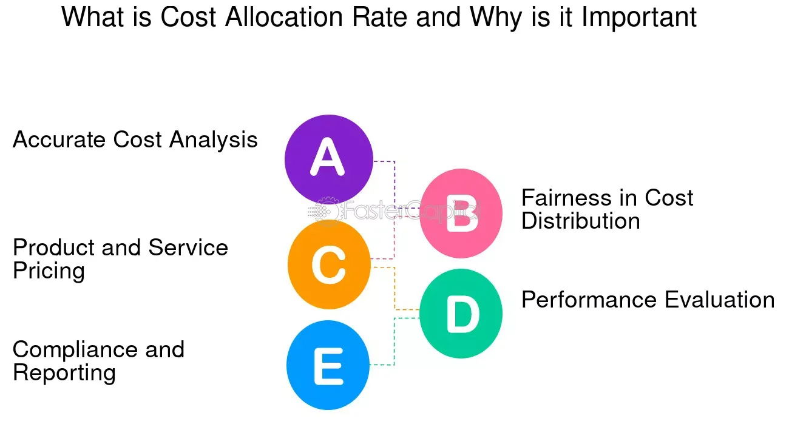

## Table of Contents

## What is an allocation rate in the context of investment?

An allocation rate in the context of investment refers to the percentage of money that is put into different types of investments. Imagine you have a pie, and you need to decide how big a slice goes to stocks, how big a slice goes to bonds, and how big a slice goes to other things like real estate or cash. The allocation rate helps you decide the size of each slice, based on your goals, how much risk you're willing to take, and how long you plan to invest.

For example, if you are young and can handle more risk, you might decide to have a higher allocation rate to stocks, say 70%, and a lower rate to bonds, maybe 30%. This means 70% of your money goes into stocks and 30% into bonds. As you get older and closer to needing your money, you might change your allocation rate to have more in safer investments like bonds to protect your savings. This way, the allocation rate helps you balance risk and reward over time.

## How does an allocation rate affect portfolio performance?

The allocation rate you choose can really change how your portfolio does over time. If you put a lot of your money into stocks, which can go up and down a lot, your portfolio might grow faster but it could also lose value quickly. On the other hand, if you put more money into bonds, which are usually safer but don't grow as fast, your portfolio might not grow as much but it will be more stable. So, the allocation rate helps decide how much risk you're taking and how much growth you might see.

Over the long run, getting the allocation rate right can make a big difference. If you start with a lot in stocks when you're young, you might see bigger gains over many years. But as you get older, moving more money into bonds can protect what you've earned. This balance between stocks and bonds, or other investments, can help you reach your goals, whether it's saving for retirement or buying a house. So, thinking about your allocation rate and changing it as your life changes is key to making your portfolio work well for you.

## What are the common methods used to determine allocation rates?

One common method to determine allocation rates is the age-based approach. This method suggests that you should subtract your age from 100 to find out how much of your money should go into stocks. For example, if you're 30 years old, you would put 70% of your money in stocks and the rest in safer investments like bonds. This method is simple and helps you reduce risk as you get older by slowly moving money from stocks to bonds.

Another method is the risk tolerance approach. This looks at how comfortable you are with the ups and downs of the market. If you don't mind the risk and want higher potential returns, you might choose a higher allocation to stocks. If you prefer stability and are more worried about losing money, you might choose more bonds. This method helps tailor your investments to your personal comfort level with risk.

A third method is the goal-based approach. This focuses on what you're saving for and when you'll need the money. If you're saving for a goal far in the future, like retirement in 30 years, you might put more money into stocks to grow your savings over time. But if your goal is closer, like buying a house in 5 years, you might choose safer investments to protect your money. This method helps align your investments with your specific financial goals.

## Can you explain the difference between strategic and tactical allocation rates?

Strategic allocation rates are like a long-term plan for your investments. Imagine you're setting up a garden and you decide where to plant each type of flower or vegetable based on what you want your garden to look like in the future. With strategic allocation, you decide how much money to put into stocks, bonds, and other investments based on your big goals, like saving for retirement or buying a house. You pick these percentages and stick with them for a long time, maybe only making small changes now and then. This way, your investments grow slowly and steadily over many years.

Tactical allocation rates are more like quick moves to take advantage of what's happening right now in the market. It's like seeing that it's going to rain soon, so you quickly move some of your plants to a sheltered spot. With tactical allocation, you might change how much money you have in stocks or bonds based on what you think will happen in the short term. If you believe stocks are going to do well soon, you might put more money into them for a while. But this approach can be riskier because it's hard to predict the market, and you might end up making the wrong moves.

## How do automated systems analyze and adjust allocation rates?

Automated systems use special computer programs to keep an eye on your investments all the time. These programs look at lots of information, like how the stock market is doing, what's happening in the economy, and even how you feel about risk. If the system sees that stocks are doing really well, it might decide to put more of your money into stocks. If it sees that the market might be getting risky, it might move some money into safer investments like bonds. This way, the system tries to make sure your money is working hard for you without taking too much risk.

These systems can also check your investments often and make small changes to keep them balanced. For example, if stocks have gone up a lot and now make up a bigger part of your portfolio than you wanted, the system might sell some stocks and buy more bonds to get back to your original plan. This is called rebalancing, and it helps keep your investments in line with your goals. By doing this work automatically, these systems can help you make the most of your money without you having to watch the market every day.

## What role does risk assessment play in setting allocation rates?

Risk assessment is really important when you're deciding how to split up your money in investments. It's all about figuring out how much risk you're okay with. Some people are fine with their money going up and down a lot because they want to make more money over time. These folks might put a lot of their money into stocks, which can be risky but can also grow a lot. Other people don't like the idea of losing money, even if it means they might not make as much. They might choose to put more money into safer things like bonds, which don't change as much but also don't grow as fast.

When you do a risk assessment, you think about things like how old you are, when you'll need the money, and what you're saving for. If you're young and saving for something far away, like retirement, you might be okay with more risk because you have time to wait for your investments to grow. But if you're older or need the money soon, you might want to be safer so you don't lose what you've saved. By understanding your risk, you can pick an allocation rate that feels right for you and helps you reach your goals without keeping you up at night worrying about your money.

## How can historical data be used to optimize allocation rates in automated systems?

Historical data is like a big book of what happened before in the world of money. Automated systems can look at this book to see how different investments like stocks and bonds have done over time. By studying this information, the systems can find patterns and learn what works best. For example, they might see that stocks usually do better than bonds over many years, but they can also see that stocks can go down a lot sometimes. This helps the systems decide how much money to put into stocks and how much into safer things like bonds, based on what has worked in the past.

Using historical data, automated systems can also figure out the best times to change your investments. They can see when the market has gone up or down in the past and use that to guess what might happen next. If the data shows that the market usually goes up after a certain event, the system might put more money into stocks right before that event. This way, the system can try to make the most of your money by using what it has learned from history to make smart choices about your allocation rates.

## What are the potential pitfalls of relying solely on automated allocation rate adjustments?

Relying only on automated systems to change your allocation rates can be risky because these systems use math and past data to make choices, but they can't predict the future perfectly. Sometimes, the market does things that nobody expects, and the system might not react fast enough or in the right way. If the system makes a big move based on what it thinks will happen, but the market does something different, you could lose money or miss out on gains.

Also, automated systems don't know you personally. They can't take into account your feelings, your life changes, or special goals that might not show up in their data. If you get a new job, have a baby, or need to buy a house sooner than planned, the system won't know to adjust your investments to fit these new situations. It's important to check in with your investments and make sure they still match what you want and need, even if you're using an automated system to help manage them.

## How do machine learning algorithms enhance the precision of allocation rate calculations?

Machine learning algorithms can make allocation rate calculations more precise by learning from lots of past data. They look at how different investments like stocks and bonds have done over time and find patterns that might be hard for people to see. By understanding these patterns, the algorithms can guess better how investments might do in the future. This helps them decide how much money to put into each type of investment to get the best results for you. They can also keep learning and getting better over time, so their guesses become more accurate as they see more data.

But [machine learning](/wiki/machine-learning) isn't perfect. It can still make mistakes because the future is hard to predict. Sometimes, the market does unexpected things, and the algorithms might not react the right way. Also, these algorithms don't know about your personal life changes or feelings, so they can't adjust your investments based on things like a new job or a big life event. That's why it's good to check in on your investments and make sure they still fit your goals, even if you're using machine learning to help manage them.

## What advanced metrics should be monitored when evaluating the effectiveness of an allocation rate strategy?

When you're trying to figure out if your allocation rate strategy is working well, you should keep an eye on a few important numbers. One is the Sharpe Ratio, which tells you how much extra return you're getting for the risk you're taking. A higher Sharpe Ratio means your investments are doing a good job of balancing risk and reward. Another number to watch is the Sortino Ratio, which is similar but focuses only on the bad kind of risk, the kind that makes your investments lose value. This can be helpful because it shows how well your strategy protects you from big losses.

You should also look at the Alpha and Beta of your portfolio. Alpha measures how much better or worse your investments are doing compared to a big group of similar investments, like a stock market index. A positive Alpha means your strategy is beating the market. Beta tells you how much your investments move with the market. A Beta higher than 1 means your investments go up and down more than the market, which can be riskier. By keeping track of these numbers, you can see if your allocation rate strategy is helping you reach your goals and manage risk well.

## How do regulatory requirements impact the implementation of allocation rates in automated investment systems?

Regulatory requirements are rules that investment companies have to follow. These rules can affect how automated systems change your allocation rates. For example, some rules might say that your money has to be spread out in certain ways to make sure it's safe. Automated systems have to follow these rules, so they might not be able to put as much money into risky investments like stocks as they want to. This can change how well your investments do because the system has to balance what's best for you with what the rules say.

Also, these rules can change over time, and the automated system has to keep up with them. If a new rule comes out, the system might need to change how it works to follow it. This can mean the system has to move your money around in ways it wouldn't have otherwise. Keeping up with these rules can be hard, but it's important because it helps make sure your investments are safe and fair. So, even though automated systems can help manage your money, they still have to work within the rules set by regulators.

## What are the latest trends in allocation rate methodologies within automated investment analysis?

One of the latest trends in allocation rate methodologies within automated investment analysis is the use of [artificial intelligence](/wiki/ai-artificial-intelligence) and machine learning. These technologies help systems learn from past data and make smarter decisions about where to put your money. They can look at lots of information very quickly and find patterns that might be hard for people to see. This means they can adjust your allocation rates to try to get the best results for you, based on what has worked well before. But remember, even with these smart tools, the future is still hard to predict, so there's always some risk involved.

Another trend is the focus on personalized investing. Automated systems are getting better at understanding what each person wants and needs. They can take into account things like how much risk you're okay with, when you'll need your money, and what you're saving for. This helps them create an allocation rate that fits you perfectly. It's like having a custom plan just for you, which can help you reach your goals more effectively. But even with this personal touch, it's still important to check in on your investments and make sure they're doing what you want them to do.

## What are Allocation Rates and How Can We Understand Them?

An allocation rate is a critical concept in investment management, signifying the percentage of an investment sum that is actually allocated to investment products after deducting any associated fees. It directly impacts the cost-effectiveness of investments as it helps determine the net amount being invested towards generating returns.

To better understand this, consider an investment of $10,000 into a financial product with an associated fee of $500. The allocation rate for this investment would be calculated as follows:

$$

Allocation \ Rate = \left( \frac{Investment \ Sum - Fees}{Investment \ Sum} \right) \times 100 = \left( \frac{10,000 - 500}{10,000} \right) \times 100 = 95\%
$$

This indicates that 95% of the initial investment is being put to work after accounting for fees, thus reflecting the cost-effectiveness of the investment strategy.

Investors often encounter allocation rates when using automated tools like robo-advisors. These tools utilize algorithms to allocate funds across different asset classes based on the investor's risk tolerance and financial goals. Understanding allocation rates in this context is essential, as they allow investors to assess how much of their capital is effectively working in the market compared to how much is eroded by fees.

For example, if an investor chooses a conservative risk profile, a robo-advisor might allocate a larger portion of the portfolio to bonds rather than stocks, which could have different fee structures, thereby affecting the overall allocation rate.

Having a clear understanding of allocation rates is crucial for effective investment management and planning. It aids investors in identifying cost-efficient investment strategies and ensuring that a significant portion of their investment generates returns. Essentially, allocation rates serve as a gauge of how efficiently capital is being utilized, allowing investors to optimize their portfolios for better performance.

## References & Further Reading

[1]: Krollner, B., Vanstone, B., & Finnie, G. (2010). "Financial time series forecasting with machine learning techniques: A survey." European Symposium on Artificial Neural Networks. [Link](https://pure.bond.edu.au/ws/files/27498056/Financial_time_series_forecasting_with_machine_learning_techniques.pdf)

[2]: Lopez de Prado, M. (2018). ["Advances in Financial Machine Learning."](https://www.amazon.com/Advances-Financial-Machine-Learning-Marcos/dp/1119482089) Wiley.

[3]: Aronson, D. R. (2006). ["Evidence-Based Technical Analysis: Applying the Scientific Method and Statistical Inference to Trading Signals."](https://www.amazon.com/Evidence-Based-Technical-Analysis-Scientific-Statistical/dp/0470008741) Wiley.

[4]: Jansen, S. (2020). ["Machine Learning for Algorithmic Trading."](https://github.com/stefan-jansen/machine-learning-for-trading) Packt Publishing.

[5]: Chan, E. P. (2009). ["Quantitative Trading: How to Build Your Own Algorithmic Trading Business."](https://github.com/ftvision/quant_trading_echan_book) Wiley.

[6]: Allen, F., & Karjalainen, R. (1999). "Using genetic algorithms to find technical trading rules." Journal of Financial Economics, 51(2), 245-271. [Link](https://www.sciencedirect.com/science/article/pii/S0304405X9800052X)00058-0)

[7]: Focardi, S. M., & Fabozzi, F. J. (2004). ["The Mathematics of Financial Modeling and Investment Management."](https://archive.org/details/mathematicsoffin0000foca) Wiley.