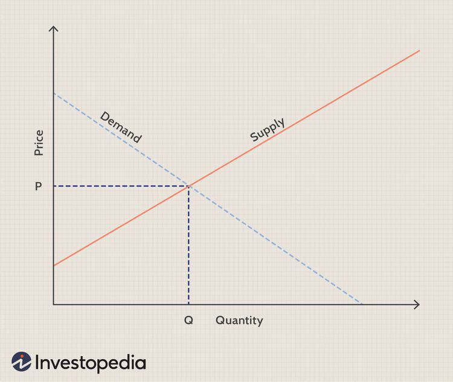

## Table of Contents

## What is allocational efficiency?

Allocational efficiency is a concept in economics that means resources are being used in the best way possible to meet people's needs and wants. It happens when goods and services are produced and distributed so that no one can be made better off without making someone else worse off. Think of it like sharing a pizza among friends. If you can't give someone a bigger slice without taking away from someone else's slice, then you've reached allocational efficiency.

In a market, allocational efficiency is achieved when the price of a good reflects its value to society and the cost of producing it. This means that the resources used to make the good are not wasted and are put to their most valuable use. For example, if farmers grow crops that people really want to eat and can sell at a good price, that's allocational efficiency. It's all about making sure that what we produce is what people need and want, without wasting resources.

## Why is allocational efficiency important in economics?

Allocational efficiency is important in economics because it helps make sure that resources are used in the best way possible. When resources are used efficiently, it means that we are producing things that people really want and need. This makes people happier and can help the economy grow. If resources are not used efficiently, we might end up making things that nobody wants, which is a waste and can slow down the economy.

Another reason allocational efficiency is important is that it helps to make sure that everyone gets a fair share of what is produced. When goods and services are distributed efficiently, it means that no one can be made better off without making someone else worse off. This is important for fairness and can help reduce inequality. In the end, allocational efficiency is about using what we have in the smartest way to make life better for everyone.

## How does allocational efficiency differ from other types of efficiency?

Allocational efficiency is different from other types of efficiency because it focuses on making sure that resources are used to produce the things that people want the most. It's about matching what is produced with what people need and want, so that no one can be made better off without making someone else worse off. For example, if a factory makes more of a popular toy instead of an unpopular one, that's allocational efficiency.

Other types of efficiency include productive efficiency and technical efficiency. Productive efficiency is about making things at the lowest possible cost. It means using the least amount of resources to produce a good or service. For example, if a company can make the same number of cars using less steel, that's productive efficiency. Technical efficiency, on the other hand, is about using the best technology and methods to produce goods and services. It's about doing things the best way possible with the technology you have. For example, if a farmer uses a new machine that helps plant seeds faster and better, that's technical efficiency.

## What are the basic requirements for achieving allocational efficiency?

To achieve allocational efficiency, the first thing that needs to happen is that the price of goods and services should reflect their true value to society. This means that if something is really important or useful to people, its price should show that. When prices are right, people will buy things that are worth the cost, and producers will make more of what people want. This helps make sure that resources are used to make things that people really need and want.

Another important requirement is that markets need to work well. This means that there should be lots of buyers and sellers, and everyone should have good information about what they are buying and selling. If markets are working well, then prices will be fair and resources will be used in the best way. Without good markets, it's hard to know what people really want, and it's easy to waste resources on things that aren't needed.

## Can you explain the role of perfect competition in allocational efficiency?

Perfect competition plays a big role in helping to achieve allocational efficiency. In a perfect competition market, there are lots of buyers and sellers, and everyone knows everything about what they are buying and selling. Because there are so many people involved, no one can control the price of things. This means that prices will be fair and will show the true value of goods and services to society. When prices are right, producers will make more of what people really want, and less of what people don't want. This helps make sure that resources are used to make things that are most needed and wanted.

In a perfect competition market, companies also try to be as efficient as possible because they want to make more money. If they can make things at a lower cost, they can sell them for less and still make a profit. This pushes them to use their resources in the best way possible. When all companies are doing this, it helps the whole market to be allocatively efficient. So, perfect competition helps make sure that resources are used well and that what is produced matches what people need and want.

## How do market failures affect allocational efficiency?

Market failures can mess up allocational efficiency because they stop resources from being used in the best way possible. When markets fail, they don't do a good job of matching what people want with what gets made. This can happen for different reasons, like when companies have too much power and can set prices too high, or when people don't know enough about what they are buying. These problems mean that prices don't show the true value of things, so resources might get wasted on stuff that's not really needed.

For example, if a big company can charge too much for something because it has no competition, people might not buy it even if they really need it. This means the company might make less of that thing than people want, and resources get used to make other things instead. Another problem is when things like pollution are not included in the price of goods. If a factory pollutes the air but doesn't have to pay for it, the price of what it makes will be too low, and too much of that thing might get made. This messes up allocational efficiency because resources are not being used to make what people really need and want.

## What tools do economists use to measure allocational efficiency?

Economists use something called a production possibility frontier (PPF) to measure allocational efficiency. A PPF is a graph that shows all the different ways a society can use its resources to make things. If a point on the graph is on the curve of the PPF, it means that the society is using its resources in the best way possible to make things that people want. If a point is inside the curve, it means that resources are not being used efficiently, and more could be made with what they have.

Another tool economists use is called Pareto efficiency. This is a way to check if resources are being used in a way that no one can be made better off without making someone else worse off. If a situation is Pareto efficient, it means it's allocatively efficient because you can't make things better for some people without making it worse for others. Economists look at how resources are shared and used to see if they meet this standard.

## How can government policies influence allocational efficiency?

Government policies can help or hurt allocational efficiency. When the government makes rules or gives money to certain industries, it can change how resources are used. For example, if the government gives money to farmers to grow more corn, farmers might grow more corn even if people don't need that much. This can make resources go to the wrong place and hurt allocational efficiency. On the other hand, if the government makes rules to stop pollution, it can make prices show the real cost of things. This can help make sure resources are used to make things that people really need and want, which is good for allocational efficiency.

Taxes and subsidies are other ways the government can affect allocational efficiency. If the government taxes things that cause harm, like cigarettes, it can make people use fewer resources on those things. This can help make sure more resources go to things that are good for society. Subsidies can also help by making it cheaper to do things that are good for everyone, like using renewable energy. When the government uses these tools well, it can help make sure that resources are used in the best way to meet people's needs and wants, leading to better allocational efficiency.

## What are the challenges in achieving allocational efficiency in real-world markets?

Achieving allocational efficiency in real-world markets is tough because there are a lot of things that can get in the way. One big problem is that markets are not always perfect. Sometimes, a few big companies can control the market and set prices too high, which messes up what people buy and what gets made. Also, people don't always have all the information they need to make good choices. If someone doesn't know that a product is bad for the environment, they might buy it anyway, which means resources get used in the wrong way.

Another challenge is that some things, like clean air and water, are hard to put a price on. When companies pollute and don't have to pay for it, the price of their products is too low, and too much of those products get made. This makes it hard to use resources efficiently because the prices don't show the real cost to society. Governments try to help by making rules and giving money to certain industries, but it's tricky to get it right. If they give too much money to the wrong places, they can make things worse instead of better.

## How does allocational efficiency relate to consumer and producer surplus?

Allocational efficiency is closely tied to both consumer and producer surplus. Consumer surplus is the difference between what people are willing to pay for something and what they actually pay. Producer surplus is the difference between what producers are willing to sell something for and what they actually get. When a market is allocatively efficient, it means that the price of a good or service is just right so that the total of consumer and producer surplus is as big as it can be. This happens because the resources are used to make the things that people want the most, and the price matches the value that people see in those things.

In a perfectly efficient market, the price of a good will be where the amount people want to buy equals the amount producers want to sell. At this point, the consumer surplus and producer surplus together are maximized, meaning that no one can be made better off without making someone else worse off. If the market is not efficient, like if there's too much of something people don't want or not enough of something they do want, then the total surplus will be smaller. So, allocational efficiency is important because it helps make sure that both consumers and producers get the most benefit from the market.

## What are some advanced models or theories used to analyze allocational efficiency?

One advanced model used to analyze allocational efficiency is called general equilibrium theory. This theory looks at how all parts of an economy work together. It tries to find out if all markets can be in balance at the same time, so that no one can be made better off without making someone else worse off. Imagine it like a big puzzle where every piece has to fit perfectly. If all the pieces fit, then the economy is allocatively efficient. Economists use math to study these models and see if they can make the puzzle work better.

Another theory is called the theory of second best. This theory says that if one part of the economy is not working right, trying to fix just that part might not make things better. Instead, you might need to make changes in other parts of the economy too. For example, if there's a tax on one thing, adding another tax somewhere else might help make the whole economy more efficient. It's like trying to fix a broken machine; sometimes, you need to adjust more than one part to make it work right. Both of these theories help economists understand how to make the economy more efficient and fair.

## How can allocational efficiency be improved in sectors like healthcare and education?

Improving allocational efficiency in healthcare means making sure that the money and resources used in healthcare go to the places where they can help people the most. One way to do this is by using data to see which treatments work best for different people. If doctors know what works, they can use resources to give those treatments instead of ones that don't help as much. Another way is by making sure that everyone can get the healthcare they need, not just the people who can pay a lot. If more people can get healthcare, then resources are used to help more people, which is good for efficiency. Governments can help by making rules that make healthcare more fair and by giving money to places that need it the most.

In education, improving allocational efficiency means using resources to give students the best education possible. One way to do this is by making sure that schools have enough teachers and good materials for all students, not just the ones in rich areas. If every student gets a good education, then resources are used in a way that helps everyone. Another way is by using data to see which teaching methods work best. If schools know what works, they can use their resources to teach in those ways instead of ones that don't help as much. Governments can help by making sure that money goes to schools that need it the most and by making rules that make education more fair for everyone.

## What is the role of resource allocation in economics?

Resource allocation is a fundamental concept in economics, referring to the distribution of resources among various uses to maximize the output or benefits achieved from those resources. This distribution is crucial for ensuring that society's needs and wants are met most efficiently. Economics seeks to study how resources—land, labor, capital, and entrepreneurial capability—are allocated and utilized to produce goods and services that satisfy human demands.

Efficient resource allocation is pivotal for achieving optimal production and consumption within an economy. When resources are allocated efficiently, they are directed toward the production of goods and services that are most valued by society, thus maximizing total welfare. This efficiency is achieved by adhering to the principle of equating marginal cost to marginal benefit in the production and consumption processes. Mathematical models often represent this relationship through optimization problems where the goal is to maximize utility (U) or profit (π) such as:

$$
\max U = f(X_1, X_2, \ldots, X_n)
$$

subject to:

$$
\sum p_i X_i \leq I
$$

where $X_i$ represents quantities of goods, $p_i$ their prices, and $I$ the available income or resources.

Different allocation mechanisms record varied efficiencies and compliance with this optimal allocation principle. Primarily, there are three key mechanisms: market-based, command, and mixed economies.

1. **Market-Based Economies**: These are characterized by allocation decisions made through the price mechanism. Supply and demand dynamics play a central role, with prices serving as signals for resource allocation—directing resources toward sectors with higher demand. In such systems, competition fosters innovation and efficiency, but challenges can arise from externalities and market failures where the invisible hand of the market does not achieve optimal resource distribution.

2. **Command Economies**: In this mechanism, the government centrally plans and controls resources, determining what to produce, how to produce, and for whom to produce. While this can theoretically lead to equitable resource distribution and focus on societal needs, it often lacks the efficiency incentives found in competitive markets, leading to inefficiencies such as surpluses and shortages.

3. **Mixed Economies**: These incorporate elements from both market-based and command economies. The government intervenes to correct market failures through regulations and social welfare policies while allowing market forces to determine other aspects of resource allocation. This system aims to balance efficiency and equity but can encounter challenges in finding the optimal level of intervention.

The challenges of resource allocation differ across these systems. Market-based economies may struggle with equitable distribution and externalities, command economies may face inefficiencies and lack the adaptive dynamics of markets, while mixed economies continuously balance freedom and regulation. Moreover, global considerations, such as trade policies and international competition, further complicate resource allocation.

Resource allocation is closely linked to allocational efficiency, a state where resources are distributed in such a way that it is impossible to make any one individual better off without making someone else worse off—often referred to as achieving Pareto efficiency. Allocational efficiency requires that the marginal benefit of consuming a good equals its marginal cost of production across all goods and services. Efficient allocation leads to favorable economic outcomes, including increased total production, consumer satisfaction, and economic growth, ultimately enhancing society’s standard of living.

Understanding and improving resource allocation mechanisms is crucial for addressing persistent economic challenges and for fostering sustainable growth and development in various economic systems.

## References & Further Reading

[1]: Bergstra, J., Bardenet, R., Bengio, Y., & Kégl, B. (2011). ["Algorithms for Hyper-Parameter Optimization."](https://papers.nips.cc/paper/4443-algorithms-for-hyper-parameter-optimization) Advances in Neural Information Processing Systems 24.

[2]: ["Advances in Financial Machine Learning"](https://www.amazon.com/Advances-Financial-Machine-Learning-Marcos/dp/1119482089) by Marcos Lopez de Prado

[3]: ["Evidence-Based Technical Analysis: Applying the Scientific Method and Statistical Inference to Trading Signals"](https://www.amazon.com/Evidence-Based-Technical-Analysis-Scientific-Statistical/dp/0470008741) by David Aronson

[4]: ["Machine Learning for Algorithmic Trading"](https://github.com/stefan-jansen/machine-learning-for-trading) by Stefan Jansen

[5]: ["Quantitative Trading: How to Build Your Own Algorithmic Trading Business"](https://www.amazon.com/Quantitative-Trading-Build-Algorithmic-Business/dp/1119800064) by Ernest P. Chan