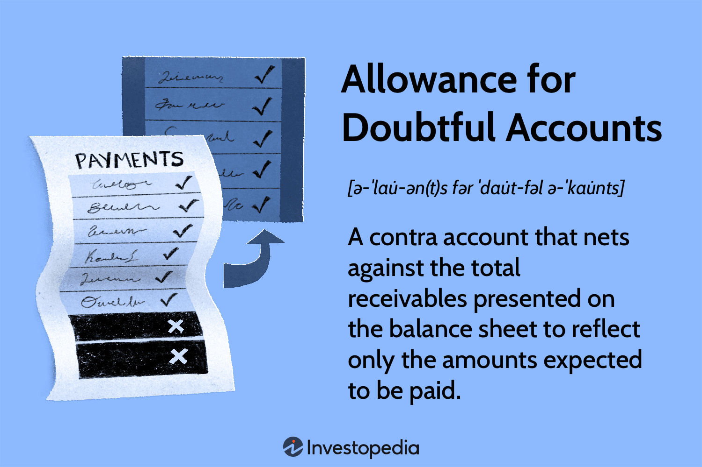

Understanding how to manage bad debt is essential in finance and accounting, as it directly affects an organization's financial health. This article will explore the accounting practices associated with the allowance for doubtful accounts—a mechanism used by companies to account for future bad debts. By accurately estimating potential losses from unpaid receivables, businesses can ensure their financial statements present a true and fair view of financial health.

The allowance for doubtful accounts is not just a standard accounting practice; it operates at the intersection of fundamental principles such as the matching principle and the conservatism principle. The matching principle requires that expenses be recorded in the same period as the related revenues to provide an accurate reflection of profitability. Meanwhile, the conservatism principle ensures that potential losses are recognized as soon as they become apparent, to avoid overstatement of financial positions.



In addition to traditional accounting methods, the field of technology, particularly algorithmic trading, is influencing how these practices evolve. Algorithmic trading, which utilizes complex algorithms to automate trading and estimate market trends, offers potential advantages for refining the estimation processes of doubtful accounts. Through advanced data analysis and predictive modeling, organizations can enhance accuracy and responsiveness to emerging financial risks.

The article will outline various estimation techniques for allowances, the impact of these estimates on financial statements, and the technological advancements aiding in their improvement. By effectively managing doubtful accounts, organizations can maintain robust financial health and make informed strategic decisions. As technology integrates further into finance, staying abreast of these developments is crucial for navigating the evolving financial landscape.

## Table of Contents

## Understanding Allowance for Doubtful Accounts

The allowance for doubtful accounts is an accounting tool employed to estimate the portion of a company's receivables that is expected to be uncollectible. This contra account is vital for ensuring that financial statements provide a realistic view of anticipated losses from credit sales. The method involves creating a buffer against bad debt, thereby presenting a more accurate picture of net realizable value, which represents the expected income from receivables.

The idea stems from vital accounting principles, namely the matching principle and the conservatism principle. The matching principle dictates that expenses should be recorded in the period in which they are incurred to generate revenues, aligning costs with corresponding earned income. By estimating bad debts and recording them in the financial period when the related sales occur, consistent with this principle, a business can better represent its financial performance over time.

In conjunction with the matching principle, the conservatism principle advises caution in financial reporting. It suggests that potential expenses and liabilities should be recognized promptly, while revenues and assets are only acknowledged when they are assured. This principle enhances the credibility of financial reports by not overstating revenue or assets, and not understating liabilities or expenses.

The allowance for doubtful accounts adjusts accounts receivable balances on the balance sheet, thereby reflecting a net figure that portrays what the firm realistically expects to collect. This accounting practice mitigates the risk of substantial variations in income statements due to the sudden realization of bad debts, which could significantly impact a company's profitability metrics if recognized only when specific receivables are deemed uncollectible.

Hence, businesses adopt a systematic approach in estimating these accounts, encompassing historical data, industry standards, and specific customer circumstances. By maintaining a regimented estimation of uncollectible accounts, firms not only uphold financial statement accuracy but also adhere to foundational accounting principles that ensure prudent financial management.

## Methods of Estimating Allowance for Doubtful Accounts

In accounting, estimating the allowance for doubtful accounts is a critical task to ensure the proper valuation of accounts receivable on financial statements. Various methods are employed to achieve this, each catering to different business contexts and data availability.

### Percentage of Sales Method
This method assigns a fixed percentage of sales revenue as bad debt expense. The percentage is derived from historical data, reflecting past trends in uncollectible accounts. This approach is straightforward and works well for companies with consistent sales patterns and bad debt ratios. The formula can be expressed as:

$$
\text{Bad Debt Expense} = \text{Percentage} \times \text{Total Credit Sales}
$$

### Accounts Receivable Aging Method
The aging method involves categorizing receivables by their age and applying different percentages of estimated uncollectibility to each category. Older accounts are typically more prone to default, hence, they are assigned higher percentages. This method provides a more nuanced estimate as it considers the time receivables have been outstanding.

For example, Python code to age accounts could look like this:

```python
def age_receivables(receivables):
    aged = {'Current': 0, '30-60 Days': 0, '60-90 Days': 0, 'Over 90 Days': 0}
    for invoice in receivables:
        days_outstanding = invoice['days_outstanding']
        if days_outstanding <= 30:
            aged['Current'] += invoice['amount']
        elif days_outstanding <= 60:
            aged['30-60 Days'] += invoice['amount']
        elif days_outstanding <= 90:
            aged['60-90 Days'] += invoice['amount']
        else:
            aged['Over 90 Days'] += invoice['amount']
    return aged
```

### Risk Classification Method
This method categorizes receivables based on customer risk profiles. Customers are classified into risk levels—low, medium, and high—and a corresponding bad debt percentage is allocated to each group. This tailored approach is suitable for businesses that deal with clients across diverse risk spectrums.

### Historical Percentage Method
The historical method uses past data to calculate the average percentage of receivables that turned into bad debts over previous accounting periods. It assumes that past trends will continue, making it ideal for stable business environments.

### Pareto Analysis
Pareto analysis, based on the Pareto principle, classifies receivables such that approximately 80% of bad debts result from 20% of the customers. By focusing on the significant few, companies can more effectively manage risk. This analysis is most effective for identifying critical customers whose non-payment has the most severe impact.

### Specific Identification Method
The specific identification method targets individual accounts that are suspected to be uncollectible. Companies identify specific customers who are likely to default and estimate bad debt precisely for these accounts. This method provides pinpoint accuracy but is labor-intensive and is generally used for high-value accounts rather than a broad portfolio.

These methods highlight the diversity of strategies available to businesses for estimating doubtful accounts, each with its own merit, optimal application scenarios, and potential limitations. The choice of method depends significantly on the company's data availability, industry practices, and the complexity of customer relationships.

## Accounting for Allowance: Techniques and Journal Entries

Accounting for allowances related to doubtful accounts involves a series of strategic accounting techniques aimed at aligning financial statements with anticipated credit losses. This practice is critical for ensuring that a company's financial documents accurately represent its fiscal health, adjusting for potential defaults in receivables. Key processes include the establishment, adjustment, and eventual write-off of bad debts, each of which requires precise journal entries.

### Establishing the Allowance for Doubtful Accounts

The first step in this accounting technique involves setting up an initial allowance for doubtful accounts. This is typically done at the end of an accounting period and is based on estimated uncollectible amounts. 

Here is the basic journal entry to establish the allowance:

```
Debit: Bad Debt Expense   $X
Credit: Allowance for Doubtful Accounts   $X
```

The debit entry records the bad debt expense on the income statement, thereby affecting the profit and loss figures. Simultaneously, the credit entry increases the allowance for doubtful accounts, which is a contra asset account that reduces the total accounts receivable on the balance sheet.

### Adjusting the Allowance for Doubtful Accounts

Over time, businesses may find it necessary to adjust their initial estimates of bad debts to better align with current business conditions. Adjustments to the allowance are usually made based on updated financial insights or revised risk assessments.

A common journal entry for adjusting the allowance might appear as follows if increasing the allowance:

```
Debit: Bad Debt Expense   $Y
Credit: Allowance for Doubtful Accounts   $Y
```

If decreasing the allowance, the entry would be reversed:

```
Debit: Allowance for Doubtful Accounts   $Z
Credit: Bad Debt Expense   $Z
```

These entries ensure that the allowance account accurately reflects new expectations and provides a fair view of potential losses.

### Writing Off Uncollectible Accounts

When specific accounts are identified as uncollectible, they are written off against the allowance for doubtful accounts. This process removes the uncollectible amount from the [books](/wiki/algo-trading-books), ensuring that receivables are not overstated.

The journal entry to write off a specific receivable is as follows:

```
Debit: Allowance for Doubtful Accounts   $A
Credit: Accounts Receivable   $A
```

This action reduces both the allowance for doubtful accounts and the accounts receivable ledger by the uncollectible amount without affecting the current period's expenses.

### Recovering Previously Written Off Debts

In instances where a previously written-off account is unexpectedly recovered, it must be reinstated before cash collection. This requires two separate journal entries:

1. **Reinstating the Account:**

```
Debit: Accounts Receivable   $B
Credit: Allowance for Doubtful Accounts   $B
```

2. **Recording the Cash Collection:**

```
Debit: Cash   $B
Credit: Accounts Receivable   $B
```

These entries ensure restoration of the account receivable and accurately reflect the cash inflow upon recovery of the debt. The reinstitution affects the allowance account without increasing that period's bad debt expense.

Overall, maintaining accurate estimates through regular account evaluations and adjustments is vital for effective financial management and planning. Employing these accounting processes and journal entries enables firms to mitigate risks of credit losses and reinforce financial statement integrity.

## Impact on Financial Ratios and Statements

The allowance for bad debt plays a crucial role in shaping financial statements, primarily by adjusting accounts receivables on the balance sheet. This adjustment serves to reflect more accurately the net realizable value of receivables, offering a clear picture of a company's [liquidity](/wiki/liquidity-risk-premium) status. In the balance sheet, the allowance for doubtful accounts is subtracted from the accounts receivable to determine the net accounts receivable. This calculation is essential for assessing a company's liquidity, as overly inflated receivables can mislead stakeholders about the cash that is genuinely available for operations.

On the income statement, bad debt is recorded as an expense, impacting overall profitability. This expense is reflected within the selling, general, and administrative expenses, or separately as a bad debt expense. The inclusion of bad debt expense reduces net income, subsequently affecting profitability ratios such as the net profit margin. The formula for net profit margin is:

$$
\text{Net Profit Margin} = \frac{\text{Net Income}}{\text{Revenue}}
$$

This ratio provides insights into how well a company converts revenue into actual profit, with a higher allowance for doubtful accounts potentially decreasing this margin.

Furthermore, the way bad debt is accounted for also influences several key financial metrics. The accounts receivable turnover ratio, which measures how efficiently a company collects receivables, is directly affected by the net accounts receivable value. This ratio is calculated as:

$$
\text{Accounts Receivable Turnover Ratio} = \frac{\text{Net Credit Sales}}{\text{Average Accounts Receivable}}
$$

A lower than expected turnover can signal issues with receivable collections or overly liberal credit terms, often prompting more stringent credit controls.

The current ratio, another critical liquidity metric, is also impacted. It is calculated as:

$$
\text{Current Ratio} = \frac{\text{Current Assets}}{\text{Current Liabilities}}
$$

A significant adjustment in accounts receivable due to doubtful accounts can lead to a change in the current ratio, influencing how investors and creditors assess the company's ability to meet short-term obligations.

In summary, the allowance for doubtful accounts and its effect on financial statements is significant. It ensures that the figures presented reflect the actual economic reality, providing stakeholders with reliable tools for decision-making. By understanding these impacts, companies can better manage their financial health and present more truthful accounts of their operational efficacy.

## Integrating Technology: Algorithmic Trading and Bad Debt Management

The integration of technology in accounting practices, particularly in the field of bad debt management, is increasingly being enhanced by [algorithmic trading](/wiki/algorithmic-trading) methods. These advancements offer the potential to improve predictive analytics for estimating doubtful accounts, largely through the use of [artificial intelligence](/wiki/ai-artificial-intelligence) (AI) and [machine learning](/wiki/machine-learning) technologies.

Algorithmic trading, which utilizes complex algorithms to execute trades at speeds and frequencies that are impossible for human traders, provides a robust framework for handling vast datasets. This capability can be directly applied to the estimation of doubtful accounts. Machine learning models can be trained on historical data to predict the likelihood of accounts becoming uncollectible. As a result, organizations can make informed decisions about which debts to consider doubtful, improving both the accuracy and reliability of their financial statements.

Big data analytics combined with modern accounting software enables the efficient processing of large volumes of data, which is crucial in identifying patterns and trends related to bad debt. For instance, clustering algorithms can group accounts with similar risk profiles, allowing for more tailored and precise estimation methods. Consider a simple implementation in Python using a machine learning library, such as scikit-learn, to cluster receivable accounts:

```python
from sklearn.cluster import KMeans
import numpy as np

# Example data: Amounts and days overdue
data = np.array([
    [500, 30],
    [1500, 90],
    [700, 60],
    [1200, 120],
    [300, 10]
])

# Apply KMeans clustering
kmeans = KMeans(n_clusters=2)
kmeans.fit(data)

# Output cluster centers and labels
print("Cluster Centers:", kmeans.cluster_centers_)
print("Labels:", kmeans.labels_)
```

In this example, accounts are clustered based on amounts owed and the number of days they are overdue, highlighting groups with potentially higher risks of default. This analytical approach enables the use of more customized policies for managing doubtful accounts.

Additionally, AI technologies such as natural language processing can enhance data extraction and interpretation from financial documents, improving both the speed and precision of allowance for doubtful accounts estimations. This automation reduces errors and allows for real-time updates to financial models, ensuring that estimates reflect current market conditions.

The adoption of these technologies not only transforms traditional accounting practices but also ensures that financial records provide a more accurate representation of an organization's receivables. As businesses continue to adopt more technologically advanced methods, the management of doubtful accounts will become more efficient, economically beneficial, and strategically aligned with overall corporate objectives.

## Conclusion

Effectively managing the allowance for doubtful accounts is crucial for ensuring accurate financial reporting and strategic planning within an organization. By accurately estimating potential losses from non-collectible receivables, companies can better represent their financial position and performance, thereby enhancing the reliability of their financial statements.

The integration of algorithmic trading techniques presents innovative opportunities to refine and improve these accounting practices. With advancements in artificial intelligence and machine learning, organizations now have access to sophisticated predictive analytics tools that can dramatically enhance the precision and efficiency of bad debt estimation processes. These technologies can analyze extensive datasets to identify patterns and predict future credit losses with greater accuracy.

Moreover, big data analytics and modern accounting software can streamline the reconciliation and adjustment processes needed for doubtful accounts, significantly reducing manual efforts and the possibility of human error. This technological progress enables companies to act swiftly and make informed decisions that optimize their credit management strategies.

Staying informed about advancements in such methodologies is vital for maintaining robust financial health for organizations. As the financial landscape continues to evolve, keeping abreast of these innovations ensures that companies not only comply with existing accounting standards but also leverage new tools to improve their competitive edge in financial management. Through strategic adoption of technology-driven practices, organizations can manage their financial risks more effectively and position themselves for sustainable growth.

## References & Further Reading

[1]: FASB Accounting Standards Codification. (2023). ["Topic 450: Contingencies"](https://fasb.org/page/document?pdf=Proposed+ASU+Contingencies+Topic+450+Disclosure+of+Certain+Loss+Contingencies.pdf&title=Proposed%20ASU%E2%80%94Contingencies%20(Topic%20450):%20Disclosure%20of%20Certain%20Loss%20Contingencies)

[2]: ["Financial Accounting Theory and Analysis: Text and Cases"](https://www.amazon.com/Financial-Accounting-Theory-Analysis-Cases/dp/1119577772) by Richard G. Schroeder, Myrtle W. Clark, & Jack M. Cathey

[3]: ["Intermediate Accounting"](https://www.pearson.com/en-us/subject-catalog/p/intermediate-accounting/P200000005904/9780136946649) by Donald E. Kieso, Jerry J. Weygandt, & Terry D. Warfield

[4]: Altman, E. I., & Hotchkiss, E. (2006). ["Corporate Financial Distress and Bankruptcy: Predict and Avoid Bankruptcy, Analyze and Invest in Distressed Debt"](https://onlinelibrary.wiley.com/doi/book/10.1002/9781118267806) Wiley Finance.

[5]: Murphy, A. (2020). ["Machine Learning, AI, and Analytics: Advanced Financial Applications"](https://www.sciencedirect.com/science/article/pii/S0166497222001705) 

[6]: ["Artificial Intelligence in Asset Management"](https://papers.ssrn.com/sol3/papers.cfm?abstract_id=3692805) by Christian L. Dunis, Peter W. Middleton, Andreas Karathanasopolous, & Konstantinos Theofilatos