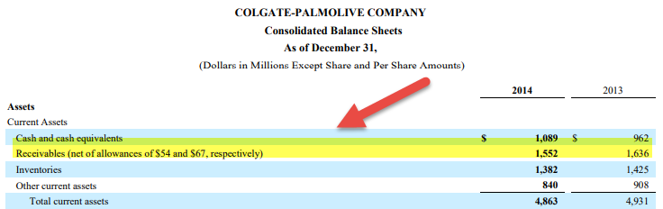

The concept of financial allowances encompasses a wide array of applications, from commodity futures contracts to personal budgeting practices. Allowances serve as pivotal mechanisms that facilitate adaptations and adjustments in various financial activities. In the context of commodity futures contracts, for instance, allowances permit certain deviations from specified quality, quantity, or delivery conditions, ensuring smoother market transactions and reducing the likelihood of disputes. These allowances are critical for maintaining fluidity in trading environments, particularly when perfect adherence to contract terms is impractical due to the inherent variability of commodities.

In personal finance, allowances refer to regular allocations of funds for spending or saving, which help individuals manage their finances more effectively. This approach supports structured budgeting and encourages discipline in financial management, promoting healthier financial habits over time.

Algorithmic trading presents another context where financial allowances are applied. Such trading strategies involve pre-set conditions and parameters that dictate trade execution. Allowances here can include permissible thresholds for price variations or timing deviations, essential for mitigating risks and optimizing trading strategies. These allowances enable algorithmic systems to operate efficiently within acceptable boundaries, thereby enhancing decision accuracy and execution speed.

The impact and application of allowances extend across various financial sectors, providing significant advantages like enhanced flexibility, risk management, and operational efficiency. By accommodating variability and allowing for exceptions within financial agreements, allowances make financial systems more robust and adaptable. As modern financial landscapes continue to evolve, the role of financial allowances in promoting efficient market operations and financial stability becomes increasingly vital.

## Table of Contents

## Understanding Financial Allowances

Financial allowances are integral components of both contractual agreements and personal financial management. In commodity trading, allowances are defined as permissible deviations from certain standards, such as quality or delivery location specified in a futures contract. This flexibility is vital as it allows for the pragmatic fulfillment of contracts, reducing potential disputes that might arise from rigid adherence to stipulated criteria.

In futures contracts, allowances are often utilized to address acceptable variations in the commodity being traded. For instance, a futures contract for agricultural products may specify certain quality grades or acceptable moisture levels. These allowances ensure that both parties can accommodate natural variations and logistical constraints without renegotiating the contract terms, thereby facilitating smoother transactions.

In a more personal financial context, allowances are structured as a portion of an individual's budget earmarked for specific purposes, such as spending or saving. Regular financial allowances enable individuals to manage their money efficiently, maintaining a balance between expenditures and savings. For example, a monthly allowance might be allocated for household expenses, entertainment, or savings goals.

Understanding these financial allowances is crucial for both individual budget planning and large-scale trading. For traders, recognizing the role of allowances can enhance risk management strategies and operational flexibility. For individuals, managing personal allowances can lead to more disciplined financial habits and improved financial health.

To effectively understand and apply financial allowances, it's important to adhere to well-defined frameworks. In the context of contracts, terms should clearly outline what constitutes an allowable deviation, with all parties in agreement on the permissible range. Tools such as quality assessment protocols and industry standards often aid this process in commodity trading. Similarly, in personal finance, budgeting tools and financial planning software can help in setting and tracking allowances, promoting financial discipline and goal achievement.

In summary, financial allowances serve as a mechanism to accommodate variability and foster stability in both transactional agreements and personal finance management, underscoring their versatility and necessity in diverse financial contexts.

## Examples of Financial Allowances in Different Contexts

Financial allowances serve various roles across different sectors, adapting to their unique requirements and constraints. In commodity trading, such allowances play a crucial role by permitting certain variations in the quality of the commodities being traded, which in turn provides contract flexibility. For instance, when trading [crude oil](/wiki/crude-oil) on a futures contract, there might be allowances for sulfur content variations. These permissible deviations help ensure that transactions are completed smoothly, even if the delivered commodity does not strictly match the precise specifications detailed in the contract.

In personal finance, allowances translate into budgetary allocations that individuals or households set aside for specific expenses, such as food, entertainment, or transportation. These financial allowances help in maintaining structured spending habits and support financial goals by providing a framework for managing income and expenses effectively.

Corporate finance employs a distinct set of financial allowances. Companies often account for depreciation or bad debts by integrating allowances into their financial statements. Depreciation allowance helps in systematically allocating the cost of tangible assets over their useful life, adhering to accounting standards and reflecting a more accurate financial position. Similarly, an allowance for doubtful accounts (or bad debt allowance) is provisioned to anticipate potential losses from uncollectible receivables, thereby adjusting the balance sheet to mirror the financial reality more closely.

Each type of allowance—whether in commodity trading, personal budgeting, or corporate finance—serves specific purposes. They reflect the financial context they are employed in and are essential for ensuring operational flexibility, financial accuracy, and strategic planning.

## How Allowances Work in Commodity Futures

Commodity futures contracts often incorporate allowances for minor discrepancies concerning the quality or [volume](/wiki/volume-trading-strategy) of the delivered commodity. These allowances are vital in maintaining the efficiency and smooth operation of futures markets, as they provide necessary flexibility in situations where perfect compliance with contract specifications is difficult to achieve.

Operators of commodity exchanges, such as the Chicago Mercantile Exchange (CME) or the Intercontinental Exchange (ICE), typically define these allowable deviations. By setting parameters within which variations are acceptable, these exchanges ensure that parties involved in futures contracts have a clear understanding of the acceptable range of product specifications. This clarity helps in reducing conflicts and facilitating the fulfilment of contracts.

For example, in oil futures contracts, allowances might relate to variations in sulfur content. The sulfur content of crude oil can affect its price and usability in refining processes. To account for this, contracts may specify a base sulfur content with an allowance for a small deviation. This could be expressed through a quality differential where, for instance, the contract allows for a sulfur content variation of ±0.5% from the agreed norm. This adjustment mechanism ensures that minor deviations do not nullify contracts or require renegotiations, thus maintaining market stability.

Mathematically, these deviations can be represented in a formula like:

$$
Q_{\text{adjusted}} = Q_{\text{base}} \times \left(1 + \frac{\Delta S}{S_{\text{base}}}\right)
$$

Where:
- $Q_{\text{adjusted}}$ is the adjusted quantity reflecting allowance for quality variation.
- $Q_{\text{base}}$ is the base contract quantity.
- $\Delta S$ represents the change in sulfur content from the base specification.
- $S_{\text{base}}$ is the base sulfur specification.

By allowing for such discrepancies, commodity exchanges enable more fluid trading dynamics, reduce the possibility of delivery default due to minor specification variances, and foster an environment where parties feel secure engaging in futures trading. This illustrates the critical role of well-defined allowances in maintaining the integrity and reliability of commodity futures markets.

## Financial Allowances and Algorithmic Trading

Algorithmic trading relies heavily on pre-set conditions and allowances to achieve optimal execution of trades. These allowances are integral to the trading strategy, as they establish acceptable parameters for transaction execution, enabling the system to navigate market fluctuations effectively.

One of the primary forms of allowances in [algorithmic trading](/wiki/algorithmic-trading) is the price threshold. These thresholds determine the price range within which a trade is considered viable. By setting price ceilings and floors, traders can avoid making transactions at prices deemed unfavorable, thereby reducing exposure to potential losses. For example, an algorithm might be programmed to buy a stock only if its price drops below a certain threshold or sell if it rises above another, thus capitalizing on market [volatility](/wiki/volatility-trading-strategies) under controlled conditions.

Timing conditions also serve as crucial allowances in algorithmic trading. These conditions specify the temporal aspects of trade execution, such as the time of day or the duration between potential trades. This strategic timing can be crucial in high-frequency trading ([HFT](/wiki/high-frequency-trading-strategies)), where milliseconds can drastically influence outcomes. By embedding timing conditions in trading algorithms, traders can optimize entry and [exit](/wiki/exit-strategy) points, aligning them with anticipated market movements.

Allowances in algorithmic trading also play a significant role in risk management. By accommodating minor deviations in operation, algorithms can adjust to market anomalies without necessitating manual intervention. This operational flexibility is essential for maintaining strategy integrity even when markets behave unpredictably.

Incorporating these allowances ensures that trading algorithms operate within defined limits, enhancing the robustness and stability of trading strategies. As markets continue to evolve and grow more complex, the flexibility provided by financial allowances will remain pivotal in refining and executing algorithmic trading strategies effectively.

## Implications and Benefits of Financial Allowances

Financial allowances, a versatile tool in both trading and personal finance, provide significant benefits by enhancing adaptability and efficiency in financial operations.

In trading and investment, allowances offer crucial flexibility. They allow market participants to navigate fluctuations and uncertainties inherent in financial markets. By accommodating minor deviations or variations—such as in commodity quality, trade execution terms, or pricing—allowances reduce the rigidity of contracts. This flexibility helps prevent potential disputes and facilitates smoother transaction processes, ultimately contributing to market stability.

Allowances play an indispensable role in financial forecasting and planning. By accounting for potential variances, they provide a buffer that enables clearer and more resilient financial projections. For instance, when setting budget forecasts or investment returns, allowances can help model different scenarios, thus promoting more accurate and reliable financial planning. This adaptability is particularly important for businesses that rely on margin forecasts and budget allocations.

On a personal finance level, maintaining a financial allowance is a fundamental practice for disciplined spending and saving. Establishing routine allowances for various expenses—such as groceries, leisure, or utilities—enables individuals to manage their finances more effectively. By setting these constraints, it encourages adhering to budget limits, thereby fostering prudent financial habits and reducing the risk of overspending.

Understanding and effectively utilizing allowances can lead to improved financial health and trading efficiency. For instance, an individual who rigorously implements a personal allowance system might find it easier to save for future investments or emergencies. Similarly, a trading entity that adeptly manages its allowance strategies can optimize returns while mitigating risks.

In conclusion, financial allowances serve as a vital mechanism for enhancing flexibility, precision in planning, and discipline in both personal and corporate finances. Their strategic implementation can yield significant benefits, enabling individuals and organizations to thrive in dynamic financial environments.

## Conclusion

Financial allowances are fundamental in diverse sectors, ranging from personal finance to commodity trading and algorithmic trading. Their ability to accommodate variability while maintaining structured frameworks is critical for effective financial management and operational efficiency. 

In the context of personal finance, allowances are instrumental in promoting disciplined financial behaviors, enabling individuals to balance spending and saving effectively. These personal allowances help in crafting manageable budgets, which contribute to financial stability and health. 

In commodity trading, allowances allow for slight deviations in quality or quantity, thus ensuring that futures contracts can be fulfilled under practical conditions. This flexibility in contracts aids in minimizing disputes and maintaining the fluidity of trade operations.

Algorithmic trading benefits significantly from the strategic use of allowances, as they permit pre-set conditions that guide trade execution. These conditions, such as price thresholds and timing constraints, are vital for robust trading strategies, enabling adaptability and mitigating risk.

As the financial landscape continues to evolve, allowances remain a key [factor](/wiki/factor-investing) in ensuring operational success and stability. Innovations in technology and finance are likely to expand the functions and applications of allowances, potentially leading to enhanced precision and more efficient financial processes. Financial allowances thus maintain their relevance, providing essential adaptability in a constantly changing environment.

## References & Further Reading

[1]: Hull, John C. (2014). ["Options, Futures, and Other Derivatives."](https://www.amazon.com/Options-Futures-Other-Derivatives-9th/dp/0133456315) Pearson Education.

[2]: "Algorithmic and High-Frequency Trading." (2013). ["The Oxford Handbook of Quantitative Asset Management."](https://assets.cambridge.org/97811070/91146/frontmatter/9781107091146_frontmatter.pdf) Oxford University Press.

[3]: Fabozzi, Frank J., Kolm, Petter N., Pachamanova, Dafna, & Focardi, Sergio M. (2007). ["Robust Portfolio Optimization and Management."](https://onlinelibrary.wiley.com/doi/book/10.1002/9781119202172) Wiley Finance.

[4]: Lee, C. & Swaminathan, B. (2000). ["Price Momentum and Trading Volume."](https://onlinelibrary.wiley.com/doi/abs/10.1111/0022-1082.00280) Journal of Finance, 55(5), 2017-2069.

[5]: Rubinstein, Mark. (2001). ["Rational Markets: Yes or No? The Affirmative Case."](https://www.jstor.org/stable/4480313) Financial Analysts Journal, 57(3), 15-29.