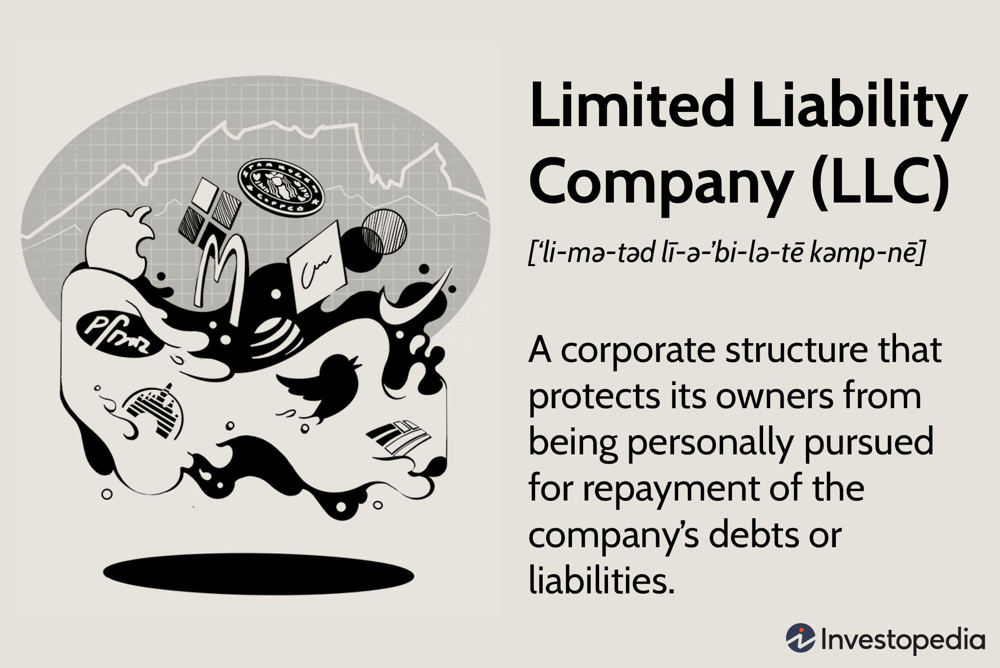

The financial services industry is undergoing a significant transformation, particularly within trading firms that specialize in proprietary and algorithmic trading. Proprietary trading refers to the act of firms trading stocks, bonds, and other financial instruments using their own capital, as opposed to that of clients. This allows firms to capitalize on higher profit margins. Algorithmic trading, on the other hand, involves using computer algorithms to execute trades efficiently based on a set of predetermined criteria. The integration of technology and vast datasets has become essential in crafting strategies that optimize trading performance.

In this evolving landscape, the role of technology and data cannot be overstated. With real-time access to market data and advanced analytical tools, trading firms are increasingly relying on complex mathematical models and sophisticated algorithms to enhance their trading strategies. This reliance allows for the swift execution of trades, which is crucial in the fast-paced environment of modern financial markets.



Key players in this domain often specialize in either proprietary or algorithmic trading, or a combination of both. These firms leverage their technological prowess and deep market understanding to outperform traditional trading methods. Among these firms is Allston Trading, recognized as a leader in both proprietary and algorithmic trading. Founded in 2002, Allston Trading has been at the forefront of innovation, particularly in the realms of high-frequency trading and market making. The firm’s strategic focus on technology has enabled it to continuously adapt and maintain a competitive edge in the financial markets.

As the financial services sector evolves, it is evident that the intersection of technology and trading strategies will continue to shape the industry's future. Proprietary and algorithmic trading remain pivotal components, driving both innovation and competition within the market. Understanding the dynamics that propel these trading strategies offers crucial insights into the broader shifts taking place in financial services today.

## Table of Contents

## What is Proprietary Trading?

Proprietary trading, often referred to as "prop trading," is a practice where financial firms trade stocks, bonds, currencies, commodities, and their derivatives using their own capital, rather than on behalf of clients. This approach allows firms to capture the full spectrum of returns generated by their trading activities, as they are not sharing profits with clients or retaining only a commission. 

The significance of proprietary trading in financial markets lies in its contribution to market liquidity and efficiency. By actively buying and selling securities, proprietary trading firms ensure that there is a consistent flow of transactions in the market, which helps in maintaining the bid-ask spreads and overall market stability. These firms employ a variety of strategies ranging from high-frequency trading, where trades are conducted at incredibly rapid speeds, to arbitrage strategies that exploit price discrepancies across different markets or instruments.

Firms like Allston Trading excel in this domain, leveraging their capabilities to operate using their own capital. These firms utilize advanced technological infrastructure to execute trades with speed and precision, optimizing their strategies through sophisticated risk management and data analysis techniques. By using proprietary capital, firms can make independent trading decisions focused entirely on profit generation without the constraints and fiduciary responsibilities that come with managing client assets.

One of the primary advantages of proprietary trading is the potential for higher returns. This is primarily because the firm can take on higher leverage and risk, in accordance with its risk management framework, without facing the limitations often imposed by client-driven services. Moreover, since all profits remain within the firm, the financial incentives align closely with the development of innovative trading strategies and technologies.

Another advantage is flexibility. In prop trading, decisions can be made quickly, without the need for client approval or the oversight typical of client-asset management practices. This autonomy enables prop trading firms to capitalize on short-term market movements and emerging opportunities that may not align with traditional investment mandates.

However, proprietary trading is not without its challenges. The significant use of leverage can amplify losses, making comprehensive risk management crucial. Additionally, the competitive nature of the industry demands continuous investment in technology and talent to remain at the forefront of trading innovation.

In summary, proprietary trading plays a pivotal role in modern financial markets by enhancing [liquidity](/wiki/liquidity-risk-premium) and fostering an environment for sophisticated trading practices. It is characterized by the use of a firm's own capital to generate profit through investment strategies that benefit from advanced technology and strategic risk-taking.

## Algorithmic Trading Explained

Algorithmic trading is defined as the use of computer algorithms to manage the execution of trades in financial markets. Traders leverage these algorithms to automate decisions based on a combination of market data, pre-defined instructions, and mathematical models. The role of [algorithmic trading](/wiki/algorithmic-trading) in modern financial markets is substantial, reflecting its capacity to enhance trading efficiency, minimize human error, and capitalize on opportunities that manual trading cannot access quickly. 

The foundation of algorithmic trading lies in processing vast amounts of market data to identify trading opportunities. Algorithms utilize historical price data, [order book](/wiki/order-book-trading-strategies) information, and market signals to predict future price movements. These predictions are often underpinned by statistical models and [machine learning](/wiki/machine-learning) techniques that can recognize patterns far beyond the capacity of human traders. A common approach is to use quantitative strategies that are mathematically structured to gain a competitive edge, such as mean reversion, [trend following](/wiki/trend-following), or [arbitrage](/wiki/arbitrage).

The use of algorithms enables significant optimization of trading strategies. For instance, consider an algorithm employing linear regression to forecast stock prices based on historical trends:

```python
import numpy as np
from sklearn.linear_model import LinearRegression

# Example of loading time-series data for stock prices
time = np.array([1, 2, 3, 4, 5]).reshape(-1, 1)
prices = np.array([101, 102, 100, 105, 107])

# Fitting linear regression model
model = LinearRegression().fit(time, prices)

# Predicting future price
future_time = np.array([6]).reshape(-1, 1)
predicted_price = model.predict(future_time)
```

In this historical data-driven approach, the algorithm predicts a potential price movement, effectively guiding buying or selling decisions without human intervention. 

One of the primary benefits of algorithmic trading is the speed with which trades can be executed. Algorithms can process data and make decisions in milliseconds, significantly faster than a human trader. This speed is critical in high-frequency trading ([HFT](/wiki/high-frequency-trading-strategies)), where firms seek to profit from small price discrepancies occurring within very short timeframes. The efficiency of algorithmic trading also facilitates greater market liquidity and tighter spreads.

Accuracy is another key advantage. The precision inherent in algorithmic systems reduces manual errors that could occur due to emotional or psychological factors. Algorithms follow predetermined rules and logic, ensuring consistent performance over time.

In conclusion, algorithmic trading represents a technology-driven innovation that has fundamentally transformed market operations. By optimizing trading strategies and enhancing execution speed and accuracy, algorithmic systems enable traders to effectively navigate and compete in contemporary financial ecosystems.

## Allston Trading as a Case Study

Allston Trading, established in 2002, has played a transformative role in the development of proprietary and algorithmic trading strategies. The firm was founded by Carlton Jones and John DiBacco, with a primary focus on leveraging cutting-edge technology and quantitative analysis to optimize trading performance. Allston Trading quickly established itself as a leader in high-frequency trading (HFT) and [market making](/wiki/market-making), becoming known for its speed and efficiency in executing trades across various asset classes.

The firm's journey is marked by several key developments. Initially, Allston Trading concentrated on trading equity options, but it gradually diversified its portfolio to include futures, foreign exchange, and fixed income products. This diversification enabled the firm to mitigate risks and capitalize on various market opportunities, enhancing its profitability and resilience.

A pivotal moment in Allston Trading's history was its acquisition by DV Trading in 2017. This acquisition was significant as it allowed both firms to combine resources and expertise, facilitating further advancements in trading strategies and technology. DV Trading, known for its strong presence in global financial markets, provided Allston Trading with additional infrastructure and capital, enhancing its capacity to engage in high-speed trading and market making.

Specializing in high-frequency trading, Allston Trading utilized complex algorithms to execute a large number of orders within fractions of a second. This capability is critical in modern financial markets, where the speed of execution can significantly influence profitability. The firm's high-frequency trading strategies often involved [statistical arbitrage](/wiki/statistical-arbitrage) and market making, where they provided liquidity by quoting buy and sell prices, capturing the bid-ask spread.

In terms of market making, Allston Trading employed sophisticated models to provide liquidity and ensure efficient price discovery in various markets. By using proprietary technology, the firm was able to maintain continuous quotes and rapidly adjust its positions in response to market fluctuations, thereby reducing risks associated with market [volatility](/wiki/volatility-trading-strategies).

Allston Trading's emphasis on technology and data-driven strategies exemplifies the competitive nature of the proprietary and algorithmic trading industry. Its history and development offer valuable insights into how trading firms can leverage technology to enhance their trading strategies and maintain a competitive edge in the financial markets.

## The Benefits and Drawbacks of Algorithmic Trading

Algorithmic trading has transformed the landscape of financial markets, offering significant advantages in terms of speed, accuracy, and efficiency. These benefits have made algorithmic trading an essential tool for many firms, enabling them to outperform traditional trading strategies.

One of the principal benefits of algorithmic trading is speed. Unlike human traders, algorithms can execute trades within milliseconds. This rapid execution allows traders to capitalize on fleeting market opportunities that arise from price discrepancies or news events. The high speed of execution is crucial in markets where price movements can be minute and occur in seconds.

Accuracy is another significant advantage of algorithmic trading. Pre-programmed algorithms follow a set of rules strictly, minimizing human errors that might occur due to fatigue, emotion, or oversight. This precision results in more effective management of trading strategies and the ability to adhere to complex execution plans that would be challenging for human traders to manage in real-time.

Efficiency is also enhanced through algorithmic trading. Algorithms can process vast amounts of market data and identify patterns or trends that might not be readily apparent to human traders. This capability allows for well-informed decision-making based on comprehensive data analysis. Moreover, the automation of trades helps reduce transaction costs and manage large trading volumes more effectively.

Despite these benefits, algorithmic trading presents several challenges. The cost and complexity of developing and maintaining high-performance trading algorithms are significant. Firms must invest in sophisticated technology and skilled personnel to create, test, and refine algorithms, ensuring that they perform well under various market conditions. 

Risk management is another critical challenge in algorithmic trading. The high speed and [volume](/wiki/volume-trading-strategy) of trades executed by algorithms can amplify potential losses, especially if an algorithm behaves unexpectedly or if there is a technical failure. Therefore, robust risk management strategies are necessary to mitigate these risks, including thorough testing of algorithms and real-time monitoring of trades.

Regulatory compliance is essential for firms engaged in algorithmic trading. Regulatory bodies such as the Securities and Exchange Commission (SEC) and the Commodity Futures Trading Commission (CFTC) set the frameworks within which firms must operate to ensure fair and orderly markets. Compliance with these regulations is mandatory to avoid legal repercussions and financial penalties. Regulations often address issues related to market manipulation, such as "spoofing," where false orders are placed to mislead market participants. Staying abreast of regulatory changes and implementing compliance measures promptly are essential for firms to maintain their operations within legal boundaries. 

In conclusion, while algorithmic trading offers significant advantages, it requires substantial investment in technology, skill, and compliance to manage its complexities and risks effectively.

## Legal and Regulatory Challenges

In the complex landscape of proprietary and algorithmic trading, firms like Allston Trading encounter various legal and regulatory challenges that significantly shape their operations. The Securities and Exchange Commission (SEC) and the Commodity Futures Trading Commission (CFTC) are the main regulatory bodies overseeing trading activities in the United States. Their regulations are designed to ensure market integrity, protect investors, and maintain fair trading practices.

Compliance with these regulations is paramount for trading firms. For instance, the SEC enforces rules that prevent market manipulation and insider trading, requiring firms to establish robust compliance systems. Simultaneously, the CFTC regulates the derivatives markets, where many algorithmic trading activities, such as those involving futures contracts, occur. Firms must adhere to registration requirements, reporting standards, and maintain records that facilitate monitoring by authorities.

A prominent legal challenge in algorithmic trading is “spoofing,” a form of market manipulation where traders place large orders they intend to cancel before execution, aiming to deceive the market about supply and demand. This practice is illegal under the Dodd-Frank Wall Street Reform and Consumer Protection Act, which equips regulators to penalize offending firms. An illustrative case involved Navinder Singh Sarao, whose spoofing activities were tied to the 2010 Flash Crash—a rapid, severe market downturn.

Large trading firms like Allston Trading must ensure their trading algorithms and strategies comply with anti-spoofing measures. This involves conducting thorough testing and validation of trading software, implementing real-time monitoring systems, and maintaining a robust compliance framework to respond promptly to any regulatory inquiries.

The resolution of spoofing allegations typically involves investigations by the SEC or CFTC, which may lead to financial penalties, trading suspensions, or criminal charges for individuals involved. Companies frequently respond by enhancing their internal controls and compliance measures.

Overall, the legal and regulatory challenges faced by proprietary trading firms necessitate a proactive approach to compliance and risk management, ensuring that their strategies align with evolving regulatory standards while safeguarding market integrity.

## Key Players in the Algorithmic and Proprietary Trading Space

In the competitive landscape of algorithmic and proprietary trading, several firms have established themselves as key players due to their innovative use of technology and acute market strategies. Notable among these are Jane Street Capital, Citadel Securities, and Hudson River Trading, each employing unique methodologies to excel in financial markets.

**Jane Street Capital** is renowned for its quantitative trading approach, employing a significant proportion of PhDs and mathematicians to develop sophisticated algorithms that drive its market strategies. The firm thrives on arbitrage opportunities, utilizing statistical models to identify mispricings across various asset classes. Jane Street's emphasis on technology and data analytics enables it to execute trades with remarkable precision and speed, contributing to its reputation as a leading liquidity provider.

**Citadel Securities** stands out due to its extensive deployment of quantitative research and advanced computing power. The firm functions as one of the world's largest market makers, ensuring liquidity in equities, options, and fixed income markets. Citadel leverages machine learning algorithms and vast datasets to make informed trading decisions rapidly. Their commitment to high-frequency trading (HFT) platforms ensures minimal latency, granting them an edge in capturing fleeting market opportunities. Through investment in infrastructure and cross-disciplinary talent, Citadel Securities continues to maintain its dominance in financial markets globally.

**Hudson River Trading (HRT)** is recognized for its focus on algorithmic trading and technological innovation. The firm utilizes an array of proprietary trading algorithms developed through rigorous quantitative research and data analysis. HRT's engineers and developers continuously refine these systems to adapt to evolving market conditions. The integration of high-performance computing and networking techniques allows HRT to process and respond to market signals efficiently. This technological prowess enables the firm to execute complex trading strategies, such as statistical arbitrage and market neutral positions, effectively maintaining a competitive position in varying market conditions.

These firms, along with Allston Trading, exemplify how leveraging cutting-edge technology and specialized expertise can lead to sustained success in algorithmic and proprietary trading. Their continuous evolution and adaptation to market trends underscore the dynamic nature of this sector, pushing the boundaries of how trading strategies are conceptualized and implemented.

## The Future of Proprietary and Algorithmic Trading

Proprietary and algorithmic trading continue to evolve significantly with the adoption of advanced technological innovations. These advancements have paved the way for enhanced trading strategies that are reshaping the financial industry.

**Impact of AI and Machine Learning**

Artificial Intelligence (AI) and Machine Learning (ML) are at the forefront of transforming trading practices. These technologies enable the development of sophisticated models that can identify patterns and predict market movements with greater accuracy. For example, machine learning algorithms can process vast amounts of data at an unprecedented scale, allowing traders to develop strategies that adapt dynamically to market conditions. The implementation of neural networks and [deep learning](/wiki/deep-learning) techniques facilitates the recognition of complex patterns that traditional models might overlook.

Python, as a leading programming language in data science, plays a vital role in deploying AI and ML in trading. Utilizing libraries such as `pandas`, `numpy`, and `scikit-learn`, traders can efficiently back-test strategies and optimize algorithms for better performance. An example code snippet leveraging Python for a basic linear regression model could be:

```python
import numpy as np
import pandas as pd
from sklearn.linear_model import LinearRegression

# Sample data: historical stock prices
data = pd.DataFrame({
    'StockPrice': [100, 102, 105, 107, 110],
    'MarketIndex': [2000, 2050, 2100, 2150, 2200]
})

# Reshape data for the regression model
X = data['MarketIndex'].values.reshape(-1, 1)
y = data['StockPrice'].values

# Create and train the model
model = LinearRegression()
model.fit(X, y)

# Predict future stock prices
future_index = np.array([[2250]])
predicted_price = model.predict(future_index)
print(f"Predicted Stock Price: {predicted_price[0]}")
```

**Evolving Regulatory Landscape**

As technology continues to advance, the regulatory environment must adapt to ensure fair and transparent trading practices. Regulatory bodies such as the U.S. Securities and Exchange Commission (SEC) and the Commodity Futures Trading Commission (CFTC) are developing frameworks to govern the use of AI and algorithmic trading. These frameworks aim to mitigate risks such as market manipulation and systemic instability.

Regulations now require increased transparency and risk management protocols for algorithmic trades. They stress the importance of implementing robust internal controls to safeguard against technological failures. The concept of "Smarter Regulation" has emerged, encouraging a proactive approach where regulators continuously update their understanding of evolving technologies to craft more effective policies.

The implications of these regulatory changes are profound, as trading firms must balance innovation with compliance. This balance necessitates investments in compliance infrastructures and a strategic approach to regulatory engagement. Consequently, firms that integrate cutting-edge technologies with a solid regulatory framework will likely have a competitive edge in the future trading ecosystem.

## Conclusion

Proprietary and algorithmic trading have become integral components of the financial industry, reshaping how markets operate and value is created. These trading methodologies leverage vast datasets and sophisticated algorithms to make swift and precise decisions, providing firms with competitive advantages and driving market efficiency. The influence of these strategies is profound, enabling firms to capitalize on arbitrage opportunities, increase liquidity, and reduce transaction costs. 

Technological innovation stands at the forefront of this evolution, with cutting-edge tools such as [artificial intelligence](/wiki/ai-artificial-intelligence) and machine learning playing pivotal roles. These technologies allow for the identification of intricate patterns within massive datasets, offering enhanced predictive capabilities and strategic insights that were previously unattainable. As firms continue to innovate, staying ahead of technological trends is not just beneficial but essential for maintaining relevance and competitive edge in an increasingly automated marketplace.

However, the rapid pace of technological advancement necessitates stringent regulatory compliance to mitigate risks associated with high-frequency and algorithmic trading, such as market manipulation and systemic risk. Regulatory bodies like the SEC and CFTC provide crucial oversight to ensure market integrity and stability. Adherence to these regulations protects not only individual firms but the broader financial ecosystem.

The ever-evolving landscape of financial trading demands continued exploration and adaptation. Firms must balance the pursuit of advanced technological solutions with robust risk management and compliance strategies. This dynamic environment challenges trading entities to innovate responsibly while maintaining the agility to respond to emerging trends and regulations. As proprietary and algorithmic trading further integrates into the fabric of financial markets, their ability to shape the industry's future remains substantial, underscoring the importance of strategic foresight and ethical integrity in trading practices.

## References & Further Reading

[1]: Bergstra, J., Bardenet, R., Bengio, Y., & Kégl, B. (2011). ["Algorithms for Hyper-Parameter Optimization."](https://dl.acm.org/doi/10.5555/2986459.2986743) Advances in Neural Information Processing Systems 24.

[2]: ["Advances in Financial Machine Learning"](https://www.amazon.com/Advances-Financial-Machine-Learning-Marcos/dp/1119482089) by Marcos Lopez de Prado

[3]: ["Evidence-Based Technical Analysis: Applying the Scientific Method and Statistical Inference to Trading Signals"](https://www.amazon.com/Evidence-Based-Technical-Analysis-Scientific-Statistical/dp/0470008741) by David Aronson

[4]: ["Machine Learning for Algorithmic Trading"](https://github.com/stefan-jansen/machine-learning-for-trading) by Stefan Jansen

[5]: ["Quantitative Trading: How to Build Your Own Algorithmic Trading Business"](https://www.amazon.com/Quantitative-Trading-Build-Algorithmic-Business/dp/1119800064) by Ernest P. Chan