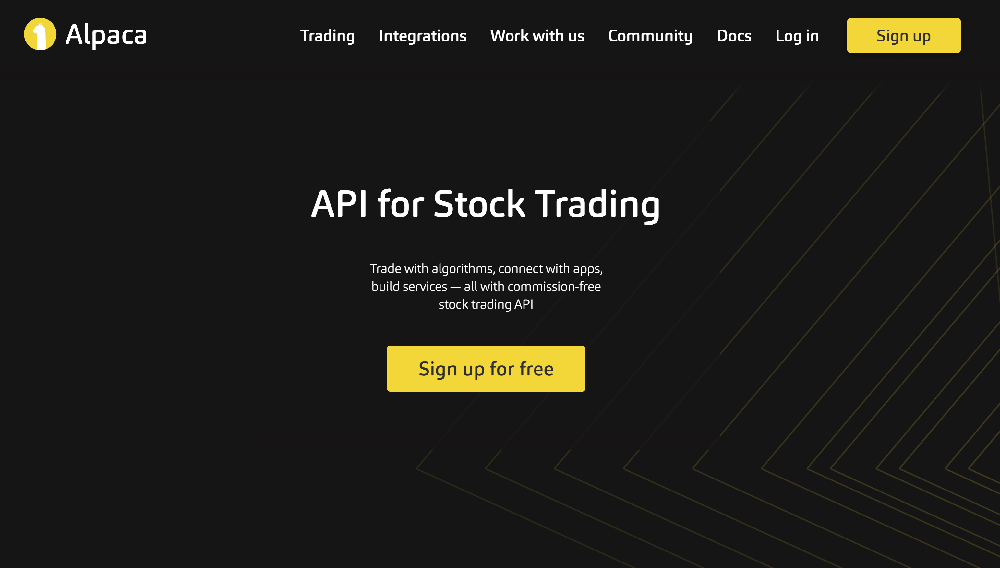

## Table of Contents

## What is the Alpaca Trading API and what are its primary functions?

The Alpaca Trading API is a tool that lets people buy and sell stocks and other financial products using computer programs. It's made by a company called Alpaca, and it's designed to be easy to use so that even people who aren't experts in coding can use it. You can connect the API to your own software or use it through their website. It's popular because it's free to use for basic features, and it works well with other tools that help with trading.

The primary functions of the Alpaca Trading API include placing orders to buy or sell stocks, checking how much money you have in your account, and getting information about the market. For example, you can use the API to automatically buy a stock when its price goes down to a certain level, or to sell it when it goes up. It also lets you see real-time data about stock prices and other financial information, which can help you make better decisions about trading. Overall, the API makes it easier to manage your investments without having to do everything manually.

## How do you set up an account with Alpaca to use their API?

To set up an account with Alpaca and start using their API, first go to their website and click on the "Sign Up" button. You'll need to enter your email address, choose a password, and provide some basic information about yourself. After you sign up, Alpaca will ask you to verify your identity. This usually involves giving them your full name, date of birth, and the last four digits of your Social Security number. They might also ask for a photo of your ID, like a driver's license or passport. Once your identity is verified, you can finish setting up your account.

After your account is set up, you'll need to connect it to the Alpaca API. Go to the Alpaca website and find the section for developers or API access. There, you can create an API key and a secret key. These keys are like special passwords that let your computer programs talk to Alpaca's system. Make sure to keep these keys safe and don't share them with anyone. Once you have your keys, you can start writing your own programs or using existing software that works with the Alpaca API to buy and sell stocks.

## What are the basic steps to authenticate and connect to the Alpaca Trading API?

To authenticate and connect to the Alpaca Trading API, you first need to get your API key and secret key from the Alpaca website. Go to the developer section or the API access page, and create these keys. They are like special passwords that let your programs talk to Alpaca's system. Make sure to keep these keys safe and don't share them with anyone. Once you have your keys, you can use them in your code to connect to the API.

After you have your keys, you can start writing your program. In your code, you'll need to include the API key and secret key. You'll also need to tell the program whether you want to use the live trading environment or the paper trading environment, which is like a practice mode. Once you've set this up, your program can send requests to the Alpaca API to do things like check your account balance, place orders, or get market data. This lets you automate your trading and manage your investments more easily.

## Can you explain the difference between paper trading and live trading with Alpaca?

Paper trading with Alpaca is like playing a game where you can pretend to buy and sell stocks without using real money. It's a safe way to practice trading and learn how the market works. You can test out different strategies and see how they might work without risking any of your own money. Alpaca gives you a pretend account with fake money so you can make trades and see what happens, but at the end of the day, no real money changes hands.

Live trading, on the other hand, is the real deal. When you use live trading with Alpaca, you're using real money to buy and sell stocks. If you make a profit, you get to keep it, but if you lose money, it's gone for real. This means you need to be careful and think about your decisions because they can affect your actual finances. Live trading is for people who are ready to take the risk and want to actively manage their investments with real money.

## How do you place a basic buy or sell order using the Alpaca API?

To place a basic buy or sell order using the Alpaca API, you need to use your API key and secret key to connect to the Alpaca system. Once you're connected, you can send a request to Alpaca to buy or sell a stock. For example, if you want to buy 10 shares of a company called ABC, you would tell the API to place a buy order for 10 shares of ABC. You can also set a price at which you want to buy the stock, like saying you want to buy it only if it's less than $50 per share.

When you send the request to Alpaca, the system will try to complete your order based on the current market conditions. If you set a specific price, the order might not happen right away if the stock isn't at that price. But if you just want to buy or sell at the current market price, the order can happen quickly. Once the order is placed, Alpaca will send you a confirmation that it's been done, and you can check your account to see the changes.

## What types of orders can be executed through the Alpaca Trading API?

The Alpaca Trading API lets you place different kinds of orders to buy or sell stocks. You can use a market order, which means you want to buy or sell a stock at the current market price. This is the fastest way to make a trade because it happens right away. Another type is a limit order, where you set a specific price at which you want to buy or sell. For example, you might say you want to buy a stock only if it's less than $50 per share. If the stock reaches that price, the order will go through.

There are also stop orders, which are used to limit losses or protect profits. A stop order becomes a market order once the stock reaches a certain price, called the stop price. For example, if you own a stock and want to sell it if it drops to $40, you can set a stop order at $40. When the stock hits that price, it will sell at the current market price. Lastly, there are stop-limit orders, which combine stop and limit orders. With a stop-limit order, you set both a stop price and a limit price. When the stock hits the stop price, it turns into a limit order and will only go through if it can be done at your limit price or better.

## How can you retrieve and manage your portfolio using the Alpaca API?

To retrieve and manage your portfolio using the Alpaca API, you first need to connect to the API using your API key and secret key. Once connected, you can send a request to Alpaca to get information about your current portfolio. This includes details like what stocks you own, how many shares you have of each stock, and the current value of your holdings. You can also see how much money you have available to trade with. This information helps you keep track of your investments and make decisions about what to do next.

Managing your portfolio with the Alpaca API involves using the data you retrieve to make trades. For example, if you want to sell some of your stocks, you can place a sell order through the API. You can also buy new stocks by placing a buy order. The API lets you set specific prices for your orders, like using a limit order to buy a stock only if it's at a certain price or lower. By regularly checking and updating your portfolio through the API, you can stay on top of your investments and adjust your strategy as needed.

## What are some advanced features of the Alpaca API, such as algorithmic trading?

One advanced feature of the Alpaca API is [algorithmic trading](/wiki/algorithmic-trading), which lets you use computer programs to make trading decisions automatically. This means you can set up rules for buying and selling stocks based on things like price changes or market trends. For example, you could write a program that buys a stock when its price goes down by a certain amount and sells it when the price goes up. This can help you trade more efficiently and take advantage of opportunities in the market without having to watch it all the time.

Another advanced feature is the ability to use real-time data and historical data to improve your trading strategies. The Alpaca API gives you access to up-to-date information about stock prices and other market data, which you can use to make better decisions. You can also look at past data to see how stocks have performed over time and use that information to predict future trends. By combining these data sources with algorithmic trading, you can create more sophisticated trading systems that can adapt to changing market conditions.

## How do you handle errors and exceptions when using the Alpaca Trading API?

When using the Alpaca Trading API, you might run into errors and exceptions. These can happen for different reasons, like if you enter the wrong information or if there's a problem with the connection to Alpaca's servers. To handle these errors, you can use something called "try-except" blocks in your code. This means you tell your program to try to do something, and if it can't, it will do something else instead. For example, if you try to place an order but it doesn't work, you can have your program send you a message saying what went wrong.

It's also a good idea to check the error messages that Alpaca sends back. These messages can tell you exactly what went wrong, like if you don't have enough money in your account or if the stock you're trying to trade isn't available. By reading these messages, you can fix the problem and try again. Keeping track of these errors can also help you improve your trading program over time, making it more reliable and less likely to run into problems in the future.

## What are the best practices for securing your Alpaca API keys?

Keeping your Alpaca API keys safe is really important. These keys are like special passwords that let your programs talk to Alpaca's system. If someone else gets your keys, they could use them to make trades with your money. So, you should never share your keys with anyone or post them online. It's also a good idea to keep them in a safe place, like a secure file on your computer or a password manager. Make sure to use strong, unique passwords for your Alpaca account and change them regularly to add an extra layer of security.

Another good practice is to use environment variables to store your API keys instead of putting them directly in your code. This means you can keep your keys separate from your program, which makes it harder for someone to find them if they get access to your code. Also, be careful when you're working on your computer in public places, because someone might be able to see your screen or get into your files. By following these simple steps, you can help keep your Alpaca API keys secure and protect your trading account.

## How can you integrate Alpaca's API with other financial data sources or tools?

You can connect Alpaca's API with other financial data sources or tools to make your trading better. For example, you might want to use a tool that gives you real-time news about the stock market. By linking this tool with Alpaca's API, you can set up your program to automatically buy or sell stocks based on the news. Another way to use other tools is to get historical data about how stocks have performed in the past. You can use this data to find patterns and make smarter trading decisions. By combining Alpaca's API with these other sources, you can create a more powerful trading system.

Another useful thing to do is to connect Alpaca's API with a tool that helps you analyze data. For example, you might use a program that can look at lots of numbers and find trends or make predictions. By sending data from Alpaca to this tool, you can get insights that help you decide when to buy or sell stocks. You can also use other trading platforms or tools that let you manage your investments in different ways. By integrating these tools with Alpaca's API, you can have a more complete view of your portfolio and make better trading choices.

## What are some common pitfalls and how can they be avoided when using the Alpaca Trading API at an expert level?

When using the Alpaca Trading API at an expert level, one common pitfall is not handling errors and exceptions properly. If your program doesn't check for errors, it might keep running even when something goes wrong, which can lead to unexpected trades or losses. To avoid this, always use try-except blocks in your code to catch and handle errors. Make sure to read the error messages from Alpaca carefully, as they can tell you what went wrong and how to fix it. By keeping track of these errors and learning from them, you can make your trading program more reliable and less likely to run into problems.

Another pitfall is not securing your API keys well enough. If someone else gets your keys, they could use them to make trades with your money. To prevent this, never share your keys with anyone or post them online. Keep them in a safe place, like a secure file on your computer or a password manager. Use environment variables to store your keys instead of putting them directly in your code, which makes it harder for someone to find them. Also, be careful when working on your computer in public places, as someone might be able to see your screen or get into your files. By following these simple steps, you can help keep your Alpaca API keys secure and protect your trading account.

## What are the challenges and considerations?

Algorithmic trading with Alpaca presents several challenges and considerations for traders, which are crucial to understand for fostering successful trading strategies. These challenges range from technical aspects and learning curves to market dynamics and regulatory compliance.

One of the primary challenges is the technical complexity involved in algorithmic trading. Beginners may find the learning curve steep due to the need for understanding programming languages, trading algorithms, and software tools. Alpaca offers a robust API that is predominantly accessed using Python, a widely-used programming language in financial technologies due to its ease of use and rich ecosystem of libraries such as NumPy, pandas, and [backtrader](/wiki/backtrader). Here’s a simple example of fetching stock data using Alpaca's API in Python:

```python
import alpaca_trade_api as tradeapi

# Your API keys
ALPACA_API_KEY = 'your_api_key'
ALPACA_SECRET_KEY = 'your_secret_key'
BASE_URL = 'https://paper-api.alpaca.markets'

api = tradeapi.REST(ALPACA_API_KEY, ALPACA_SECRET_KEY, BASE_URL, api_version='v2')

# Get daily prices for AAPL over the last 100 days
barset = api.get_barset('AAPL', 'day', limit=100)
aapl_bars = barset['AAPL']

for bar in aapl_bars:
    print(f"Time: {bar.t}, Close: {bar.c}")
```

Risk management is another critical consideration when engaging in algorithmic trading. Traders must develop solid risk management strategies to hedge against potential losses. This includes setting stop-loss orders to limit losses, employing position sizing techniques to control the amount risked per trade, and ensuring a diversified portfolio to mitigate systemic risk. Formulaically, one might consider the Kelly Criterion for determining optimal bet size:

$$
f^* = \frac{bp - q}{b}
$$

Where:
- $f^*$ is the fraction of the portfolio to wager
- $b$ is the odds received on the wager
- $p$ is the probability of winning
- $q$ is the probability of losing, which is $1-p$

In terms of market data, [liquidity](/wiki/liquidity-risk-premium), and [volatility](/wiki/volatility-trading-strategies), traders using Alpaca must be cognizant of how these factors can affect trading performance. Access to real-time and historical market data allows traders to backtest strategies, yet variations in liquidity can impact the execution of trades, potentially causing slippage—in scenarios of high volatility, this becomes pronounced. 

Regulatory compliance is another consideration, especially for U.S.-based traders. Alpaca operates under the jurisdiction of U.S. securities regulations, meaning traders must comply with various regulations put forth by entities like the Securities and Exchange Commission (SEC) and the Financial Industry Regulatory Authority (FINRA). This includes rules regarding margin trading, pattern [day trading](/wiki/day-trading-spy), and tax obligations. Traders should be well-versed in these regulations to avoid legal repercussions, especially when executing complex trading strategies. 

Overall, overcoming these challenges requires a combination of technical acumen, strategic planning, market knowledge, and an understanding of regulatory requirements. Addressing these considerations systematically will better position traders to effectively utilize Alpaca for successful algorithmic trading.

## References & Further Reading

[1]: [Bergstra, J., Bardenet, R., Bengio, Y., & Kégl, B. (2011). "Algorithms for Hyper-Parameter Optimization."](https://dl.acm.org/doi/10.5555/2986459.2986743) Advances in Neural Information Processing Systems 24.

[2]: ["Advances in Financial Machine Learning"](https://www.amazon.com/Advances-Financial-Machine-Learning-Marcos/dp/1119482089) by Marcos Lopez de Prado

[3]: ["Evidence-Based Technical Analysis: Applying the Scientific Method and Statistical Inference to Trading Signals"](https://www.amazon.com/Evidence-Based-Technical-Analysis-Scientific-Statistical/dp/0470008741) by David Aronson

[4]: ["Machine Learning for Algorithmic Trading"](https://github.com/stefan-jansen/machine-learning-for-trading) by Stefan Jansen

[5]: ["Quantitative Trading: How to Build Your Own Algorithmic Trading Business"](https://books.google.com/books/about/Quantitative_Trading.html?id=j70yEAAAQBAJ) by Ernest P. Chan