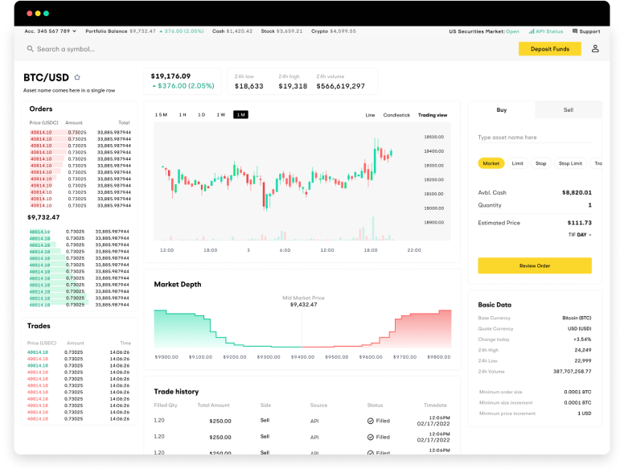

Algorithmic trading has gained significant traction in financial markets over the past decade, revolutionizing how traders interact with stock exchanges. It employs complex algorithms and quantitative techniques to automate and optimize trading decisions, offering benefits like speed, precision, and the ability to handle large volumes of trades without human error. As technology advances, the barriers to entry for individual traders in algorithmic trading continue to decrease, fostering a democratized trading environment.

Within this expanding landscape, Alpaca Trading has emerged as a notable platform, providing robust tools and resources for algorithmic traders. Specializing as an API-first trading platform, Alpaca offers a seamless integration for traders looking to implement automated trading strategies. By supporting multiple programming languages and offering a commission-free trading model, Alpaca has positioned itself as an accessible and cost-effective solution for both novice and experienced algorithmic traders.



This article aims to explore how Alpaca Trading facilitates automated and efficient trading by examining its features, functionalities, and advantages. Algorithmic trading offers numerous benefits: enhanced trading efficiency, minimized human error, and the ability to capitalize on market movements in a fraction of a second. Platforms like Alpaca empower traders to harness these benefits through sophisticated technological infrastructures and user-friendly interfaces.

The purpose of this article is to provide an in-depth analysis of Alpaca Trading, detailing how it supports and enhances algorithmic trading endeavors. By understanding these elements, traders can make informed decisions about leveraging Alpaca Trading for their algorithmic strategies, potentially improving their trading outcomes and competitive edge in the financial markets.

## Table of Contents

## Understanding Algorithmic Trading

Algorithmic trading, often referred to as algo trading, involves the use of computer algorithms to execute trading orders based on a series of pre-defined criteria. This systematic approach to trading is designed to maximize speed and accuracy, enabling traders to capitalize on market opportunities that manual trading simply cannot match. At its core, algorithmic trading is about leveraging computational power to analyze vast amounts of data and make trading decisions in real time, thereby optimizing efficiency in financial markets.

Algorithms in trading operate by following a set of instructions that relate to timing, price, or quantity, often across multiple markets. These algorithms are capable of assessing a multitude of factors rapidly, such as price fluctuations, market trends, and trading volumes. The decision-making process is grounded in statistical models and mathematical formulas that evaluate these market variables. For example, a simple Python strategy for executing trades based on moving averages could be structured as follows:

```python
import numpy as np
def moving_average_strategy(prices, short_window, long_window):
    signals = np.zeros(len(prices))
    short_mavg = np.convolve(prices, np.ones(short_window)/short_window, mode='valid')
    long_mavg = np.convolve(prices, np.ones(long_window)/long_window, mode='valid')
    signals[short_window:] = np.where(short_mavg > long_mavg, 1.0, 0.0)
    return signals
```

There are several types of [algorithmic trading](/wiki/algorithmic-trading) strategies commonly employed by traders. Market-making strategies, for instance, involve placing buy and sell orders simultaneously to capture the bid-ask spread as profit, maintaining a continuous [liquidity](/wiki/liquidity-risk-premium) provision. Trend-following strategies aim to capitalize on the [momentum](/wiki/momentum) of asset prices by executing orders aligned with the current market direction. Arbitrageurs, on the other hand, seek to exploit price discrepancies of identical or similar financial instruments across different markets or platforms, executing strategies within seconds to lock in risk-free profits.

The efficacy of algorithmic trading is heavily dependent on the speed and precision of trade execution. In modern markets, where delays are measured in microseconds, having a high-speed trading infrastructure is crucial. Algorithmic strategies can execute trades faster than human reflexes, thus ensuring transactions are completed within optimal pricing conditions. The speed aspect is further enhanced by technological advancements such as co-location services, where trading servers are placed in proximity to exchange servers to minimize latency.

Technological innovation continues to revolutionize algorithmic trading. The advancement of [machine learning](/wiki/machine-learning) and [artificial intelligence](/wiki/ai-artificial-intelligence) has allowed for more sophisticated analysis of market trends and patterns, predictively adjusting algorithms based on historical and real-time data. Furthermore, high-performance computing enables the processing of complex models at unprecedented speeds, broadening the scope and depth of strategies available for traders.

In conclusion, algorithmic trading represents a fusion of finance and technology, utilizing algorithms to bring about greater speed, accuracy, and efficiency in executing trades. As technology progresses, it is envisaged that algo trading will continue to evolve, offering new strategies and opportunities to those in the financial market landscape.

 to Alpaca Trading

Alpaca Trading is recognized as a prominent API trading platform, extensively utilized by algorithmic traders for its robust functionalities and user-friendly environment. Established with a focus on democratizing access to financial markets, Alpaca offers a platform that is not only versatile but also highly efficient for automated trading strategies.

At the core of Alpaca's appeal is its API-first approach, which provides a seamless interface for traders interested in algorithmic trading. The platform's API allows users to execute trades automatically, manage portfolios, and retrieve both real-time and historical market data with ease. This functionality is crucial for algorithmic traders who depend on accurate and timely data to make informed trading decisions.

One of Alpaca's most attractive features is its commission-free trading model, which eliminates the traditional cost barrier associated with frequent trading. By offering commission-free trades, Alpaca enables traders to execute high-frequency and algorithmic trading strategies without the burden of accumulating fees over time. This cost-effective model has significantly contributed to Alpaca's popularity among both new and experienced traders.

Alpaca's platform supports integration with various programming languages, including Python, JavaScript, and C++, allowing traders to develop and deploy custom trading algorithms with flexibility. This multi-language support is essential for traders who may have preferences or specific requirements for coding their algorithms. The integration capabilities extend further to accommodate popular programming frameworks and libraries, facilitating a broader range of technical analysis and strategy implementation.

Security is a key consideration for any trading platform, and Alpaca ensures a high level of security for its users. The platform employs industry-standard encryption and secure authentication methods to protect user data and transactions. Additionally, Alpaca offers responsive customer support to assist users with technical issues or inquiries, further bolstering user confidence and satisfaction.

In summary, Alpaca Trading stands out as a leading API trading platform, providing algorithmic traders with a commission-free, secure, and efficient environment to execute their trading strategies. Its interoperability with a variety of programming languages and strong customer support makes it an attractive option for those looking to leverage technology in financial markets.

## Features of Alpaca for Algo Trading

Alpaca Trading offers a suite of features tailored to meet the needs of algorithmic traders, emphasizing efficiency, accuracy, and accessibility. At the core of its offerings is a robust Application Programming Interface (API), which facilitates seamless trade execution. This API allows developers to automate trading processes, enabling them to send market orders, receive notifications upon trade execution, and manage portfolios with ease. It supports integration with various programming languages, including Python, making it accessible for both novice and experienced developers.

One of the key advantages of using Alpaca is its access to real-time and historical market data. The platform provides traders with comprehensive data necessary for making informed decisions and developing precise trading algorithms. By offering real-time stock quotes and detailed historical data, Alpaca ensures that traders can analyze market trends and test their algorithms against past conditions. This feature is crucial for refining strategies and ensuring that they are robust under various market scenarios.

Backtesting capabilities are another significant feature provided by Alpaca. Traders can simulate how their algorithms would have performed in historical markets, allowing them to identify potential weaknesses and optimize their strategies before deploying them live. This preemptive testing is critical for minimizing risks and enhancing the effectiveness of trading algorithms.

Alpaca also provides scalability features essential for handling high-frequency trading algorithms. These algorithms require the ability to process a large number of transactions quickly and efficiently. Alpaca's infrastructure is designed to handle such demands, providing low-latency access to markets and ensuring that trades are executed at the desired prices without unnecessary delays.

Moreover, Alpaca offers paper trading options, which are invaluable for traders looking to test strategies without incurring financial risks. Paper trading simulates the live trading environment, allowing users to evaluate the performance of their strategies in real-time without using actual money. This feature provides a risk-free platform for learning and experimentation, particularly useful for newcomers to algorithmic trading.

In summary, Alpaca Trading's features are strategically designed to support the complex requirements of algorithmic trading. Its robust API, comprehensive data access, [backtesting](/wiki/backtesting) tools, scalability for high-frequency trading, and paper trading capabilities collectively provide traders with the tools necessary for developing and implementing effective trading algorithms with confidence and precision.

## Benefits of Using Alpaca Trading

Alpaca Trading offers several compelling benefits that make it an attractive choice for individuals and institutions engaging in algorithmic trading. One of the primary advantages is its commission-free trading model. Traditional brokerage firms often charge fees for each transaction, which can accumulate over time and erode trading profits, especially for high-frequency traders. By eliminating these fees, Alpaca allows traders to retain more of their earnings, thereby providing a significant cost-saving advantage.

Flexibility is another key benefit of using Alpaca Trading. The platform supports a wide range of programming languages, including Python, which is particularly popular among data scientists and financial analysts. This support allows traders to develop and deploy custom trading algorithms tailored to their specific strategies and preferences. With Alpaca's robust API, users can connect their own trading software, facilitating seamless integration and customization of trading operations.

Efficiency and accuracy in trade execution are crucial for the success of algorithmic trading. Alpaca Trading is designed to handle high-frequency trading scenarios with minimal latency, enhancing the efficiency of executing trades. This high level of accuracy in processing transactions ensures that trading algorithms perform as intended, reducing slippage and increasing the reliability of trading operations.

The Alpaca platform also provides valuable insights into risk management. Effective risk management tools are essential for mitigating the potential losses associated with trading. Alpaca offers features that allow traders to monitor their portfolios, analyze historical data, and set risk parameters. These tools help traders make informed decisions and manage their exposure to market [volatility](/wiki/volatility-trading-strategies) effectively.

User testimonials and success stories further highlight the advantages of using Alpaca for algorithmic trading. Many traders have reported improved performance and satisfaction with the platform's offerings. The ability to test and optimize trading strategies in a paper trading environment without financial risk is often cited as a valuable feature by users. This capability enables traders to refine their algorithms and gain confidence before deploying them in live markets.

Overall, Alpaca Trading stands out as a versatile and user-friendly platform that significantly enhances the trading experience for algorithmic traders. Its commission-free model, flexible programming support, efficient trade execution, and comprehensive risk management tools collectively contribute to its growing popularity among traders seeking to leverage automated trading strategies.

## How to Get Started with Alpaca for Algo Trading

To get started with Alpaca for algorithmic trading, follow these steps to set up an account and begin developing algorithms tailored to your trading strategies.

**Step-by-step guide to setting up an account on Alpaca Trading:**

1. **Visit the Alpaca Website**: Navigate to the official Alpaca website to begin the account registration process.

2. **Sign Up**: Click on the "Sign up" button. Enter your email address and create a password to register. You may be required to verify your email address.

3. **Complete the Registration Form**: Provide the necessary personal information, including full name, address, and phone number, as required by financial regulations.

4. **Link Your Bank Account**: To facilitate fund transfers, link your bank account securely. This step is crucial for live trading but can be skipped initially if you are starting with paper trading.

5. **Select the Account Type**: Choose between a live trading account or a paper trading account. Beginners are encouraged to start with paper trading to practice without financial risk.

**Choosing the right programming language and tools for developing algorithms:**

When selecting a programming language for developing trading algorithms on Alpaca, Python is highly recommended due to its simplicity and extensive libraries tailored for financial analysis. Alpaca’s API is conducive to integration with Python, making it easier to develop, test, and deploy trading algorithms.

Example Python setup for using Alpaca’s API:

```python
import alpaca_trade_api as tradeapi

# Set your API key and secret
API_KEY = 'your_api_key'
API_SECRET = 'your_api_secret'
BASE_URL = 'https://paper-api.alpaca.markets' # Use the paper trading URL for testing

# Initialize the Alpaca API
api = tradeapi.REST(API_KEY, API_SECRET, BASE_URL, api_version='v2')
```

**Tips for beginners to start with simple trading strategies:**

Beginners should consider starting with basic trading strategies such as moving average crossovers or momentum-based strategies. These strategies rely on well-understood technical indicators and are relatively simple to implement. Focusing on simplicity can help new traders gain confidence and understanding before progressing to more complex strategies.

**Exploring the Alpaca community and resources for learning and support:**

The Alpaca community offers forums, tutorials, and documentation to support traders in their journey. Engaging with community resources can provide insights into best practices and innovative strategies. Furthermore, Alpaca’s official documentation is a valuable guide to understanding its API functionalities and parameters.

**Best practices for testing and optimizing trading algorithms on Alpaca:**

1. **Utilize Paper Trading**: Before deploying a strategy in a live trading environment, test it extensively using Alpaca’s paper trading feature. This environment replicates live trading conditions without risking real money.

2. **Backtesting**: Leverage historical data provided by Alpaca to backtest your strategies against past market conditions. This helps in evaluating the potential effectiveness of your strategy.

3. **Iterative Optimization**: Continuously refine and adjust your algorithm parameters based on backtesting results and market changes. Regular optimization helps in adapting to evolving market conditions.

4. **Risk Management**: Integrate risk management tools such as stop-loss and take-profit orders in your algorithm to protect against significant losses.

Starting with Alpaca for algorithmic trading provides an accessible platform for traders to develop, test, and refine their trading strategies efficiently. By following the steps and best practices outlined, traders can maximize their potential for success in the algorithmic trading sphere.

## Challenges and Considerations

Algorithmic trading offers tremendous potential, but it also presents certain challenges and considerations, particularly for those new to the practice. One of the primary challenges is the technical complexity involved in developing and deploying trading algorithms. Effective algorithmic trading requires a deep understanding of programming, data analysis, and financial markets. The ability to write efficient, bug-free code in languages like Python is essential. Algorithms must be thoroughly tested and optimized to execute trades accurately and at the desired speed.

Another major consideration is understanding market risks and volatility. Algorithmic trading strategies must account for fluctuations in market conditions, which can influence trade outcomes. Models need to incorporate robust risk management practices, such as setting stop-loss limits and diversifying across different assets to mitigate potential losses. Volatility can be quantified using indicators such as the standard deviation of returns, enabling traders to adjust strategies dynamically.

Regulatory considerations are also important when using automated trading strategies. Different jurisdictions have specific regulations governing algorithmic trading, which aim to maintain market integrity and prevent systemic risk. Traders must ensure compliance with these regulations, which might include restrictions on high-frequency trading or mandates for specific reporting requirements. Staying informed on regulatory updates is crucial for avoiding legal pitfalls.

Finally, continuous monitoring and updating of trading algorithms are critical to maintaining their effectiveness. Market conditions evolve, and strategies that were once profitable can quickly become obsolete. Regularly reviewing performance metrics and incorporating machine learning techniques to adapt to changing trends can enhance an algorithm's longevity and profitability. This ongoing process involves both quantitative analysis and qualitative judgment to fine-tune parameters and improve outcomes.

## Conclusion

Alpaca Trading stands as a pivotal platform in the landscape of algorithmic trading, largely due to its robust API and commission-free trading model, which have collectively contributed to the democratization of access to sophisticated trading practices. Throughout this article, we've examined the integral features and benefits that Alpaca offers to seasoned algorithmic traders and newcomers alike. Its seamless trade execution, real-time market data access, and support for a multitude of programming languages make it a versatile tool for deploying custom trading algorithms. 

Alpaca's introduction to the trading ecosystem has paved the way for more individuals to engage in algorithmic trading without the barrier of high costs. This accessibility has realigned the landscape, enabling retail traders to develop and test strategies free from financial risk through its paper trading and backtesting capabilities. The ability to handle high-frequency trading demands further accentuates its role in propelling innovation in the trading domain.

As algo trading continues evolving, platforms like Alpaca hold a prominent place in supporting traders to harness technological advancements efficiently. The flexibility and efficiency it provides not only empower traders but also encourage experimentation and continuous improvement of trading algorithms. This commitment to fostering growth and access suggests a bright future where algorithmic trading becomes more inclusive and dynamic.

For those intrigued by the potential of algorithmic trading, Alpaca Trading offers a compelling starting point. The platform's supportive community and extensive resources provide an enriching environment conducive to learning and strategizing. Feedback from users has been overwhelmingly positive, with traders showcasing success stories and insights into their journeys. Therefore, we invite readers to consider Alpaca Trading if they are contemplating venturing into algorithmic trading and to share their experiences or queries, fostering a broader dialogue and knowledge exchange within the trading community.

## References & Further Reading

[1]: Bergstra, J., Bardenet, R., Bengio, Y., & Kégl, B. (2011). ["Algorithms for Hyper-Parameter Optimization."](https://papers.nips.cc/paper/4443-algorithms-for-hyper-parameter-optimization) Advances in Neural Information Processing Systems 24.

[2]: ["Advances in Financial Machine Learning"](https://www.amazon.com/Advances-Financial-Machine-Learning-Marcos/dp/1119482089) by Marcos Lopez de Prado

[3]: ["Evidence-Based Technical Analysis: Applying the Scientific Method and Statistical Inference to Trading Signals"](https://www.amazon.com/Evidence-Based-Technical-Analysis-Scientific-Statistical/dp/0470008741) by David Aronson

[4]: ["Machine Learning for Algorithmic Trading"](https://github.com/stefan-jansen/machine-learning-for-trading) by Stefan Jansen

[5]: ["Quantitative Trading: How to Build Your Own Algorithmic Trading Business"](https://books.google.com/books/about/Quantitative_Trading.html?id=j70yEAAAQBAJ) by Ernest P. Chan