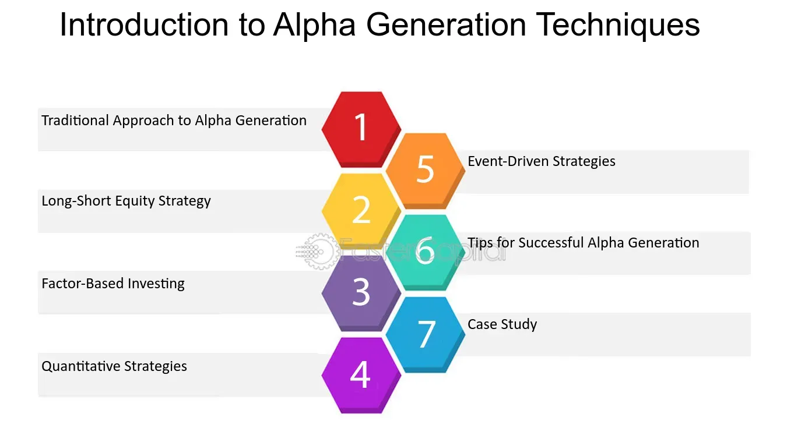

## Table of Contents

## What are Alpha Generation Techniques?

Alpha Generation Techniques are methods used by investors to try to earn more money than the average market return. These techniques involve finding special opportunities or using smart strategies to beat the market. Investors use these techniques because they want to make their investments grow faster than if they just followed the overall market trends.

There are many different Alpha Generation Techniques, but they all aim to find an edge over other investors. Some common methods include using detailed data analysis to find undervalued stocks, using computer programs to make quick trades, or even using economic theories to predict market movements. Each technique requires a lot of research and understanding of how markets work, but the goal is always the same: to make more money than the average investor.

## Why are Alpha Generation Techniques important in finance?

Alpha Generation Techniques are important in finance because they help investors make more money than the average market return. If you just follow the market, you might make some money, but if you want to do better than that, you need to find special ways to invest. These techniques let investors look for opportunities that others might miss, like finding stocks that are priced too low or using computers to trade quickly.

Using Alpha Generation Techniques can also help investors manage risk better. By understanding the market deeply and using smart strategies, investors can make choices that are less likely to lose money. This is important because investing always involves some risk, but with these techniques, investors can try to reduce that risk and still aim for higher returns. Overall, these techniques are key for anyone who wants to do better than just following the market.

## What is the difference between alpha and beta in investment strategies?

In investment strategies, alpha and beta are two important measures that help investors understand how their investments are performing. Alpha is about how much an investment beats the market. If a stock or a portfolio has a high alpha, it means it's doing better than what you would expect if you just followed the market. For example, if the market goes up by 10% but your investment goes up by 15%, you have a positive alpha of 5%. Investors love alpha because it shows they're doing something special to make more money than everyone else.

Beta, on the other hand, is about how much an investment moves with the market. If a stock or a portfolio has a high beta, it means it goes up and down a lot when the market goes up and down. A beta of 1 means the investment moves exactly with the market. If it's more than 1, it moves more than the market, and if it's less than 1, it moves less. Beta is important because it helps investors understand how risky their investments are. If you want to be safer, you might choose investments with a lower beta, but if you're okay with more risk, you might go for a higher beta.

## Can you explain some basic Alpha Generation Techniques for beginners?

One basic Alpha Generation Technique for beginners is to look for undervalued stocks. This means finding companies that are selling for less money than they are really worth. You can do this by looking at a company's price-to-earnings ratio, which compares its stock price to how much money it makes. If a company has a lower ratio than other similar companies, it might be undervalued. By buying these stocks and waiting for other investors to notice their true value, you could make more money than if you just followed the market.

Another simple technique is to invest in dividend-paying stocks. These are companies that regularly give some of their profits back to shareholders. By choosing companies with a good history of paying dividends, you can earn extra money on top of any increase in the stock's price. This can help you beat the market because you're not just relying on the stock price going up; you're also getting regular payments that add to your returns.

A third basic technique is to use index funds but with a twist. Instead of just buying a regular index fund that tracks the whole market, you can look for index funds that focus on certain parts of the market that are expected to do well. For example, you might choose an index fund that only includes technology companies if you think tech will grow faster than other sectors. By [picking](/wiki/asset-class-picking) these targeted index funds, you can try to do better than the overall market without having to pick individual stocks.

## How do momentum strategies contribute to alpha generation?

Momentum strategies help investors earn more money than the market by focusing on stocks that are already going up. The idea is simple: if a stock's price has been increasing, it's likely to keep going up for a while. Investors using this strategy buy stocks that have been doing well recently, hoping they will keep doing well. By doing this, they can ride the wave of the stock's upward movement and make more money than if they just invested in the whole market.

However, momentum strategies can also be risky. If the stock's price suddenly drops, investors who used this strategy might lose money quickly. That's why it's important to keep an eye on the market and be ready to sell if things start to go the wrong way. Even with this risk, many investors find that momentum strategies help them beat the market because they can catch stocks at the right time and make good profits before the trend changes.

## What role do quantitative models play in advanced Alpha Generation Techniques?

Quantitative models are very important in advanced Alpha Generation Techniques because they help investors use math and data to make better decisions. These models look at a lot of information, like stock prices, company earnings, and even news, to find patterns that can predict how stocks will do in the future. By using these models, investors can find special opportunities that other people might miss. For example, a model might show that a certain stock is about to go up because of good news or strong earnings, so the investor can buy it before it gets more expensive.

These models also help investors manage risk better. They can run many different scenarios to see how an investment might do in different situations. This helps investors understand what could go wrong and how to protect their money. By using quantitative models, investors can make smarter choices and try to beat the market more often. Even though these models need a lot of math and computer skills, they are a big part of why some investors can do better than others.

## How can one evaluate the effectiveness of an Alpha Generation Technique?

To evaluate how well an Alpha Generation Technique is working, you need to look at how much more money it makes compared to the market. This is called alpha. You can find alpha by comparing the returns of your investment to a market index, like the S&P 500. If your investment does better than the index, you have a positive alpha. It's also important to look at this over a long time, not just a few months, because the market can be up and down. By looking at the long-term results, you can see if the technique really helps you beat the market or if it was just luck.

Another way to evaluate an Alpha Generation Technique is to look at how much risk you are taking. Some techniques might make more money, but they can also lose more money if things go wrong. You can use something called the Sharpe Ratio to see if the extra money you're making is worth the extra risk. The Sharpe Ratio compares the extra returns (alpha) to the risk you're taking. A higher Sharpe Ratio means you're getting more reward for the risk you're taking. By looking at both the alpha and the risk, you can decide if an Alpha Generation Technique is really helping you do better than the market in a safe way.

## What are some common pitfalls to avoid when implementing Alpha Generation Techniques?

One big mistake people make when using Alpha Generation Techniques is not understanding the risks involved. Just because a technique worked in the past doesn't mean it will work in the future. Markets change, and what used to make money might not work anymore. It's important to keep an eye on how things are going and be ready to change your plan if it's not working. Also, some techniques might seem to make a lot of money, but they can be very risky. If you're not careful, you could lose a lot of money quickly.

Another common pitfall is not doing enough research. Alpha Generation Techniques often need a lot of information to work well. If you don't take the time to understand the stocks or the market, you might make bad choices. It's easy to get caught up in the excitement of trying to beat the market, but without good research, you're just guessing. Always make sure you know what you're doing and why you're doing it. That way, you can make smarter decisions and avoid big mistakes.

## How do machine learning and AI enhance Alpha Generation Techniques?

Machine learning and AI make Alpha Generation Techniques better by helping investors find patterns in lots of data that they might not see otherwise. These smart computer programs can look at things like stock prices, news, and even what people are saying on social media. By finding these patterns, [machine learning](/wiki/machine-learning) and AI can help investors pick stocks that are likely to go up in value. This means investors can make more money than if they just followed the market. For example, an AI model might notice that a certain stock always goes up after a company announces good news, so the investor can buy the stock before everyone else does.

Another way machine learning and AI help is by making decisions faster. The stock market can change quickly, and it's hard for people to keep up. But a computer can look at new information and make trades in seconds. This can be a big advantage because it lets investors take advantage of opportunities as soon as they come up. Plus, machine learning models can keep learning and getting better over time. As they see more data, they can adjust their strategies to work even better. This means investors using AI can keep beating the market as long as they keep their models up to date.

## What are the ethical considerations when using Alpha Generation Techniques?

Using Alpha Generation Techniques can raise some ethical questions. One big issue is fairness. When investors use these techniques to beat the market, they might be taking advantage of information that other people don't have. This can make the market less fair for everyone else. For example, if someone uses a computer program to make quick trades based on secret information, it might not be right because other people don't have the same chance to make money.

Another ethical concern is about the impact on the market. Some Alpha Generation Techniques, like high-frequency trading, can make the market more unstable. This means prices can go up and down a lot, which can be bad for other investors who are not using these techniques. It's important for investors to think about how their actions might affect the whole market and try to use these techniques in a way that doesn't hurt other people.

## How do Alpha Generation Techniques vary across different asset classes?

Alpha Generation Techniques can be different depending on what kind of investments you are looking at. For stocks, a common technique is to find companies that are undervalued, meaning their stock price is lower than it should be based on the company's earnings or other factors. Investors might also use momentum strategies, where they buy stocks that have been going up in price and hope they keep going up. In the bond market, alpha can be generated by looking at interest rates and credit quality. For example, if an investor thinks interest rates will go down, they might buy bonds that will go up in value because of that.

In the real estate market, alpha can come from finding properties that are priced lower than their potential value or from investing in areas that are expected to grow. Investors might use data on things like population growth and job markets to find these opportunities. For commodities like gold or oil, alpha can be generated by predicting changes in supply and demand. For example, if an investor thinks oil prices will go up because of a shortage, they might buy oil futures to make money from the price increase. Each asset class has its own unique ways to find alpha, and the best techniques depend on understanding the specific market and using the right data and strategies.

## What are the latest trends and innovations in Alpha Generation Techniques for expert investors?

Expert investors are always looking for new ways to make more money than the market, and one of the latest trends is using machine learning and [artificial intelligence](/wiki/ai-artificial-intelligence) to find patterns in data that can predict how stocks will do. These smart computer programs can look at a lot of information quickly, like stock prices, news, and even what people are saying on social media. By finding these patterns, investors can pick stocks that are likely to go up in value before everyone else does. This helps them make more money than if they just followed the market. Another innovation is using [alternative data](/wiki/best-alternative-data), like satellite images or credit card transactions, to get a better idea of how companies are doing. This can give investors an edge because they have information that other people don't.

Another big trend is using environmental, social, and governance ([ESG](/wiki/esg-investing)) factors to find alpha. More and more investors are looking at how companies treat the environment, their employees, and their leaders to decide if they are good investments. By focusing on companies that do well in these areas, investors can find stocks that might do better than the market because they are more sustainable and responsible. This also helps them avoid companies that might have problems in the future because of bad practices. Overall, these new trends and innovations help expert investors stay ahead of the game and keep finding ways to beat the market.

## What is the understanding of Alpha in Algorithmic Trading?

Alpha represents the excess return that an investment generates compared to a benchmark index, indicating the effectiveness of a particular trading strategy. In [quantitative trading](/wiki/quantitative-trading), alpha takes on a broader meaning, denoting the systematic edge that can be harnessed through advanced statistical techniques and data analysis.

To understand alpha in a quantitative context, consider the fundamental equation for calculating alpha:

$$
\text{Alpha} = R_i - (\beta \times R_m + R_f)
$$

where $R_i$ represents the return of the investment, $\beta$ is the beta of the investment (a measure of its volatility relative to the market), $R_m$ is the return of the market benchmark, and $R_f$ is the risk-free rate. This equation highlights how alpha captures returns that exceed what might be expected given the level of systematic market risk.

Quantitative traders leverage this concept by developing models that systematically identify opportunities to capture alpha. This involves utilizing statistical methods and algorithms to analyze large datasets and detect patterns or anomalies that might indicate a trading opportunity. By applying rigorous mathematical frameworks, traders can identify these exploitable inefficiencies with precision.

One approach involves constructing a portfolio that maximizes alpha by incorporating a variety of factors, such as [momentum](/wiki/momentum), value, and size. Machine learning models can also be employed to refine these factors and adjust to changing market conditions, thus maintaining the efficacy of the trading strategy.

In algo trading, alpha's significance cannot be overstated. It is the primary measure by which a strategy's worth is gauged, offering insight into the potential for generating superior returns independent of broad market movements. As such, traders and fund managers continually seek innovative ways to unearth and capitalize on alpha-generating opportunities, ensuring their methods evolve with market dynamics and technological advancements.

## What are the challenges in alpha generation?

Alpha generation in [algorithmic trading](/wiki/algorithmic-trading) presents a range of challenges that traders and quantitative analysts must address to achieve consistent success. Each challenge requires distinct approaches and solutions to ensure that alpha is not eroded during the trading process. Key challenges include overfitting, market impact, data quality, and latency.

### Overfitting

Overfitting occurs when a trading model is excessively tailored to historical data, capturing noise rather than the underlying signal. This often results in poor performance in new market conditions. To mitigate this, traders employ techniques such as cross-validation and regularization. Cross-validation helps in assessing the model's predictive power on unseen data by splitting the dataset into training and testing subsets multiple times. Regularization methods, like L1 (Lasso) and L2 (Ridge) penalties, add constraints to the model to discourage excessive complexity. Mathematically, the regularized regression is expressed as:

$$

\text{Loss} = \frac{1}{n} \sum_{i=1}^{n} (y_i - \hat{y}_i)^2 + \lambda \sum_{j=1}^{p} |\beta_j|
$$

where $y_i$ are the actual values, $\hat{y}_i$ are the predicted values, $\beta_j$ are the model coefficients, and $\lambda$ is the regularization parameter.

### Market Impact

Market impact refers to the effect that large trades can have on market prices, potentially reducing the profitability of a strategy. Effective execution strategies are crucial to minimize market impact. This involves executing large orders through techniques like algorithmic slicing, where a large order is broken down into smaller, more manageable pieces that are executed periodically to avoid abrupt pricing shifts. Monitoring [liquidity](/wiki/liquidity-risk-premium) and employing hidden orders are additional strategies to manage the impact effectively.

### Data Quality

High-quality data is fundamental for robust model development and accurate decision-making. Data quality issues, such as stale prices, outliers, or missing values, can severely impair model performance. Ensuring data accuracy involves preprocessing steps like data cleaning, normalization, and imputation. Implementations in Python for handling missing data might include:

```python
import pandas as pd

# Example DataFrame
data = pd.DataFrame({'price': [100, 101, None, 104, 105]})

# Fill missing values with the forward fill method
data['price'] = data['price'].fillna(method='ffill')
```

### Latency

Latency is a critical [factor](/wiki/factor-investing), especially in high-frequency trading ([HFT](/wiki/high-frequency-trading-strategies)) where milliseconds can determine profitability. Reducing latency involves optimizing algorithms and utilizing cutting-edge hardware and network infrastructures. Techniques include locating trading servers closer to exchanges (colocation services), utilizing low-level programming languages like C++ for performance-critical components, and employing multi-threading to expedite the processing of market data and order execution.

Together, addressing these challenges is vital for sustaining competitive advantage and generating alpha in algorithmic trading environments. As the landscape of financial markets continues to evolve, constant innovation and adaptation in overcoming these hurdles remain integral.

## References & Further Reading

[1]: Lopez de Prado, M. (2018). ["Advances in Financial Machine Learning."](https://books.google.com/books/about/Advances_in_Financial_Machine_Learning.html?id=oU9KDwAAQBAJ) Wiley.

[2]: Aronson, D. (2007). ["Evidence-Based Technical Analysis: Applying the Scientific Method and Statistical Inference to Trading Signals."](https://www.amazon.com/Evidence-Based-Technical-Analysis-Scientific-Statistical/dp/0470008741) Wiley.

[3]: Jansen, S. (2020). ["Machine Learning for Algorithmic Trading."](https://github.com/stefan-jansen/machine-learning-for-trading) Packt Publishing.

[4]: Chan, E. P. (2008). ["Quantitative Trading: How to Build Your Own Algorithmic Trading Business."](https://github.com/ftvision/quant_trading_echan_book) Wiley.

[5]: Narang, R. P. (2013). ["Inside the Black Box: The Simple Truth About Quantitative Trading."](https://onlinelibrary.wiley.com/doi/book/10.1002/9781118267738) Wiley.

[6]: Dunning, T., & Friedman, E. (2014). ["Apache Hadoop YARN: Moving Beyond MapReduce and Batch Processing with Apache Hadoop 2."](https://www.oreilly.com/library/view/apache-hadooptm-yarn/9780133441925/) O'Reilly Media.

[7]: Chollet, F. (2017). ["Deep Learning with Python."](https://www.amazon.com/Deep-Learning-Python-Francois-Chollet/dp/1617294438) Manning Publications.

[8]: Brightman, C., & Ang, A. (2021). ["Factor Investing and Asset Management."](https://journals.sagepub.com/doi/full/10.1177/09722629241295451) Oxford University Press.