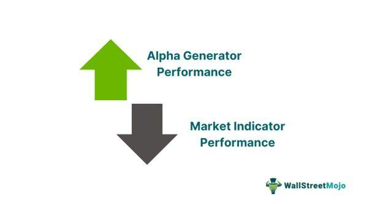

Alpha is a pivotal concept in investment strategies, representing the excess return that an investment generates relative to a benchmark index. It is a measure of an investment's performance on a risk-adjusted basis. A positive alpha indicates that a portfolio has outperformed its benchmark after adjusting for risk, while a negative alpha signifies underperformance. For investors, both institutional and individual, understanding and generating alpha is crucial because it directly correlates with the potential for maximizing portfolio returns.

Alpha generation can occur through various means, including international investments and algorithmic trading. International investments often seek alpha by taking advantage of growth opportunities in emerging markets and foreign equities, where market inefficiencies and economic developments may offer significant excess returns. Investors are increasingly looking beyond domestic borders to exploit these opportunities, thus diversifying their portfolios and potentially enhancing returns.



Algorithmic trading, on the other hand, leverages advanced technologies and quantitative analysis to identify and execute strategies that consistently aim to generate alpha. By utilizing large datasets and sophisticated models, algorithmic traders can exploit short-term market anomalies and inefficiencies with speed and precision. This approach allows for the discovery of alpha opportunities that may not be visible through traditional trading methods.

For institutional investors such as hedge funds, mutual funds, and pension funds, consistently achieving positive alpha is a principal objective, as it justifies the fees charged by active managers and supports the fund's overall performance. Similarly, individual investors seeking to outperform standard market returns must understand how to identify and implement alpha-generating strategies. Whether through active portfolio management or leveraging emerging technologies, the pursuit of alpha remains a central theme in investment management.

Ultimately, comprehending the significance of alpha in investment strategies is essential for making informed decisions that align with financial goals. As the financial markets continue to evolve, the quest for alpha will likely intensify, necessitating a deeper understanding of both traditional and innovative approaches to investment.

## Table of Contents

## What is an Alpha Generator?

An alpha generator is a critical component in portfolio management, aimed at providing returns that exceed a specific benchmark. The concept of alpha, represented by the Greek letter α in finance, measures the excess returns on an investment relative to the returns of a benchmark index, such as the S&P 500. Essentially, an alpha generator seeks to create these excess returns through various strategies or security selections.

Alpha generators are integral to active portfolio management strategies, where the manager's objective is to outperform the market, not merely replicate it, as is the case with passive management. The role of alpha generators in this context is to identify and exploit opportunities that are not fully priced into the market, thereby providing returns that exceed those of the benchmark.

There are several types of securities that can act as alpha generators. These include equities, bonds, derivatives, foreign exchange, and commodities. Each security type carries its own set of characteristics and risk profiles, which can be leveraged to generate alpha. Equities, for example, may present opportunities through stock [picking](/wiki/asset-class-picking), sector rotation, or market timing. Bonds can be used by capitalizing on [interest rate](/wiki/interest-rate-trading-strategies) movements or credit enhancements. Derivatives and foreign exchange markets offer leverage and risk-management capabilities that can enhance returns if managed skillfully.

The excess return produced by an alpha generator can be expressed mathematically. The general formula for alpha is:

$$
\alpha = R_i - (\beta \times R_m) - R_f
$$

where:
- $R_i$ is the portfolio return,
- $\beta$ is the beta of the portfolio (a measure of the sensitivity of the portfolio's returns to market returns),
- $R_m$ is the market return,
- $R_f$ is the risk-free rate of return.

In practical terms, generating alpha requires a profound understanding of market dynamics, detailed research, sophisticated modeling, and, often, an element of innovation. The application of quantitative models, data analysis, and even [algorithmic trading](/wiki/algorithmic-trading) plays a pivotal role in identifying and executing these alpha-generating strategies, leading to increased performance for both institutional and individual investors.

## Algorithmic Trading and Alpha Generation

Algorithmic trading plays a crucial role in identifying and executing strategies that generate alpha—excess returns above a benchmark. By leveraging complex algorithms and quantitative analysis, traders can systematically analyze vast datasets to uncover inefficiencies and opportunities in the market.

Quantitative analysis in trading involves the application of mathematical and statistical models to assess market patterns and forecast future price movements. Algorithmic trading systems are designed to rapidly process this data, making split-second decisions that would be impossible for a human trader. These algorithms can implement strategies based on various factors, including mean reversion, [momentum](/wiki/momentum), and [arbitrage](/wiki/arbitrage) opportunities.

One common algorithmic strategy is [statistical arbitrage](/wiki/statistical-arbitrage), which relies on the short-term mean reversion of a set of correlated securities. This strategy typically involves identifying pairs or groups of securities with historical price relationships. When these relationships deviate from the expected pattern, the algorithm triggers trades designed to exploit this divergence, thus generating alpha.

Another strategy frequently employed by hedge funds and institutional investors is [trend following](/wiki/trend-following). Algorithms designed for trend following identify and capitalize on persistent movement in asset prices. These algorithms are adept at recognizing upward or downward trends and executing trades that ride these trends for as long as they persist.

High-frequency trading ([HFT](/wiki/high-frequency-trading-strategies)) is also a significant part of the algorithmic trading landscape. HFT strategies make thousands of trades in fractions of a second, profiting from small price discrepancies. These strategies require substantial computational power and minimal network latency to capitalize on fleeting opportunities across multiple platforms and asset classes.

Machine learning and [artificial intelligence](/wiki/ai-artificial-intelligence) have further enhanced algorithmic trading, enabling systems to adapt to evolving market conditions. By incorporating [machine learning](/wiki/machine-learning) models, traders can design algorithms that learn from past trading data, improving prediction accuracy and refining trading strategies over time.

For instance, [reinforcement learning](/wiki/reinforcement-learning)—a machine learning paradigm where algorithms learn optimal behaviors through trial and error—can be applied in trading to develop strategies that dynamically adjust to changing market conditions. Python, a popular language for implementing algorithmic trading strategies, offers libraries such as scikit-learn and TensorFlow, which facilitate the creation of machine learning models.

Below is a simplified Python example illustrating a basic strategy using a moving average crossover, a common technique in trend following:

```python
import pandas as pd
import numpy as np

# Assuming 'data' is a DataFrame with a 'Close' column for price data
data = pd.DataFrame({'Close': [/* price data */]})

# Calculate moving averages
short_window = 40
long_window = 100
data['Short_MA'] = data['Close'].rolling(window=short_window).mean()
data['Long_MA'] = data['Close'].rolling(window=long_window).mean()

# Generate signals
data['Signal'] = 0
data['Signal'][short_window:] = np.where(data['Short_MA'][short_window:] > data['Long_MA'][short_window:], 1, 0)
data['Position'] = data['Signal'].diff()

# Output buy/sell signals
print(data[data['Position'] == 1])  # Buy signal
print(data[data['Position'] == -1]) # Sell signal
```

Algorithmic trading, with its ability to process extensive datasets and execute complex strategies swiftly, is invaluable in the pursuit of alpha. By leveraging quantitative analysis and advanced technologies, traders can navigate the competitive and volatile nature of financial markets more effectively.

## International Investments as Alpha Generators

International investments are increasingly recognized as powerful alpha generators, offering opportunities beyond domestic markets. Alpha refers to the measure of active return on an investment, representing the performance of a portfolio relative to a benchmark index. Investors seeking to enhance portfolio returns are often drawn to international markets, particularly emerging markets and foreign equities, as they can provide significant alpha through diverse and high-growth investment opportunities.

Emerging markets are characterized by economies that are transitioning from developing to developed status, presenting unique growth prospects due to rapid industrialization, urbanization, and demographic shifts. These markets typically experience faster economic growth than developed markets, providing fertile ground for investment opportunities. For example, countries like China, India, and Brazil have seen significant economic expansion and structural transformations, making them attractive destinations for investors seeking alpha.

However, international investments are accompanied by distinct risks, such as political instability, currency fluctuations, regulatory changes, and differing accounting standards. Political and economic events can heavily influence emerging markets, causing [volatility](/wiki/volatility-trading-strategies) that can affect investment returns. Additionally, currency risk arises when an investor's home currency strengthens against the currency of the investment location, potentially eroding returns when converted back to the home currency.

Despite the risks, the potential rewards of international investments can be substantial. Diversification is a key advantage, as investing in international equities can reduce overall portfolio risk by spreading investments across different geographies, industries, and currencies. This diversification can lead to enhanced risk-adjusted returns, with international equities often exhibiting low correlation with domestic markets.

Numerous case studies highlight successful international investment strategies. For instance, the adoption of a top-down investment approach focusing on macroeconomic indicators and country selection has proven effective in emerging markets. Investors may also implement bottom-up strategies that emphasize identifying undervalued companies with strong potential for growth within these markets. 

An example of successful international investment is the MSCI Emerging Markets Index, which captures the performance of large and mid-cap securities across 24 emerging market countries. The index has historically provided higher returns compared to developed market indices, underscoring the potential of emerging markets as alpha generators. Another example involves the strategic investment in sectors poised for growth, such as technology and consumer goods in India, which has led to significant returns due to increasing consumer demand and technological adoption.

In conclusion, while international investments, particularly in emerging markets, present substantial risks, the potential for alpha generation is compelling. By understanding and managing these risks, and employing both strategic and tactical approaches to international investing, investors can harness the growth potential inherent in global markets to achieve above-market returns.

## Strategies for Generating Alpha

Active and passive management represent two distinct approaches to generating alpha in investment portfolios. Active management seeks to outperform a benchmark index through strategic analysis and investment decisions. Active managers rely on advanced research and market insights to capitalize on perceived pricing inefficiencies. In contrast, passive management aims to replicate the performance of a benchmark index. These portfolios typically track indices like the S&P 500 and are not focused on generating alpha, generally appealing to investors prioritizing lower costs and reduced management fees. 

### Fundamental and Technical Analysis

Fundamental analysis is crucial in identifying alpha opportunities, examining a company’s financial health, management effectiveness, and competitive advantages. Key metrics include earnings, return on equity (ROE), and debt-to-equity ratio. Investors employ this analysis to estimate intrinsic values against market prices, identifying undervalued stocks to achieve excess returns.

Technical analysis complements this by evaluating historical price patterns and trading volumes. Analysts use chart patterns and indicators such as moving averages and relative strength indexes (RSI) to predict future price movements. This analysis is pivotal for timing buy and sell decisions in both equities and derivatives markets.

### Modern Portfolio Theory (MPT)

Modern Portfolio Theory, formulated by Harry Markowitz, provides a framework for constructing portfolios to maximize expected return based on a given level of market risk, emphasizing diversification. According to MPT, investment portfolios should aim to optimize the portfolio’s expected return based on a given risk tolerance. The theory employs the efficient frontier, a set of optimal portfolios offering the highest expected return for a given risk level. 

Mathematically, this can be expressed as:

$$
E(R_p) = \sum_{i=1}^{n} w_i E(R_i)
$$

Where:
- $E(R_p)$ is the expected return of the portfolio.
- $w_i$ is the proportion of the portfolio invested in asset $i$.
- $E(R_i)$ is the expected return of asset $i$.

Risk is minimized through covariance between asset returns. The portfolio’s variance or risk is computed as:

$$
\sigma_p^2 = \sum_{i=1}^{n} \sum_{j=1}^{n} w_i w_j \sigma_{ij}
$$

Where $\sigma_{ij}$ is the covariance between the returns of assets $i$ and $j$. MPT highlights the critical role of asset correlation in diversification, suggesting that an optimally diversified portfolio will incur risk mainly due to systemic factors, not individual asset performance.

By integrating fundamental and technical analysis into active portfolio management strategies, investors can improve their ability to generate alpha. MPT offers a path to optimize returns against a backdrop of inherent market risks, emphasizing careful diversification and strategic risk assessment as a foundation for achieving sustained portfolio growth and competitive alpha.

## Challenges in Alpha Generation

The pursuit of alpha, defined as the excess return on an investment relative to a benchmark index, is both challenging and rewarding for traders. Regulatory and technological obstacles often complicate alpha generation in today's fast-evolving financial markets.

### Regulatory and Technological Challenges

Regulatory frameworks can hinder efforts to generate alpha. Many countries have stringent regulations that govern trading activities, influencing how strategies are developed and executed. For instance, transaction reporting requirements, trading restrictions, and capital requirements can limit the flexibility required to exploit fleeting market inefficiencies. Regulations such as the Dodd-Frank Act in the United States or the Markets in Financial Instruments Directive II (MiFID II) in Europe aim to enhance transparency and reduce risk but can also constrain innovative trading strategies.

Technological advancements present both opportunities and challenges. Required investments in sophisticated technological infrastructure, such as high-frequency trading systems, can be costly and demand detailed technical expertise. Moreover, as markets become more efficient due to rapid information dissemination technologies, identifying and exploiting inefficiencies becomes increasingly difficult.

### Impact of Market Conditions and Investor Behavior

Market volatility and unpredictability pose significant challenges to alpha generation. In volatile markets, where prices fluctuate sharply in a short period, traditional models may fail to predict returns accurately, leading to decreased alpha. Meanwhile, in stable conditions, reduced market movements can also make it difficult to find profitable trading opportunities.

Investor behavior significantly impacts alpha-generating strategies. Behavioral biases, such as herding (when investors follow the prevailing market trends) and overreaction to news, can create anomalies as well as inefficiencies. Capturing these nuances requires adaptive strategies that swiftly adjust to shifts in market sentiment.

### Advanced Technologies in Alpha Strategies

New technologies, particularly artificial intelligence (AI) and machine learning, are transforming alpha generation. These technologies offer innovative ways to analyze vast data sets, identify patterns unobservable through traditional methods, and automate trading decisions. For instance, machine learning algorithms can analyze historical price movements and news trends to anticipate market shifts, offering a competitive edge.

Python has become increasingly popular for implementing AI-driven trading algorithms, thanks to its robust libraries such as NumPy, pandas, and scikit-learn. An example Python snippet for implementing a simple machine learning model might involve the following:

```python
import pandas as pd
from sklearn.ensemble import RandomForestClassifier
from sklearn.model_selection import train_test_split
from sklearn.metrics import classification_report

# Assume 'data.csv' contains historical financial data with features and target 'price_movement'
data = pd.read_csv('data.csv')
features = data.drop('price_movement', axis=1)
target = data['price_movement']

# Split into training and test sets
X_train, X_test, y_train, y_test = train_test_split(features, target, test_size=0.2, random_state=42)

# Create and train a Random Forest Classifier
model = RandomForestClassifier(n_estimators=100, random_state=42)
model.fit(X_train, y_train)

# Predict and evaluate
predictions = model.predict(X_test)
print(classification_report(y_test, predictions))
```

While AI and machine learning offer promise, they are also not infallible. Models require continuous updates and improvements to remain effective as market conditions evolve and new data become available. Hence, while advanced technologies have the potential to enhance alpha generation, they also present new layers of complexity and risk.

In conclusion, the dynamic interplay between regulatory environments, technological advances, market conditions, and investor behavior makes alpha generation a challenging yet exciting endeavor. The progressive incorporation of AI and machine learning invites new methodologies but requires traders to navigate an increasingly complex landscape while managing inherent risks.

## Real-Life Examples and Case Studies

### Real-Life Examples and Case Studies

In the analysis of historical market performance, generating alpha has consistently been a focal point for both institutional investors and hedge funds. Alpha represents the excess return on an investment relative to the return of a benchmark index, such as the S&P 500. This section highlights some notable examples where significant alpha has been generated using varied strategies.

**1. Case Study: ONE-SIGNAL Compared to S&P 500**

ONE-SIGNAL, a hypothetical algorithmic trading strategy, serves as an illustrative example. By utilizing advanced quantitative analysis and a sophisticated algorithmic framework, ONE-SIGNAL aims to identify inefficiencies within the market. When compared to the S&P 500, which is a widely recognized benchmark, ONE-SIGNAL demonstrated an ability to generate superior returns consistently.

The performance comparison over a specified period shows that ONE-SIGNAL achieved a higher cumulative return than the S&P 500. A linear regression of ONE-SIGNAL’s returns against the S&P 500's returns can elucidate how much of the strategy’s performance can be attributed to alpha. Mathematically, this can be expressed using the Capital Asset Pricing Model (CAPM) as:

$$
R_i = \alpha + \beta R_m + \epsilon
$$

where $R_i$ is the return of ONE-SIGNAL, $R_m$ is the market return, $\beta$ represents the beta of the strategy, $\alpha$ is the alpha indicating the strategy’s excess return, and $\epsilon$ is the residual error term.

Analysis from this model reveals that ONE-SIGNAL exhibits a statistically significant positive alpha, suggesting its effectiveness in delivering alpha beyond market returns.

**2. Additional Examples from Top-Performing Funds and Algorithms**

Several top-performing funds have consistently delivered alpha by leveraging advanced algorithmic trading techniques. Renaissance Technologies, with its Medallion Fund, remains a sterling example of alpha generation. The fund employs high-frequency trading strategies powered by mathematical and statistical models to exploit small market inefficiencies. Over decades, the Medallion Fund has outpaced the S&P 500 significantly, with annualized returns often exceeding 30%.

Additionally, quantitative hedge funds such as Two Sigma have utilized machine learning algorithms to analyze massive datasets, identifying complex patterns that humans can miss. Their strategies have allowed them to consistently outperform traditional benchmarks, underscoring the potential of algorithmic processes in alpha generation.

The pursuit of alpha remains a potent driver of innovation in the investment management industry. From the deployment of cutting-edge technologies to the refinement of traditional quantitative models, the landscape continues to evolve, offering new opportunities and challenges for those seeking to outperform the market.

## Conclusion

In summarizing the key points of this article, alpha generation remains a critical focus for investors aiming to outperform standard benchmarks. Through international investments, particularly in emerging markets and foreign equities, investors can access a wider array of opportunities that possess the potential for significant excess returns. These markets offer unique advantages and risks, each contributing to the overall alpha potential when carefully managed through diversified investment strategies. Algorithmic trading further enhances alpha generation by using quantitative analysis and advanced algorithms to identify and execute high-probability trades. These strategies allow investors to capitalize on market inefficiencies quickly and with precision, leveraging large data sets and computational power to outperform traditional methods.

Looking towards the future, the investment landscape is rapidly evolving, presenting both opportunities and challenges for those seeking alpha. As markets continue to globalize and technology advances, the methods for generating alpha are likely to become more sophisticated. Institutional and individual investors will need to adapt by integrating new tools and approaches, such as artificial intelligence and machine learning, to maintain their competitive edge. For Python developers interested in alpha strategies, libraries such as NumPy for numerical data manipulation and scikit-learn for machine learning can be incredibly useful.

However, these advancements also bring increased risk. The speed and complexity inherent in modern investment strategies necessitate careful risk management and a deep understanding of both the tools and the markets in order to avoid potential pitfalls. 

Ultimately, the balance between leveraging innovative techniques and maintaining sound risk management principles is crucial. Successful alpha generation will depend not only on the ability to harness new technologies and explore untapped international markets but also on maintaining a disciplined approach that carefully weighs the potential returns against the associated risks. As the investment world continues to shift, those who embrace change while steadfastly managing risk will be best positioned to achieve sustainable alpha.

## References & Further Reading

[1]: Bergstra, J., Bardenet, R., Bengio, Y., & Kégl, B. (2011). ["Algorithms for Hyper-Parameter Optimization."](https://dl.acm.org/doi/10.5555/2986459.2986743) Advances in Neural Information Processing Systems 24.

[2]: ["Advances in Financial Machine Learning"](https://www.amazon.com/Advances-Financial-Machine-Learning-Marcos/dp/1119482089) by Marcos Lopez de Prado

[3]: ["Evidence-Based Technical Analysis: Applying the Scientific Method and Statistical Inference to Trading Signals"](https://www.amazon.com/Evidence-Based-Technical-Analysis-Scientific-Statistical/dp/0470008741) by David Aronson

[4]: ["Machine Learning for Algorithmic Trading"](https://github.com/stefan-jansen/machine-learning-for-trading) by Stefan Jansen

[5]: ["Quantitative Trading: How to Build Your Own Algorithmic Trading Business"](https://github.com/LucindaYa/quant-resources/blob/master/Quantitative%20Trading%20How%20to%20Build%20Your%20Own%20Algorithmic%20Trading%20Business.pdf) by Ernest P. Chan