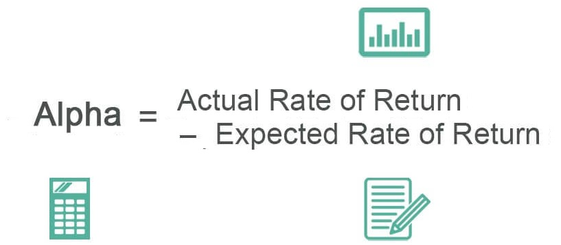

In recent years, the intersection of finance and technology has produced significant advancements in the domain of investment strategies. Central to these developments is the rise of algorithmic trading, where the use of sophisticated algorithms and machine learning models has revolutionized traditional trading strategies, enhancing their efficiency and profitability. Algorithmic trading leverages technology to perform high-speed transactions and analyze vast amounts of data, thus minimizing human error and emotional bias. This transformation is notably driven by alpha finance—a metric assessing an investment portfolio's performance relative to a market benchmark. A positive alpha indicates a portfolio's superior performance, while a negative alpha signifies underperformance. This measure is fundamental in evaluating the effectiveness of trading strategies and the competency of fund managers.

The focus on alpha finance necessitates a comprehensive understanding of how automated trading systems assimilate real-time market data to make informed trading decisions. Through predictive analytics and trend recognition, these systems strive to achieve optimal alpha, signifying a more favorable risk-adjusted trading outcome. The integration of machine learning enhances these algorithms, enabling them to identify patterns and forecast market movements with increased accuracy. This article will explore the concept of alpha in finance, highlight the pivotal role played by algorithmic trading, and assess the resultant impact on investment performance—as influenced by the innovative use of technology in financial markets.



## Table of Contents

## Understanding Alpha in Finance

Alpha is a significant metric in finance, representing the extent to which an investment portfolio exceeds a market benchmark's performance. It serves as a key indicator for evaluating the added value generated by the active management of a portfolio over its benchmark. A positive alpha suggests that a portfolio or investment strategy has outperformed the market, while a negative alpha indicates underperformance relative to the market benchmark.

In formulaic terms, alpha can be expressed as follows:

$$
\alpha = R_p - (R_f + \beta \times (R_m - R_f))
$$

Where:
- $R_p$ is the portfolio return.
- $R_f$ is the risk-free rate.
- $\beta$ is the measure of the portfolio's market risk exposure.
- $R_m$ is the market return.

Alpha is not only crucial for evaluating the skills and decision-making capabilities of fund managers but also serves as an essential metric for institutional investors. By optimizing their investment portfolios with a focus on achieving a high alpha, these investors aim to enhance returns and meet their financial objectives more effectively.

Additionally, alpha is frequently assessed alongside beta, another core concept in finance. While alpha focuses on performance relative to a benchmark, beta measures a portfolio's [volatility](/wiki/volatility-trading-strategies) or systematic risk in relation to the market. Together, alpha and beta provide a comprehensive understanding of an investment's performance and the associated risk, allowing for more informed investment decisions.

Given its importance, alpha remains a focal point in portfolio management and is extensively used to gauge the efficacy of various financial strategies.

## The Role of Algorithmic Trading

Algorithmic trading refers to the use of automated systems to execute trading strategies. These systems are designed to adhere to a specific set of rules, making them efficient in executing trades at high speeds. This efficiency is derived from the ability of algorithms to monitor market conditions, analyze historical data, and react to market signals within fractions of a second. By reducing the latency in trade executions, algorithmic systems capitalize on fleeting market opportunities that human traders might miss.

One of the major advantages of [algorithmic trading](/wiki/algorithmic-trading) is the reduction of emotional and psychological biases that can influence manual trading decisions. Emotions such as fear and greed are often mitigated as algorithms strictly follow predefined rules and logic. This objective approach can enhance consistency in trading outcomes, avoiding erratic decisions precipitated by market volatility.

Algorithms leverage a wide range of data inputs. This includes real-time market data, historical price series, and a myriad of economic indicators that provide insights into potential market movements. By analyzing these inputs, algorithms can identify patterns and trends, enabling informed decision-making. The predictive capabilities of these systems are further amplified by the integration of [machine learning](/wiki/machine-learning) models. Machine learning provides a framework for algorithms to learn from complex data sets, improving their accuracy in predicting price movements over time.

Machine learning models, such as neural networks and decision trees, are commonly employed to enhance trading algorithms. These models enable algorithms to process vast amounts of data, recognize non-linear patterns, and adapt to changing market conditions. A simple example of a machine learning model for stock price prediction could be a linear regression model:

```python
from sklearn.linear_model import LinearRegression
import numpy as np

# Example data: historical stock prices
price_data = np.array([[1, 200], [2, 210], [3, 215], [4, 230], [5, 240]])

# Features (days) and target (prices)
X = price_data[:, 0].reshape(-1, 1)
y = price_data[:, 1]

# Create and train the model
model = LinearRegression()
model.fit(X, y)

# Predict future price
future_day = np.array([[6]])
predicted_price = model.predict(future_day)
print(f"Predicted price for day 6: {predicted_price[0]}")
```

In this example, a linear regression model is trained using historical stock prices to predict future prices. This illustrates a foundational method used in algorithmic trading, where data-driven predictions form the basis for executing trading strategies.

In summary, through the integration of machine learning with algorithmic trading systems, traders are provided with predictive capabilities that surpass traditional analytical methods. The reliance on objective data analysis, speed, and precision enables these systems to continuously adapt to the dynamic conditions of financial markets, aiming to optimize trading performance and achieve superior returns.

## Investment Performance with Algo Trading

Algorithmic trading has revolutionized the evaluation of investment performance, primarily in its quest to generate alpha. One of the key aspects of assessing the performance of algorithmic trading strategies is the use of various performance metrics. The Sharpe Ratio, for instance, is widely utilized to understand the risk-adjusted return of an investment strategy. It is calculated as:

$$
\text{Sharpe Ratio} = \frac{E[R] - R_f}{\sigma_R}
$$

where $E[R]$ is the expected return of the portfolio, $R_f$ is the risk-free rate, and $\sigma_R$ is the standard deviation of the excess return. A higher Sharpe Ratio indicates better risk-adjusted performance.

Another critical measure is the Maximum Drawdown, which signifies the largest single drop in value, peak to trough, before a new peak is achieved. It provides insights into the potential risk and capital at risk for an algorithmic trading strategy.

Algorithmic trading strategies are designed to enhance returns while minimizing volatility, compared to traditional strategies. These strategies often benefit from the ability to process vast amounts of data quickly, making predictions and executing trades at speeds unattainable by human traders.

Backtesting is an essential component of evaluating these strategies. By using historical data, traders can simulate how a strategy might have performed in the past, ensuring that strategies are robust before they are deployed in live markets. This process allows for the refinement of algorithms to optimize performance and manage risk effectively.

In today's financial markets, institutional investors and hedge funds are increasingly relying on algorithmic trading to stay competitive, especially in volatile environments. The speed and precision offered by algorithmic systems enable these entities to exploit market inefficiencies and capitalize on fleeting opportunities that a human trader might miss.

Overall, the reliance on algorithmic trading has led to a shift in investment performance evaluation, with a greater focus on metrics that accurately reflect the complexities of modern financial markets.

## Pros and Cons of Algorithmic Trading

Algorithmic trading, often referred to as algo trading, leverages computer algorithms to make trading decisions. The efficiency and speed of algorithmic trading stem from its ability to execute thousands of orders in seconds, process large amounts of market data rapidly, and formulate strategies without human intervention. This ensures that traders can take advantage of even the most fleeting market opportunities.

One major advantage of algorithmic trading is the ability to backtest strategies using historical data. By simulating trades on past data, traders can evaluate the potential success and risks of their strategies before deploying them in live markets. This iterative process allows continuous improvement, as traders can tweak their algorithms based on backtest results to optimize performance.

However, algorithmic trading is not without its challenges. One significant risk is technical failure, which can result from software bugs, connectivity issues, or server outages. Such failures can lead to substantial financial losses if trades are executed incorrectly or not at all. Another downside is the propensity for overfitting models to historical data, wherein an algorithm performs well in backtests but poorly in real market conditions due to its overly tailored fit to the historical data.

The unpredictable and dynamic nature of financial markets further complicates algorithmic trading. Market conditions can change rapidly, rendering even well-designed algorithms less effective. As a result, regular strategy evaluation and adjustment are necessary. Additionally, the design and maintenance of these algorithms require substantial technical expertise. Continuous monitoring is essential to adapt to market changes and mitigate risks effectively.

In summary, while algorithmic trading offers notable advantages such as speed, efficiency, and robust data analysis capabilities, it is also accompanied by significant technical and market-related risks. Traders leveraging these systems must possess both the technical acumen to design and manage complex algorithms and the market insight to ensure these strategies remain relevant and effective.

## Conclusion

The integration of algorithmic trading into financial markets fundamentally alters how investment performance is assessed. Alpha finance, as a measure of an investment's performance against a benchmark, has become increasingly central, driving significant innovation in strategy development aimed at leveraging technology for enhanced returns. The ability of algorithmic systems to process vast amounts of data with high speed and precision offers undeniable benefits. These systems eliminate human emotional and psychological biases, enabling consistent execution of strategies and allowing for more informed, data-driven decision-making.

Despite these advantages, challenges persist, particularly with the risks of technical failures and the constant need for strategy adaptation to market dynamics. Overfitting, where models are excessively tailored to historical data at the expense of future accuracy, remains a significant concern. However, ongoing advancements in machine learning promise further efficiencies in trading algorithms. These advancements offer enhanced predictive capabilities and more sophisticated risk management strategies, potentially leading to higher alpha generation.

To maintain a competitive edge, traders and investors must stay current with technological progress. This involves not only understanding emerging tools and methods but also being prepared to integrate these advancements effectively into existing frameworks. By doing so, they can optimize their strategies and continue to achieve alpha in ever-evolving markets. This constant evolution underscores the dynamic interaction between technological innovation and strategic financial management, highlighting the essential role of algorithmic trading in modern finance.

## Call to Action

For traders and investors eager to explore algorithmic trading and alpha finance strategies, numerous resources are readily available to enhance understanding and proficiency. Engaging in interactive online courses can be an excellent starting point. Platforms like IG Academy offer comprehensive educational materials that cover a wide array of topics, including market analysis, trading strategies, and risk management. These courses are designed to build essential trading knowledge and technical skills, ensuring participants are well-equipped to navigate complex market environments.

Staying updated on financial events and advancements in trading technologies is crucial to refining strategies and maintaining a competitive advantage. Regularly reading financial news, subscribing to industry journals, and attending webinars can provide valuable insights into market dynamics and emerging trends. Such resources help traders make informed decisions and adapt to changes in economic indicators and market behavior effectively.

Connecting with trading communities and professional networks can significantly enhance one’s trading acumen. Platforms such as Reddit’s trading forums, LinkedIn groups dedicated to finance, and other social media channels allow traders to exchange ideas, discuss strategies, and learn from experienced practitioners. Participating in these communities can provide practical insights and foster collaboration, leading to better decision-making and improved trading performance.

Additionally, leveraging technologies such as Python for algorithmic trading can be beneficial. Python, with its rich set of libraries like NumPy, pandas, and scikit-learn, offers robust tools for developing trading algorithms. For example, a simple moving average crossover strategy can be implemented with Python to signal when to buy or sell assets. By practicing coding and automating strategies, traders can enhance their understanding of algorithmic trading and improve their ability to achieve alpha. The emphasis on continuous learning and adaptation is key in the ever-evolving landscape of financial markets.

## References & Further Reading

[1]: Bergstra, J., Bardenet, R., Bengio, Y., & Kégl, B. (2011). ["Algorithms for Hyper-Parameter Optimization."](https://proceedings.neurips.cc/paper/2011/file/86e8f7ab32cfd12577bc2619bc635690-Paper.pdf) Advances in Neural Information Processing Systems 24.

[2]: ["Advances in Financial Machine Learning"](https://www.amazon.com/Advances-Financial-Machine-Learning-Marcos/dp/1119482089) by Marcos Lopez de Prado

[3]: ["Evidence-Based Technical Analysis: Applying the Scientific Method and Statistical Inference to Trading Signals"](https://www.amazon.com/Evidence-Based-Technical-Analysis-Scientific-Statistical/dp/0470008741) by David Aronson

[4]: ["Machine Learning for Algorithmic Trading"](https://github.com/PacktPublishing/Machine-Learning-for-Algorithmic-Trading-Second-Edition) by Stefan Jansen

[5]: ["Quantitative Trading: How to Build Your Own Algorithmic Trading Business"](https://www.amazon.com/Quantitative-Trading-Build-Algorithmic-Business/dp/1119800064) by Ernest P. Chan