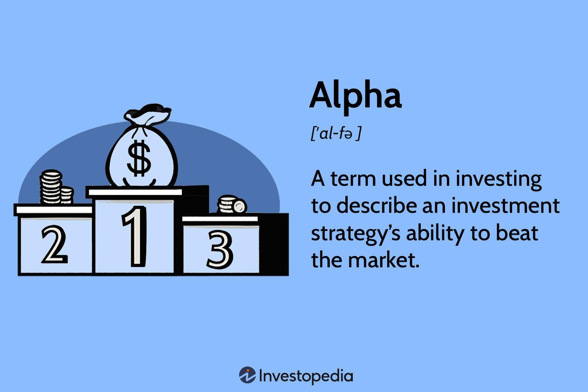

## Table of Contents

## What is alpha in the context of finance?

In finance, alpha is a measure of how well an investment does compared to what you would expect from the market. It shows if a stock or a portfolio is doing better or worse than a benchmark, like the S&P 500. If an investment has a positive alpha, it means it's doing better than the market. If it has a negative alpha, it's doing worse.

Alpha is important for investors because it helps them see if their investment choices are smart. For example, if you pick stocks and your portfolio has a positive alpha, it means your choices are beating the market. This can be because of good stock picking or smart timing. But remember, alpha doesn't tell the whole story. It's just one way to look at how well an investment is doing.

## How is alpha calculated?

Alpha is calculated by comparing the actual returns of an investment to the expected returns from a benchmark, like the S&P 500. To find alpha, you start with the investment's actual return and then subtract the return you would expect from the benchmark. The expected return from the benchmark is often called the "risk-free rate" plus the benchmark's return. The risk-free rate is usually the return on a safe investment like a U.S. Treasury bond. So, if your investment did better than what you expected from the benchmark, you have a positive alpha.

For example, let's say you invested in a stock and it returned 12% over a year. The S&P 500, your benchmark, returned 10% over the same time, and the risk-free rate was 2%. To find your alpha, you would take your stock's return of 12% and subtract the expected return from the benchmark, which is the risk-free rate of 2% plus the S&P 500's return of 10%. That gives you an expected return of 12% (2% + 10%). Since your stock's actual return was also 12%, your alpha would be 0% (12% - 12%). This means your stock performed exactly as expected, neither beating nor underperforming the market.

## What does a positive alpha indicate?

A positive alpha means that an investment is doing better than what you would expect from the market. If you pick a stock or make a portfolio and it has a positive alpha, it shows that your choices are beating the market. This can happen because you picked good stocks or because you bought and sold at the right times.

Having a positive alpha is great for investors because it shows that they are making smart choices. It's like getting a pat on the back for doing well. But remember, alpha is just one way to look at how well an investment is doing. It doesn't tell you everything, but it's a good sign that you're on the right track.

## Can you explain the difference between alpha and beta?

Alpha and beta are both important in finance, but they tell us different things about investments. Alpha measures how well an investment is doing compared to the market. If you have a positive alpha, it means your investment is doing better than what you would expect from the market. It's like a score that shows if you're making smart choices with your investments. For example, if you pick a stock and it does better than the market, you have a positive alpha.

Beta, on the other hand, tells us about the risk of an investment. It shows how much an investment moves up or down compared to the market. If a stock has a beta of 1, it moves exactly with the market. If it has a beta higher than 1, it moves more than the market, which means it's riskier. If it has a beta less than 1, it moves less than the market, which means it's less risky. So, beta helps you understand how wild or calm your investment might be.

In short, alpha is about how well you're doing compared to the market, and beta is about how risky your investment is. Both are useful, but they give you different pieces of information to help you make better choices with your money.

## How does alpha relate to a portfolio's performance?

Alpha is a way to see if a portfolio is doing better or worse than the market. It's like a score that shows how smart your investment choices are. If your portfolio has a positive alpha, it means it's doing better than what you would expect from the market. For example, if you pick some stocks and they do better than the market, your portfolio has a positive alpha. This is good because it shows you're making good choices with your investments.

But alpha is just one part of the story. It doesn't tell you everything about how well your portfolio is doing. It's important to look at other things too, like how risky your investments are. Still, alpha is a helpful tool because it gives you a quick way to see if your portfolio is beating the market. If you see a positive alpha, it's like getting a thumbs up for your investment decisions.

## What are common strategies to achieve alpha?

One common way to achieve alpha is by picking stocks that are likely to do better than the market. This means looking for companies that are growing fast, have good management, or are undervalued by other investors. For example, if you think a tech company is going to grow a lot in the next few years, you might buy its stock. If you're right and the company does well, your portfolio could have a positive alpha because it's beating the market.

Another strategy is called market timing. This is when you try to buy and sell investments at the right times to make more money. For example, if you think the market is going to go up, you might buy more stocks. If you think it's going to go down, you might sell some of your stocks. If you're good at guessing when to buy and sell, you can get a positive alpha because you're making more money than the market.

Some people also use active management to try to beat the market. This means hiring a professional to pick stocks and make investment decisions for you. The manager uses their skills and knowledge to find investments that will do better than the market. If they pick the right stocks and make smart choices, your portfolio can have a positive alpha. But remember, trying to achieve alpha can be risky, and it's not always easy to beat the market.

## How can alpha be used to evaluate fund managers?

Alpha is a useful tool for evaluating how well fund managers are doing their job. It tells you if the manager is making smart choices with the fund's money. If a fund has a positive alpha, it means the manager is picking investments that are doing better than the market. This is good because it shows the manager is adding value to the fund. For example, if a fund manager picks stocks that beat the market, the fund's alpha will be positive, and investors will be happy because their money is growing more than expected.

But alpha is just one part of the story. It's important to look at other things too, like how much risk the manager is taking. Sometimes a manager might get a positive alpha by taking big risks, which can be scary for investors. So, it's good to use alpha along with other measures to get a full picture of how well a fund manager is doing. If a manager keeps getting a positive alpha without taking too much risk, it's a sign they are doing a good job and making smart choices for the fund.

## What are the limitations of using alpha as a performance metric?

Alpha is a helpful way to see if an investment is doing better than the market, but it has some problems. One big problem is that alpha doesn't tell you about risk. An investment might have a high alpha because it's very risky, not because it's a smart choice. If you only look at alpha, you might think an investment is doing well when really it's just taking big chances. Another problem is that alpha can be hard to measure accurately. It depends on what benchmark you use and how you calculate the expected return. If you use the wrong benchmark or make a mistake in your calculations, your alpha might not be right.

Also, alpha looks at past performance, but it doesn't tell you about the future. Just because an investment had a positive alpha last year doesn't mean it will do well next year. Markets change, and what worked before might not work again. So, if you use alpha to pick investments, you might be making choices based on old information. It's important to remember these limitations and use other tools along with alpha to get a full picture of how well an investment is doing.

## How does alpha fit into the Capital Asset Pricing Model (CAPM)?

Alpha is a key part of the Capital Asset Pricing Model (CAPM), which is a way to figure out what kind of return you should expect from an investment. CAPM says that the return on an investment should be the risk-free rate, like what you get from a safe investment like a U.S. Treasury bond, plus a bit more based on how risky the investment is. The extra return you get for taking on risk is called the "risk premium," and it's based on the investment's beta, which shows how much it moves with the market. Alpha is what's left over after you take away the expected return from the actual return. If your investment does better than what CAPM says it should, you have a positive alpha.

In simple terms, alpha in CAPM helps you see if an investment is doing better or worse than expected. If an investment has a positive alpha, it means it's beating the market and doing better than what CAPM predicted. This can happen if the investment is doing really well or if the manager is making smart choices. But if an investment has a negative alpha, it's not doing as well as expected. Alpha is a helpful tool in CAPM because it gives you a quick way to see if your investments are beating the market, but remember, it's just one part of the story and you need to look at other things too.

## What role does alpha play in risk-adjusted performance measurement?

Alpha is important in measuring how well an investment is doing when you think about risk. It shows if an investment is doing better or worse than the market, after you take away the return you would expect just for taking on risk. If an investment has a positive alpha, it means it's doing better than what you would expect, even when you think about how risky it is. This is good because it shows that the investment is adding value and beating the market, not just because it's risky.

But alpha is just one way to look at risk-adjusted performance. It's helpful, but it doesn't tell you everything. You also need to look at other things, like how much risk the investment is taking. Sometimes an investment might have a high alpha because it's very risky, not because it's a smart choice. So, when you use alpha to see how well an investment is doing, it's important to use other tools too to get a full picture.

## How can statistical methods enhance the accuracy of alpha calculations?

Statistical methods can make alpha calculations more accurate by helping us use better data and smarter ways to figure things out. One way is by using regression analysis, which is a fancy way of saying we can look at a lot of data to find patterns. With regression, we can see how much an investment's return depends on the market's return. This helps us find a more exact expected return, which makes our alpha calculation more accurate. Another way is by using more data over a longer time. The more data we have, the better we can see if an investment is really doing better than the market, not just by chance.

Also, statistical methods can help us deal with things that might mess up our alpha calculations, like changes in the market or different risks. For example, we can use something called risk-adjusted performance measures, like the Sharpe ratio, to see if an investment is doing well because it's smart or just because it's risky. By using these methods, we can get a clearer picture of whether an investment's alpha is real or just a fluke. This helps investors make better choices and understand how well their investments are really doing.

## What advanced techniques are used by quantitative analysts to generate alpha?

Quantitative analysts, or "quants," use fancy math and computer programs to find ways to make money in the stock market. One way they do this is by using something called machine learning. This is when computers learn from a lot of data to find patterns that humans might miss. For example, a computer might look at a bunch of numbers about a company and figure out if it's going to do well or not. If the computer finds a good pattern, the quant can use it to pick stocks that might beat the market, which means they can get a positive alpha.

Another way quants try to generate alpha is by using high-frequency trading. This means they use computers to buy and sell stocks very quickly, sometimes in just a few seconds. The idea is to make a lot of small profits by being faster than other traders. They might use special math formulas to decide when to buy and sell, and they can make money even if the market isn't moving much. By doing this, they hope to get a positive alpha because they're making more money than the market.

Quants also use something called risk arbitrage. This is when they look for chances to make money from companies that are merging or being bought out. They might buy stock in one company and sell stock in another, hoping to make money from the difference in prices. If they do this well, they can get a positive alpha because they're making more money than what the market would give them. All these methods use math and computers to try to beat the market and get a positive alpha.

## What is Understanding Alpha in Finance?

Alpha is a significant metric in finance, representing the extent to which an investment portfolio exceeds a market benchmark's performance. It serves as a key indicator for evaluating the added value generated by the active management of a portfolio over its benchmark. A positive alpha suggests that a portfolio or investment strategy has outperformed the market, while a negative alpha indicates underperformance relative to the market benchmark.

In formulaic terms, alpha can be expressed as follows:

$$
\alpha = R_p - (R_f + \beta \times (R_m - R_f))
$$

Where:
- $R_p$ is the portfolio return.
- $R_f$ is the risk-free rate.
- $\beta$ is the measure of the portfolio's market risk exposure.
- $R_m$ is the market return.

Alpha is not only crucial for evaluating the skills and decision-making capabilities of fund managers but also serves as an essential metric for institutional investors. By optimizing their investment portfolios with a focus on achieving a high alpha, these investors aim to enhance returns and meet their financial objectives more effectively.

Additionally, alpha is frequently assessed alongside beta, another core concept in finance. While alpha focuses on performance relative to a benchmark, beta measures a portfolio's [volatility](/wiki/volatility-trading-strategies) or systematic risk in relation to the market. Together, alpha and beta provide a comprehensive understanding of an investment's performance and the associated risk, allowing for more informed investment decisions.

Given its importance, alpha remains a focal point in portfolio management and is extensively used to gauge the efficacy of various financial strategies.

## What is the investment performance with algo trading?

Algorithmic trading has revolutionized the evaluation of investment performance, primarily in its quest to generate alpha. One of the key aspects of assessing the performance of algorithmic trading strategies is the use of various performance metrics. The Sharpe Ratio, for instance, is widely utilized to understand the risk-adjusted return of an investment strategy. It is calculated as:

$$
\text{Sharpe Ratio} = \frac{E[R] - R_f}{\sigma_R}
$$

where $E[R]$ is the expected return of the portfolio, $R_f$ is the risk-free rate, and $\sigma_R$ is the standard deviation of the excess return. A higher Sharpe Ratio indicates better risk-adjusted performance.

Another critical measure is the Maximum Drawdown, which signifies the largest single drop in value, peak to trough, before a new peak is achieved. It provides insights into the potential risk and capital at risk for an algorithmic trading strategy.

Algorithmic trading strategies are designed to enhance returns while minimizing volatility, compared to traditional strategies. These strategies often benefit from the ability to process vast amounts of data quickly, making predictions and executing trades at speeds unattainable by human traders.

Backtesting is an essential component of evaluating these strategies. By using historical data, traders can simulate how a strategy might have performed in the past, ensuring that strategies are robust before they are deployed in live markets. This process allows for the refinement of algorithms to optimize performance and manage risk effectively.

In today's financial markets, institutional investors and hedge funds are increasingly relying on algorithmic trading to stay competitive, especially in volatile environments. The speed and precision offered by algorithmic systems enable these entities to exploit market inefficiencies and capitalize on fleeting opportunities that a human trader might miss.

Overall, the reliance on algorithmic trading has led to a shift in investment performance evaluation, with a greater focus on metrics that accurately reflect the complexities of modern financial markets.

## References & Further Reading

[1]: Bergstra, J., Bardenet, R., Bengio, Y., & Kégl, B. (2011). ["Algorithms for Hyper-Parameter Optimization."](https://proceedings.neurips.cc/paper/2011/file/86e8f7ab32cfd12577bc2619bc635690-Paper.pdf) Advances in Neural Information Processing Systems 24.

[2]: ["Advances in Financial Machine Learning"](https://www.amazon.com/Advances-Financial-Machine-Learning-Marcos/dp/1119482089) by Marcos Lopez de Prado

[3]: ["Evidence-Based Technical Analysis: Applying the Scientific Method and Statistical Inference to Trading Signals"](https://www.amazon.com/Evidence-Based-Technical-Analysis-Scientific-Statistical/dp/0470008741) by David Aronson

[4]: ["Machine Learning for Algorithmic Trading"](https://github.com/PacktPublishing/Machine-Learning-for-Algorithmic-Trading-Second-Edition) by Stefan Jansen

[5]: ["Quantitative Trading: How to Build Your Own Algorithmic Trading Business"](https://www.amazon.com/Quantitative-Trading-Build-Algorithmic-Business/dp/1119800064) by Ernest P. Chan