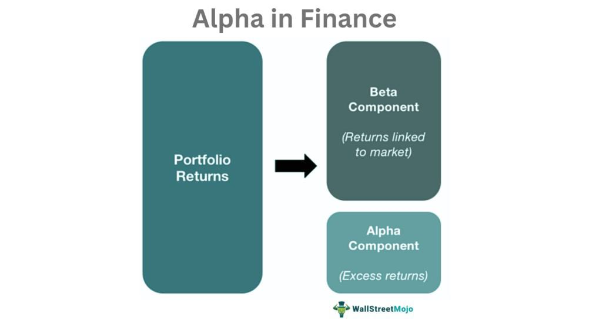

Alpha, in the context of investing, refers to the measure of an investment strategy's ability to beat the market, represented by a benchmark index, on a risk-adjusted basis. Positive alpha indicates that a strategy has succeeded in outperforming the market through skillful management rather than pure chance. This performance metric is crucial for investors looking to assess the added value provided by portfolio managers, enabling them to discern between genuine skill and market movements.

Algorithmic trading, on the other hand, is the use of computer programs to execute trades based on pre-defined sets of rules and conditions. This approach has gained considerable traction in modern financial markets due to its ability to process vast amounts of data quickly, reduce human error, and execute trades with precision. As financial markets have grown more complex and competitive, the significance of algorithmic trading has soared, allowing traders to optimize their strategies in real time.



The convergence of alpha and algorithmic trading presents new opportunities to achieve higher investment returns. By utilizing advanced quantitative techniques, algorithmic trading systems can identify market inefficiencies and potential trades that may lead to alpha generation. This integration allows investors to automate strategies that might outperform the market, such as exploiting arbitrage opportunities or employing trend-following methodologies.

This article explores these themes, outlining the ways in which algorithmic trading can be employed to generate alpha. It provides examples of algorithmic strategies that have successfully produced alpha, while discussing the challenges and considerations involved in maintaining these strategies in practice. It also examines the future prospects of algorithmic trading and alpha generation, highlighting emerging trends such as the incorporation of artificial intelligence and machine learning.

## Table of Contents

## Understanding Alpha in Investing

Alpha is a crucial performance metric in investing that measures the excess return of an investment relative to its benchmark index. It indicates how much a portfolio has outperformed or underperformed the market index, thereby providing insights into the portfolio manager's skill or the effectiveness of an investment strategy. Alpha is expressed as a percentage, and a positive Alpha indicates that the portfolio has outperformed the benchmark, while a negative Alpha signifies underperformance.

The relationship between Alpha and market benchmarks is essential to understanding its application in investment. Market benchmarks are standard indices, such as the S&P 500, against which the performance of a portfolio is compared. Alpha reveals the value added or lost from the manager’s active investment decisions as opposed to passive market movement. Thus, a higher Alpha is preferable as it demonstrates the manager's ability to achieve returns beyond those suggested by beta or market exposure.

Alpha is also a tool for assessing the skill of a portfolio manager or an investment strategy. By isolating the component of the return that is due to decisions specific to the portfolio—such as security selection and market timing—Alpha allows investors to assess managerial prowess. A portfolio with a high Alpha, controlled for risk, suggests that the manager has added significant value through active management techniques.

There are various types of Alpha metrics, with Jensen’s Alpha being one of the most recognized. Jensen's Alpha is based on the Capital Asset Pricing Model (CAPM) and is calculated using the following formula:

$$
\alpha = R_i - \left( R_f + \beta (R_m - R_f) \right)
$$

where:
- $R_i$ is the actual return of the portfolio.
- $R_f$ is the risk-free rate.
- $\beta$ is the portfolio's beta, indicating its sensitivity compared to the market.
- $R_m$ is the return of the market.

Jensen’s Alpha measures the return of a portfolio over and above what is predicted by its exposure to the broader market (beta), after adjusting for the risk-free rate. A positive Jensen's Alpha indicates that the portfolio has achieved a return exceeding what would typically be expected for its level of risk, showcasing exceptional management skill or an effective investment strategy. 

Through these metrics and benchmarks, investors can efficiently evaluate the effectiveness of portfolio managers and optimize their investment strategies, emphasizing the importance of Alpha in the investment decision-making process.

## Basics of Algorithmic Trading

Algorithmic trading refers to the use of computer programs and systems to execute financial trades based on pre-defined criteria and algorithms. This approach leverages complex algorithms to make trading decisions in fractions of a second, often across diverse asset classes. The automated nature of [algorithmic trading](/wiki/algorithmic-trading) allows traders to capitalize on market opportunities with a level of efficiency and precision that manual trading cannot match.

Key components of algorithmic trading systems include data collection, signal generation, strategy execution, and risk management. Data collection involves the assimilation of vast amounts of market data, which can include asset prices, trading volumes, and economic indicators. These data are processed to generate signals that inform trading decisions. The strategies must be executed with speed and reliability, which requires robust technological infrastructure.

The benefits of algorithmic trading are manifold. Speed is paramount, as algorithms can process information and execute trades much faster than a human trader, enabling the capture of fleeting market opportunities. Precision in execution reduces manual errors, thereby improving the reliability of trades. Algorithmic trading also allows for [backtesting](/wiki/backtesting) strategies with historical data, optimizing them before applying to live markets. 

Algorithms execute trades by following explicit instructions derived from market conditions and strategies. For example, a simple moving average crossover strategy might be designed to buy an asset when its short-term moving average exceeds the long-term moving average, and sell it when the opposite occurs. In Python, this could be expressed as:

```python
import pandas as pd

# Assume 'data' is a pandas DataFrame with columns ['Date', 'Price']
data['SMA_short'] = data['Price'].rolling(window=50).mean()
data['SMA_long'] = data['Price'].rolling(window=200).mean()

# Generate signals
data['Buy_Signal'] = (data['SMA_short'] > data['SMA_long']) & (data['SMA_short'].shift(1) <= data['SMA_long'].shift(1))
data['Sell_Signal'] = (data['SMA_short'] < data['SMA_long']) & (data['SMA_short'].shift(1) >= data['SMA_long'].shift(1))
```

In this example, the algorithm calculates short-term and long-term simple moving averages (SMA) on historical price data. Buy and sell signals are then generated based on the crossover points of these moving averages.

Overall, algorithmic trading relies heavily on the strategic use of technology to achieve precise, efficient, and consistent trading operations, often yielding a significant competitive edge in financial markets.

## Generating Alpha with Algorithmic Trading

Algorithmic trading, an innovative approach incorporating technology and finance, can be meticulously structured to target Alpha generation, a key metric in assessing investment performance. At its core, algorithmic trading leverages quantitative analysis and mathematical models to identify lucrative trading opportunities that can outperform the market. Quantitative analysis involves the use of statistical and mathematical models to analyze financial markets and securities. It helps to identify patterns and trends that may not be immediately apparent to human traders. 

Mathematical models are essential in this context, as they provide the backbone for executing trades based on pre-defined criteria derived from historical market data. These models assist in comprehensively analyzing large datasets to discern patterns or anomalies that could yield Alpha. For instance, a simple moving average (SMA) strategy, which might involve buying a security when its short-term SMA crosses above its long-term SMA, can identify price trends that provide an edge over the average market movements.

Python, widely regarded for its rich ecosystem of data analysis libraries, can be used to implement such models. For example, an SMA crossover strategy could be coded in Python as follows:

```python
import pandas as pd

def sma_strategy(prices, short_window, long_window):
    # Calculate the short-term and long-term simple moving averages
    short_sma = prices.rolling(window=short_window, min_periods=1).mean()
    long_sma = prices.rolling(window=long_window, min_periods=1).mean()

    # Identify buy signals
    signals = pd.DataFrame(index=prices.index)
    signals['buy'] = short_sma > long_sma

    return signals

# Example usage with daily prices data
prices = pd.Series([100, 102, 101, 105, 110, 107, 111, 115, 120])
signals = sma_strategy(prices, short_window=3, long_window=5)
print(signals)
```

Algorithmic trading strategies, skillfully designed, can capitalize on diverse market conditions to generate Alpha. Trend-following strategies, for example, aim to benefit from market [momentum](/wiki/momentum) by making trades based on predicted price movements derived from historical data. These strategies assume that securities trending in one direction will continue in that direction for a period, allowing traders to capture gains. 

On the other hand, [arbitrage](/wiki/arbitrage) strategies seek to exploit price discrepancies between similar assets across different markets or instruments. By identifying and executing trades on these inefficiencies, traders can lock in risk-free profits. Despite their low-risk nature, arbitrage opportunities are often fleeting and require rapid execution, making algorithmic trading an ideal approach.

For both trend-following and arbitrage strategies, the integration of algorithmic trading ensures precision and speed in execution, minimizes emotional bias, and enhances the scalability of the trading operations. As market dynamics evolve, the adaptability and efficiency of algorithmic trading remain pivotal in extracting Alpha from financial systems.

## Examples of Algorithmic Trading Strategies for Alpha

Algorithmic trading strategies designed to maximize Alpha employ various sophisticated techniques to exploit market inefficiencies and derive superior returns. These strategies are typically based on complex algorithms and quantitative models that analyze large datasets to identify profitable trading opportunities. Below are detailed examples of commonly employed strategies aimed at generating Alpha.

**1. Trend-Following Strategies:**

Trend-following strategies seek to capitalize on the momentum of a stock’s price trend—either upward or downward. These strategies depend on the assumption that prices exhibiting a certain direction are likely to continue in that direction for some time. Algorithms can be designed to identify such trends and implement buy or sell orders accordingly. A simple moving average crossover is a basic example, in which buy signals are generated when a short-term moving average crosses above a long-term moving average, while sell signals are initiated when the reverse occurs.

**2. Statistical Arbitrage:**

Statistical arbitrage strategies aim to exploit inefficiencies in pricing between related financial instruments. These strategies typically involve the use of mathematical models and statistical analysis to detect pairs of securities whose price movements are historically correlated but have diverged temporarily. The algorithm will go long on the undervalued security while shorting the overvalued one, profiting from the convergence of their prices. A well-known model applied here is the "pairs trading" strategy.

**3. Market Making:**

Market-making algorithms provide [liquidity](/wiki/liquidity-risk-premium) to the market by continuously quoting buy and sell prices in a given security, profiting from the bid-ask spread. These strategies require high-frequency trading capabilities and robust algorithms that can adjust quotes in real-time based on market conditions. Market makers earn Alpha by facilitating transactions and efficiently managing inventory risks.

**Case Studies and Real-World Applications:**

*AQR Capital Management* is a notable example of a firm leveraging algorithmic strategies for Alpha generation. They employ a broad array of systematic trading algorithms designed to exploit behavioral inefficiencies and market anomalies. Their diversified approach includes factors such as value, momentum, and carry, which are all quantitatively embedded in their trading models.

Another example includes *Renaissance Technologies*, whose Medallion Fund has achieved remarkable returns by deploying intricate algorithms that capture small inefficiencies across various asset classes. Renaissance's success is largely attributed to its significant investment in data analysis and modeling expertise, allowing it to keep its strategies proprietary and highly effective.

These examples illustrate the effectiveness of algorithmic strategies in generating Alpha when executed with precision and supported by rigorous quantitative research. As technologies and market dynamics evolve, these strategies need constant adaptation and refinement to maintain their edge in achieving superior investment returns.

## Challenges and Considerations

Algorithmic trading, while offering significant potential for generating Alpha, presents numerous challenges that market participants must navigate to maintain a competitive edge. Understanding these challenges, which include technology limitations, regulatory issues, and market risks, is essential for investors seeking to optimize their strategies.

### Technology Limitations

Algorithmic trading relies heavily on technology, from data collection and processing to the actual execution of trades. One primary concern is latency, the delay before a transfer of data begins following an instruction. High-frequency trading firms, for example, can execute trades in microseconds. Even a slight delay can mean the difference between profit and loss. This necessitates continuous investments in hardware upgrades and network improvements.

Moreover, the robustness of trading algorithms can be compromised by software bugs or incomplete market data, leading to significant financial losses. To mitigate these risks, firms must implement rigorous testing procedures, often utilizing simulated trading environments to optimize algorithm performance under various market conditions.

### Regulatory Challenges

Algorithmic trading operates within a complex regulatory framework that varies across jurisdictions. Regulators frequently update policies to ensure market fairness and transparency, addressing concerns like market manipulation and systemic risk. Traders must stay informed of these changes to remain compliant. Non-compliance can result in severe penalties and damage to reputations.

One way to address this is by integrating compliance checks into the algorithmic trading processes. This can include automatic alerts and checks that prevent trades in certain assets or markets if new regulations or restrictions apply.

### Market Risks

Market [volatility](/wiki/volatility-trading-strategies) poses inherent risks to algorithmic trading strategies. An algorithm that performs well in stable markets may falter during periods of high volatility. For example, during a market crash, the lack of human discretion could lead to automated trades that exacerbate losses.

Risk management strategies become crucial in such scenarios. Diversification of trading algorithms across various asset classes and market conditions can help reduce risk exposure. Additionally, implementing stop-loss orders and dynamic portfolio rebalancing are effective strategies to limit losses. 

Statistical methods such as backtesting can be used to anticipate potential risks. Backtesting involves applying trading strategies to historical market data to evaluate their performance. Here is a basic example using Python to backtest a simple moving average crossover strategy:

```python
import pandas as pd

# Sample market data
data = pd.read_csv('historical_data.csv')

# Calculating moving averages
data['SMA_50'] = data['Close'].rolling(window=50).mean()
data['SMA_200'] = data['Close'].rolling(window=200).mean()

# Signal generation
data['Signal'] = 0
data.loc[data['SMA_50'] > data['SMA_200'], 'Signal'] = 1       # Buy signal
data.loc[data['SMA_50'] < data['SMA_200'], 'Signal'] = -1      # Sell signal

# Performance evaluation
initial_capital = 10000
data['Portfolio_Value'] = initial_capital + (data['Signal'].diff() * data['Close']).cumsum()

print(data[['Close', 'SMA_50', 'SMA_200', 'Signal', 'Portfolio_Value']])
```

### Enhancing Algorithm Robustness

Algorithm robustness refers to the capacity of trading strategies to perform consistently across different market environments. Machine learning models, which adapt to new market data patterns, can be integrated to enhance robustness. These models require large datasets for training and must be regularly updated to account for changing market dynamics.

Furthermore, continuous monitoring is essential to identify and correct degradation in algorithm performance. Implementing a feedback loop where algorithms learn from past trades and adjust their parameters can help enhance their effectiveness.

In summary, while algorithmic trading offers avenues for achieving Alpha, it requires careful consideration of technological, regulatory, and market challenges. Proper risk management, continual technological upgrades, and compliance adherence are crucial to sustaining a competitive edge in the financial markets.

## The Future of Alpha and Algorithmic Trading

The intersection of Alpha and algorithmic trading continues to evolve as new technologies and methodologies emerge, reshaping the landscape of financial markets. Recent trends highlight the increasing integration of [artificial intelligence](/wiki/ai-artificial-intelligence) (AI) and [machine learning](/wiki/machine-learning) (ML) into algorithmic trading systems. These advanced technologies enhance the ability to process vast amounts of data, identify patterns, and predict market movements with greater accuracy. AI algorithms can learn from historical data and adapt to new information, thereby refining their trading strategies over time. This dynamic attribute significantly boosts the potential to generate Alpha by making more informed and timely decisions.

Machine learning models, such as neural networks and random forests, are increasingly being used to filter noise from valuable market signals. For instance, [reinforcement learning](/wiki/reinforcement-learning), a subset of machine learning, has shown promise in optimizing trading strategies by continuously learning from market feedback. By implementing ML techniques, traders are able to uncover complex, non-linear relationships within data sets, which traditional models might overlook. This results in a more robust identification of Alpha-generating opportunities.

The balance between active and passive management in pursuit of Alpha remains a critical discussion point in financial strategies. Historically, active management has sought to capitalize on inefficiencies in the market to generate Alpha. However, with the advent of algorithmic trading, this pursuit has become increasingly competitive, challenging the viability of traditional approaches. On the other hand, passive strategies, characterized by index tracking, offer lower costs and have gained popularity for their risk-adjusted returns. As algorithmic trading becomes more sophisticated, the distinctions between active and passive management blur, with quantitative strategies leading to hybrid approaches that optimize both styles.

Algorithmic trading's future will likely be shaped by regulatory considerations as well, as the ease of executing high-frequency trades raises concerns regarding market stability and fairness. As regulatory frameworks evolve, algorithm developers must ensure compliance while maintaining the pursuit of Alpha.

In conclusion, the future of Alpha and algorithmic trading is intertwined with technological advancement. The adoption of AI and ML represents a significant opportunity to enhance trading strategies and Alpha generation. However, as markets and technologies evolve, the strategies for balancing active and passive management will have to adapt accordingly, ensuring that investors can effectively navigate the complexities of modern financial markets.

## Conclusion

Algorithmic trading represents a significant innovation in the quest for Alpha, the measure of an investment strategy's ability to outperform a market benchmark. This method employs advanced mathematical models and quantitative analysis to identify and exploit trading opportunities, often with a level of precision and speed that is unattainable by human traders. The potential of algorithmic trading to revolutionize Alpha generation lies in its ability to process vast amounts of data rapidly and execute trades with minimal human intervention.

Algorithmic trading allows for the implementation of complex strategies such as trend-following and arbitrage, which can adapt quickly to market conditions. These strategies are designed to generate Alpha by capitalizing on inefficiencies in the market. Moreover, as technology evolves, the integration of artificial intelligence and machine learning holds promise for further enhancing the capabilities of algorithmic trading systems, offering even greater potential for achieving exceptional returns.

For both novice and seasoned investors, adopting algorithmic trading strategies offers a structured approach to engaging with financial markets. Novices can benefit from systematic strategies that mitigate emotional decision-making, while experienced investors can leverage these sophisticated tools to refine and enhance their existing strategies. However, it is crucial for investors to carefully consider the challenges associated with algorithmic trading, such as technological limitations, regulatory compliance, and potential market risks.

In conclusion, algorithmic trading stands poised to redefine the landscape of Alpha generation in investing. By harnessing the power of technology, investors can not only improve the efficiency of their trading activities but also unlock new opportunities for superior returns. As the financial ecosystem continues to evolve, algorithmic trading will likely play an increasingly pivotal role in shaping investment strategies and outcomes.

## References & Further Reading

[1]: Bergstra, J., Bardenet, R., Bengio, Y., & Kégl, B. (2011). ["Algorithms for Hyper-Parameter Optimization."](https://papers.nips.cc/paper/4443-algorithms-for-hyper-parameter-optimization) Advances in Neural Information Processing Systems 24.

[2]: ["Advances in Financial Machine Learning"](https://www.amazon.com/Advances-Financial-Machine-Learning-Marcos/dp/1119482089) by Marcos Lopez de Prado

[3]: ["Evidence-Based Technical Analysis: Applying the Scientific Method and Statistical Inference to Trading Signals"](https://www.amazon.com/Evidence-Based-Technical-Analysis-Scientific-Statistical/dp/0470008741) by David Aronson

[4]: ["Machine Learning for Algorithmic Trading"](https://github.com/stefan-jansen/machine-learning-for-trading) by Stefan Jansen

[5]: ["Quantitative Trading: How to Build Your Own Algorithmic Trading Business"](https://www.amazon.com/Quantitative-Trading-Build-Algorithmic-Business/dp/1119800064) by Ernest P. Chan