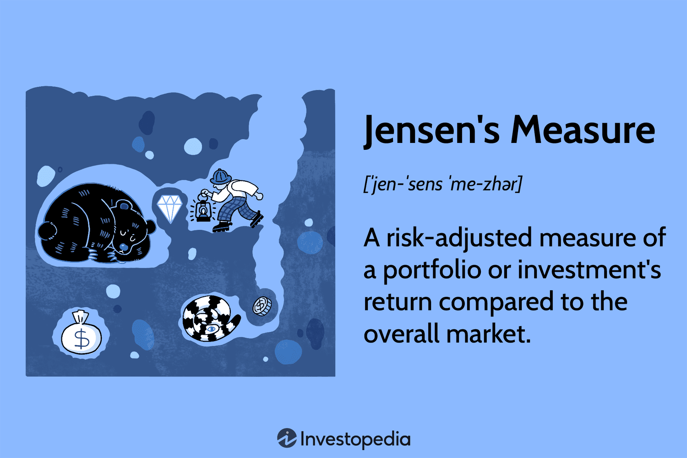

Hypothesis testing is a fundamental statistical tool utilized in a variety of applications, notably in finance and algorithmic trading. At its core, hypothesis testing is employed to make inferences about a population based on sample data, thus guiding decision-making processes. In the domain of algorithmic trading, hypothesis testing aids in evaluating trading strategies and market signals.

A critical concept within hypothesis testing is alpha risk, or Type I error. Alpha risk is defined as the probability of incorrectly rejecting a true null hypothesis, which can lead to erroneous conclusions. In trading, this could result in executing trades based on false assumptions about the market, known as false positives. For instance, identifying a pattern as significant when it is not can lead to unprofitable trades.



To mitigate the impact of alpha risk, traders must thoroughly understand and manage it. This involves carefully setting the significance level (usually denoted as $\alpha$), which is the threshold for determining whether a test statistic is extreme enough to reject the null hypothesis. Common values for $\alpha$ range from 0.01 to 0.10, with lower values indicating a lower tolerance for Type I errors.

Key concepts associated with hypothesis testing include the null hypothesis ($H_0$), which typically represents a statement of no effect or no difference, and the alternative hypothesis ($H_a$), which indicates the presence of an effect or difference. Additionally, the p-value is a measure that helps determine the strength of evidence against the null hypothesis. A smaller p-value indicates stronger evidence in favor of the alternative hypothesis.

By mastering hypothesis testing and managing alpha risk, traders can minimize false positives, ensuring more reliable and statistically sound trading strategies. This article will explore these concepts further, providing a comprehensive understanding of their application in algorithmic trading.

## Table of Contents

## Understanding Alpha Risk

Alpha risk, often referred to as Type I error, represents the probability of rejecting a true null hypothesis during hypothesis testing. In the domain of algorithmic trading, this translates to making trading decisions based on false positive signals. For example, a trading algorithm might incorrectly signal a profitable trade when there is none, leading to potential financial losses.

The size of the sample plays a crucial role in determining the magnitude of alpha risk. Generally, larger sample sizes result in lower alpha risk. This outcome is because larger datasets provide more reliable estimates of population parameters, reducing the likelihood of incorrectly identifying patterns that do not exist.

Mathematically, alpha risk is denoted by the alpha level ($\alpha$), which represents the threshold for significance in statistical tests. If a test results in a p-value less than $\alpha$, the null hypothesis is rejected. Typical alpha levels in hypothesis testing range from 0.01 to 0.05, with lower values indicating a more stringent criterion for rejection, thus reducing the chance of a Type I error. However, overly stringent alpha levels can increase the risk of a Type II error, where a false null hypothesis is incorrectly accepted.

Here's a simple Python illustration showcasing how alpha risk can be managed with larger sample sizes using a t-test:

```python
import numpy as np
from scipy import stats

# Simulated sample data for two trading strategies
np.random.seed(42)
strategy_a = np.random.normal(loc=0.1, scale=0.05, size=1000)  # Larger sample size
strategy_b = np.random.normal(loc=0.1, scale=0.05, size=100)   # Smaller sample size

# Perform t-test
t_stat, p_value = stats.ttest_ind(strategy_a, strategy_b)

alpha = 0.05

print(f"T-statistic: {t_stat}, P-value: {p_value}")

if p_value < alpha:
    print("Reject the null hypothesis: significant difference between strategies")
else:
    print("Fail to reject the null hypothesis: no significant difference between strategies")
```

In this example, increasing the sample size of strategy_a as compared to strategy_b enhances the precision of the statistical test, thereby providing a more reliable assessment of whether a significant difference exists.

Reducing alpha risk is vital for enhancing the robustness and reliability of trading strategies by minimizing the incidence of false trades. This can be achieved by using larger sample sizes, appropriately choosing the alpha level, and applying statistical corrections like the Bonferroni correction when multiple hypothesis tests are conducted. By managing alpha risk, traders can improve the accuracy of their statistical tests, ultimately leading to more trustworthy trading decisions.

## Hypothesis Testing in Trading

Hypothesis testing is a crucial aspect in the evaluation of trading strategies, allowing traders to make informed decisions based on statistical inferences drawn from sample data. The core of this process involves the formulation of two competing hypotheses: the null hypothesis ($H_0$) and the alternative hypothesis ($H_1$). The null hypothesis typically represents a baseline or default position, suggesting that there is no effect or no difference, while the alternative hypothesis suggests the presence of an effect or a difference.

In trading, these hypotheses often pertain to the effectiveness of a particular strategy or the existence of a market anomaly. For instance, a trader might hypothesize that a new trading algorithm generates profits over random chance. Here, the null hypothesis ($H_0$) would assert that the algorithm's performance is no better than random, and the alternative hypothesis ($H_1$) would suggest the opposite.

Selecting an appropriate significance level ($\alpha$) is vital as it indicates the threshold for rejecting the null hypothesis. This significance level represents the probability of committing a Type I error, where the null hypothesis is incorrectly rejected. In financial trading, significance levels typically range from 0.01 to 0.10. A lower significance level, such as 0.01, implies a stringent test, reducing the likelihood of false positives but increasing the chance of Type II errors ($\beta$), which occur when a false null hypothesis is not rejected. Conversely, a higher significance level increases the risk of Type I errors but lowers the risk of Type II errors.

Once the hypotheses and significance level are established, test [statistics](/wiki/bayesian-statistics) are calculated based on the data. These statistics help determine whether to reject the null hypothesis. Common test statistics in trading include t-tests for comparing means, and more advanced techniques may involve calculating p-values to gauge the evidence against the null hypothesis.

Python code can be useful in automating hypothesis test calculations. For example, using the `scipy` library, one can quickly perform a t-test to compare the mean returns of two different trading strategies:

```python
from scipy import stats

# Sample data: returns of two trading strategies
strategy_returns_1 = [0.05, 0.06, 0.04, 0.07]
strategy_returns_2 = [0.03, 0.01, 0.05, 0.02]

# Perform a t-test
t_stat, p_value = stats.ttest_ind(strategy_returns_1, strategy_returns_2)

print(f"T-statistic: {t_stat}, P-value: {p_value}")
```

In this example, the t-statistic and p-value provide a statistical basis for deciding whether the mean returns of the two strategies differ significantly at a given significance level. A p-value lower than the chosen alpha level suggests rejecting the null hypothesis, supporting that one strategy yields higher returns.

Thus, hypothesis testing in trading harnesses mathematical rigor to conclude trading strategies, ensuring that decisions are based on evidence rather than assumptions, thereby enhancing the strategy's reliability.

## Types of Hypothesis Tests Used in Trading

Various hypothesis tests play essential roles in evaluating trading strategies, each tailored to handle specific types of data and hypotheses.

**T-Tests**  
A t-test is commonly employed in trading to compare the means of two datasets. For example, it can be used to determine whether the average returns from two different trading strategies are significantly different. The t-test assumes that the data is normally distributed and that the samples have approximately equal variances. The formula for the t-test statistic is:

$$
t = \frac{\bar{X}_1 - \bar{X}_2}{\sqrt{\frac{s_1^2}{n_1} + \frac{s_2^2}{n_2}}}
$$

where $\bar{X}_1$ and $\bar{X}_2$ are the sample means, $s_1^2$ and $s_2^2$ are the sample variances, and $n_1$ and $n_2$ are the sample sizes.

**Chi-Square Tests**  
Chi-square tests are beneficial for assessing relationships between categorical variables. In trading, they can be used to examine the association between market sentiment and buying signals. The test evaluates whether the observed frequencies in each category differ from the expected frequencies. The chi-square statistic is computed as:

$$
\chi^2 = \sum \frac{(O_i - E_i)^2}{E_i}
$$

where $O_i$ is the observed frequency and $E_i$ is the expected frequency for category $i$.

**ANOVA (Analysis of Variance)**  
ANOVA is used to compare the means across multiple groups, beneficial for evaluating several trading strategies simultaneously. It assesses whether any of the group means are statistically significantly different from each other. Unlike t-tests, which only compare two groups, ANOVA can handle multiple groups without increasing the risk of Type I error. The F-statistic used in ANOVA is calculated as:

$$
F = \frac{\text{Between-group variability}}{\text{Within-group variability}}
$$

Python can be utilized to perform these tests efficiently using packages such as `scipy` for t-tests and chi-square tests, and `statsmodels` or `scipy` for ANOVA. Here's a simple example of applying a t-test using Python:

```python
from scipy import stats

# Sample data: returns from two trading strategies
returns_strategy1 = [0.05, 0.06, 0.07, 0.04, 0.08]
returns_strategy2 = [0.04, 0.05, 0.06, 0.07, 0.03]

# Perform a t-test
t_stat, p_value = stats.ttest_ind(returns_strategy1, returns_strategy2)

print(f"T-statistic: {t_stat}, P-value: {p_value}")
```

Understanding and selecting the appropriate hypothesis test is crucial for accurately interpreting statistical evidence in trading, ensuring that strategies are well-supported by data.

## Challenges and Considerations

Hypothesis testing holds significant promise for [algorithmic trading](/wiki/algorithmic-trading) strategies but is not without its challenges. Three primary considerations include overfitting, false positives, and data snooping.

Overfitting occurs when a trading model or strategy is too complex, making it fit very well to the sample data but poorly to new data. This is a common pitfall in algorithmic trading due to the large number of potential predictors and historical data available. Techniques like cross-validation, where the data is split into training and testing sets, help combat overfitting by providing a more realistic evaluation of a model's predictive ability. Using simpler models is another way to enhance robustness, ensuring that the model captures the signal rather than the noise within the data.

False positives, or Type I errors, can lead traders to identify patterns that do not actually exist. Setting conservative significance levels is one approach to minimizing this risk, as stricter criteria can reduce the likelihood of mistakenly rejecting a true null hypothesis. Another method involves applying corrections, such as the Bonferroni correction, especially in scenarios involving multiple hypothesis tests, which can otherwise inflate the overall Type I error rate.

Data snooping, the error of exhaustively searching data for patterns which may not have predictive power, also poses a risk. This often leads to strategies that perform well in-sample but fail out-of-sample. Utilizing out-of-sample testing, like withholding a portion of the data for final model evaluation, helps avoid this issue. Additionally, testing models on diverse datasets can improve generalizability and lessen the chances of overfitting to a specific dataset.

Overall, traders must remain vigilant about these challenges, adopting rigorous testing and validation methods to create reliable and effective trading strategies.

## Conclusion

Understanding and managing alpha risk in hypothesis testing is fundamental for effective algorithmic trading. Alpha risk, or the probability of a Type I error, can lead to false positives in trading strategies, resulting in misguided decisions that might jeopardize financial outcomes. To mitigate these risks, traders employ rigorous statistical testing protocols, ensuring a robust foundation upon which trading strategies are built.

By systematically applying statistical tests—such as t-tests, chi-square tests, and ANOVA—traders can make informed decisions that enhance the reliability and effectiveness of their strategies. This process involves setting appropriate significance levels, carefully considering data samples, and minimizing the chances of overfitting or misinterpretation of data. The selection of these tests allows traders to examine relationships and differences, providing a comprehensive assessment of trading hypotheses.

Integrating hypothesis testing in the strategic development process ensures that trading strategies are grounded in statistical evidence. This foundation reduces the dependency on anecdotal or speculative decision-making, shifting the focus to actionable insights derived from empirical data. Whether evaluating the impact of a newly identified market anomaly or assessing the comparative performance of diverse trading strategies, hypothesis testing serves as a critical tool for quantitative traders.

Ultimately, embracing hypothesis testing with a keen awareness of alpha risk empowers traders to refine their strategies continually. The disciplined application of statistical methods not only enhances strategy reliability but also mitigates the adverse effects of random chance, driving better-aligned investment outcomes over the long term.

## References & Further Reading

Refer to authoritative texts on statistical methods and trading strategies for advanced understanding and applications. Books such as "The Elements of Statistical Learning" by Trevor Hastie, Robert Tibshirani, and Jerome Friedman, provide foundational insights into statistical learning methods that are crucial for developing trading algorithms. Another key resource, "Applied Econometrics" by Dimitrios Asteriou and Stephen G. Hall, details the quantitative techniques used in economic data analysis and can be instrumental in understanding market dynamics.

Further reading may include resources on financial [machine learning](/wiki/machine-learning) and evidence-based technical analysis. "Advances in Financial Machine Learning" by Marcos López de Prado addresses contemporary methods in machine learning tailored for trading, providing algorithms and techniques that enhance decision-making. Additionally, "Evidence-Based Technical Analysis" by David Aronson presents a framework for developing systematic, statistical analysis for trading strategies. This text is valuable for those seeking to utilize evidence-based approaches rather than relying on anecdotal or traditionally heuristic methods.

Web resources such as research papers available on platforms like arXiv and SSRN could also provide cutting-edge insights and empirical studies related to algorithmic trading and hypothesis testing applications. These platforms host a plethora of studies covering recent advancements and methodologies which can be beneficial for both academic study and practical application in trading strategies.