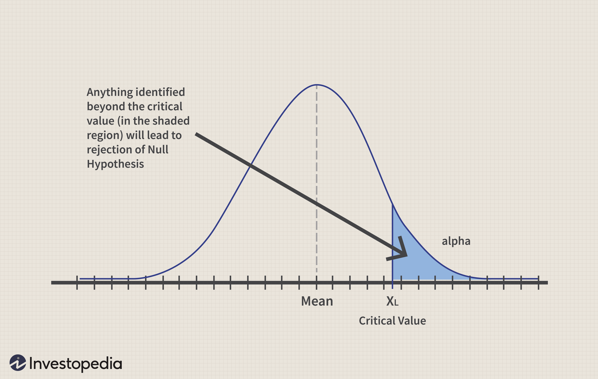

Algorithmic trading has revolutionized financial markets by employing computer algorithms to perform trading orders at optimal speeds and frequencies. Data-driven insights are the cornerstone of this innovation, enabling traders to analyze vast amounts of information swiftly and accurately. A crucial element in developing effective trading strategies is the process known as alpha testing. Alpha testing serves as a pre-deployment stage that evaluates the potential success of a trading strategy using historical data, establishes its robustness, and ensures its viability under different market conditions.

This article underscores the significance of alpha testing within algorithmic trading, highlighting the role of FactSet's Alpha Testing platform in streamlining and enhancing this phase. FactSet emerges as a pivotal tool in aiding traders to refine their strategies with substantial data resources and sophisticated analytical capabilities. Through FactSet, traders can perform thorough backtesting and stress testing of their models, improve decision-making accuracy, and ultimately, enhance their trading performance with data-backed strategies.

The following sections will explore the intricacies of alpha testing and the substantial benefits offered by utilizing FactSet's platform. By gaining a clear understanding of these concepts, traders can leverage these insights to make more informed trading decisions. A comprehensive grasp of alpha testing in algorithmic trading lays the groundwork for a more reliable and efficient trading ecosystem, offering traders a competitive edge in today’s dynamic financial landscape.

## Table of Contents

## Understanding Alpha Testing in Algorithmic Trading

Alpha testing in [algorithmic trading](/wiki/algorithmic-trading) represents a crucial pre-deployment evaluation phase where trading strategies undergo thorough assessment using historical data sets. The objective of this phase is to estimate how these strategies might perform in future market scenarios and ensure that only viable and potentially profitable strategies progress to real-market deployment.

The primary goal of alpha testing is to identify any potential flaws or inefficiencies in trading models early in the development process. By evaluating strategies against historical data, traders can discern patterns and relationships that may not be immediately apparent. This predictive analysis enables traders to make informed decisions about the robustness and viability of their strategies, effectively filtering out suboptimal models.

In the context of algorithmic trading, successful alpha testing is synonymous with enhanced risk management and increased investment returns. By utilizing historical data to evaluate a strategy’s potential performance, traders can better understand the risks associated with specific strategies under varying market conditions. Such testing helps answer critical questions such as, “How does a strategy perform when confronted with different market environments?” and “What are the potential risks that could impact its performance?”

The process of alpha testing generally involves [backtesting](/wiki/backtesting) strategies by applying them to historical data to study the outcomes. Backtesting serves as a simulation tool to project how a strategy might perform by replicating its operation over historical market data. The results are analyzed to refine and calibrate the models, enhancing accuracy and performance. This stage is significant in narrowing down strategies that not only meet the theoretical profitability criteria but also show resilience and robustness across diverse market situations.

Overall, alpha testing provides a structured framework that mitigates risks and uncovers the true potential of trading strategies before they are deployed in live markets. This ensures that the strategies employed are not only grounded on historical evidence but also poised to adapt to the dynamic nature of financial markets.

## FactSet's Alpha Testing Platform

FactSet provides an alpha testing platform tailored for the diverse requirements of quantitative traders. This platform supports the backtesting and visualization of [factor](/wiki/factor-investing) performance by utilizing extensive historical data and customizable scenarios. FactSet's data concordance plays a crucial role in ensuring seamless integration of both proprietary and third-party data, contributing to precise historical backtesting. This seamless integration is essential for building and testing robust trading models that reflect accurate historical behavior.

The platform offers quantitative researchers the ability to employ various statistical measures or even construct custom reporting columns to conduct in-depth analyses of factor behavior. This flexibility allows traders to dissect performance metrics thoroughly, ensuring that they can tailor their evaluations according to specific research needs and strategies.

Moreover, FactSet introduces the Quant Scheduler, a feature that automates the scheduling of reports and ensures regular data updates. This functionality is vital for maintaining continuous analysis efforts without interruptions. By automating the scheduling process, quantitative analysts can focus more on strategy development and less on administrative tasks. The combination of these capabilities makes FactSet's alpha testing platform an effective tool for enhancing the efficiency and accuracy of trading strategy evaluations.

## How FactSet Enhances Trading Strategies

FactSet enhances trading strategies by offering a flexible testing environment that allows traders to uncover new performance drivers critical to their success. The platform integrates robust data from various sources, granting users unparalleled insights into both historical and current market trends. This comprehensive data integration is pivotal for traders seeking to develop and refine their strategies with precision.

Traders can experiment with factor strategies within FactSet’s secure and intuitive interface. This feature minimizes operational complexities, enabling users to focus on strategy refinement without worrying about potential disruptions. By providing tools for visualizing [statistics](/wiki/bayesian-statistics) and correlations, FactSet aids in making informed decisions while minimizing risks. Such visualization capabilities allow traders to clearly see relationships between different market variables, leading to strategic adjustments that enhance performance.

To keep traders informed with up-to-date information, FactSet continuously offers data updates. This ensures that all decision-making is grounded in the most current market information, reducing the likelihood of basing strategies on outdated or incomplete data. Consistent data updates are crucial for maintaining the accuracy and relevance of trading models in rapidly changing market conditions.

The combination of robust data integration, a user-friendly testing environment, and ongoing data updates positions FactSet as a valuable tool for traders looking to refine their strategies and optimize their performance. By facilitating the discovery of new performance drivers and ensuring data-driven decision-making, FactSet provides the tools necessary for traders to gain a competitive edge in the market.

## Benefits of Alpha Testing with FactSet

FactSet's Alpha Testing platform provides several key benefits that enhance the process of refining algorithmic trading strategies. 

### Enhanced Decision Accuracy
Central to FactSet's platform is its rich data environment, which significantly boosts the precision of trading models. By offering access to a wide array of high-quality data, traders can implement more accurate predictions and model assessments. This increased accuracy is crucial for adjusting strategies to align with historical trends and current market dynamics. Leveraging this data environment, algorithms can be trained to adapt to nuanced market behaviors, thereby enhancing their predictive capabilities.

### Time Efficiency
FactSet’s platform is tailored to optimize time management through its advanced scheduling utilities. The Scheduling utility permits ongoing research continuity, facilitating parallel processing of reports in the background. This allows traders and analysts to allocate their resources more effectively, reducing downtime and ensuring that insights are available when needed. Asynchronous data processing ensures that the analytical workflow is streamlined without interruptions, which can be critical for making time-sensitive trading decisions.

### Customization Flexibility
The ability to customize reports is another significant feature of FactSet's Alpha Testing platform. Users can design reports to cater to specific analytical requirements, modifying parameters and metrics to focus on areas of interest. This feature adds crucial value to analysis by allowing traders to hone in on particular market movements or factor behaviors, ensuring that strategies are tailored accurately to the unique contours of their trading objectives.

### Comprehensive Historical Data
FactSet provides traders with access to deep datasets, which offer a broad view of market history. Comprehensive historical data are essential for identifying long-term trends and anomalies, thus informing the development of robust trading strategies. By understanding past market behaviors and outcomes, traders can anticipate possible future scenarios and incorporate this insight into their strategy development process. Longitudinal datasets also allow for a more rigorous backtesting process, ensuring that developed strategies are resilient across different market conditions.

### Improved Innovation Capacity
The platform aids the discovery and testing of new strategies by offering an environment conducive to innovation. Traders are encouraged to experiment with various strategies to uncover new performance opportunities, thanks to the seamless integration of data and analytical tools. The interactive features support exploratory analysis, leading to the identification of previously unconsidered trading opportunities. This innovation-centric design fosters a culture of continuous improvement and adaptation, which can be pivotal in the constantly evolving landscape of financial markets.

By integrating these features, FactSet's Alpha Testing platform not only supports but also enhances the process of crafting effective algorithmic trading strategies, thus empowering traders with the tools needed to maintain a competitive edge.

## Conclusion

Alpha testing in algorithmic trading plays a pivotal role in validating trading strategies, ensuring they are both effective and profitable before full-scale deployment. FactSet's Alpha Testing platform stands out as a dynamic tool, offering traders a robust framework to enhance their strategies. By utilizing FactSet, traders gain access to comprehensive data insights and advanced analytical resources, which are essential for developing and refining trading models.

In a rapidly evolving algorithmic trading environment, harnessing technological advancements such as those offered by FactSet provides a significant edge. The platform's capacity to process extensive datasets and deliver precise analytics helps traders maintain a competitive stance in the market. Moreover, FactSet's user-friendly design allows traders to seamlessly integrate its capabilities into their existing workflows, thus optimizing decision-making processes.

Traders aspiring to improve their trading strategies might find FactSet’s alpha testing platform to be a strategic ally in achieving data-driven success. The ability to test and validate strategies with precision not only mitigates risk but also paves the path for uncovering new trading opportunities. Embracing such a powerful platform could be instrumental for traders seeking to excel in an increasingly data-centric industry.

## References & Further Reading

[1]: ["Advances in Financial Machine Learning"](https://www.amazon.com/Advances-Financial-Machine-Learning-Marcos/dp/1119482089) by Marcos Lopez de Prado

[2]: ["Evidence-Based Technical Analysis: Applying the Scientific Method and Statistical Inference to Trading Signals"](https://www.amazon.com/Evidence-Based-Technical-Analysis-Scientific-Statistical/dp/0470008741) by David Aronson

[3]: ["Machine Learning for Algorithmic Trading"](https://github.com/PacktPublishing/Machine-Learning-for-Algorithmic-Trading-Second-Edition) by Stefan Jansen

[4]: ["Quantitative Trading: How to Build Your Own Algorithmic Trading Business"](https://www.amazon.com/Quantitative-Trading-Build-Algorithmic-Business/dp/1119800064) by Ernest P. Chan

[5]: Almgren, R., Thum, C., Hauptmann, E., & Li, H. (2005). ["Direct Estimation of Equity Market Impact."](https://www.cis.upenn.edu/~mkearns/finread/costestim.pdf) Risk. 

[6]: Strongin, S., Petschmann, A., & Sharenow, G. (2000). ["Beating Benchmarks."](https://www.pm-research.com/content/iijpormgmt/26/4/11) Goldman Sachs Asset Management.