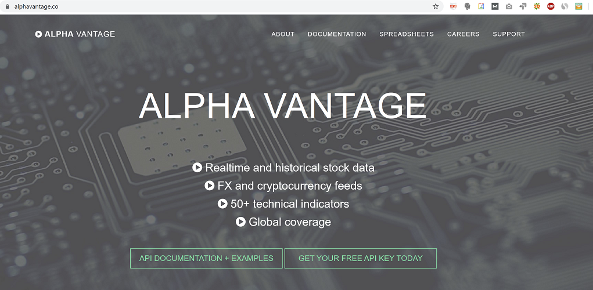

In the fast-paced world of algorithmic trading, having access to reliable and comprehensive financial data is crucial for making informed trading decisions. The rapid evolution of trading technologies demands platforms that provide not just sheer volumes of data but also actionable insights. Alpha Vantage has emerged as a popular choice among developers and traders seeking an efficient platform to derive such insights. With its user-friendly interface and robust API offerings, Alpha Vantage caters to a diverse range of financial market participants, from individual traders to institutional investors.

This article aims to explore the role of Alpha Vantage in algorithmic trading and how it can enhance trading strategies. Traders and developers can leverage Alpha Vantage to gain an edge in accessing real-time and historical financial data. By providing a plethora of tools and data points, Alpha Vantage enables users to refine their algorithmic models and improve trading outcomes.



Alpha Vantage stands out due to its comprehensive features and support for various asset classes including stocks, forex, and cryptocurrencies. It also offers an extensive collection of technical indicators, which are crucial for developing sophisticated trading strategies. The platform's affordability compared to other financial data providers makes it accessible to both novice and seasoned traders.

In the subsequent sections, we will explore the features, advantages, and practical applications of Alpha Vantage, enabling traders to make well-informed decisions about integrating this data service into their strategies. Whether you're a seasoned trader or a beginner stepping into the algorithmic trading space, understanding the capabilities and offerings of Alpha Vantage can be a game-changer in navigating complex financial markets.

## Table of Contents

## What is Alpha Vantage?

Alpha Vantage is a prominent data service provider that offers both free and premium application programming interfaces (APIs) for accessing financial market data. Originally founded with the mission of democratizing access to financial data, Alpha Vantage supports a wide range of asset classes, making it a versatile resource for traders and developers alike. 

The platform provides a comprehensive suite of APIs that deliver real-time and historical data on various financial instruments, including stocks, foreign exchange (forex), and cryptocurrencies. Additionally, Alpha Vantage offers technical indicators that are essential for crafting algorithmic trading strategies. Its services are lauded for their ease of integration, making them an attractive option for developers interested in building sophisticated trading algorithms or applications.

One of the standout features of Alpha Vantage is its affordability. Compared to other data providers, it offers a more budget-friendly pricing structure while ensuring extensive coverage of financial data. The balance between cost and comprehensiveness positions Alpha Vantage as a go-to option for both individual traders and institutions. Furthermore, its APIs are designed with user-friendliness in mind, supporting multiple programming languages such as Python, Java, and C#, which enhances accessibility for a broad array of users.

In summary, Alpha Vantage is recognized for its mission to make financial data more accessible, its diverse data offerings, and its user-friendly, cost-effective API solutions. These qualities collectively make it a valuable asset for those engaged in [algorithmic trading](/wiki/algorithmic-trading).

## Key Features of Alpha Vantage

Alpha Vantage provides a broad array of features that make it an attractive choice for algorithmic traders seeking efficient and effective data solutions. One of its primary strengths is the comprehensive range of financial data available. Alpha Vantage offers time series data that includes intraday, daily, weekly, and monthly data spans. This allows traders to analyze trends and adjust their strategies based on high-resolution market movements. Additionally, the platform supports extensive fundamental data covering key financial metrics and performance indicators, empowering traders to conduct thorough [fundamental analysis](/wiki/fundamental-analysis).

Another standout feature of Alpha Vantage is its extensive library of technical indicators. These indicators are crucial for strategy development as they provide insights into market [momentum](/wiki/momentum), trends, [volume](/wiki/volume-trading-strategy), and [volatility](/wiki/volatility-trading-strategies). For instance, traders can utilize common indicators like the Moving Average Convergence Divergence (MACD), Relative Strength Index (RSI), and Bollinger Bands to detect potential buy or sell signals. These tools enable the creation of robust strategies tailored to specific market conditions.

The ease of use of Alpha Vantage's API is a crucial component in its appeal. The API is designed with simplicity and accessibility in mind, making it particularly user-friendly for developers regardless of their experience level. It supports multiple programming languages including Python, Java, and C#, making it versatile and easy to integrate into existing systems. For example, Python code to fetch stock data might look like the following:

```python
import requests

url = 'https://www.alphavantage.co/query'
params = {
    'function': 'TIME_SERIES_DAILY_ADJUSTED',
    'symbol': 'AAPL',
    'apikey': 'your_api_key'
}
response = requests.get(url, params=params)
data = response.json()
print(data)
```

This multi-language support aligns well with diverse technological stacks used by trading firms and individual developers, facilitating smooth implementation of algorithmic trading strategies.

Moreover, Alpha Vantage's coverage of global markets significantly enhances its utility for traders seeking to develop diversified trading strategies. The platform provides access to data from various major exchanges worldwide, allowing traders to assess opportunities in different geographical markets. This global reach is essential for those looking to hedge risks or capitalize on international market movements, providing a more holistic view of the financial landscape.

These features collectively position Alpha Vantage as a powerful tool for algo traders, delivering a combination of comprehensive data, strategic insights through technical indicators, user-friendly API, and extensive market coverage. Such capabilities are integral for developing competitive trading strategies and achieving trading success.

## Advantages of Using Alpha Vantage in Algo Trading

Alpha Vantage offers a friendly API pricing structure that is appealing to both individual traders and institutions. The platform provides a free tier for users to access basic financial data, making it accessible to beginners and small traders. For those requiring more extensive data access, premium plans are available at a relatively low cost compared to other data providers. This competitive pricing allows a wide range of users to incorporate financial data into their algorithmic trading strategies without incurring significant expenses.

The platform is known for its reliability and consistency, critical aspects when performing [backtesting](/wiki/backtesting) and live trading. Alpha Vantage ensures regular data updates and maintains high uptime, minimizing interruptions during trading operations. Reliable data feeds are essential for generating accurate trading signals, as any discrepancies can lead to suboptimal trading decisions. By offering consistent and dependable data, Alpha Vantage enables traders to conduct thorough backtests, enhancing the robustness of their trading algorithms.

Compatibility with numerous programming languages and trading platforms is another significant advantage of Alpha Vantage. The API supports popular programming languages such as Python, Java, and C#, allowing developers to seamlessly integrate financial data into their preferred frameworks. This flexibility facilitates rapid strategy development and execution, as traders can use their existing infrastructure without the need for extensive modifications.

Rapid response time is crucial for executing time-sensitive trading strategies, where even minor delays can impact profitability. Alpha Vantage's API is optimized for low latency, providing swift access to real-time data crucial for strategies like high-frequency trading. By ensuring quick data retrieval, traders can position themselves advantageously in the market, capitalizing on fleeting opportunities.

Community support and extensive documentation further enhance the usability of Alpha Vantage's services. The platform provides comprehensive guides and examples, assisting users in effectively implementing the API. Additionally, an active community of developers and traders offers support, sharing insights and solutions to common challenges. This collaborative environment contributes to faster problem resolution and continuous learning, crucial for maintaining a competitive edge in algorithmic trading.

## Practical Applications in Algorithmic Trading

Alpha Vantage provides a versatile API that is instrumental in developing a wide array of algorithmic trading strategies. One practical application is the implementation of simple moving average (SMA) crossover strategies. A SMA crossover occurs when a short-term moving average, such as a 50-day SMA, crosses over a long-term moving average, such as a 200-day SMA. This event often signals a potential trend reversal, which traders can exploit for buy or sell decisions. Using the Alpha Vantage API, traders can access the required historical stock data and compute moving averages efficiently. The following Python code illustrates the computation of SMA crossovers:

```python
import requests
import pandas as pd

api_key = 'YOUR_ALPHA_VANTAGE_API_KEY'
symbol = 'AAPL'
url = f'https://www.alphavantage.co/query?function=TIME_SERIES_DAILY_ADJUSTED&symbol={symbol}&apikey={api_key}&outputsize=full'

response = requests.get(url)
data = response.json()

df = pd.DataFrame(data['Time Series (Daily)']).T
df = df.rename(columns={'5. adjusted close': 'Adj Close'}).astype('float')
df['SMA50'] = df['Adj Close'].rolling(window=50).mean()
df['SMA200'] = df['Adj Close'].rolling(window=200).mean()

df['Signal'] = 0
df['Signal'][50:] = np.where(df['SMA50'][50:] > df['SMA200'][50:], 1, -1)
df['Position'] = df['Signal'].diff()
```

In terms of predicting price movements in [forex](/wiki/forex-system) markets, Alpha Vantage offers comprehensive currency exchange data, which can be leveraged in case studies. Traders utilize historical forex data to develop regression models or [machine learning](/wiki/machine-learning) algorithms that predict future price movements based on past trends.

Moreover, Alpha Vantage's API can serve as a powerful tool for conducting sentiment analysis in [cryptocurrency](/wiki/cryptocurrency) trading. By accessing real-time and historical cryptocurrency data, developers can integrate third-party sentiment analysis tools and APIs to assess market sentiment. This involves analyzing social media feeds, news articles, and forum discussions to gauge the market mood, which is then incorporated into trading algorithms.

For backtesting trading strategies, Python becomes a preferred language due to its robust libraries, such as Pandas and Backtrader. Integrating Alpha Vantage data for backtesting involves fetching historical prices and simulating trades to evaluate strategy performance. Here's a simple example:

```python
import backtrader as bt

class SMACross(bt.SignalStrategy):
    def __init__(self):
        self.signal_add(bt.SIGNAL_LONG, df['Position'])

cerebro = bt.Cerebro()
data = bt.feeds.PandasData(dataname=df)
cerebro.adddata(data)
cerebro.addstrategy(SMACross)
cerebro.run()
cerebro.plot()
```

For more advanced strategies, traders might want to create custom indicators using Alpha Vantage data. By manipulating raw data, traders can construct proprietary indicators that exploit specific market inefficiencies or signals unique to their trading approach. This customization allows the exploration of trading strategies that are not possible with standard indicators, providing a competitive edge in the market.

## Challenges and Considerations

Alpha Vantage is widely recognized for its contribution to the democratization of financial data through its API services. However, leveraging this platform in algorithmic trading necessitates an understanding of its challenges and considerations to maximize its potential.

One significant limitation of Alpha Vantage lies in its data rate restrictions, particularly in the free tier. The API call frequency is limited, which can pose challenges for users requiring high-frequency data updates. This limitation might impact decision-making, especially in fast-paced trading environments where timely data is crucial. Traders may consider upgrading to a premium plan or leveraging a caching mechanism to partially mitigate this issue.

Data accuracy is another critical aspect to consider. Like any data provider, there might be instances of discrepancies or lags in the data provided by Alpha Vantage. These issues can be mitigated by cross-verifying data with multiple sources or using statistical techniques to detect and correct anomalies. For example, implementing outlier detection algorithms can help identify and rectify unexpected data points.

Legal and compliance aspects are paramount when using financial data for trading operations. Users must ensure that they adhere to the terms and conditions set forth by Alpha Vantage, as well as comply with legal regulations concerning data usage and trading in their respective jurisdictions. This involves understanding any licensing agreements and seeking legal counsel when necessary, particularly for institutional use.

In the context of trading strategies, relying solely on a single data source can be risky. Combining data from multiple providers can offer a more comprehensive view of market conditions, enhancing the robustness of trading strategies. This multi-source approach can help compensate for potential gaps or inaccuracies in any single dataset. Implementing such an approach requires the integration of various data formats and possibly transforming them into a uniform schema for more effective analysis.

Ongoing evaluation of data quality is essential to ensure the reliability of trading algorithms. Automated systems should incorporate error-handling mechanisms to gracefully manage API response failures or data inconsistencies. For example, error trapping using Python can be implemented as follows:

```python
import requests

def fetch_data(api_url):
    try:
        response = requests.get(api_url)
        response.raise_for_status()  # Raises an error for bad HTTP response
        return response.json()
    except requests.exceptions.HTTPError as http_err:
        print(f"HTTP error occurred: {http_err}")
    except Exception as err:
        print(f"Other error occurred: {err}")

data = fetch_data('https://www.alphavantage.co/query?function=TIME_SERIES_INTRADAY&symbol=IBM&interval=1min&apikey=demo')
```

In conclusion, while Alpha Vantage offers substantial advantages for algorithmic trading, being aware of its challenges is crucial. By understanding and addressing data rate limits, accuracy concerns, legal compliance, and the importance of data source diversification, traders can leverage Alpha Vantage more effectively. Continuous evaluation and error-handling in algorithmic processes will further reinforce the integrity of trading outcomes.

## Conclusion

Integrating Alpha Vantage in algorithmic trading offers a multitude of benefits that can significantly enhance trading strategies. With its robust APIs providing access to real-time and historical financial data, Alpha Vantage ensures that traders can rely on consistent and accurate information, which is foundational for crafting effective trading strategies. Reliable data access is not just advantageous; it is essential in developing strategies that can adapt to market conditions and capitalize on emerging opportunities.

The evolving landscape of trading requires tools that can keep pace, and Alpha Vantage offers just that. Its capabilities extend beyond basic data retrieval to enabling traders to construct complex algorithms that can analyze market trends and respond dynamically. This adaptability is crucial for staying competitive in today's fast-paced trading environments.

Moreover, the world of trading is continually changing, requiring a commitment to continuous learning and adaptation. Alpha Vantage supports this journey by providing resources that allow traders to refine their strategies and test new approaches. As markets shift, so too should the strategies employed, and having a dependable data source facilitates this ongoing evolution.

For those new to algorithmic trading or seeking more advanced strategies, experimenting with Alpha Vantage data offers a gateway to discovering new trading opportunities. By utilizing the comprehensive data sets available, traders can explore strategies that were previously inaccessible or too complex to manage efficiently. Engaging with Alpha Vantage not only broadens one's trading horizons but also enhances the potential for success in uncovering profitable trading scenarios.

## References & Further Reading

[1]: Bergstra, J., Bardenet, R., Bengio, Y., & Kégl, B. (2011). ["Algorithms for Hyper-Parameter Optimization."](https://proceedings.neurips.cc/paper/2011/file/86e8f7ab32cfd12577bc2619bc635690-Paper.pdf) Advances in Neural Information Processing Systems 24.

[2]: ["Advances in Financial Machine Learning"](https://www.amazon.com/Advances-Financial-Machine-Learning-Marcos/dp/1119482089) by Marcos Lopez de Prado

[3]: ["Evidence-Based Technical Analysis: Applying the Scientific Method and Statistical Inference to Trading Signals"](https://www.amazon.com/Evidence-Based-Technical-Analysis-Scientific-Statistical/dp/0470008741) by David Aronson

[4]: ["Machine Learning for Algorithmic Trading"](https://github.com/PacktPublishing/Machine-Learning-for-Algorithmic-Trading-Second-Edition) by Stefan Jansen

[5]: ["Quantitative Trading: How to Build Your Own Algorithmic Trading Business"](https://books.google.com/books/about/Quantitative_Trading.html?id=j70yEAAAQBAJ) by Ernest P. Chan