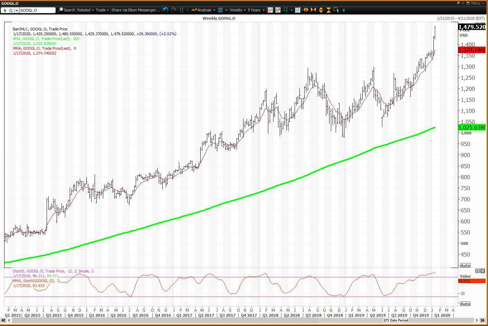

Analyzing stock performance and making data-driven decisions are essential components of successful investing. Alphabet Inc., the parent company of Google, is a critical player in the technology sector, capturing the attention of investors worldwide. This article provides a comprehensive analysis of Alphabet's stock, with a specific focus on the Price-to-Earnings (P/E) ratio — a key financial metric instrumental in evaluating a company's market value relative to its earnings.

The P/E ratio is significant for investors seeking insights into whether a stock is overvalued or undervalued, offering a snapshot of growth expectations and associated risks. In the context of Alphabet, the P/E ratio serves as a valuable tool for assessing its stock valuation and benchmarking its performance against industry counterparts in the highly competitive technology sector.



Moreover, the role of algorithmic trading in modern investment strategies cannot be overlooked. With advancements in technology, algorithmic trading has revolutionized how investors approach stock analysis, providing the ability to execute trades based on predefined criteria, including financial ratios like the P/E ratio. 

This article will explore the utilization of the P/E ratio in valuing Alphabet's stock, understanding its market positioning, and leveraging algorithmic trading strategies to make well-informed investment decisions. By combining financial analysis with advanced trading techniques, investors can optimize their strategies and enhance the potential for achieving financial success in the stock market.

## Table of Contents

## Understanding the P/E Ratio

The Price-to-Earnings (P/E) ratio is an essential financial metric for assessing a stock's market value relative to its earnings. It serves as an invaluable tool for investors, enabling them to evaluate whether a stock is overvalued or undervalued. The P/E ratio is calculated by dividing the market price per share by the earnings per share (EPS):

$$
\text{P/E Ratio} = \frac{\text{Market Price per Share}}{\text{Earnings per Share (EPS)}}
$$

A lower P/E ratio could suggest that a stock is undervalued, potentially indicating a buying opportunity. Conversely, a higher P/E ratio might imply that the stock is overvalued, cautioning investors about possible overpricing. In the context of Alphabet Inc., this ratio is especially insightful. As a major player in the tech industry, Alphabet's P/E ratio aids investors in making informed decisions concerning buying or selling the stock.

Beyond evaluating valuation, the P/E ratio can also provide insights into growth prospects and the inherent risks associated with a stock. For Alphabet, a P/E ratio that is considerably lower or higher than industry peers might reflect its future earnings expectations, growth opportunities, and market conditions. This makes observing shifts in the P/E ratio over time useful for investors seeking to understand both the immediate and long-term dynamics influencing Alphabet's financial performance.

While the P/E ratio is a beneficial starting point in stock analysis, it is important for investors to consider additional financial metrics and qualitative factors to gain a comprehensive understanding of a company's valuation and performance.

## Alphabet's Current and Historical P/E Ratios

As of January 2025, Alphabet's Price-to-Earnings (P/E) ratio stands at 25.36, a critical indicator of the company's market performance and investor sentiment. The P/E ratio is calculated by dividing the company's current share price by its earnings per share (EPS). 

$$
\text{P/E Ratio} = \frac{\text{Market Price per Share}}{\text{Earnings per Share (EPS)}}
$$

Alphabet's historical P/E ratios have exhibited variability influenced by several factors, including market dynamics, earnings reports, and broader industry trends. These fluctuations provide insight into how market participants perceive the company's growth prospects and assess its relative value compared to its earnings. 

To understand these patterns, it is important to examine Alphabet’s quarterly and yearly P/E trends. Quarterly earnings announcements often lead to shifts in the P/E ratio as they provide new information on the company's financial health. For instance, an unexpected increase in EPS may lead to a decrease in the P/E ratio, assuming the stock price remains constant, indicating potentially improved value. Conversely, if the EPS falls short of market expectations, the P/E ratio may rise, reflecting perceived overvaluation or increased risk.

Several factors play crucial roles in shaping Alphabet's P/E ratio. Changes in EPS, a direct component of the P/E calculation, can result from operational efficiencies, cost management, or revenue changes. Market conditions such as investor sentiment and macroeconomic developments, including [interest rate](/wiki/interest-rate-trading-strategies) changes, also impact derived valuations. For example, in a lower interest rate environment, investors might pay more for future earnings, potentially leading to higher P/E ratios.

The calculation of P/E ratios can be approached from both a trailing and forward perspective. The trailing P/E ratio uses earnings data from the last twelve months, offering a historical snapshot, while the forward P/E ratio utilizes projected EPS for future periods, providing insights into expected growth and performance.

Here's a simple Python code snippet to calculate both:

```python
# Trailing P/E calculation
current_share_price = 2600  # example value
trailing_eps = 102.49  # example value for TTM EPS
trailing_pe_ratio = current_share_price / trailing_eps

# Forward P/E calculation
projected_eps = 110  # example projected EPS
forward_pe_ratio = current_share_price / projected_eps

print(f"Trailing P/E Ratio: {trailing_pe_ratio:.2f}")
print(f"Forward P/E Ratio: {forward_pe_ratio:.2f}")
```

These calculations allow investors to gauge whether Alphabet is undervalued or overvalued compared to its historical performance and expectations for future growth. By analyzing both trailing and forward P/E ratios, investors can form a more comprehensive view of Alphabet's valuation, helping to make informed decisions about buying, holding, or selling the stock.

## Algorithmic Trading and P/E Ratios

Algorithmic trading, known for its speed and precision, utilizes computer programs to execute trades based on complex mathematical models and data analytics. Among the key metrics incorporated into these algorithms is the Price-to-Earnings (P/E) ratio, which serves as an essential indicator of a company's market valuation relative to its earnings. For investors in Alphabet Inc., leveraging [algorithmic trading](/wiki/algorithmic-trading) strategies that utilize P/E ratios can provide significant advantages in optimizing trading decisions.

Understanding Alphabet's P/E ratio enables algorithmic trading systems to evaluate the stock's valuation swiftly and accurately. Given the [volatility](/wiki/volatility-trading-strategies) and speed of financial markets, the capability of algorithms to interpret P/E ratios and act almost instantaneously on market shifts ensures a competitive edge. For instance, a lower-than-industry-average P/E ratio might trigger a "buy" signal within an algorithm, suggesting that Alphabet's stock may be undervalued compared to its earnings potential.

Algorithmic systems employ various strategies to analyze P/E ratios along with other financial metrics such as earnings per share (EPS), revenue growth, and return on equity (ROE). Python, a popular programming language in finance, can be used to implement such trading strategies. Below is a sample Python snippet illustrating a simplistic trading algorithm based on P/E ratio thresholds:

```python
# Sample Python algorithm for trading based on P/E ratios

def trading_algorithm(stock_data):
    buy_threshold = 20.0  # Hypothetical P/E threshold for buying
    sell_threshold = 30.0  # Hypothetical P/E threshold for selling

    decisions = []

    for date, pe_ratio in stock_data.items():
        if pe_ratio < buy_threshold:
            decisions.append((date, 'Buy'))
        elif pe_ratio > sell_threshold:
            decisions.append((date, 'Sell'))
        else:
            decisions.append((date, 'Hold'))

    return decisions

# Example stock data input: {'2025-01-01': 18.5, '2025-02-01': 25.4, '2025-03-01': 31.2}
```

Incorporating P/E ratio analysis in algorithmic trading is beneficial for crafting responsive and effective trading models. As such, traders program these algorithms to not only consider P/E ratios but to also adjust trading actions based on real-time market conditions and broader economic indicators. Consequently, this integration augments traditional investment strategies, providing a more comprehensive risk assessment and opportunity analysis.

Moreover, algorithmic trading systems offer significant efficiency improvements by processing vast amounts of data with minimal human intervention. This automation enables investors to capitalize on fleeting market opportunities that might otherwise be missed using manual trading approaches. By systematically integrating P/E ratio analysis into these algorithms, investors can enhance their strategies for trading Alphabet's stock, optimizing both short-term returns and long-term investment growth based on data-driven insights.

Overall, the application of algorithmic trading to P/E ratios empowers investors by offering advanced tools for decision-making and strengthening their ability to navigate the ever-evolving financial markets.

## Peer Comparison and Industry Analysis

In evaluating Alphabet Inc.'s Price-to-Earnings (P/E) ratio, comparing it to industry peers provides valuable insights into its market position and valuation standing. The P/E ratio is a critical marker that combines the company's share price with its per-share earnings, expressed mathematically as:

$$
\text{P/E Ratio} = \frac{\text{Market Value per Share}}{\text{Earnings per Share (EPS)}}
$$

As of January 2025, Alphabet's P/E ratio is 25.36. This figure allows investors to assess how the company is valued relative to its earnings when compared to other technology firms. In the Interactive Media & Services industry, prominent peers include Tencent, Shopify, and several others. Each company has distinct business models and market conditions that influence their respective P/E ratios.

For instance, Tencent, a significant player in the industry, may exhibit differing P/E ratios due to its reliance on the Chinese market and its diverse business lines ranging from social media to fintech. Shopify, primarily known for its e-commerce platform, might present a different P/E ratio due to its growth strategy and market penetration focus, emphasizing rapid expansion and technological innovation. Comparing Alphabet with such peers provides context on how Alphabet's market strategies and operational efficiencies are reflected in its stock valuation.

Understanding how Alphabet's market capitalization, which represents the total market value of its outstanding shares, influences its P/E ratio is crucial. A larger market cap might suggest a more established and possibly slower-growing company, which can affect investor expectations and, consequently, the P/E ratio. Earnings growth rates are another [factor](/wiki/factor-investing); rapid revenue growth typically leads to a higher P/E ratio as investors are willing to pay a premium for future growth potential.

Industry trends, such as advancements in [artificial intelligence](/wiki/ai-artificial-intelligence) and shifts in digital advertising markets, also impact Alphabet's P/E ratio. These trends can alter earnings forecasts and market perceptions, making it essential to consider the broader technological and economic environment when analyzing Alphabet's valuation.

Ultimately, through this comparative analysis, investors can evaluate whether Alphabet's stock is appropriately valued against industry standards. Understanding the metrics in relation to market peers highlights Alphabet's strengths, such as its leading position in digital advertising and continued innovation in AI and cloud services, while also identifying areas for potential growth or improvement. Such insights allow investors to make more informed decisions regarding portfolio adjustments or stock purchase strategies.

## Conclusion

The P/E ratio is a fundamental tool in stock analysis, providing investors with a measure to evaluate Alphabet Inc.'s market potential and make informed decisions. It allows investors to gauge whether a stock is overvalued or undervalued by comparing its current share price to its earnings per share (EPS). This ratio becomes more insightful when considered alongside other financial metrics such as the debt-to-equity ratio, return on equity, and cash flow analysis, as well as qualitative factors like management performance and market position. Such an integrated approach ensures a comprehensive understanding of Alphabet's financial health and investment worthiness.

Algorithmic trading has revolutionized how investors interact with P/E ratios, allowing for rapid and efficient decision-making. By implementing algorithmic systems that automate trading based on P/E ratio criteria and other financial indicators, investors can swiftly capitalize on market movements. This method enhances the precision and agility of investment strategies, offering potential financial advantages through timely trading actions.

Understanding Alphabet's P/E ratio within the broader market and industry context enables investors to appreciate its growth prospects. Comparing Alphabet's P/E ratio with industry peers provides valuable insights into its relative valuation and competitive standing. Consistent evaluation of these metrics is crucial in refining investment strategies, ensuring they remain aligned with long-term financial goals and market dynamics.

In conclusion, while the P/E ratio is a potent analytical tool, its effectiveness is amplified when used as part of a holistic investment approach. By leveraging algorithmic trading and maintaining awareness of market and industry trends, investors can optimize their strategies for sustainable success.

## References & Further Reading

[1]: Graham, B., & Zweig, J. (2003). ["The Intelligent Investor: The Definitive Book on Value Investing. A Book of Practical Counsel."](https://www.amazon.com/Intelligent-Investor-Definitive-Investing-Essentials/dp/0060555661) HarperCollins.

[2]: Damodaran, A. (2012). ["Investment Valuation: Tools and Techniques for Determining the Value of Any Asset."](https://books.google.com/books/about/Investment_Valuation.html?id=5SRHAAAAQBAJ) John Wiley & Sons.

[3]: López de Prado, M. (2018). ["Advances in Financial Machine Learning."](https://www.amazon.com/Advances-Financial-Machine-Learning-Marcos/dp/1119482089) Wiley.

[4]: Aronson, D. R. (2007). ["Evidence-Based Technical Analysis: Applying the Scientific Method and Statistical Inference to Trading Signals."](https://onlinelibrary.wiley.com/doi/book/10.1002/9781118268315) John Wiley & Sons.

[5]: Chan, E. P. (2008). ["Quantitative Trading: How to Build Your Own Algorithmic Trading Business."](https://github.com/ftvision/quant_trading_echan_book) Wiley.