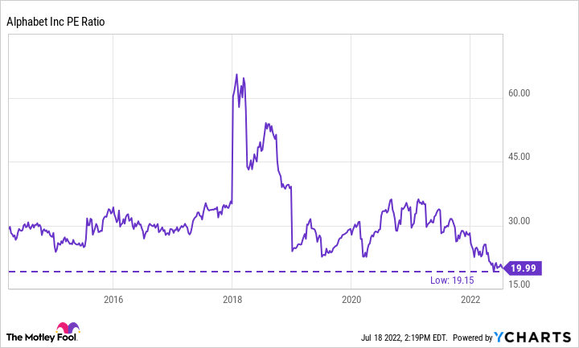

## Table of Contents

## What is Alphabet Inc. and what does it do?

Alphabet Inc. is a big company that started in 2015. It is the parent company of Google, which means it owns Google and many other businesses. The main person who helped start Alphabet is Larry Page, and another important person is Sergey Brin. They used to run Google but now they work on Alphabet.

Alphabet does a lot of different things. Its biggest part is Google, which runs a search engine, makes phones, and has a video site called YouTube. But Alphabet also has other parts that work on things like making cars that drive themselves, health projects, and new internet ideas. This way, Alphabet can try many new things and help make the world better in different ways.

## What is a stock's price-to-earnings (P/E) ratio?

A stock's price-to-earnings (P/E) ratio is a way to figure out how much people are willing to pay for a company's earnings. It's calculated by taking the current stock price and dividing it by the earnings per share (EPS). The EPS is how much money the company makes for each share of its stock over a certain time, usually a year. So, if a stock is selling for $50 and the company made $5 per share last year, the P/E ratio would be 10. This means investors are willing to pay $10 for every $1 of earnings.

The P/E ratio helps investors decide if a stock is a good buy. A high P/E ratio might mean that people think the company will grow a lot in the future, so they're willing to pay more for its stock. But it could also mean the stock is too expensive. On the other hand, a low P/E ratio might show that the stock is a bargain, or it might mean that people don't think the company will do well in the future. By comparing the P/E ratio of a company to others in the same industry, or to its own history, investors can get a better idea of whether the stock is priced right.

## How is the P/E ratio calculated for Alphabet Inc.?

The P/E ratio for Alphabet Inc. is calculated by taking the current stock price of Alphabet and dividing it by the earnings per share (EPS). The stock price is how much one share of Alphabet costs in the stock market right now. The EPS is found by taking the total earnings of Alphabet over a certain period, usually a year, and dividing it by the number of shares the company has. So, if Alphabet's stock is trading at $100 and their EPS is $5, the P/E ratio would be 20. This means investors are willing to pay $20 for every $1 of Alphabet's earnings.

This ratio helps investors understand if Alphabet's stock is a good deal. If the P/E ratio is high, it might mean that people think Alphabet will grow a lot in the future, so they're ready to pay more for its stock. But a high P/E could also mean the stock is too expensive. If the P/E ratio is low, it might show that the stock is a bargain, or it could mean people don't think Alphabet will do well in the future. By comparing Alphabet's P/E ratio to other companies in the same industry, or to its own past P/E ratios, investors can get a better idea of whether the stock is priced right.

## What is the current P/E ratio of Alphabet Inc.?

The current P/E ratio of Alphabet Inc. changes every day because it depends on the stock price and the company's earnings. As of the latest data available, Alphabet's P/E ratio is around 25. This number means that investors are willing to pay $25 for every $1 of earnings that Alphabet makes.

This P/E ratio can help people decide if Alphabet's stock is a good buy. A P/E ratio of 25 is considered pretty normal for a big tech company like Alphabet. It shows that people think Alphabet will keep growing and making money in the future. But, if you compare it to other tech companies or look at Alphabet's past P/E ratios, you can get a better idea if the stock is priced right for you.

## How does Alphabet Inc.'s P/E ratio compare to the industry average?

Alphabet Inc.'s P/E ratio of around 25 is a bit higher than the average P/E ratio for the tech industry, which is usually around 20 to 22. This means that investors are willing to pay a bit more for Alphabet's earnings compared to other tech companies. A higher P/E ratio can show that people think Alphabet will grow faster than other companies in the tech industry.

Even though Alphabet's P/E ratio is higher than the industry average, it's still within a normal range for big tech companies. Companies like Apple, Microsoft, and Amazon also have P/E ratios that are often higher than the industry average. This shows that investors see a lot of value in these big tech companies and expect them to keep making good profits in the future.

## What factors influence Alphabet Inc.'s P/E ratio?

Several things can change Alphabet Inc.'s P/E ratio. One big thing is how well Alphabet is doing with its business. If Alphabet is making more money and growing fast, people might be willing to pay more for its stock, which makes the P/E ratio go up. Another thing is what's happening in the whole economy. If the economy is doing well, people might feel more confident and be ready to pay more for stocks, pushing up the P/E ratio. But if the economy is not doing well, people might be more careful and the P/E ratio could go down.

Also, what other investors think about Alphabet's future can change its P/E ratio. If people think Alphabet will keep growing and making new things, they might be willing to pay more for its stock, making the P/E ratio higher. But if there are worries about Alphabet's future, like new laws or competition, the P/E ratio might go down. Finally, how Alphabet's P/E ratio compares to other tech companies can also affect it. If Alphabet's P/E ratio is much higher than other tech companies, some investors might think it's too expensive and the P/E ratio could drop.

## How has Alphabet Inc.'s P/E ratio changed over the past five years?

Over the past five years, Alphabet Inc.'s P/E ratio has gone up and down a bit, but it has mostly stayed in a normal range for a big tech company. At the start of this time, around five years ago, Alphabet's P/E ratio was about 20. This was a bit lower than it is now, showing that investors were willing to pay less for Alphabet's earnings back then. Over the years, as Alphabet kept growing and making more money, the P/E ratio slowly went up. By the middle of this time, it was around 23, and it has stayed around 25 for the last year or so.

A few things have made Alphabet's P/E ratio change over these years. When the economy was doing well, and people felt good about the future, Alphabet's P/E ratio went up because investors were ready to pay more for its stock. But when there were worries, like during the early days of the global health crisis, the P/E ratio dropped a bit because people were more careful with their money. Also, as Alphabet kept coming up with new ideas and growing its business, investors saw more value in the company, which helped keep the P/E ratio high. Overall, the changes in Alphabet's P/E ratio show how investors' feelings about the company and the economy have changed over time.

## What are the implications of a high P/E ratio for Alphabet Inc. stock?

A high P/E ratio for Alphabet Inc. means that investors are willing to pay more for each dollar of the company's earnings. This can be a good sign because it shows that people think Alphabet will keep growing and making more money in the future. They are ready to pay a higher price for the stock because they believe in Alphabet's potential. For example, if Alphabet is working on new technology or expanding into new areas, a high P/E ratio might mean investors are excited about these possibilities.

However, a high P/E ratio can also mean that the stock might be too expensive. If the stock price is very high compared to what the company is actually [earning](/wiki/earning-announcement), it could be risky. If Alphabet doesn't grow as fast as investors expect, the stock price could go down. This means investors need to be careful and look at other things too, like how the company is doing right now and what's happening in the economy. A high P/E ratio is just one piece of the puzzle when deciding if Alphabet's stock is a good buy.

## How can investors use Alphabet Inc.'s P/E ratio to make investment decisions?

Investors can use Alphabet Inc.'s P/E ratio to help decide if the stock is a good buy. If the P/E ratio is high, it means people are willing to pay a lot for Alphabet's earnings. This could be a good sign if investors think Alphabet will keep growing and making more money. For example, if Alphabet is working on new projects like self-driving cars or health technology, a high P/E ratio might mean people are excited about these future possibilities. Investors might see this as a chance to buy the stock because they believe Alphabet's earnings will go up in the future.

On the other hand, a high P/E ratio could also mean the stock is too expensive. If the stock price is much higher than what Alphabet is actually earning right now, it might be risky. If Alphabet doesn't grow as fast as people expect, the stock price could drop. So, investors need to be careful and look at other things too, like how Alphabet is doing right now and what's happening in the economy. The P/E ratio is just one part of the picture when deciding if Alphabet's stock is a good investment.

## What are the limitations of using P/E ratios to evaluate Alphabet Inc. stock?

Using P/E ratios to evaluate Alphabet Inc.'s stock has some limitations. One big problem is that P/E ratios don't tell the whole story about a company. They only show how much people are willing to pay for the company's earnings right now, but they don't say anything about other important things like the company's debts, how much cash it has, or what new projects it's working on. For example, if Alphabet is spending a lot of money on new technology that might make a lot of money in the future, a high P/E ratio might look bad right now but could be good in the long run.

Another limitation is that P/E ratios can be affected by things that are hard to predict, like changes in the economy or new laws. If the economy is doing well, P/E ratios might go up because people feel good about the future. But if there's a big change, like a new law that makes it harder for Alphabet to do business, the P/E ratio might go down even if the company itself is doing okay. Also, P/E ratios can be different from one industry to another, so comparing Alphabet's P/E ratio to a company in a different industry might not be fair. Investors need to look at more than just the P/E ratio to get a full picture of whether Alphabet's stock is a good investment.

## How do Alphabet Inc.'s forward P/E ratios differ from its trailing P/E ratios?

Alphabet Inc.'s forward P/E ratio and trailing P/E ratio are two different ways to look at how much investors are willing to pay for the company's earnings. The trailing P/E ratio uses the earnings from the last 12 months to figure out the ratio. So, if you want to know Alphabet's trailing P/E ratio, you would take the current stock price and divide it by the earnings per share from the past year. This gives investors an idea of how the company has been doing recently.

On the other hand, the forward P/E ratio uses the earnings that people expect Alphabet to make in the next 12 months. To find this, you would take the current stock price and divide it by the expected earnings per share for the coming year. The forward P/E ratio can be helpful because it shows what investors think about Alphabet's future. If the forward P/E ratio is lower than the trailing P/E ratio, it might mean that people think Alphabet will do better in the future. But if it's higher, it could mean that people are worried about the company's future earnings.

## What advanced metrics should be considered alongside P/E ratios for a comprehensive analysis of Alphabet Inc. stock?

When looking at Alphabet Inc.'s stock, it's good to think about other numbers too, not just the P/E ratio. One important number is the price-to-sales (P/S) ratio. This tells you how much people are willing to pay for every dollar of sales Alphabet makes. If the P/S ratio is high, it might mean people think Alphabet will grow a lot in the future. Another number to look at is the price-to-book (P/B) ratio, which compares the stock price to the company's net worth. A low P/B ratio might show that the stock is a good deal, while a high one could mean it's expensive.

It's also helpful to look at Alphabet's return on equity (ROE). This number shows how well the company is using the money that shareholders have put in. A high ROE means Alphabet is doing a good job of making money with that investment. Another thing to consider is the debt-to-equity ratio, which tells you how much debt Alphabet has compared to what shareholders have put in. A high debt-to-equity ratio might mean the company is taking on a lot of risk. By looking at these numbers along with the P/E ratio, investors can get a better idea of whether Alphabet's stock is a good buy.

## What is the P/E Ratio and how can it be understood?

The Price-to-Earnings (P/E) ratio is an essential financial metric for assessing a stock's market value relative to its earnings. It serves as an invaluable tool for investors, enabling them to evaluate whether a stock is overvalued or undervalued. The P/E ratio is calculated by dividing the market price per share by the earnings per share (EPS):

$$
\text{P/E Ratio} = \frac{\text{Market Price per Share}}{\text{Earnings per Share (EPS)}}
$$

A lower P/E ratio could suggest that a stock is undervalued, potentially indicating a buying opportunity. Conversely, a higher P/E ratio might imply that the stock is overvalued, cautioning investors about possible overpricing. In the context of Alphabet Inc., this ratio is especially insightful. As a major player in the tech industry, Alphabet's P/E ratio aids investors in making informed decisions concerning buying or selling the stock.

Beyond evaluating valuation, the P/E ratio can also provide insights into growth prospects and the inherent risks associated with a stock. For Alphabet, a P/E ratio that is considerably lower or higher than industry peers might reflect its future earnings expectations, growth opportunities, and market conditions. This makes observing shifts in the P/E ratio over time useful for investors seeking to understand both the immediate and long-term dynamics influencing Alphabet's financial performance.

While the P/E ratio is a beneficial starting point in stock analysis, it is important for investors to consider additional financial metrics and qualitative factors to gain a comprehensive understanding of a company's valuation and performance.

## What are Alphabet's current and historical P/E ratios?

As of January 2025, Alphabet's Price-to-Earnings (P/E) ratio stands at 25.36, a critical indicator of the company's market performance and investor sentiment. The P/E ratio is calculated by dividing the company's current share price by its earnings per share (EPS). 

$$
\text{P/E Ratio} = \frac{\text{Market Price per Share}}{\text{Earnings per Share (EPS)}}
$$

Alphabet's historical P/E ratios have exhibited variability influenced by several factors, including market dynamics, earnings reports, and broader industry trends. These fluctuations provide insight into how market participants perceive the company's growth prospects and assess its relative value compared to its earnings. 

To understand these patterns, it is important to examine Alphabet’s quarterly and yearly P/E trends. Quarterly earnings announcements often lead to shifts in the P/E ratio as they provide new information on the company's financial health. For instance, an unexpected increase in EPS may lead to a decrease in the P/E ratio, assuming the stock price remains constant, indicating potentially improved value. Conversely, if the EPS falls short of market expectations, the P/E ratio may rise, reflecting perceived overvaluation or increased risk.

Several factors play crucial roles in shaping Alphabet's P/E ratio. Changes in EPS, a direct component of the P/E calculation, can result from operational efficiencies, cost management, or revenue changes. Market conditions such as investor sentiment and macroeconomic developments, including [interest rate](/wiki/interest-rate-trading-strategies) changes, also impact derived valuations. For example, in a lower interest rate environment, investors might pay more for future earnings, potentially leading to higher P/E ratios.

The calculation of P/E ratios can be approached from both a trailing and forward perspective. The trailing P/E ratio uses earnings data from the last twelve months, offering a historical snapshot, while the forward P/E ratio utilizes projected EPS for future periods, providing insights into expected growth and performance.

Here's a simple Python code snippet to calculate both:

```python
# Trailing P/E calculation
current_share_price = 2600  # example value
trailing_eps = 102.49  # example value for TTM EPS
trailing_pe_ratio = current_share_price / trailing_eps

# Forward P/E calculation
projected_eps = 110  # example projected EPS
forward_pe_ratio = current_share_price / projected_eps

print(f"Trailing P/E Ratio: {trailing_pe_ratio:.2f}")
print(f"Forward P/E Ratio: {forward_pe_ratio:.2f}")
```

These calculations allow investors to gauge whether Alphabet is undervalued or overvalued compared to its historical performance and expectations for future growth. By analyzing both trailing and forward P/E ratios, investors can form a more comprehensive view of Alphabet's valuation, helping to make informed decisions about buying, holding, or selling the stock.

## How does Peer Comparison relate to Industry Analysis?

In evaluating Alphabet Inc.'s Price-to-Earnings (P/E) ratio, comparing it to industry peers provides valuable insights into its market position and valuation standing. The P/E ratio is a critical marker that combines the company's share price with its per-share earnings, expressed mathematically as:

$$
\text{P/E Ratio} = \frac{\text{Market Value per Share}}{\text{Earnings per Share (EPS)}}
$$

As of January 2025, Alphabet's P/E ratio is 25.36. This figure allows investors to assess how the company is valued relative to its earnings when compared to other technology firms. In the Interactive Media & Services industry, prominent peers include Tencent, Shopify, and several others. Each company has distinct business models and market conditions that influence their respective P/E ratios.

For instance, Tencent, a significant player in the industry, may exhibit differing P/E ratios due to its reliance on the Chinese market and its diverse business lines ranging from social media to fintech. Shopify, primarily known for its e-commerce platform, might present a different P/E ratio due to its growth strategy and market penetration focus, emphasizing rapid expansion and technological innovation. Comparing Alphabet with such peers provides context on how Alphabet's market strategies and operational efficiencies are reflected in its stock valuation.

Understanding how Alphabet's market capitalization, which represents the total market value of its outstanding shares, influences its P/E ratio is crucial. A larger market cap might suggest a more established and possibly slower-growing company, which can affect investor expectations and, consequently, the P/E ratio. Earnings growth rates are another [factor](/wiki/factor-investing); rapid revenue growth typically leads to a higher P/E ratio as investors are willing to pay a premium for future growth potential.

Industry trends, such as advancements in [artificial intelligence](/wiki/ai-artificial-intelligence) and shifts in digital advertising markets, also impact Alphabet's P/E ratio. These trends can alter earnings forecasts and market perceptions, making it essential to consider the broader technological and economic environment when analyzing Alphabet's valuation.

Ultimately, through this comparative analysis, investors can evaluate whether Alphabet's stock is appropriately valued against industry standards. Understanding the metrics in relation to market peers highlights Alphabet's strengths, such as its leading position in digital advertising and continued innovation in AI and cloud services, while also identifying areas for potential growth or improvement. Such insights allow investors to make more informed decisions regarding portfolio adjustments or stock purchase strategies.

## References & Further Reading

[1]: Graham, B., & Zweig, J. (2003). ["The Intelligent Investor: The Definitive Book on Value Investing. A Book of Practical Counsel."](https://www.amazon.com/Intelligent-Investor-Definitive-Investing-Essentials/dp/0060555661) HarperCollins.

[2]: Damodaran, A. (2012). ["Investment Valuation: Tools and Techniques for Determining the Value of Any Asset."](https://books.google.com/books/about/Investment_Valuation.html?id=5SRHAAAAQBAJ) John Wiley & Sons.

[3]: López de Prado, M. (2018). ["Advances in Financial Machine Learning."](https://www.amazon.com/Advances-Financial-Machine-Learning-Marcos/dp/1119482089) Wiley.

[4]: Aronson, D. R. (2007). ["Evidence-Based Technical Analysis: Applying the Scientific Method and Statistical Inference to Trading Signals."](https://onlinelibrary.wiley.com/doi/book/10.1002/9781118268315) John Wiley & Sons.

[5]: Chan, E. P. (2008). ["Quantitative Trading: How to Build Your Own Algorithmic Trading Business."](https://github.com/ftvision/quant_trading_echan_book) Wiley.