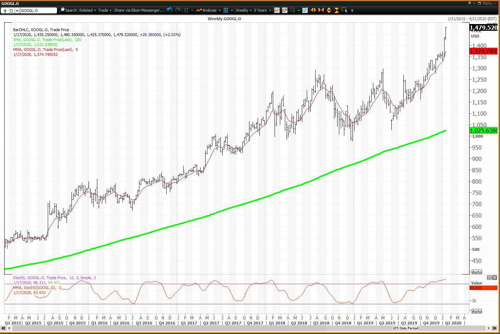

Alphabet Inc., the parent company of Google, is recognized as a formidable entity in the sphere of stock investments. Known for its technological advancements and market influence, Alphabet's prominence extends beyond its core business of internet services to encompass a broad spectrum of innovative technologies, notably in artificial intelligence (AI). With a stronghold on online advertising, Alphabet generates substantial revenue, which is instrumental in driving its stock performance. In recent years, the enterprise has embraced a diversified business strategy, investing heavily in AI technologies, cloud computing, and various other high-tech sectors. This strategic diversification underpins its resilient financial performance and assures investors of its commitment to pioneering new growth avenues.

The purpose of this article is to provide a comprehensive analysis of Alphabet's stock performance and its technological prowess. One of the primary focuses is Alphabet's innovative strides in AI, which have notably enhanced its operational capabilities and service offerings. Moreover, algorithmic trading is a crucial factor affecting Alphabet's stock dynamics, reflecting the intricate relationship between technological advancements and financial strategies.



This exploration aims to assess Alphabet's investment potential, identifying current opportunities and challenges. The discussion includes an evaluation of how Alphabet's technological innovations contribute to its market positioning, particularly in the rapidly evolving tech landscape. Investors and analysts should regard Alphabet's continuous focus on AI and algorithmic trading as significant factors influencing its stock volatility and overall market performance. Understanding these aspects sheds light on Alphabet's potential as a long-term investment, even amidst the financial uncertainties of today's global markets.

## Table of Contents

## Understanding Alphabet's Stock Structure

Alphabet Inc. structures its stock offerings through distinct share classes, primarily consisting of Class A and Class B shares, informally referred to as "alphabet stocks." This classification is significant for investors due to the distinct voting rights associated with each class. Class A shares, traded under the ticker symbol GOOGL, are publicly available and provide the holder with one vote per share. In contrast, Class B shares are not publicly traded and offer ten votes per share, granting the company's founders and executives majority control over corporate decision-making processes.

The existence of different share classes illustrates Alphabet's strategic approach to corporate governance. By maintaining a dual-class share structure, Alphabet ensures that its founders and core leaders retain disproportionate control, thereby safeguarding their vision and strategic directives from the influence of external shareholders. This arrangement supports Alphabet's ability to make long-term innovative investments without succumbing to short-term market pressures.

Alphabet's diverse business model, which spans numerous sectors including digital advertising, artificial intelligence, cloud computing, and autonomous vehicles, necessitates this level of control. The stability offered by its share structure allows Alphabet to explore and invest in a wide range of technological advancements and market opportunities while securing its leadership pillars.

The structural complexity associated with Alphabet's stock share classes reflects its intertwined operational and investment strategies. For prospective investors, understanding the implications of these share classes is crucial not only for gauging voting power but also for appreciating how Alphabet balances innovation and market control.

Overall, Alphabet's share structure plays a vital role in maintaining its organizational stability and strategic expansion across various technological domains. Investors weighing the potential of Alphabet's stocks should consider both the benefits of its robust business model and the influence of its unique voting structure when making investment decisions.

## Alphabet's Technological Edge: AI and Algo Trading

Alphabet Inc. has leveraged its technological edge by integrating [artificial intelligence](/wiki/ai-artificial-intelligence) (AI) into its business operations, enhancing product offerings and improving operational efficiency. A significant development in this area is Google's Gemini AI, a model designed to power a range of services and products, driving performance improvements across various platforms. These AI innovations allow Alphabet to maintain its competitive advantage by offering personalized and efficient solutions tailored to user needs.

AI integration is evident in multiple Alphabet platforms like Google Search, Google Ads, and cloud services. AI models enhance search algorithms, enabling more accurate and context-aware results. In advertising, AI optimizes ad targeting, potentially increasing revenue generation and improving user experiences. Alphabet's cloud offerings also benefit from AI technologies that facilitate data analysis and infrastructure management, providing robust support for enterprise clients.

Algorithmic trading is another facet of Alphabet's technological strategy, playing a critical role in managing and optimizing stock performance. These sophisticated algorithms employ complex models to analyze market data, identify trends, and execute trades with increased precision and speed. This integration of AI into [algorithmic trading](/wiki/algorithmic-trading) strategies has resulted in improved [liquidity](/wiki/liquidity-risk-premium) and reduced trading costs, aligning with Alphabet's overarching aim of leveraging technology to enhance efficiency.

Understanding the methodology behind algorithmic trading can provide investors with insights into how these systems contribute to stock [volatility](/wiki/volatility-trading-strategies) and overall performance. Algorithms typically utilize mathematical models such as linear regressions and time-series analysis to predict stock movements. Here is a simple Python example illustrating a basic trading strategy based on moving averages:

```python
import numpy as np
import pandas as pd

# Create a sample stock data
np.random.seed(0)
dates = pd.date_range('20220101', periods=100)
prices = np.random.randn(100).cumsum() + 100
stock_data = pd.DataFrame({'Date': dates, 'Close': prices})

# Calculate moving averages
short_window = 20
long_window = 50

stock_data['Short_MA'] = stock_data['Close'].rolling(window=short_window, min_periods=1).mean()
stock_data['Long_MA'] = stock_data['Close'].rolling(window=long_window, min_periods=1).mean()

# Generate trading signals
stock_data['Signal'] = 0.0
stock_data['Signal'][short_window:] = np.where(stock_data['Short_MA'][short_window:] > stock_data['Long_MA'][short_window:], 1.0, 0.0)

# Calculate positions
stock_data['Position'] = stock_data['Signal'].diff()

# Output the DataFrame with signals
print(stock_data[['Date', 'Close', 'Short_MA', 'Long_MA', 'Signal', 'Position']].tail())
```

This program illustrates a simplistic moving average crossover strategy, identifying buy and sell signals based on price movements relative to calculated average prices over short and long windows.

The combination of AI and algorithmic trading not only highlights Alphabet's technological capabilities but also enhances its stock performance management, reinforcing the company's strategic positioning in the tech and investment landscapes.

## Stock Performance and Market Position

Alphabet Inc.'s stock performance is characterized by sustained growth, a trend that can be largely attributed to its continuous technological innovations and strategic market positioning. As of the latest financial reports, Alphabet has demonstrated a robust financial health, underscored by its consistent revenue growth and strong cash reserves. Despite the challenges posed by a complex regulatory environment, Alphabet has maintained a positive outlook, primarily driven by its diverse portfolio and forward-looking initiatives in areas such as artificial intelligence and cloud computing.

The steady growth in Alphabet's stock value is reflective of its ability to leverage its technological edge, particularly through ventures like Google Cloud and AI-driven solutions, which have become significant revenue contributors. Alphabet's role as a leader in digital advertising also continues to bolster its financial performance, supporting its market stabilization efforts. Moreover, the company has effectively navigated the regulatory hurdles by adopting adaptive strategies that minimize potential disruptions to its operations and market trajectory.

Investors analyzing Alphabet's stock must consider its historical performance metrics, which showcase a pattern of resilience against market adversities and exploit its future growth opportunities. Prospective projections suggest a continuation of this upward trajectory, based on Alphabet's strategic investments and the scaling of its innovative solutions across global markets. Evaluating these trends can furnish investors with a comprehensive understanding of Alphabet's market position, providing insights into its long-term investment potential.

## The Role of Algorithmic Trading in Alphabet's Stock

Algorithmic trading has become an essential component in the trading of Alphabet Inc.'s stock, vastly improving market efficiency and liquidity. The implementation of these automated systems aids in reducing trading costs by executing large volumes of transactions with minimal human intervention. Algorithmic trading strategies employ advanced algorithms to swiftly analyze market data, identifying patterns and trends that may elude manual trading processes.

The algorithms, often embedded in sophisticated software, are designed to exploit short-term fluctuations in the stock market. They allow traders to achieve optimal execution prices by detecting the most opportune moments to buy or sell Alphabet's stock. For example, high-frequency trading ([HFT](/wiki/high-frequency-trading-strategies)), a subset of algorithmic trading, utilizes powerful computer programs to execute thousands of trades per second, capitalizing on fleeting opportunities in the market.

To illustrate the efficiency of algorithmic trading, consider a basic [momentum](/wiki/momentum) strategy where the algorithm continuously calculates the moving average of Alphabet's stock price over different periods. If the short-term moving average surpasses the long-term average, the algorithm interprets it as a buying signal and initiates a trade; conversely, it sells when the opposite occurs. This approach can be implemented in Python as follows:

```python
def calculate_moving_average(prices, window):
    return [sum(prices[i:i+window])/window for i in range(len(prices)-window+1)]

short_window = 10
long_window = 50

short_ma = calculate_moving_average(stock_prices, short_window)
long_ma = calculate_moving_average(stock_prices, long_window)

buy_signals = [i for i in range(1, len(short_ma)) if short_ma[i] > long_ma[i] and short_ma[i-1] <= long_ma[i-1]]
sell_signals = [i for i in range(1, len(short_ma)) if short_ma[i] < long_ma[i] and short_ma[i-1] >= long_ma[i-1]]
```

Beyond short-term strategies, algorithmic trading also optimizes longer-term strategies, contributing to overall stock stability. For investors, comprehending the role and impact of algorithmic trading is pivotal in assessing Alphabet's stock performance. It informs them of potential volatility induced by these trading practices, which often results in rapid price adjustments. Thus, while these algorithms enhance market dynamics by increasing liquidity and lowering costs, they also introduce an added layer of volatility that investors must navigate.

Understanding these dynamics allows investors to make informed decisions about their stock portfolios, recognizing the balance algorithmic trading strikes between efficiency and market stability in the context of Alphabet’s stock.

## Regulatory Environment and Its Impact

Alphabet Inc., the parent company of Google, operates in an environment that is increasingly scrutinized by regulatory bodies worldwide. This scrutiny is largely due to its dominant position in various tech domains, including search, advertising, and AI, giving rise to significant regulatory challenges, particularly concerning antitrust issues and data privacy concerns.

Antitrust issues form a critical aspect of the regulatory challenges faced by Alphabet. As a major player controlling substantial market shares in search and digital advertising, Alphabet has faced investigations and lawsuits in multiple jurisdictions, including the United States and the European Union. These antitrust cases generally argue that Alphabet's business practices stifle competition by leveraging its market dominance to favor its products and services, thus potentially violating antitrust laws. For instance, the European Commission has imposed several fines on Alphabet for anti-competitive behavior, notably regarding its search and advertising practices. Such regulatory actions not only impose financial penalties but also necessitate changes to Alphabet's business practices, potentially affecting its operational strategies.

Data privacy concerns present another significant regulatory challenge for Alphabet. As a company that manages large amounts of personal data through its various services, including Google Search, YouTube, and Android, Alphabet is subject to stringent data protection regulations. The General Data Protection Regulation (GDPR) in the EU and the California Consumer Privacy Act (CCPA) in the US are among the key regulations imposing strict guidelines on how Alphabet must handle personal data. These regulations require transparency in data collection and use, provide consumers with rights over their data, and mandate security measures to protect data privacy. Non-compliance can result in substantial fines and reputational damage, compelling Alphabet to invest significantly in compliance and data protection measures.

The regulatory landscape is complex and continuously evolving, with potential implications for Alphabet's business operations and investor confidence. As global regulators become more vigilant, Alphabet must navigate an intricate web of legal requirements that can significantly affect its operational flexibility and cost structures. For investors, these regulatory challenges introduce risks that could impact Alphabet's revenue streams and profitability. Changes in the regulatory environment can lead to increased compliance costs, alter market dynamics, or even restrict Alphabet's ability to capitalize on new business opportunities.

Investors must maintain a vigilant eye on these regulatory factors as they assess Alphabet's long-term investment potential. Understanding the nuances of antitrust actions and privacy regulations, along with their potential implications for Alphabet's business model, is crucial. An informed assessment can help investors gauge the risks associated with regulatory compliance and litigation, which, in turn, influences stock valuation and investment decisions. While Alphabet's innovations and market leadership provide considerable strengths, the evolving regulatory environment remains a critical consideration for investors evaluating its future prospects.

## Conclusion

Alphabet Inc. remains a dominant force in the tech industry due to its continuous innovations and robust financial health. The company has effectively leveraged its expertise in artificial intelligence and technological advancements to enhance its product offerings and maintain a competitive edge. This focus positions Alphabet favorably in the market, promising substantial returns for investors.

Regulatory challenges, particularly in areas such as antitrust and data privacy, present significant hurdles for Alphabet. These issues require careful navigation to ensure compliance and maintain investor confidence. Despite these regulatory pressures, Alphabet's commitment to technological innovation serves as a buffer, offering a positive outlook for future growth.

Investors looking for opportunities in the tech sector will find Alphabet an attractive option due to its solid market presence and consistent performance. The company's strategic initiatives and focus on cutting-edge technologies promise continued growth and expansion, making it a viable long-term investment.

## References & Further Reading

[1]: ["Advances in Financial Machine Learning"](https://www.amazon.com/Advances-Financial-Machine-Learning-Marcos/dp/1119482089) by Marcos Lopez de Prado

[2]: ["Machine Learning for Algorithmic Trading"](https://github.com/stefan-jansen/machine-learning-for-trading) by Stefan Jansen

[3]: ["Quantitative Trading: How to Build Your Own Algorithmic Trading Business"](https://github.com/LucindaYa/quant-resources/blob/master/Quantitative%20Trading%20How%20to%20Build%20Your%20Own%20Algorithmic%20Trading%20Business.pdf) by Ernest P. Chan

[4]: ["Evidence-Based Technical Analysis: Applying the Scientific Method and Statistical Inference to Trading Signals"](https://www.amazon.com/Evidence-Based-Technical-Analysis-Scientific-Statistical/dp/0470008741) by David Aronson

[5]: Google AI Blog. ["Announcing Gemini: The Next Big Step for Google AI."](https://blog.google/technology/google-deepmind/google-gemini-ai-update-december-2024/) 

[6]: European Commission. ["Antitrust: Commission fines Google €2.42 billion for abusing dominance as search engine by giving illegal advantage to own comparison shopping service."](https://ec.europa.eu/newsroom/comp/items/104946/)

[7]: ["Implementing AI Models: Concepts in Python Data Science."](https://towardsdatascience.com/ai-agents-from-concepts-to-practical-implementation-in-python-fb26789b1560) Real Python