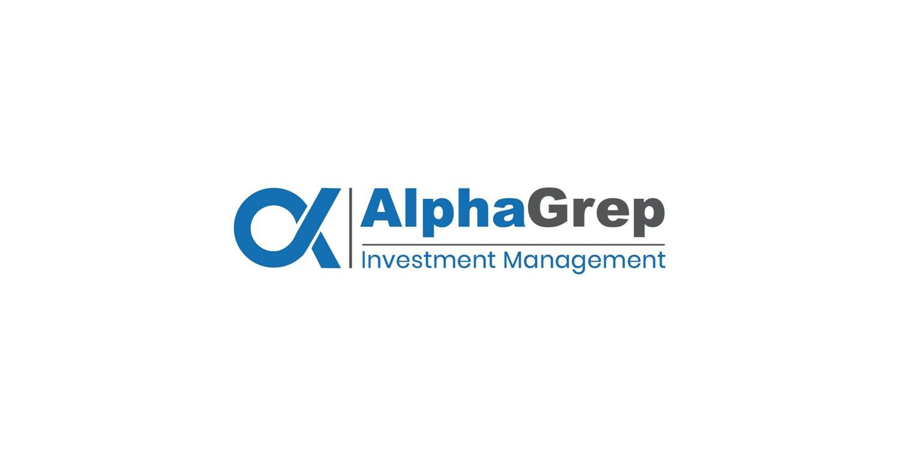

AlphaGrep stands as a distinguished entity within the domain of quantitative trading and investment. Since its inception in 2010, the firm has pioneered the development of advanced algorithmic trading strategies. These strategies are critical in modern trading, where the ability to execute transactions in milliseconds can determine profitable outcomes. The company's operations span over 30 global exchanges, encompassing a wide array of asset classes, showcasing its versatility and adaptability in diverse market environments.

Serving as a prominent market maker, AlphaGrep plays a vital role in providing liquidity and ensuring smooth market functionality. Market makers are crucial participants in financial markets, as they facilitate trading by continuously quoting buy and sell prices, thus enabling other participants to execute trades efficiently. AlphaGrep's significant participation in market volume emphasizes its influential presence within the trading ecosystem.



AlphaGrep's success relies on its adept use of quantitative models and cutting-edge technology, which allow the firm to identify and capitalize on market inefficiencies. By integrating sophisticated mathematical principles and computer science, AlphaGrep creates robust algorithms that optimize trading performance. The result is a dynamic approach that enhances the firm's capacity to react quickly to market conditions, maintaining its competitive edge.

In exploring AlphaGrep's achievements, we will examine the critical elements and operative philosophies that contribute to its prominent status in quantitative trading. Through a blend of innovative technology, strategic market insights, and rigorous risk management, AlphaGrep continues to position itself as a leader in the evolving landscape of algorithmic trading.

## Table of Contents

## The Evolution of Algo Trading

Algorithmic trading has significantly reshaped financial markets, introducing unprecedented speed and efficiency. This transformation can largely be attributed to the integration of advanced mathematical models and cutting-edge technology, which enable market participants to execute trades faster and more precisely than ever before. Algorithmic trading leverages algorithms for executing orders intelligently, typically making decisions on the basis of time, price, or other quantifiable variables. These systems can process market data much faster than a human trader, allowing them to take advantage of short-term opportunities that would otherwise be missed.

AlphaGrep, founded in 2010, stands as a key player in this evolution. The firm exemplifies the power of algorithmic trading by developing strategies rooted in the identification of market inefficiencies. These inefficiencies are discrepancies in market prices or opportunities that are not immediately apparent, which can be capitalized on for profit. AlphaGrep utilizes a combination of sophisticated mathematics and data analytics to identify these opportunities and exploit them before they dissipate.

The core of AlphaGrep's success lies in its ultra-low latency systems, designed to ensure that trades are executed at the optimal moment. Latency refers to the time delay between the initiation and execution of a trading order. Reducing latency is crucial in [algorithmic trading](/wiki/algorithmic-trading), as even millisecond delays can result in missed opportunities due to the rapid pace of market movements. AlphaGrep's infrastructure minimizes latency, allowing it to capture transient trading opportunities effectively.

The historical development of algorithmic trading reveals its profound impact on market dynamics. Initially limited to large institutional investors, advances in technology have democratized access to algorithmic trading tools, thereby increasing market [liquidity](/wiki/liquidity-risk-premium) and depth. These shifts have also spurred the development of automated market-making and [arbitrage](/wiki/arbitrage) strategies, which have become staples in the trading ecosystem.

AlphaGrep's contribution to these advancements is noteworthy. The company continuously refines its strategies to adapt to the ever-changing landscape of financial markets. By doing so, AlphaGrep not only enhances its own trading performance but also contributes to broader market efficiency. Algorithmic trading, propelled by firms like AlphaGrep, will likely continue to evolve, further shaping the future of financial markets on a global scale.

## AlphaGrep’s Trading Strategies

AlphaGrep's trading strategies are meticulously crafted through the employment of advanced mathematical and statistical models. These models are designed to integrate seamlessly with vast amounts of market data, evaluating complex patterns and trends that may not be immediately discernible through conventional analysis. The cornerstone of AlphaGrep's approach lies in its ability to harness this data to make informed trading decisions swiftly and effectively.

At the heart of AlphaGrep's trading paradigm is the development of proprietary technology solutions tailored for optimal trading execution. These solutions are engineered to operate with ultra-low latency, ensuring that AlphaGrep can exploit fleeting opportunities in highly dynamic market environments. By prioritizing speed and accuracy, AlphaGrep minimizes slippage and maximizes execution quality.

Risk management is a core component of AlphaGrep's strategy development. The firm employs comprehensive risk assessment methodologies to identify potential vulnerabilities across diverse market conditions. This proactive approach enables AlphaGrep to mitigate risks effectively while optimizing for profit. Techniques such as Value at Risk (VaR) and scenario analysis are routinely employed to forecast adverse market movements and adjust positions accordingly.

AlphaGrep also emphasizes continuous improvement and innovation within its strategy framework. The use of [backtesting](/wiki/backtesting) and simulation plays a crucial role in refining their trading models, allowing the firm to test various hypotheses and adapt to evolving market conditions. This iterative process ensures that strategies remain robust and relevant over time.

In summary, AlphaGrep's trading strategies are built on a foundation of sophisticated analytics, cutting-edge technology, and rigorous risk management practices. By interlinking these elements, the firm sustains its competitive advantage in the world of algorithmic trading.

## Global Operations and Market Presence

AlphaGrep operates on a global scale, maintaining a diversified geographical presence that spans key financial hubs in Asia, America, and Europe. This strategic positioning allows the firm to access a wide variety of markets and asset classes, facilitating optimal market operations. Notable locations include Chicago, London, and Mumbai, each serving as pivotal centers for the firm's trading and market-making activities.

Chicago, as a cornerstone of American finance, offers access to some of the largest and most liquid markets in the world, including the Chicago Mercantile Exchange (CME) and the Chicago Board Options Exchange (CBOE). AlphaGrep's presence here underscores its capacity to compete and contribute significantly in high-frequency trading environments characterized by immense trade volumes and rapid transaction speeds.

In Europe, London serves as a primary hub that offers robust access to European and global markets. London’s financial ecosystem is among the most developed globally, facilitating extensive trading opportunities across diverse asset classes including equities, fixed income, commodities, and foreign exchange. This strategic location not only enhances AlphaGrep’s market-making capabilities but also enables the firm to operate seamlessly across various time zones.

Mumbai is a vital part of AlphaGrep's operations in Asia, where the firm participates actively in rapidly growing markets. Asia represents a significant portion of global trading activity, and AlphaGrep's presence here allows for direct engagement with emerging market economies, offering growth opportunities that complement its operations in more established markets.

AlphaGrep’s status as a top participant on over 30 global exchanges exemplifies its operational capacity and adaptability. As a significant market maker, the firm provides liquidity across various asset classes. This involves quoting both buy and sell prices in numerous securities, allowing it to capture the bid-ask spread and benefiting from market movements while ensuring market stability and efficiency.

To maintain its global footprint and market relevance, AlphaGrep employs several strategies. The firm invests significantly in technology and innovation, ensuring that its trading systems are equipped to handle vast amounts of data with low latency, which is crucial in high-frequency trading environments. By employing a team of skilled engineers, mathematicians, and data scientists, AlphaGrep continues to refine its algorithms and proprietary technology, sustaining its competitive edge in diverse markets.

In conclusion, AlphaGrep's global operations and market presence are vital components of its success. Through strategic geographic placements and robust technology-driven operations, the firm remains a key player in global markets, contributing to liquidity and efficiency across multiple asset classes.

## Technology and Innovation at AlphaGrep

Innovation is integral to AlphaGrep's operations, driving its success in the highly competitive field of [quantitative trading](/wiki/quantitative-trading). This firm employs cutting-edge technology to optimize trading efficiency and effectiveness, maintaining a leading position in global markets.

Central to AlphaGrep's innovative capacity is its diverse team comprising engineers, mathematicians, and data scientists. These professionals work in tandem to develop sophisticated algorithms that process vast amounts of market data. By leveraging these algorithms, the firm can identify patterns and market inefficiencies that inform its trading strategies. For example, high-frequency trading ([HFT](/wiki/high-frequency-trading-strategies)) systems utilized by AlphaGrep employ ultra-low latency technology to execute trades within microseconds, capitalizing on transient market opportunities.

The technology framework at AlphaGrep includes the use of advanced [machine learning](/wiki/machine-learning) models to predict market movements and automate trading decisions. These predictions are enhanced through continuous data analysis, ensuring the models remain adaptive and robust in the face of market [volatility](/wiki/volatility-trading-strategies). Python is often used in developing these machine learning algorithms due to its extensive libraries such as NumPy, SciPy, and TensorFlow, which facilitate efficient numerical computations and [deep learning](/wiki/deep-learning).

AlphaGrep fosters an innovative culture that encourages continuous improvement and adoption of new technologies. Their commitment to innovation is evident in their development of proprietary software solutions that streamline trading operations. The following Python snippet exemplifies a simplified version of a strategy one might find at AlphaGrep, where real-time data is analyzed to generate trading signals:

```python
import numpy as np
import pandas as pd
from sklearn.linear_model import LinearRegression

# Load market data
data = pd.read_csv('market_data.csv')
X = data[['feature1', 'feature2', 'feature3']]  # Features for prediction
y = data['price']  # Target variable

# Linear regression model for predicting price
model = LinearRegression()
model.fit(X, y)

# Predict future prices
prediction = model.predict(X[-1:].values)
print(f'Predicted price: {prediction[0]}')
```

This snippet demonstrates a basic predictive model utilizing a linear regression approach, typical of the foundational techniques that can be scaled and expanded in real-world trading strategies.

The innovative culture at AlphaGrep is further supported by regular hackathons and innovation challenges that encourage creative problem-solving among team members. This environment not only enhances their trading algorithms but also promotes a dynamic workplace where new ideas can be tested and implemented swiftly.

By prioritizing innovation and the application of cutting-edge technologies, AlphaGrep ensures its continued competitiveness in trading, enabling the firm to adapt promptly to the evolving financial landscape. Through its strategic focus and robust technological infrastructure, AlphaGrep remains well-positioned to lead advancements in algorithmic trading.

## The Future of AlphaGrep in Algo Trading

AlphaGrep, a major player in quantitative trading, is firmly dedicated to enhancing transparency and efficiency within financial markets. This commitment aligns with the company's long-term vision as it seeks to navigate the challenges and opportunities that come with an evolving trading ecosystem. As the landscape of algorithmic trading continues to transform, AlphaGrep is well-positioned to capitalize on emerging opportunities.

The firm's strategy involves a dynamic approach to market participation, which includes the continuous evolution of its trading strategies. This adaptability is crucial as market dynamics shift, influenced by technological advances, regulatory changes, and global events. AlphaGrep's ability to adjust its algorithmic strategies ensures its ability to remain competitive and responsive to market conditions.

Looking to the future, AlphaGrep plans to expand its algorithmic capabilities and broaden its market presence. This involves not only refining existing trading algorithms but also developing new strategies that leverage the latest advancements in data science and machine learning. By investing in cutting-edge technology and fostering a culture of innovation, AlphaGrep is preparing to extend its influence across more asset classes and geographic regions.

AlphaGrep's vision for the future of algorithmic trading encompasses a holistic approach that integrates advanced risk management practices, robust technological frameworks, and an emphasis on market transparency. This strategic direction is anticipated to enhance their competitive edge while contributing positively to the overall efficiency of financial markets.

In conclusion, AlphaGrep's forward-looking strategy is built on a foundation of innovation, adaptability, and growth. By staying ahead of technological trends and continuously refining its methodologies, AlphaGrep aims to set new standards in algorithmic trading, thereby shaping the future landscape of this dynamic industry.


## References & Further Reading

[1]: Aldridge, I. (2013). ["High-Frequency Trading: A Practical Guide to Algorithmic Strategies and Trading Systems"](https://www.amazon.com/High-Frequency-Trading-Practical-Algorithmic-Strategies/dp/1118343506). Wiley Finance.

[2]: Lopez de Prado, M. (2018). ["Advances in Financial Machine Learning"](https://www.amazon.com/Advances-Financial-Machine-Learning-Marcos/dp/1119482089). Wiley.

[3]: Chan, E. P. (2009). ["Quantitative Trading: How to Build Your Own Algorithmic Trading Business"](https://github.com/ftvision/quant_trading_echan_book). Wiley.

[4]: Jansen, S. (2020). ["Machine Learning for Algorithmic Trading"](https://github.com/stefan-jansen/machine-learning-for-trading). Packt Publishing.

[5]: Aronson, D. (2006). ["Evidence-Based Technical Analysis: Applying the Scientific Method and Statistical Inference to Trading Signals"](https://www.amazon.com/Evidence-Based-Technical-Analysis-Scientific-Statistical/dp/0470008741). Wiley.

[6]: Narang, R. K. (2013). ["Inside the Black Box: A Simple Guide to Quantitative and High Frequency Trading"](https://onlinelibrary.wiley.com/doi/book/10.1002/9781118662717). Wiley.

[7]: Harvey, C. R., Liu, Y., & Zhu, H. (2016). ["…and the Cross-Section of Expected Returns."](https://people.duke.edu/~charvey/Research/Published_Papers/P118_and_the_cross.PDF) The Review of Financial Studies, 29(1), 5-68.

[8]: Friedman, M. & Savage, L. J. (1948). ["Utility Analysis of Choices Involving Risk"](https://www.jstor.org/stable/1826045). The Journal of Political Economy, 56(4), 279-304.