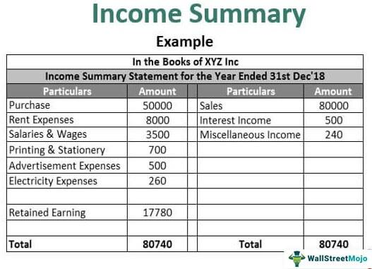

The financial services industry is undergoing constant transformation with the rapid advancement of technology acting as a catalyst for innovation. Among the pioneers in this technological evolution was AlphaMetrix, a significant entity that played a crucial role in bringing algorithmic trading to prominence within the hedge fund industry. Established in 2005, AlphaMetrix leveraged cutting-edge technology to create a managed account platform that provided unprecedented access to hedge fund investment opportunities. Its strategies capitalized on the sophisticated use of algorithms to navigate the complex financial markets, setting a benchmark in investment management.

This article explores the journey of AlphaMetrix, focusing on its strategic approaches, leadership dynamics, and the pivotal moments that led to its eventual collapse. The downfall of AlphaMetrix serves as both a cautionary tale and a learning opportunity about the perils of inadequate financial management, even amid the promise of technological superiority.

Furthermore, this discussion provides a broader understanding of the transformative force of algorithmic trading in the hedge fund sector. By examining AlphaMetrix's impact, the article highlights valuable insights into the integration of technology with investment strategies, thereby offering lessons that continue to shape contemporary practices in financial management.

## Table of Contents

## Background of AlphaMetrix

AlphaMetrix was founded in May 2005, establishing its headquarters in Chicago. It rapidly became a significant player in the hedge fund industry, primarily due to its innovative managed account platform. This platform was designed to offer hedge fund investment opportunities, providing transparency and structured access to a range of managers and strategies. The implementation of this technology not only distinguished AlphaMetrix from traditional hedge funds but also attracted a substantial amount of assets under management.

A pivotal figure in the company's development was Aleks Kins, who served as both President and CEO. Under his leadership, AlphaMetrix emphasized technological advancement and strategic growth. The firm effectively utilized its managed account platform to transform traditional investment paradigms, focusing on algorithmic trading and offering detailed risk management services to clients.

At its peak, AlphaMetrix managed approximately $700 million in assets, largely through various commodity pools. This achievement underscored its influence in the financial market during its operational years. The firm was able to cater to a diverse clientele base, benefiting from the rise in popularity of alternative investment strategies which sought higher returns and diversification benefits.

However, the success of AlphaMetrix was short-lived due to financial challenges that surfaced over time. These issues culminated in the firm's collapse in 2013, primarily triggered by allegations of fund misappropriation. Such allegations played a significant role in undermining investor confidence and destabilizing the firm's operations. The accusations were serious enough to attract regulatory scrutiny, which, combined with operational deficiencies, led to its eventual downfall.

The AlphaMetrix saga emphasizes the precarious nature of financial management and the challenges of maintaining robust governance structures in hedge funds. Despite its innovative approach, the firm's inability to sustain financial integrity ultimately led to its [exit](/wiki/exit-strategy) from the industry.

## AlphaMetrix's Hedge Fund and Algorithmic Trading Strategies

AlphaMetrix was instrumental in integrating technology into [hedge fund](/wiki/hedge-fund-trading-strategies) operations, notably through its [algorithmic trading](/wiki/algorithmic-trading) methodologies. The firm emerged as a pioneer in this domain, capitalizing on advancements in computing and data analytics to enhance its investment strategies and service offerings. 

One of AlphaMetrix's core services was managed account structuring, which allowed investors to access diverse hedge fund strategies while maintaining control over their capital. This approach provided a high degree of transparency, enabling clients to monitor performance and risk in real-time, a significant enhancement over traditional hedge fund vehicles where such visibility is often limited.

The firm's strategy also involved foraying into traditional hedge funds by incorporating a long/short equity vehicle. This move illustrated AlphaMetrix’s commitment to diversifying its investment approaches and addressing a broader spectrum of investor needs. Long/short equity strategies typically entail buying undervalued stocks while shorting overvalued ones, aiming to capitalize on market anomalies while mitigating systemic risk.

A significant innovation by AlphaMetrix was the introduction of AlphaMetrix360, a comprehensive suite of fund administration services designed explicitly for hedge fund managers. This platform provided critical functions such as fund accounting, performance reporting, and compliance monitoring. By automating these processes, AlphaMetrix360 helped managers focus on strategy and execution rather than back-office logistics.

AlphaMetrix’s algorithmic trading strategies were emblematic of an industry-wide trend towards leveraging technology to gain competitive advantages in financial markets. By utilizing sophisticated algorithms, the firm could execute trades with greater speed and precision than traditional human traders. These algorithms analyzed vast datasets to identify patterns and execute trades based on quantitative models. This capability was particularly beneficial in highly liquid and fast-moving markets, where reaction time is crucial.

The deployment of pioneering technology by AlphaMetrix not only streamlined operations but also set a precedent in the hedge fund industry for using technology as a fundamental driver of investment strategy and operational efficiency. Despite the eventual downfall of the firm, its advancements in algorithmic trading continue to influence modern financial services, underscoring the transformative impact of technology in investment management.

## The Downfall of AlphaMetrix

AlphaMetrix initially captured the financial industry's attention with its innovative approach to hedge fund management, especially in algorithmic trading. However, notwithstanding its early successes, the company began experiencing severe cash flow issues that significantly threatened its operations. In 2013, these troubles were compounded when major partners, CME Group and the National Futures Association (NFA), cancelled their contracts with AlphaMetrix. This loss of partnerships not only exacerbated financial challenges but also raised red flags about the firm's stability and operational integrity.

Further complicating AlphaMetrix's troubles, the Commodity Futures Trading Commission (CFTC) accused the firm of misappropriating $2.8 million. This allegation resulted in a legal battle that culminated in a lawsuit and subsequent settlement. Such accusations severely tarnished AlphaMetrix's reputation, undermining trust among investors and further intensifying its financial woes.

Internal audits and reviews exposed serious deficiencies in AlphaMetrix's financial control systems and recordkeeping practices. These inadequacies were critical factors leading to its downfall, highlighting a fundamental disconnect between the firm's technological ambitions and its financial oversight capabilities. The lack of sound financial practices not only led to mismanagement of funds but also contributed to the company's inability to maintain operational solvency during times of financial stress.

The collapse of AlphaMetrix offers a cautionary narrative in the high-stakes hedge fund sector. It underscores the pivotal importance of rigorous financial management, transparent operations, and robust compliance protocols. Hedge fund managers and financial service companies can draw critical lessons from AlphaMetrix's experience, particularly the dangers of financial mismanagement and the need for strong governance frameworks to support innovative trading strategies.

## Impact and Legacy of AlphaMetrix on the Financial Services Industry

AlphaMetrix's legacy in the financial services industry is profound, especially in the context of algorithmic trading within hedge funds. Despite ceasing operations in 2013, the firm left an indelible mark on the sector through its pioneering use of technology and innovative trading methodologies. One of the most significant outcomes of AlphaMetrix's rise and fall is the spotlight it placed on the necessity for transparency and stringent financial controls in investment platforms.

The collapse of AlphaMetrix highlighted the dangers of inadequate oversight and financial mismanagement. The lack of robust financial controls became apparent when the Commodity Futures Trading Commission (CFTC) accused the firm of misappropriating millions, resulting in a legal case that underscored the importance of transparency in the finance industry. This situation has emphasized to industry professionals and regulatory bodies the critical need for enhanced scrutiny and regulation to prevent similar scenarios in the future.

AlphaMetrix's strategic decisions and operational practices remain subjects of industry analysis and discussion. The company's approach to hosting lavish events and its swift expansion demonstrate the potential pitfalls of aggressive growth strategies without adequate risk management and financial discipline. These elements serve as cautionary tales for contemporary hedge funds and algorithmic trading firms, reinforcing the importance of balancing innovation with sound financial practices.

Furthermore, the downfall of AlphaMetrix serves as a case study for understanding the interplay between technology and finance. While the firm successfully leveraged algorithmic trading to achieve a competitive edge, its operational failures provide invaluable lessons. Industry professionals can learn from these experiences, recognizing the complexities and challenges inherent in integrating advanced technology within financial markets.

The regulatory landscape has also been influenced by AlphaMetrix's journey. The firm's collapse prompted a reevaluation of existing regulations and encouraged the development of more comprehensive frameworks to oversee hedge funds and algorithmic trading platforms. This has led to increased calls for transparency, real-time monitoring, and accountability in the management of financial assets.

In summary, AlphaMetrix’s story is an essential reference for understanding how technological advancements and financial management must be harmonized. While its innovations continue to inspire new approaches in algorithmic trading, the firm's missteps provide critical insights into the necessary financial governance and regulatory oversight needed to sustain success in the financial services industry.

## References & Further Reading

[1]: Fishman, R.S. (2013). ["The Downfall of AlphaMetrix: A Cautionary Tale for Hedge Funds"](https://pubmed.ncbi.nlm.nih.gov/17102014/). Bloomberg.

[2]: The Commodity Futures Trading Commission. (2014). ["CFTC Charges Chicago-Based AlphaMetrix and its Principal Aleks Kins with Misappropriating Pool Participant Funds."](https://en.wikipedia.org/wiki/Commodity_Futures_Trading_Commission) CFTC Press Releases.

[3]: ["Advances in Financial Machine Learning"](https://www.amazon.com/Advances-Financial-Machine-Learning-Marcos/dp/1119482089) by Marcos Lopez de Prado

[4]: Lopez, L. (2013). ["The AlphaMetrix Scandal Explained"](https://www.courthousenews.com/its-a-company-not-a-piggy-bank/). Business Insider.

[5]: ["Quantitative Trading: How to Build Your Own Algorithmic Trading Business"](https://www.amazon.com/Quantitative-Trading-Build-Algorithmic-Business/dp/1119800064) by Ernest P. Chan