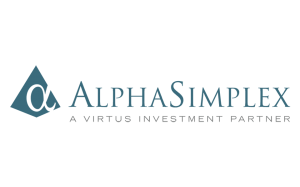

## Table of Contents

## What is AlphaSimplex Group?

AlphaSimplex Group is a company that helps people and other companies invest their money. They focus on using special math and computer methods to make better investment choices. The company was started by a man named Andrew Lo, who is well-known for his work in finance.

They offer different services to help their clients. One of their main services is managing investment funds, where they take care of the money for their clients and try to make it grow. They also do research and create new ways to invest money that can help their clients do better than just saving money in a regular bank account.

## When was AlphaSimplex Group founded?

AlphaSimplex Group was started in 1999. That means it has been around for more than 20 years. The person who started it is Andrew Lo. He is known for his smart ideas about money and investing.

The company helps people and other businesses with their money. They use special math and computer tricks to make good choices about where to put the money. This can help the money grow more than it would in a regular bank account.

## Who are the founders of AlphaSimplex Group?

AlphaSimplex Group was started by Andrew Lo. He is the main founder and he began the company in 1999. Andrew Lo is well-known for his work in finance and he wanted to create a company that uses special math and computer methods to help people invest their money better.

The company helps people and other businesses manage their money. They try to make the money grow by using smart ways to invest it. This can be better than just keeping money in a regular bank account.

## What types of investment strategies does AlphaSimplex Group specialize in?

AlphaSimplex Group specializes in using math and computer methods to make smart choices about where to invest money. They focus a lot on something called "quantitative investing." This means they use numbers and formulas to decide which investments might be good. They look at a lot of data and try to find patterns that can help them pick the best places to put money.

One of the main strategies they use is called "[hedge fund](/wiki/hedge-fund-trading-strategies) strategies." This means they try to make money whether the market is going up or down. They do this by using different kinds of investments at the same time, like stocks, bonds, and other things. This can help them protect the money they manage from big drops in the market.

Another strategy they use is called "risk management." This means they try to keep the money they manage safe by understanding and controlling the risks. They use math to figure out how risky different investments are and then they choose investments that fit with how much risk their clients are okay with. This helps them make safer choices about where to put the money.

## How does AlphaSimplex Group approach risk management?

AlphaSimplex Group uses math to manage risk. They look at a lot of numbers and data to figure out how risky different investments are. By understanding these risks, they can choose investments that match how much risk their clients are okay with. This helps them make safer choices about where to put the money.

They use special formulas and computer programs to find patterns in the data. This helps them predict what might happen to the investments they are thinking about. By doing this, they can try to avoid big losses and protect the money they manage from big drops in the market.

## What are some of the key products offered by AlphaSimplex Group?

AlphaSimplex Group offers a few main products to help people and businesses with their money. One of their key products is called the "Hedge Fund Strategies." These are special funds that try to make money no matter if the market is going up or down. They do this by using different kinds of investments at the same time, like stocks and bonds. This can help protect the money from big drops in the market.

Another important product they offer is called "Managed Futures." This is a type of investment where they use math and computer programs to predict what might happen in the future. They look at a lot of data to find patterns and then make choices about where to invest the money. This can help the money grow over time.

They also offer something called "Risk Management Solutions." These are tools and services that help their clients understand and control the risks of their investments. By using math to figure out how risky different investments are, they can choose safer options that fit with how much risk their clients are okay with. This helps keep the money safe and can lead to better investment results.

## Can you explain the role of quantitative analysis at AlphaSimplex Group?

At AlphaSimplex Group, quantitative analysis is a big part of how they make choices about where to invest money. They use math and computer programs to look at a lot of numbers and data. This helps them find patterns and make predictions about what might happen in the future. By doing this, they can pick investments that they think will do well. It's like using a special tool to see into the future of the market.

Quantitative analysis helps AlphaSimplex Group manage risk too. They use math to figure out how risky different investments are. This way, they can choose investments that match how much risk their clients are okay with. It's like having a safety net that helps keep the money safe. By understanding and controlling the risks, they can make safer choices and protect the money they manage from big drops in the market.

## What is the significance of AlphaSimplex Group in the hedge fund industry?

AlphaSimplex Group is important in the hedge fund industry because they use math and computers to make smart choices about investments. They are known for their special way of doing things, called quantitative analysis. This means they look at a lot of numbers and data to find patterns and make predictions about the future. By doing this, they can pick investments that they think will do well. This approach helps them stand out in the hedge fund world, where many companies are trying to find the best ways to make money for their clients.

Another reason AlphaSimplex Group is significant is because they focus on managing risk. They use math to understand how risky different investments are and then choose investments that fit with how much risk their clients are okay with. This helps them protect the money they manage from big drops in the market. Their focus on risk management and their use of quantitative methods make them a key player in the hedge fund industry, helping to lead the way in how hedge funds can work smarter and safer.

## How has AlphaSimplex Group evolved its investment strategies over time?

Over the years, AlphaSimplex Group has changed its investment strategies to keep up with the market. They started out focusing a lot on using math and computers to make choices about where to invest money. This way of doing things, called quantitative analysis, helped them find patterns in the data and predict what might happen in the future. As time went on, they got better at using these methods and started to use them in more ways. They began to look at even more data and used more complex math to make their predictions more accurate.

Another big change was how they managed risk. At first, they focused on understanding and controlling risk to keep the money they managed safe. Over time, they got better at this and started to use new tools and methods to manage risk even better. They also started to offer more products that help their clients understand and control the risks of their investments. By doing this, they could help their clients make safer choices and protect their money from big drops in the market. These changes have helped AlphaSimplex Group stay a leader in the hedge fund industry.

## What are some notable achievements or milestones of AlphaSimplex Group?

AlphaSimplex Group has been around since 1999 and has made a big name for itself in the world of investing. One of their biggest achievements is how they use math and computers to make smart choices about where to put money. This way of doing things, called quantitative analysis, has helped them find patterns in data and predict what might happen in the future. They've become known as leaders in using this method, which has helped them do well in the hedge fund industry.

Another important milestone for AlphaSimplex Group is how they've gotten better at managing risk. They've always focused on keeping the money they manage safe, but over time, they've developed new tools and methods to do this even better. This has helped them protect their clients' money from big drops in the market. Their work in risk management has made them a trusted name in the industry, showing that they can help people invest their money in a safer way.

## How does AlphaSimplex Group integrate technology and data science in its operations?

AlphaSimplex Group uses technology and data science a lot in its work. They use special computer programs and math to look at a lot of numbers and information. This helps them find patterns in the data and make guesses about what might happen in the future. By doing this, they can pick the best places to put money. It's like using a super smart tool to see into the future of the market. This way of using technology and data science is called quantitative analysis, and it's a big part of how AlphaSimplex Group makes choices about investments.

They also use technology to manage risk. They use math to figure out how risky different investments are. This helps them choose investments that match how much risk their clients are okay with. It's like having a safety net that helps keep the money safe. By understanding and controlling the risks, they can make safer choices and protect the money they manage from big drops in the market. Using technology and data science like this has helped AlphaSimplex Group become a leader in the hedge fund industry.

## What future trends or innovations is AlphaSimplex Group focusing on?

AlphaSimplex Group is always looking for new ways to use technology and data to make better investment choices. They are focusing on using even more advanced math and computer programs to look at data. This can help them find new patterns and make even better guesses about what might happen in the market. They are also working on new ways to use [artificial intelligence](/wiki/ai-artificial-intelligence) and [machine learning](/wiki/machine-learning). These are special kinds of computer programs that can learn from data and make smart choices on their own. By using these new tools, AlphaSimplex Group hopes to stay ahead in the hedge fund industry.

Another big focus for AlphaSimplex Group is on improving how they manage risk. They are working on new tools and methods to understand and control risks even better. This can help them protect the money they manage from big drops in the market. They are also looking at new types of investments that can help their clients make money in different ways. By keeping up with these trends and innovations, AlphaSimplex Group wants to keep being a leader in the world of investing and help their clients do well with their money.

## What is Pioneering Algorithmic Trading?

Algorithmic trading is integral to AlphaSimplex Group's investment strategy, as it leverages mathematical models to make informed, data-driven trading decisions. This approach allows for more efficient and systematic execution of trades, minimizing emotional biases and adhering to rigorous quantitative frameworks.

In 2007, AlphaSimplex demonstrated its innovative prowess by collaborating with Credit Suisse to launch the first 130/30 fund index. This financial product allowed investors to maintain a balanced approach, investing 130% of assets in long positions and 30% in short positions, effectively managing risk while aiming for enhanced returns. The strategy of a 130/30 fund index exemplifies AlphaSimplex's foresight in pioneering market solutions that leverage algorithmic systems to tackle complex investment challenges.

Another hallmark of AlphaSimplex's expertise is their Managed Futures Strategy Fund, introduced in 2010. This fund capitalizes on trend-following strategies underpinned by sophisticated quantitative models. By analyzing past market trends, these models identify and exploit future price dynamics, optimizing portfolio allocations. The trend-following strategy is mathematically represented through various methods, one of which is:

$$
\text{Signal} = \frac{\text{Current Price} - \text{Moving Average}}{\text{Volatility}}
$$

The model generates trading signals based on the deviation of current market prices from their long-term moving averages, normalized by their [volatility](/wiki/volatility-trading-strategies). Such a strategy enables the fund to adapt swiftly to changing market conditions, showcasing AlphaSimplex's capability to utilize algorithms for resilient investment management.

Overall, AlphaSimplex Group's commitment to [algorithmic trading](/wiki/algorithmic-trading) is evident in their product offerings and strategic market innovations, setting a precedent for others in the financial sector.

## References & Further Reading

[1]: Lo, A. W. (2016). ["Adaptive Markets: Financial Evolution at the Speed of Thought."](https://www.amazon.com/Adaptive-Markets-Financial-Evolution-Thought/dp/0691135142) Princeton University Press.

[2]: ["Advances in Financial Machine Learning"](https://www.amazon.com/Advances-Financial-Machine-Learning-Marcos/dp/1119482089) by Marcos Lopez de Prado

[3]: Berger, A., Pukthuanthong, K., & Yang, J. J. (2011). ["International diversification with frontier markets."](https://www.sciencedirect.com/science/article/abs/pii/S0304405X11000420) Journal of Financial Economics.

[4]: ["Quantitative Trading: How to Build Your Own Algorithmic Trading Business"](https://www.amazon.com/Quantitative-Trading-Build-Algorithmic-Business/dp/0470284889) by Ernest P. Chan
