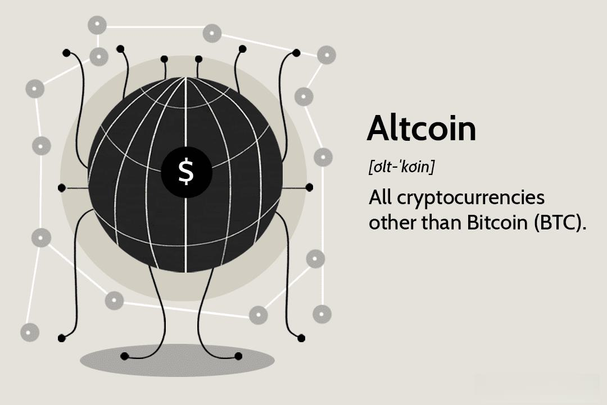

Digital currency, a term broadly encompassing cryptocurrencies and altcoins, represents a significant evolution in the financial sector. Unlike traditional currencies, digital currencies operate entirely online without a physical counterpart. Cryptocurrencies, a subset of digital currency, leverage cryptographic techniques to secure transactions, while altcoins refer to all cryptocurrencies other than Bitcoin, each offering unique functionalities or improvements over the original Bitcoin framework.

These digital assets have profoundly transformed the financial landscape by enabling decentralized, peer-to-peer transactions, thereby reducing dependence on traditional banking systems. The blockchain technology underlying most cryptocurrencies ensures transparency, security, and immutability of transactions. As a result, they have introduced new financial possibilities and have become a viable alternative to conventional financial instruments. Ethereum, for instance, has expanded the application of blockchain by supporting smart contracts, while Ripple focuses on enhancing cross-border payment systems.



The rising popularity and volatility inherent in cryptocurrencies have sparked interest in algorithmic trading (algo trading) within this market. Algorithmic trading employs computer algorithms to execute trades based on predefined criteria, offering speed and precision unmatched by human traders. In the volatile cryptocurrency market, these features are particularly advantageous as they can capitalize on rapid price fluctuations.

This article provides an exploration of the integration of algo trading into the digital currency ecosystem, examining key topics such as advantages, risks, and strategies. We will discuss how algo trading can improve investment outcomes, the unique challenges it faces in the cryptocurrency market, and how it facilitates 24/7 trading. Additionally, the article will present risk management practices specific to crypto algo trading, offering insights into mitigating potential pitfalls. Finally, the anticipated growth of algo trading will be framed within the context of future developments in digital currencies and evolving financial technologies.

Through this comprehensive analysis, readers will gain a deeper understanding of the intersection between cryptocurrency and algorithmic trading, appreciating how technology continues to shape the future of finance.

## Table of Contents

## Understanding Digital Currency and Altcoins

Digital currency refers to a form of currency that is available only in digital or electronic form, unlike physical currencies like coins or banknotes. Digital currencies exhibit properties similar to physical currencies but allow for instantaneous transactions and borderless transfer of ownership. Given their foundation on secure networks and blockchain technology, digital currencies include various types, most notably cryptocurrencies and altcoins.

Cryptocurrencies represent a subset of digital currencies that utilize cryptographic techniques to secure transactions, control the creation of new units, and verify the transfer of assets. Bitcoin, introduced in 2009, pioneered the concept of [cryptocurrency](/wiki/cryptocurrency) and operates on a decentralized peer-to-peer network, eliminating the need for a central authority.

Altcoins, or alternative cryptocurrencies, emerged following Bitcoin to improve on its structure or cater to specific needs in the digital economy. The fundamental difference between Bitcoin and altcoins lies in their design objectives and underlying technology adaptations. While Bitcoin serves as a decentralized digital currency primarily for transactions and as a store of value, altcoins explore various functionalities beyond simple currency exchange, such as decentralized applications (dApps), smart contracts, and privacy enhancements.

The cryptocurrency ecosystem offers a diverse array of altcoins, each with unique features tailored to different use cases. For instance, Ethereum, created by Vitalik Buterin in 2015, expands upon Bitcoin by incorporating smart contracts—self-executing contracts with terms directly written into code, enabling decentralized applications. Ripple (XRP), on the other hand, focuses on facilitating real-time global payments with low transaction costs, providing a bridge currency for financial institutions. Litecoin, created by Charlie Lee in 2011, offers faster transaction confirmation times compared to Bitcoin, making it more suitable for everyday transactions.

The cornerstone of digital currency lies in blockchain technology, a distributed ledger that records transactions across multiple computers in a manner that the recorded information cannot be altered retroactively. This ensures transparency, security, and resistance to tampering. Blockchain technology underpins the operation of cryptocurrencies, allowing for decentralized control, enhanced security through cryptographic techniques, and verifiable transaction records.

To sum up, popular altcoins such as Ethereum, Ripple, and Litecoin demonstrate the diversity within the digital currency landscape, each bringing unique features that extend beyond the initial vision of Bitcoin. These digital assets are underpinned by blockchain technology, which enables secure, decentralized, and efficient transactions, thus shaping the future of the digital economy.

## The Role of Cryptocurrency in Modern Finance

Cryptocurrencies have emerged as a transformative force within traditional financial systems by introducing decentralized and secure mediums of exchange and investment. Unlike conventional currencies, cryptocurrencies operate on a decentralized model facilitated by blockchain technology, a distributed ledger that ensures security and transparency through cryptographic techniques. This decentralization eliminates the need for intermediaries such as banks, reducing transaction costs and counterparty risks.

One of the primary benefits of cryptocurrencies is their potential for enhanced security. Through the use of encryption and public verification, cryptocurrencies mitigate the risk of fraud and unauthorized transactions. Moreover, the immutable nature of blockchain prevents tampering with transaction records, thereby ensuring data integrity. This security paradigm is further reinforced by the decentralized network of nodes overseeing the blockchain, making it resilient against centralized failures and attacks.

Despite these advantages, cryptocurrencies face several challenges and criticisms. First, their high [volatility](/wiki/volatility-trading-strategies) poses significant risks to investors and undermines their reliability as a stable store of value. Price fluctuations can be drastic and unpredictable, frequently deterring potential users and investors concerned about financial stability. Furthermore, the lack of standardized regulations across jurisdictions often leads to regulatory uncertainty. Governments and financial institutions express concerns over the anonymity of cryptocurrencies, which can facilitate illicit activities such as money laundering and tax evasion.

The adoption rate of cryptocurrencies by businesses and consumers has been steadily increasing, driven by growing awareness and the increasing utility of digital assets. Many businesses now accept cryptocurrencies as a legitimate form of payment, benefiting from reduced transaction fees and the appeal to tech-savvy customers. Additionally, the rise of crypto fintech platforms has made it easier for consumers to invest, trade, and utilize cryptocurrencies in everyday transactions.

Regulatory measures play a crucial role in the adoption and acceptance of cryptocurrencies. While certain regions have embraced cryptocurrencies with favorable regulations, others have imposed stringent measures to curb their use and mitigate associated risks. Regulatory clarity is essential for the mainstream acceptance of cryptocurrencies, as it builds trust among consumers and businesses. However, excessive regulation can stifle innovation and limit the potential benefits of cryptocurrencies. Therefore, achieving a balanced regulatory approach is critical for fostering a healthy and sustainable cryptocurrency ecosystem globally.

In summary, cryptocurrencies are reshaping the financial landscape by offering decentralized, secure financial solutions. Despite facing challenges such as volatility and regulatory hurdles, the increasing acceptance by consumers and businesses signifies a shifting paradigm wherein digital currencies are becoming an integral part of modern finance. As regulatory frameworks evolve, the future of cryptocurrencies will depend on balancing the benefits of decentralization with the imperatives of legal oversight and security.

 to Algorithmic Trading

Algorithmic trading, commonly known as algo trading, is a method of executing orders using automated and pre-programmed trading instructions. These instructions are based on variables such as time, price, and quantity. The primary significance of [algorithmic trading](/wiki/algorithmic-trading) in financial markets lies in its ability to enhance trading efficiency and precision, reduce manual intervention errors, and execute trades at speeds beyond human capability.

### Automation of Trading Strategies

In algo trading, algorithms are designed to evaluate a multitude of market conditions and place trades when specific conditions are met. For instance, an algorithm might be programmed to buy a stock when its moving average surpasses a certain threshold, or sell if it drops below another. This automation is achieved through a combination of historical data analysis, mathematical models, and execution strategies. Traders can automate strategies that would otherwise be time-consuming and error-prone due to the labor-intensive nature of manual trading.

### Benefits of Algorithmic Trading

The automation inherent in algorithmic trading provides several key advantages:

- **Speed**: Algorithms can execute orders in milliseconds. The speed at which these trades occur can mean the difference between profit and loss, especially in volatile markets.

- **Precision**: Algorithms minimize the risks of manual errors that can occur during human processing of trade data. This ensures that the instructions are executed exactly as planned, without emotional interference.

- **Reduced Human Error**: By eliminating the need for manual intervention, algo trading reduces the likelihood of mistakes that can arise from fatigue or decision-making biases.

### Common Types of Algorithms

There are several types of algorithms used in trading, each tailored to different objectives:

- **Trend-following Algorithms**: These are based on moving averages and channel breakout methodologies. They rely on the assumption that asset prices tend to move in trends. 

- **Arbitrage Algorithms**: These seek to exploit price discrepancies between different markets or instruments. For example, if a stock is traded at different prices on two exchanges, an arbitrage algorithm would simultaneously buy and sell the stock to profit from the difference.

- **Market Making Algorithms**: These algorithms provide liquidity to the market by continuously quoting buy and sell prices for various assets, capturing the spread as profit.

- **Volume-weighted Average Price (VWAP) and Time-weighted Average Price (TWAP)**: Used to execute large order volumes without significantly affecting the market price by breaking down the order into smaller parts executed over a specified time period.

### History and Evolution

The roots of algorithmic trading date back to the 1970s with the advent of electronic trading systems. The earliest forms were primarily used for simple tasks like calculating the execution price of large stock orders. As computing power and data processing capabilities advanced, algorithms became more sophisticated and integral to modern finance.

The 1990s saw a surge in high-frequency trading ([HFT](/wiki/high-frequency-trading-strategies)), a subset of algorithmic trading characterized by extremely high speeds of execution and a high turnover of positions. This era marked the broad adoption of algo trading strategies across various asset classes.

In recent years, technological advancements such as [machine learning](/wiki/machine-learning) and [artificial intelligence](/wiki/ai-artificial-intelligence) have further transformed algorithmic trading, enabling strategies that adapt in real-time to changing market conditions, thus enhancing their potential accuracy and effectiveness. 

Algorithmic trading continues to evolve, with innovations aimed at leveraging ever-increasing volumes of data and expanding computational resources, continuing to shape the landscape of global financial markets.

## Algo Trading in the Cryptocurrency Market

Algorithmic trading, commonly known as algo trading, has become increasingly integrated into the cryptocurrency market, leveraging advanced computational methods to automate and optimize trading decisions. This integration brings both unique challenges and significant opportunities to traders and investors.

The volatile nature of cryptocurrencies presents specific challenges for algo trading. Unlike traditional financial markets, cryptocurrency markets operate 24/7 and experience rapid price swings, sometimes exceeding 10% within hours. This intense volatility requires algorithms to not only be swift but also exceptionally adaptable to sudden market changes. Furthermore, [liquidity](/wiki/liquidity-risk-premium) in the crypto market can be fragmented across numerous exchanges, impacting an algorithm’s ability to execute large trades without causing substantial price shifts, a phenomenon known as slippage.

Despite these challenges, algo trading offers considerable advantages in the cryptocurrency sphere. One of the primary benefits is the ability to capitalize on [arbitrage](/wiki/arbitrage) opportunities. Cryptocurrency prices can vary significantly between exchanges due to decentralized markets and differing levels of liquidity. Arbitrage strategies capitalize on these price discrepancies, buying low on one exchange and selling high on another, often within milliseconds. Another successful strategy is trend-following algorithms, which utilize technical indicators to identify and explore market trends in directional movements. Additionally, mean reversion strategies, which predict that prices will revert to a mean value over time, are also widely adopted by crypto traders.

To facilitate effective algo trading in cryptocurrency markets, a variety of platforms and tools have been developed. These platforms, such as TradeSanta, CryptoHopper, and 3Commas, offer traders advanced algorithmic frameworks supported by features like [backtesting](/wiki/backtesting), risk management systems, and API integrations with major exchanges. They allow users to deploy sophisticated trading bots that operate autonomously, executing trades based on predefined strategies.

Python, a preferred programming language for algo trading due to its simplicity and extensive libraries, is widely used for developing cryptocurrency trading algorithms. For example, the `ccxt` library provides a comprehensive interface for interacting with many crypto exchange platforms, allowing developers to construct algorithms capable of executing trades and managing portfolios. A simple example of using Python for algo trading might involve setting up a bot to check price movements and execute trades based on specific signals:

```python
import ccxt

# Initialize exchange
exchange = ccxt.binance({
    'apiKey': 'YOUR_API_KEY',
    'secret': 'YOUR_SECRET',
})

# Fetch current market price
ticker = exchange.fetch_ticker('BTC/USDT')

# Sample logic for a simple moving average crossover
def trade_logic():
    long_moving_average = calculate_sma(period=50)
    short_moving_average = calculate_sma(period=14)

    if short_moving_average > long_moving_average:
        place_order('buy', quantity)
    elif short_moving_average < long_moving_average:
        place_order('sell', quantity)

def calculate_sma(period):
    # Fetch historical data
    ohlcv = exchange.fetch_ohlcv('BTC/USDT', timeframe='1d')
    close_prices = [x[4] for x in ohlcv]
    return sum(close_prices[-period:]) / period

def place_order(order_type, quantity):
    if order_type == 'buy':
        exchange.create_market_buy_order('BTC/USDT', quantity)
    elif order_type == 'sell':
        exchange.create_market_sell_order('BTC/USDT', quantity)

# Implement trade logic
trade_logic()
```

In conclusion, while crypto algo trading involves navigating significant market volatility and liquidity challenges, it offers unparalleled opportunities for strategic innovation and optimization. Platforms and tools designed for crypto algo trading enable both novice and seasoned traders to exploit these opportunities effectively, driving the increasing sophistication and success in cryptocurrency markets.

## Advantages of Using Algorithms for Cryptocurrency Trading

Algorithmic trading, or algo trading, is increasingly recognized for its substantial benefits within the cryptocurrency market. This section explores these advantages, emphasizing how algorithms enhance trading efficiency, risk management, scalability, and continuous market engagement.

### Improved Investment Returns

Algo trading enhances investment returns by leveraging sophisticated trading strategies that capitalize on market inefficiencies. Algorithms can process vast amounts of market data, perform complex calculations, and execute trades with split-second timing. This precision allows traders to take advantage of arbitrage opportunities, implement high-frequency trading strategies, and optimize entry and [exit](/wiki/exit-strategy) points to maximize profits. For example, a trading algorithm might be set to execute a buy order when a cryptocurrency's price dips below a specified moving average and sell when it exceeds another threshold:

```python
def trade_signal(prices, short_window=20, long_window=50):
    signals = pd.DataFrame(index=prices.index)
    signals['short_mavg'] = prices.rolling(window=short_window, min_periods=1).mean()
    signals['long_mavg'] = prices.rolling(window=long_window, min_periods=1).mean()
    signals['signal'] = 0.0
    signals['signal'][short_window:] = np.where(signals['short_mavg'][short_window:] 
                                                > signals['long_mavg'][short_window:], 1.0, 0.0)
    signals['positions'] = signals['signal'].diff()
    return signals
```

### Risk Management Features

Algorithmic strategies in cryptocurrency trading provide inherent risk management features by establishing predefined rules and constraints for trading activities. These algorithms can assess risk metrics such as volatility and set parameters for stop-loss and take-profit orders, minimizing losses and securing gains automatically. By consistently applying these rules, algo trading minimizes emotional biases and reduces human errors that could result from impulsive decision-making during market fluctuations.

### Scalability and Flexibility

Algo trading systems are capable of handling large volumes of transactions simultaneously, offering exceptional scalability. This is especially pertinent in the cryptocurrency market, known for its high liquidity and rapid price changes. Algorithms can efficiently manage diversified portfolios, perform trades across multiple exchanges, and rapidly adapt to market conditions, thereby increasing operational efficiency. This flexibility allows traders to implement and manage complex strategies that could be challenging to execute manually.

### 24/7 Market Participation

The cryptocurrency market operates non-stop, 24/7, due to its decentralized nature. Algorithms are particularly beneficial in this context as they facilitate continuous participation in the market without the need for constant human oversight. This ensures trading opportunities are not missed regardless of time zones or market hours, which is crucial for markets subjected to frequent price shifts. Algorithms can monitor multiple markets and execute transactions automatically, ensuring potential opportunities are seized regardless of external time constraints.

In conclusion, algorithmic trading offers enhanced returns, improved risk management, scalability, flexibility, and uninterrupted market engagement, making it an invaluable tool for cryptocurrency traders. These capabilities exemplify the integration of technology and finance, providing traders with robust frameworks to optimize their strategies and achieve better outcomes in the dynamic crypto market.

## Risks and Challenges in Cryptocurrency Algo Trading

Algorithmic trading in the cryptocurrency market is accompanied by specific risks and challenges that necessitate careful consideration and planning. One of the primary concerns is the inherent volatility of the cryptocurrency market, which can lead to extreme price fluctuations within short timeframes. This volatility can significantly impact algorithmic performance, as algorithms are typically designed based on historical data, which may not accurately predict future market behaviors. The unpredictable nature of the market can result in algorithmic strategies that perform poorly during unanticipated events or market anomalies.

Technical challenges are also prevalent in crypto algo trading. These challenges include latency issues, where delays in data processing and execution can lead to suboptimal trades, particularly in a fast-moving market. Furthermore, the reliability of trading algorithms depends heavily on rigorous algorithmic testing, often incorporating simulations known as backtesting. Backtesting involves applying trading algorithms to historical market data to evaluate their potential effectiveness. It is crucial to ensure that backtesting is comprehensive to detect any underlying weaknesses or biases in the algorithm, thereby improving its reliability and robustness in live trading scenarios.

Regulatory and security concerns are additional considerations for cryptocurrency algo traders. Regulatory frameworks for cryptocurrencies vary significantly across jurisdictions and are continuously evolving. This regulatory uncertainty can affect market dynamics and the legality of trading practices. Security concerns also loom large, with the risk of hacking and cyberattacks on exchanges and trading platforms posing a substantial threat. Ensuring that adequate security measures, such as robust encryption and two-[factor](/wiki/factor-investing) authentication, are in place is vital to safeguarding assets and sensitive information.

To mitigate these risks, traders can adopt several strategies. Diversification of trading strategies can help manage risk by not relying solely on a single algorithmic approach. Continuous monitoring and adaptive strategies that can adjust to changing market conditions are essential for maintaining performance. Moreover, traders should stay informed about regulatory developments and ensure compliance to avoid legal repercussions. Engaging with a secure and reputable trading platform, along with implementing rigorous security protocols, can further enhance the safety and efficacy of cryptocurrency algo trading.

In summary, navigating the risks and challenges in cryptocurrency algo trading requires a multifaceted approach that includes addressing technical challenges, preparing for market anomalies, adhering to regulatory requirements, and implementing stringent security measures. By doing so, traders can optimize their algorithmic strategies and enhance their performance in this dynamic financial landscape.

## Setting Up for Successful Cryptocurrency Algo Trading

Setting up for successful cryptocurrency algorithmic trading requires a careful approach, involving selecting the right tools, continual learning, and strategy refinement. Beginners must first understand the essential elements involved in choosing appropriate trading bots and platforms.

**Choosing the Right Trading Bot and Platform**

The primary step in cryptocurrency algo trading is selecting a reliable trading bot and platform. A trading bot automates transactions based on predetermined strategies. When choosing a bot, consider factors such as customization options, security features, and historical performance. Some popular trading bots include HaasOnline, Cryptohopper, and 3Commas. As for platforms, Binance, Coinbase Pro, and Kraken are widely used due to their robustness and range of trading pairs. Security and usability should be priorities since they significantly affect the efficiency of executing trades. 

**Continuous Learning and Adapting Strategies**

The cryptocurrency market is highly volatile, necessitating ongoing learning and strategic adaptation. Traders should consistently update their knowledge of market trends, technical analysis, and emerging technologies. Engaging with online communities, attending webinars, and taking courses can enhance understanding. Moreover, algorithmic strategies must be scrutinized and adjusted regularly to adapt to market conditions. This involves revisiting assumptions, refining parameters, and updating algorithms to reflect the latest insights.

**Backtesting for Optimizing Algorithms**

Backtesting is a pivotal process in which traders apply their strategies retrospectively to historical market data. This practice allows them to evaluate how strategies would have performed previously, helping identify potential flaws or areas for improvement. Python is an excellent language for conducting backtests due to its libraries like `pandas` for data manipulation and `[backtrader](/wiki/backtrader)` for strategy testing. For example:

```python
import backtrader as bt

class MyStrategy(bt.Strategy):
    def next(self):
        if self.data.close[0] > self.data.close[-1]:
            self.buy(size=10)
        elif self.data.close[0] < self.data.close[-1]:
            self.sell(size=10)

cerebro = bt.Cerebro()
cerebro.addstrategy(MyStrategy)
cerebro.run()
```

This simple strategy checks if the closing price is higher than the previous one to buy or lower to sell. Backtesting such strategies helps in iterating and optimizing them before live deployment.

**Step-by-Step Guide to Starting with Crypto Algo Trading**

1. **Education**: Begin with understanding the basics of both cryptocurrency and algorithmic trading.
2. **Platform and Bot Selection**: Select a trusted platform and a customizable, secure trading bot as per your requirements.
3. **Account Setup**: Open accounts on selected exchanges and bots, ensuring 2FA and other security measures are activated.
4. **Capital Allocation**: Decide on the portion of funds to allocate for algo trading, stressing only using capital you can afford to lose.
5. **Strategy Development**: Develop or choose a strategy suitable for current market conditions and align with your risk tolerance.
6. **Backtesting**: Rigorously backtest the strategy against historical data to assess potential performance and refine accordingly.
7. **Paper Trading**: Conduct paper (simulated) trading to practice without financial risk and further tweak your approach.
8. **Live Deployment**: Execute your strategy in a live environment, starting with modest amounts to manage risk.
9. **Continuous Monitoring**: Continuously monitor performance, stay updated with market shifts, and adapt strategies as necessary.

Through careful selection of tools and strategies, continuous market research, and frequent reassessment of trading algorithms, beginners can set themselves up for successful cryptocurrency algo trading.

## The Future of Digital Currency and Algorithmic Trading

As the landscape of digital currencies continues to evolve, several trends can be anticipated that will shape the future of these assets and their interaction with algorithmic trading technologies. Digital currencies, including cryptocurrencies and their derivatives, are gaining traction due to their decentralized nature, providing a viable alternative to traditional financial systems. As these technologies mature, their integration with cutting-edge advancements in algorithmic trading is expected to bring transformative changes to global markets.

**Evolution of Algorithmic Trading Technologies:**

Algorithmic trading is expected to become more sophisticated with the integration of advanced technologies such as artificial intelligence (AI) and machine learning. These technologies can optimize trading algorithms by analyzing large datasets to uncover patterns and predict market movements more accurately. Machine learning models, such as neural networks, could theoretically enhance predictive capabilities by learning from historical trading data and continuously adapting to new information. For example, a Python-based machine learning model could be designed to optimize a trading strategy using historical data:

```python
import pandas as pd
from sklearn.model_selection import train_test_split
from sklearn.ensemble import RandomForestRegressor
from sklearn.metrics import mean_squared_error

# Load dataset
data = pd.read_csv('crypto_data.csv')
X = data.drop('target', axis=1)
y = data['target']

# Train-test split
X_train, X_test, y_train, y_test = train_test_split(X, y, test_size=0.2, random_state=42)

# Initialize and fit the model
model = RandomForestRegressor(n_estimators=100, random_state=42)
model.fit(X_train, y_train)

# Predict and evaluate
y_pred = model.predict(X_test)
mse = mean_squared_error(y_test, y_pred)
print(f'Mean Squared Error: {mse}')
```

This continual learning and adaptation make algorithmic trading not just faster but potentially more accurate in capitalizing on market opportunities.

**Impact of AI and Machine Learning:**

The integration of AI and machine learning is poised to revolutionize the way trading strategies are formulated and executed. These technologies enable real-time analysis and decision-making processes, enhancing the trading experience by reducing latency and improving efficiency. AI-driven systems offer the potential for autonomous trading platforms that can operate with minimal human intervention, further pushing the boundaries of market dynamics. The synergistic use of AI could also lead to more personalized investment strategies tailored to individual preferences and risk appetites.

**Cryptocurrency Adoption and Regulation:**

Cryptocurrency adoption is predicted to increase as more businesses and consumers recognize the benefits of digital currencies. However, regulatory frameworks will also play a pivotal role in determining the pace of this adoption. Governments across the globe are exploring ways to regulate digital currencies to combat illegal activities while encouraging innovation. The evolving regulatory landscape may lead to more standardized practices and increased investor confidence, potentially boosting adoption rates.

**Anticipated Growth of Algo Trading in Global Markets:**

The expansion of algorithmic trading within the global financial markets is expected to continue, driven by technological advancements and the increasing complexities of market environments. As the digital currency market grows, the demand for sophisticated trading algorithms that can handle volatility and leverage arbitrage opportunities will rise. This anticipated growth will be supported by the proliferation of trading platforms and tools specifically designed for algorithmic trading in cryptocurrencies, offering more accessible entry points for institutional and retail investors alike.

In conclusion, the convergence of digital currency innovations with the advancement of algorithmic trading technologies signals a transformative period in global financial markets. The future promises enhanced efficiency, accuracy, and accessibility in trading, driven primarily by AI and machine learning. As regulatory frameworks solidify and public adoption increases, the integration of these technologies will likely redefine traditional financial landscapes, offering new opportunities and challenges alike.

## Conclusion

In summarizing the exploration of digital currencies and algorithmic trading (algo trading), it's clear that these innovations are pivotal in revolutionizing the financial sector. Digital currencies, encompassing cryptocurrencies and altcoins, represent a shift towards decentralized and secure financial systems. Understanding these digital assets is vital as they offer numerous benefits, including enhanced security, reduced transaction costs, and a democratized access to financial services.

Algorithmic trading has proven itself crucial, particularly in the cryptocurrency market, offering speed, precision, and the ability to operate without human error. The use of advanced algorithms and trading bots reflects how technology has become integral to analyzing and responding to market conditions more efficiently. This intersection of digital currency and algo trading suggests a future where financial systems are becoming increasingly sophisticated and automated.

It's important for individuals and businesses to continue their education on these subjects to stay ahead in a rapidly evolving financial landscape. Engaging with ongoing developments, from regulatory changes to technological advancements, is essential for leveraging these tools effectively.

The role of technology in shaping the future of financial markets cannot be overstated. As AI and machine learning evolve, they promise further advancements in algo trading, potentially optimizing trading strategies beyond current capabilities. The anticipated growth of these technologies suggests a future where financial markets are more accessible and efficient.

In conclusion, the integration of cryptocurrency and algorithmic trading heralds a transformative era in finance, promising improved market dynamics and new opportunities for innovation. As the financial landscape continues to evolve, embracing these changes and understanding their implications will be crucial for success.

## References & Further Reading

[1]: Bergstra, J., Bardenet, R., Bengio, Y., & Kégl, B. (2011). ["Algorithms for Hyper-Parameter Optimization."](https://dl.acm.org/doi/10.5555/2986459.2986743) Advances in Neural Information Processing Systems 24.

[2]: ["Advances in Financial Machine Learning"](https://www.amazon.com/Advances-Financial-Machine-Learning-Marcos/dp/1119482089) by Marcos Lopez de Prado

[3]: ["Evidence-Based Technical Analysis: Applying the Scientific Method and Statistical Inference to Trading Signals"](https://www.amazon.com/Evidence-Based-Technical-Analysis-Scientific-Statistical/dp/0470008741) by David Aronson

[4]: ["Machine Learning for Algorithmic Trading"](https://github.com/stefan-jansen/machine-learning-for-trading) by Stefan Jansen

[5]: ["Quantitative Trading: How to Build Your Own Algorithmic Trading Business"](https://www.amazon.com/Quantitative-Trading-Build-Algorithmic-Business/dp/1119800064) by Ernest P. Chan