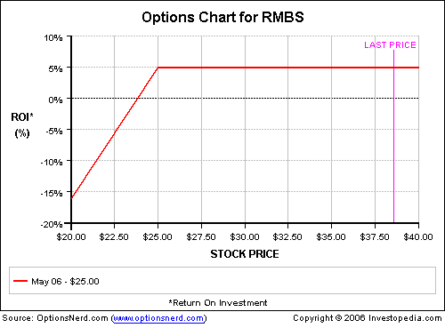

Options trading has become increasingly popular among investors, applauded for its flexibility and the potential to achieve substantial financial returns. This method of trading allows investors to hedge risks, speculate on the future direction of stock prices, or earn additional income, making it an attractive option for diverse trading strategies.

One notable strategy within options trading is the covered call. The covered call strategy involves buying an underlying asset, such as a stock, and simultaneously selling a call option on that asset. This approach is beneficial as it enables investors to receive the premium from the sale of the call option, adding to the income generated from holding the stock. It is particularly advantageous when the investor expects the asset's price to remain relatively unchanged. In this scenario, the investor keeps the premium while continuing to hold the asset if the option expires out-of-the-money.



The advent of algorithmic trading has introduced new efficiencies to many trading strategies, including covered calls. Algorithmic trading, often referred to as 'algo trading,' involves the use of computer programs to follow a defined set of instructions for placing trades. Such automation minimizes emotional interference and enhances decision-making precision. By leveraging algorithms, traders can optimize the management of covered call strategies, ensuring trades are executed with improved consistency and less manual oversight.

This article explores how the implementation of algorithms in covered call trading strategies can enhance their adaptability and effectiveness. It will cover the benefits of automation, from increasing operational efficiency to improving risk management. Moreover, the article will discuss how to implement these algorithmic strategies, highlighting the resources and platforms available for such endeavors. Finally, the article will address potential pitfalls of automation, such as over-optimization, technical failures, and liquidity risks, encouraging traders to exercise careful monitoring and strategy refinement.

Algorithmic trading holds the promise of advancing covered call strategies by enhancing returns and mitigating risks. However, as with any innovation, potential challenges must be thoughtfully managed to harness its full potential in the options trading landscape.

## Table of Contents

## Understanding Covered Call Strategy

A covered call is a financial strategy employed by investors aiming to generate additional income from equities they already own. The strategy involves two primary actions: purchasing an asset, typically stocks, and concurrently writing (selling) call options on the same asset. This combination forms the foundation of the covered call strategy.

The core benefit for investors engaging in covered call strategies is the premium received from selling the call options. When an investor writes a call option, they sell the right to another party to purchase the underlying asset at a predetermined price (the strike price) before the option's expiration date. In exchange for this right, the option buyer pays a premium to the writer (seller) of the call. This premium serves as immediate income for the investor, providing a financial cushion or return that can enhance overall investment returns.

The covered call strategy is particularly advantageous for investors who anticipate that the underlying asset's price will remain relatively stable over the option's duration. By selling call options, investors can capitalize on this stability to generate income without divesting their original stock holdings. If the stock price remains below the strike price at expiration, the call option will expire worthless, allowing the investor to retain both the premium received and the underlying asset.

However, it is crucial to recognize that the covered call strategy does impose an obligation on the investor. If the price of the underlying asset rises above the strike price, the option buyer may choose to exercise their option, requiring the investor to sell their asset at the strike price. In such a scenario, the investor benefits from the premium received but foregoes any additional upside potential beyond the strike price.

This strategy effectively offers a way to generate additional income on stocks an investor is already holding, particularly when the investor's outlook on the asset is neutral to slightly bullish. This can be a particularly attractive approach for investors seeking to enhance returns on a stagnant stock portfolio or during periods of market stability.

## The Role of Algorithmic Trading in Covered Calls

Algorithmic trading refers to the use of computer programs and algorithms to execute trading strategies automatically. This approach is especially beneficial in options trading, including covered call strategies, due to its ability to enhance decision-making and optimize trade execution.

Automation in trading significantly reduces the influence of human emotions, such as fear and greed, which can lead to irrational decisions. By relying on predefined criteria, algorithms ensure that trades are executed systematically and consistently, adhering strictly to the strategy's parameters. This consistency is critical in covered call strategies, where the timing and execution of option sales play a crucial role in maximizing returns and mitigating risks.

One of the primary advantages of implementing [algorithmic trading](/wiki/algorithmic-trading) in covered call strategies is the increase in efficiency and precision. Algorithms can process vast amounts of data swiftly, identifying optimal entry and [exit](/wiki/exit-strategy) points for trades. This capability allows traders to capitalize on small price movements and market inefficiencies that might be missed by human traders. Additionally, algorithms can execute trades at speeds that are impossible for manual trading, reducing the time gap between decision-making and execution, thereby potentially improving transaction costs and overall profitability.

Another critical feature of algorithmic trading is its ability to monitor current market conditions and adjust strategies in real time. This dynamic response is essential in options trading, where market [volatility](/wiki/volatility-trading-strategies) can significantly impact the performance of trading strategies. Algorithms can be programmed to automatically modify strike prices, adjust option expiration dates, or even suspend trading activity in response to market changes. This adaptability ensures that the covered call strategy remains aligned with market conditions, thereby optimizing its effectiveness.

The mathematical models underlying algorithmic trading facilitate these capabilities, employing techniques such as statistical analysis, [machine learning](/wiki/machine-learning), and optimization. Consider a Python example that calculates the optimal strike price for a covered call option:

```python
import numpy as np
from scipy.stats import norm

def black_scholes_call(S, K, T, r, sigma):
    d1 = (np.log(S/K) + (r + sigma**2 / 2) * T) / (sigma * np.sqrt(T))
    d2 = d1 - sigma * np.sqrt(T)
    call_price = S * norm.cdf(d1) - K * np.exp(-r * T) * norm.cdf(d2)
    return call_price

# Example parameters
S = 100  # Current stock price
K = 105  # Strike price
T = 1    # Time to expiration in years
r = 0.05 # Risk-free interest rate
sigma = 0.2 # Stock volatility

optimal_strike_price = black_scholes_call(S, K, T, r, sigma)
print("Optimal Call Price: ", optimal_strike_price)
```

In this example, the Black-Scholes model is used to determine the price of a call option based on various factors such as the underlying stock price, strike price, time to expiration, risk-free [interest rate](/wiki/interest-rate-trading-strategies), and stock volatility. Algorithms can leverage such financial models to make more informed trading decisions.

In summary, algorithmic trading plays a pivotal role in enhancing the execution of covered call strategies through automation, increased efficiency and precision, and real-time market responsiveness. These advantages make it an indispensable tool for traders seeking to optimize their options trading outcomes.

## Benefits of Automating Covered Call Strategies

Automating covered call strategies provides numerous advantages for traders seeking efficiency and consistency in options trading. One of the primary benefits is time efficiency. Algorithms are capable of executing trades continuously, without breaks, allowing them to take advantage of trading opportunities that might arise outside of regular market hours. This 24/7 capability ensures that potential premiums from call options do not go unclaimed due to human oversight or time constraints, as algorithms can seamlessly monitor and react to market conditions in real time.

Risk management is another crucial benefit offered by automated strategies. By adhering strictly to predefined risk parameters, algorithms can help prevent emotionally-driven decision-making, a common pitfall in manual trading. In this automated environment, parameters such as maximum loss limits, position sizes, and target premiums can be rigorously enforced, minimizing the chance of human error or emotional bias affecting trade outcomes. This strict adherence ensures that the risk is consistently maintained within acceptable boundaries.

Scalability is also significantly enhanced through automation. Managing multiple positions simultaneously can be a daunting task for human traders, but algorithms excel at handling complex operations across various assets and markets. By employing automated covered call strategies, traders can efficiently manage a diversified portfolio, reaping the benefits of economies of scale without the need for additional human resources. This scalability is crucial for enabling traders to expand their activities and manage larger portfolios while maintaining effective oversight.

Consistency in executing trades is another important advantage of using algorithms in covered call strategies. Once a strategy is programmed into an algorithm, it is executed consistently according to predefined rules, eliminating abrupt changes that might occur from subjective judgment. This ensures that the strategy's fundamentals are faithfully followed, providing a stable framework for assessing performance over time. By maintaining this level of consistency, traders can build a reliable, long-term approach to generating additional income through options trading.

In conclusion, the automation of covered call strategies provides significant benefits in terms of time efficiency, risk management, scalability, and consistency. These advantages make algorithmic trading an attractive option for those looking to enhance their covered call strategies, allowing them to focus on refining their approach and achieving better trading outcomes.

## Implementing Algorithmic Covered Call Strategies

Implementing algorithmic covered call strategies involves selecting the appropriate trading platform and tools for programmatic trading. Among the popular choices for automating covered calls are Python, TDAmeritrade, and Lattco’s AutoPilot. Each of these platforms offers unique features that facilitate the automation of trading strategies.

Python is a versatile programming language with extensive libraries like NumPy and Pandas for data manipulation, and PyAlgoTrade and Backtrader for creating and [backtesting](/wiki/backtesting) trading strategies. Python's rich ecosystem makes it ideal for traders who prefer customizable solutions. Its flexibility allows for crafting scripts that can automate the process of scanning for suitable stocks, calculating optimal strike prices, and executing trades based on predefined criteria.

TDAmeritrade provides robust trading resources through its thinkorswim platform, which supports algorithmic trading. It offers an API that can be accessed using Python, enabling traders to automate their strategies. TDAmeritrade’s platform is particularly suitable for those looking for a comprehensive solution with advanced analytics and charting tools.

Lattco’s AutoPilot is another prominent choice, delivering user-friendly interfaces and algorithmic capabilities. It allows traders to automate covered call strategies with minimal programming expertise. AutoPilot's intuitive design is beneficial for those who desire a straightforward setup to manage and execute trades.

Regardless of the platform, implementing an algorithmic covered call strategy typically involves selecting suitable stocks, determining optimal strike prices, and choosing expiration dates that align with the strategy’s objectives. A critical step in this process is backtesting, which involves running the strategy against historical data to evaluate its performance before deploying it in live markets. Backtesting helps traders identify potential weaknesses in their strategy and optimize parameters to improve future performance.

Here is a simple Python example using Backtrader, a popular backtesting library:

```python
import backtrader as bt

class CoveredCallStrategy(bt.SignalStrategy):
    def __init__(self):
        # Example condition for initiating a covered call position
        self.signal_add(bt.SIGNAL_LONG, data.close > data.close(-1))

    def next(self):
        if self.position:
            # Logic to sell call option if conditions are met
            pass

cerebro = bt.Cerebro()
cerebro.addstrategy(CoveredCallStrategy)
data = bt.feeds.YahooFinanceData(dataname='AAPL', fromdate='2020-01-01', todate='2021-01-01')
cerebro.adddata(data)
cerebro.run()
```

This code sets up a basic framework for testing a covered call strategy. It involves monitoring the asset price and executing trades based on a simple moving average crossover, demonstrating the general process of strategy development and evaluation. Adjustments can be made for specific conditions, such as volatility or upcoming earnings reports, providing the flexibility needed for complex trading strategies.

Implementing algorithmic covered call strategies demands selecting the right tools, setting clear criteria, and thoroughly backtesting to ensure robust performance in live trading environments.

## Potential Pitfalls of Automation

Over-optimization in algorithmic trading can result in strategies that are finely tuned to historical data but fail to perform in varying market conditions. This phenomenon, often termed as "curve fitting," occurs when a trading model is excessively tailored to past data, capturing noise rather than the underlying trends. Such strategies may yield exceptional results during backtesting but falter when exposed to live market dynamics. A robust approach involves using techniques like cross-validation and walk-forward optimization to ensure that the strategy is generalized and not just profitable during historical testing.

Technological failures are another significant concern in automated trading. Issues such as system crashes, software bugs, and connectivity problems can disrupt the execution of trades, potentially leading to significant financial losses. To mitigate these risks, traders should employ redundant systems, establish reliable data backup protocols, and ensure that contingency plans are in place. Real-time monitoring and alert systems can also help detect and address issues promptly.

Liquidity risks pose a challenge by affecting the ability to enter or exit positions at desired price levels. Automated strategies may struggle during periods of low [liquidity](/wiki/liquidity-risk-premium), leading to slippage—a difference between the expected and actual prices. This discrepancy can erode profits or exacerbate losses. Conducting liquidity analyses and adjusting position sizes based on market conditions are crucial in managing this risk.

Regular monitoring and refinement of automated strategies are essential for maintaining effectiveness. Markets are dynamic, and strategies that succeed today may become obsolete as market conditions evolve. By continuously analyzing performance metrics and adjusting algorithms as necessary, traders can capitalize on new opportunities and minimize exposure to emerging risks. Regular updates ensure that the trading system remains aligned with the current market environment and strategic objectives.

## Conclusion

Algorithmic trading markedly enhances the execution of covered call strategies by providing a structured and systematic approach that minimizes human error and emotional bias. The automation of such strategies is advantageous as it can increase returns while simultaneously reducing risks associated with human trading. This is accomplished through consistent adherence to predefined trading criteria, which facilitates timely and precise execution of trades. 

By leveraging automation, traders can efficiently manage more positions than possible with manual processes, allowing for better diversification and risk management. The scalability of automated systems enables the handling of numerous positions without diminishing the quality of execution. Furthermore, algorithms can incorporate advanced risk management techniques, applying strict adherence to stop-loss orders or position limits, further mitigating potential downsides.

However, traders should remain vigilant of potential risks associated with automation. Algorithmic systems, while generally reliable, are vulnerable to technical failures such as connectivity issues and software bugs, which can disrupt trading activities. Moreover, over-reliance on algorithmic strategies can lead to complacency, potentially resulting in lack of oversight and inadequate responses to unexpected market conditions. To address these concerns, continuous monitoring and regular refinement of trading algorithms are essential. Testing strategies under various market conditions and incorporating dynamic market data can help maintain their efficacy and relevance.

In conclusion, when properly implemented and diligently overseen, automated covered call strategies can not only streamline trading operations but also significantly enhance the efficiency and profitability of options trading. By marrying technology with strategic investment principles, traders can harness the full potential of advanced algorithmic tools to optimize their covered call strategies.

## References & Further Reading

[1]: Bergstra, J., Bardenet, R., Bengio, Y., & Kégl, B. (2011). ["Algorithms for Hyper-Parameter Optimization."](https://dl.acm.org/doi/10.5555/2986459.2986743) Advances in Neural Information Processing Systems 24.

[2]: ["Advances in Financial Machine Learning"](https://www.amazon.com/Advances-Financial-Machine-Learning-Marcos/dp/1119482089) by Marcos Lopez de Prado

[3]: ["Evidence-Based Technical Analysis: Applying the Scientific Method and Statistical Inference to Trading Signals"](https://www.amazon.com/Evidence-Based-Technical-Analysis-Scientific-Statistical/dp/0470008741) by David Aronson

[4]: ["Machine Learning for Algorithmic Trading"](https://github.com/stefan-jansen/machine-learning-for-trading) by Stefan Jansen

[5]: ["Quantitative Trading: How to Build Your Own Algorithmic Trading Business"](https://github.com/LucindaYa/quant-resources/blob/master/Quantitative%20Trading%20How%20to%20Build%20Your%20Own%20Algorithmic%20Trading%20Business.pdf) by Ernest P. Chan