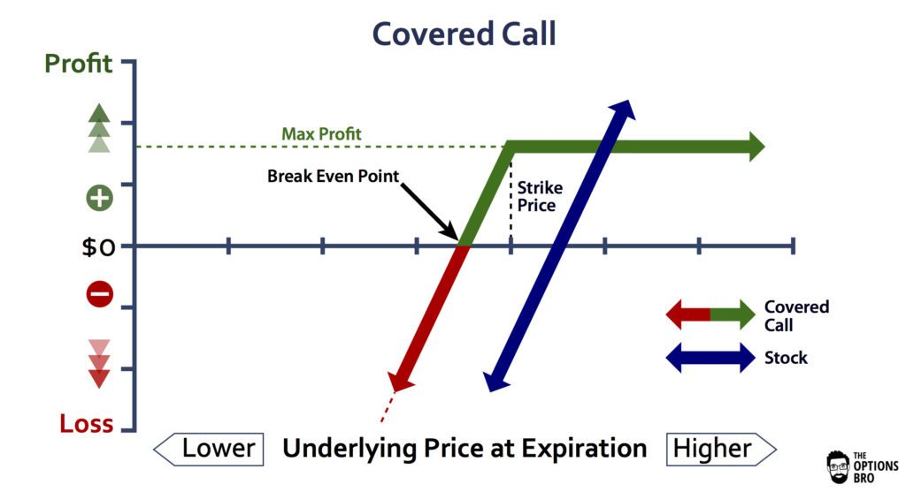

## Table of Contents

## What is a covered call strategy in options trading?

A covered call strategy is a way to earn extra money from stocks you already own. In this strategy, you sell call options on the stocks you have. A call option gives someone else the right to buy your stock at a certain price before a specific date. You get paid for selling the option, which is called the premium. This premium is your extra income. The strategy is called "covered" because you own the stock that the option is based on, so you're not taking on extra risk.

However, there is a catch. If the stock price goes above the price set in the option, the person who bought the option might decide to buy your stock. This means you have to sell your stock at the agreed price, even if the market price is higher. This limits how much you can gain if the stock price rises a lot. But, if the stock price stays below the option price, the option will expire worthless, and you keep the premium and your stock. This strategy can be good if you think the stock price will stay the same or go up a little, but not too much.

## How does an alternative covered call strategy differ from the traditional one?

An alternative covered call strategy is different from the traditional one because it uses different kinds of options or adds other steps to the basic covered call. In a traditional covered call, you own the stock and sell a call option on that stock. But in an alternative strategy, you might use options that have different rules, like options that can be exercised only at certain times or options that are based on more than one stock. You might also combine the covered call with other options, like buying a put option to protect against the stock price falling too much.

These alternative strategies can be more complex but can also offer more ways to manage risk and possibly make more money. For example, you might use a strategy called a collar, where you sell a call option and buy a put option at the same time. This can limit how much you can lose if the stock price drops, but it also limits how much you can gain if the stock price goes up a lot. Another example is using a strategy called a diagonal call spread, where you sell a short-term call option and buy a longer-term call option at a different price. This can give you more flexibility and potentially more profit, but it's also more complicated to manage.

## What are the basic steps to implement an alternative covered call strategy?

To start an alternative covered call strategy, first pick a stock you own or want to own. Then, decide on the kind of alternative strategy you want to use. For example, you might choose a collar, where you sell a call option and buy a put option at the same time. Or, you might go for a diagonal call spread, where you sell a short-term call option and buy a longer-term call option at a different price. Each strategy has its own rules and risks, so make sure you understand them before you start.

Once you've chosen your strategy, you need to set the right prices and dates for your options. For a collar, you'll pick the price at which you're willing to sell your stock (the call option's strike price) and the price at which you want to be able to sell your stock if it falls too much (the put option's strike price). For a diagonal call spread, you'll choose the short-term call option's strike price and expiration date, and the longer-term call option's strike price and expiration date. After setting these, you'll place your trades, selling the call option and buying the put or the longer-term call option as needed. Keep an eye on your investments and be ready to make adjustments if the stock price moves a lot.

## What types of stocks or ETFs are best suited for an alternative covered call strategy?

Stocks or ETFs that are best for an alternative covered call strategy are usually ones that don't move up or down too much. These are called low-[volatility](/wiki/volatility-trading-strategies) stocks or ETFs. They are good because they are less likely to go above the price you set for selling the stock, which means you can keep the extra money you get from selling the call option. Also, if you're using a strategy like a collar, where you buy a put option to protect against the stock price falling, low-volatility stocks are less likely to drop a lot, so you won't lose as much money.

Another type of stock or [ETF](/wiki/etf-trading-strategies) that works well is one that pays good dividends. When you use an alternative covered call strategy on these, you get the extra money from selling the call option, plus the dividends from the stock or ETF. This can make your overall return better. Just remember, the stock or ETF should be one that you're okay with selling if the price goes up a lot, because that's what might happen with the call option.

## How can an investor assess the risk and reward of an alternative covered call?

To assess the risk and reward of an alternative covered call, an investor needs to look at how much the stock or ETF might move up or down. If the stock is likely to stay pretty steady, the risk is lower because it's less likely to go above the price you set for selling it. This means you'll probably keep the extra money from selling the call option. But if the stock is very up and down, there's more risk because it might go above your price and you'll have to sell it, missing out on bigger gains. Also, if you're using a strategy like a collar, you need to think about how much you could lose if the stock falls a lot, even though the put option can help protect you.

The reward part comes from the extra money you get from selling the call option, and maybe from dividends if the stock or ETF pays them. If the stock stays below your set price, you keep this extra money and your stock, which is good. But the reward is limited because if the stock goes way up, you'll have to sell it at your set price and miss out on those bigger gains. So, the key is to find a balance where the extra money from the call option and any dividends make up for the risk of missing out on big stock price jumps.

## What are the key market conditions that favor the use of an alternative covered call strategy?

The best time to use an alternative covered call strategy is when the market is not moving a lot. If the stock or ETF you own is pretty stable and doesn't go up or down too much, this strategy can work well. When the market is calm, the stock is less likely to go above the price you set for selling it, which means you can keep the extra money from selling the call option. Also, if you're using a strategy like a collar, where you buy a put option to protect against the stock price falling, a stable market means you won't lose as much money if the stock does drop a little.

Another good time for this strategy is when the market is paying good dividends. If you own a stock or ETF that gives you regular dividend payments, the extra money from selling the call option can add to those dividends, making your overall return better. Just make sure the stock or ETF is one you're okay with selling if the price goes up a lot, because that's what might happen with the call option. So, a stable market with good dividends is the best situation for using an alternative covered call strategy.

## How does the choice of strike price and expiration date impact the outcome of an alternative covered call?

The strike price you pick for your call option in an alternative covered call strategy is really important. It's the price at which someone can buy your stock if they want to. If you pick a strike price that's higher than where the stock is now, you get more money from selling the call option, but there's also a bigger chance someone will actually buy your stock. If you pick a lower strike price, you get less money from selling the option, but it's less likely someone will buy your stock, so you can keep it and the extra money. So, the strike price is all about balancing how much money you want to make from selling the option and how much you want to keep your stock.

The expiration date of the call option also makes a big difference. This is the date by when someone has to decide if they want to buy your stock. If you pick a date that's far away, you get more money from selling the option because it gives the buyer more time to decide. But, the longer the time, the more chance the stock price might go up a lot, and you might have to sell your stock. If you pick a date that's soon, you get less money from selling the option, but there's less time for the stock price to change a lot, so you're more likely to keep your stock and the extra money. So, the expiration date is about balancing how much money you want to make from selling the option and how much you want to keep your stock.

## Can you explain the tax implications of profits from an alternative covered call strategy?

When you make money from an alternative covered call strategy, you need to think about taxes. If you sell the call option and keep the money from it, that's called a premium. The tax on this premium depends on how long you owned the stock before you sold the option. If you owned the stock for less than a year, the premium is taxed as regular income. If you owned the stock for more than a year, the premium can be taxed at a lower rate, as a long-term capital gain.

If the stock gets called away, meaning someone buys it from you at the strike price, you also have to pay taxes on any profit you made from selling the stock. This profit is the difference between the strike price and what you paid for the stock. If you owned the stock for less than a year, this profit is taxed as regular income. If you owned it for more than a year, it's taxed as a long-term capital gain, which is usually a lower rate. So, the length of time you held the stock before selling the option or having it called away can make a big difference in how much tax you have to pay.

## What advanced techniques can be used to optimize returns in an alternative covered call strategy?

To optimize returns in an alternative covered call strategy, you can use a technique called rolling the call option. This means if the stock price is getting close to your strike price and you don't want to sell your stock yet, you can buy back the call option you sold and sell a new one with a later expiration date or a higher strike price. This can give you more time to keep your stock and maybe get more money from selling the new option. It's like resetting the clock on your option, giving you another chance to make money without selling your stock right away.

Another technique is to use a strategy called a diagonal call spread. In this strategy, you sell a short-term call option and buy a longer-term call option at a different strike price. This can help you make more money from the difference in the prices of the two options. It's more complicated than just selling one call option, but it can give you more ways to make money if the stock price moves in a way you expect. This strategy can be good if you think the stock will go up a little but not too much, because it lets you keep the stock and still make money from the options.

## How does an alternative covered call strategy perform in different volatility environments?

An alternative covered call strategy works best when the stock or ETF you own doesn't move up or down too much. This is called a low-volatility environment. When the stock is pretty stable, it's less likely to go above the price you set for selling it. This means you can keep the extra money you get from selling the call option. If you're using a strategy like a collar, where you buy a put option to protect against the stock price falling, a low-volatility environment means you won't lose as much money if the stock does drop a little. So, a calm market is good for this strategy because it helps you keep your stock and the extra money from the call option.

In a high-volatility environment, where the stock or ETF moves up and down a lot, an alternative covered call strategy can be riskier. If the stock price goes above the price you set for selling it, you might have to sell your stock and miss out on bigger gains. This is because the call option you sold might get used by someone who wants to buy your stock at that price. On the other hand, if you're using a strategy like a diagonal call spread, where you sell a short-term call option and buy a longer-term call option, you might be able to make more money from the difference in the prices of the two options. But, it's still more complicated and risky because the stock price can change a lot, making it harder to predict what will happen.

## What are some common pitfalls to avoid when using an alternative covered call strategy?

One big mistake to avoid when using an alternative covered call strategy is [picking](/wiki/asset-class-picking) the wrong strike price or expiration date. If you choose a strike price that's too low, you might have to sell your stock when you don't want to, and if you pick a strike price that's too high, you might not get enough money from selling the call option. The same goes for the expiration date. If you pick a date that's too soon, you might not get enough money from selling the option, and if you pick a date that's too far away, the stock price might go up a lot and you'll have to sell your stock. So, it's important to pick a strike price and expiration date that balance how much money you want to make and how much you want to keep your stock.

Another pitfall is not understanding how the strategy works in different market conditions. If the market is very up and down, your stock might go above the strike price and you'll have to sell it, missing out on bigger gains. On the other hand, if the market is very calm, you might not make as much money from selling the call option. Also, if you're using a strategy like a collar or a diagonal call spread, you need to know how these work and how they can help you make more money or protect you from losing money. So, it's important to understand how the market might change and how that can affect your strategy.

## How can an investor integrate an alternative covered call strategy into a broader investment portfolio?

An investor can integrate an alternative covered call strategy into a broader investment portfolio by using it to generate extra income from stocks they already own. For example, if you own a stock that doesn't move up or down too much and pays good dividends, you can sell call options on that stock to get more money. This extra money can then be used to buy more stocks or ETFs, helping to grow your portfolio. You might also use this strategy on just a part of your portfolio, so you don't risk too much. This way, you can keep some of your money in safer investments while still trying to make more money from the stocks you use for the covered call strategy.

Another way to use an alternative covered call strategy in your portfolio is to balance it with other kinds of investments. For example, if you have some stocks that are more risky and might go up or down a lot, you can use the covered call strategy on stocks that are more stable. This can help you make some extra money from the stable stocks while still having the chance to make bigger gains from the riskier stocks. You can also use the money you make from the covered call strategy to buy more options or other investments that can protect your portfolio from big losses. This way, the covered call strategy can help you make more money and also help keep your portfolio safe.

## References & Further Reading

[1]: Bergstra, J., Bardenet, R., Bengio, Y., & Kégl, B. (2011). ["Algorithms for Hyper-Parameter Optimization."](https://dl.acm.org/doi/10.5555/2986459.2986743) Advances in Neural Information Processing Systems 24.

[2]: ["Advances in Financial Machine Learning"](https://www.amazon.com/Advances-Financial-Machine-Learning-Marcos/dp/1119482089) by Marcos Lopez de Prado

[3]: ["Evidence-Based Technical Analysis: Applying the Scientific Method and Statistical Inference to Trading Signals"](https://www.amazon.com/Evidence-Based-Technical-Analysis-Scientific-Statistical/dp/0470008741) by David Aronson

[4]: ["Machine Learning for Algorithmic Trading"](https://github.com/stefan-jansen/machine-learning-for-trading) by Stefan Jansen

[5]: ["Quantitative Trading: How to Build Your Own Algorithmic Trading Business"](https://github.com/LucindaYa/quant-resources/blob/master/Quantitative%20Trading%20How%20to%20Build%20Your%20Own%20Algorithmic%20Trading%20Business.pdf) by Ernest P. Chan