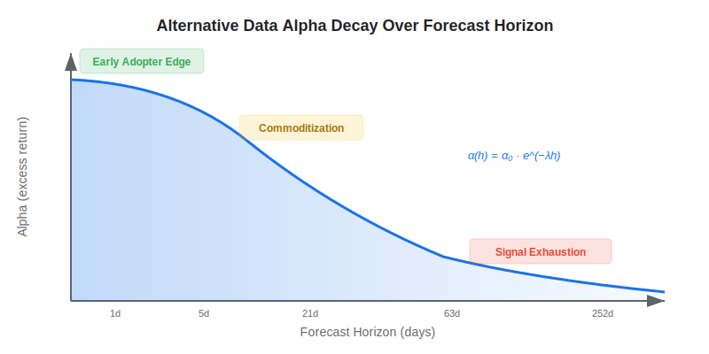
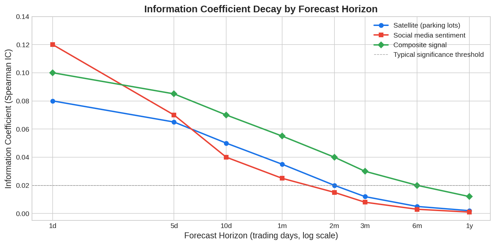

Alternative data has become one of the most talked-about edges in quantitative finance. But a critical question often goes unasked: **how long does that edge actually last?** The horizon effect describes the empirical observation that alternative data's predictive power is strongest at short forecast horizons and decays as you extend the prediction window. Understanding this dynamic is essential for any algo trader deciding whether — and how — to invest in [alternative data sources](https://paperswithbacktest.com/wiki/best-alternative-data).

## What Is the Horizon Effect in Alternative Data?

The horizon effect refers to the pattern where non-traditional data sources (satellite imagery, credit card transactions, web traffic, social media sentiment) deliver their strongest forecasting value over short time horizons — days to weeks — and progressively lose predictive power at longer horizons such as quarters or years.

This happens because alternative data typically captures **real-time snapshots** of economic activity. A satellite image of a retailer's parking lot tells you something about *this week's* foot traffic, but its signal becomes noise when you try to predict revenues twelve months out. The information gets absorbed by markets, superseded by new data, or overwhelmed by macro factors at longer horizons.

The theoretical foundation traces back to the Grossman-Stiglitz (1980) paradox: if information were perfectly reflected in prices, there would be no incentive to pay for it. In practice, there is always a window between when informed traders acquire alternative data and when prices fully adjust — the **information advantage window**.

$$\alpha(h) = \alpha_0 \cdot e^{-\lambda h}$$

Where $\alpha(h)$ is the excess return at forecast horizon $h$, $\alpha_0$ is the initial signal strength, and $\lambda$ is the decay rate. Faster-decaying signals require higher-frequency trading to capture.



## How the Horizon Effect Works in Practice

The lifecycle of an alternative data signal follows a predictable pattern:

**Phase 1 — Early Adopter Edge**: A small number of quantitative funds discover that, say, satellite-derived parking lot counts predict retail earnings surprises. They trade on this signal and earn outsized returns. The data is expensive and hard to process, limiting adoption.

**Phase 2 — Commoditization**: More funds license the same data. Vendors emerge offering cleaned, structured feeds. The signal gets crowded. The alpha at short horizons shrinks but remains positive. At longer horizons, it was already weak.

**Phase 3 — Creative Destruction**: Traders move to newer, less crowded data sources — perhaps combining parking lot data with credit card transaction feeds for a richer composite signal. The cycle restarts.

Foucault and Frésard (2023) formalize this in the context of cross-sectional versus time-series predictions. They show that alternative data's value for **cross-sectional** stock selection (which stock will outperform?) decays more slowly than its value for **time-series** prediction of a single stock's return. This is because relative rankings are more stable than absolute levels.

## Measuring Signal Decay with Python

You can empirically estimate the horizon effect for any alternative data signal using information coefficient (IC) analysis across multiple forecast horizons:

```python
import numpy as np
import pandas as pd

def compute_ic_by_horizon(signal: pd.Series, returns: pd.DataFrame,
                          horizons: list[int] = [1, 5, 10, 21, 63]) -> pd.Series:
    """
    Compute rank IC between a cross-sectional signal and
    forward returns at different horizons (in trading days).
    """
    ic_results = {}
    for h in horizons:
        fwd_ret = returns.shift(-h)  # forward returns
        # align signal and forward returns
        aligned = pd.concat([signal, fwd_ret], axis=1).dropna()
        aligned.columns = ["signal", "fwd_return"]
        # Spearman rank correlation
        ic = aligned["signal"].corr(aligned["fwd_return"], method="spearman")
        ic_results[h] = ic
    return pd.Series(ic_results, name="IC")

# Example usage with synthetic data
np.random.seed(42)
n_stocks, n_days = 100, 252
signal = pd.Series(np.random.randn(n_stocks), name="alt_data_signal")
returns = pd.DataFrame(
    np.random.randn(n_stocks, n_days) * 0.02,
    columns=[f"day_{i}" for i in range(n_days)]
)
# In practice, replace with real alternative data and stock returns
horizons = [1, 5, 10, 21, 63]
print("IC by forecast horizon:")
print(compute_ic_by_horizon(signal, returns.iloc[:, 0], horizons))
```

The key diagnostic: if IC drops sharply beyond 5–10 days, your signal is short-lived and demands high-frequency rebalancing. If IC holds through 21+ days, you have a more durable edge.



## Key Factors Driving Signal Decay

| Factor | Effect on Decay Rate | Example |
|---|---|---|
| Data exclusivity | Less exclusive → faster decay | Satellite data from a single vendor vs. widely available web traffic |
| Processing complexity | More complex → slower decay | Raw satellite imagery requiring ML vs. pre-processed sentiment scores |
| Market efficiency of the sector | More efficient → faster decay | Large-cap US equities vs. emerging market small-caps |
| Data latency | Lower latency → faster initial alpha but also faster crowding | Real-time credit card data vs. monthly government reports |
| Combination with other signals | Composite signals decay slower | Parking lot + credit card + web traffic combined |

## Practical Implications for Algo Traders

**1. Match your trading frequency to the signal's decay rate.** If your alternative data signal has a 5-day half-life, a monthly rebalancing strategy will capture almost none of the alpha. Run the IC analysis first, then design the strategy.

**2. Combine multiple data sources.** The Grossman-Stiglitz insight suggests that composite signals — merging satellite, [sentiment](https://paperswithbacktest.com/wiki/sentiment-trading), and transaction data — create a more robust edge because they are harder for competitors to replicate exactly.

**3. Focus on cross-sectional signals.** Foucault and Frésard's finding that cross-sectional predictions decay more slowly means long-short equity strategies may extract more durable value from alternative data than directional bets.

**4. Monitor alpha decay in production.** Signal strength is not static. Build dashboards that track rolling IC over time. When decay accelerates, it is a sign of crowding and time to iterate.

## Limitations and Risks

The horizon effect is not a law — it is an empirical regularity. Some alternative data sources maintain predictive power at longer horizons, particularly those capturing slow-moving structural shifts (e.g., ESG scores, patent filings). Survivorship bias also plays a role: we hear about the signals that worked, not the hundreds that never delivered alpha at any horizon.

Additionally, transaction costs matter enormously. A signal with strong 1-day IC but requiring daily turnover of the entire portfolio may be unprofitable after costs. The effective horizon must account for break-even turnover.

## Conclusion

The horizon effect is the single most important concept for any algo trader evaluating alternative data. Before licensing an expensive dataset, run the IC analysis, estimate the decay rate, and verify that your strategy's rebalancing frequency can actually capture the signal. The edge is real — but it is time-limited, and only traders who respect that constraint will profit from it.

---

**Explore further on PapersWithBacktest:**
- Browse [backtested alternative data strategies](https://paperswithbacktest.com/strategies) with Python code and performance metrics
- Access [clean historical market data](https://paperswithbacktest.com/datasets) for equities, crypto, and futures
- Take the [algo trading course](https://paperswithbacktest.com/course) — 60+ video lessons and notebooks
- Related wiki pages: [Best Alternative Data Sources](https://paperswithbacktest.com/wiki/best-alternative-data) · [Sentiment Trading](https://paperswithbacktest.com/wiki/sentiment-trading)
