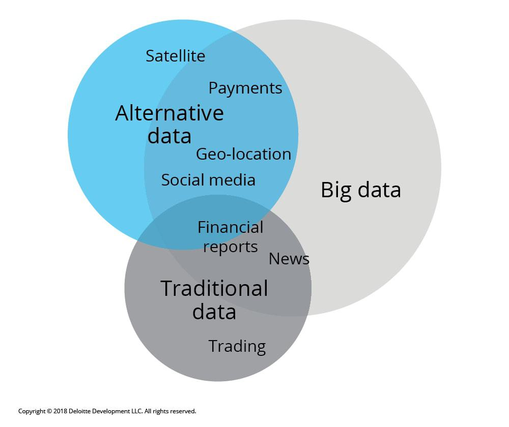

The rapid evolution of trading strategies in recent years has been significantly influenced by the integration of alternative data as a transformative factor in algorithmic trading. Unlike traditional financial data, which primarily includes metrics such as stock prices, trading volumes, and financial statements, alternative data encompasses a broad range of non-conventional sources. These sources provide traders with new insights into market trends and dynamics, potentially leading to a competitive advantage.

Alternative data is characterized by its ability to offer unique perspectives on market sentiment, consumer behavior, and economic indicators that are not captured by standard financial metrics. For instance, data from satellite imagery can reveal real-time information about industrial activity, while social media feeds can reflect public opinion towards specific companies or sectors. These unconventional indicators often present early signals of market movements, allowing traders to anticipate changes and adjust their strategies accordingly.



Incorporating alternative data into algorithmic trading involves developing sophisticated models that can process and interpret these diverse data types. The ability to harness alternative data effectively enables traders to construct strategies with enhanced predictive capabilities, thus increasing their chances of identifying profitable opportunities before they become apparent through traditional analytical methods.

This article aims to examine the role of alternative data in algorithmic trading, highlighting its potential to revolutionize trading strategies by providing a deeper understanding of underlying market forces. By leveraging these new data sources, traders can refine their strategies and better position themselves to navigate the complexities of modern financial markets.

## Table of Contents

## Understanding Alternative Data

Alternative data encompasses any information that does not fall under traditional financial metrics, such as stock prices or trading volumes. This type of data captures a broader spectrum of economic and behavioral indicators, offering insights that can precede and even predict trends not immediately visible in traditional metrics. For instance, satellite imagery can be used to monitor industrial activity by assessing the output levels in manufacturing plants or the storage levels in tankers and storage facilities. By analyzing such data, traders can anticipate shifts in supply and demand before they are reflected in financial statements or stock prices.

Social media sentiment analysis is another example, where data from platforms like Twitter, Facebook, or specialized investment forums help gauge public opinion towards specific stocks or market events. By employing natural language processing algorithms, traders can analyze the tone and frequency of discussions related to a particular company or sector. This analysis can unveil investor sentiment trends that might foreshadow significant market movements, enabling traders to make informed decisions based on crowd psychology.

These [alternative data](/wiki/best-alternative-data) sources, when combined with traditional data, create a richer and more robust basis for developing trading strategies. They offer a competitive edge by revealing insights that traditional metrics may overlook, allowing traders to anticipate market shifts and effectively manage risk.

## Types of Alternative Data Used in Trading

Alternative data has become increasingly important in the financial industry, offering unique perspectives that traditional data sources may overlook. There are several key types of alternative data utilized in trading today.

**Satellite Imagery** is employed by traders to gain insights into physical assets. By analyzing satellite images, traders can monitor oil storage levels or evaluate the health of agricultural fields. For instance, changes in the size of shadow footprints of oil tanks can indicate shifts in storage volumes, providing predictive insights into supply and demand dynamics in the energy market. Similarly, evaluating crop conditions through satellite imagery can help forecast agricultural production levels, thereby influencing commodity trading strategies.

**Social Media Sentiment** is another critical source of alternative data. Platforms such as Twitter and Reddit provide a rich reservoir of public opinion that can be analyzed to gauge market sentiment towards specific stocks or sectors. Sentiment analysis utilizes natural language processing (NLP) techniques to evaluate the emotional tone in social media posts, offering insights into public perception and potential market movements. For example, an increase in positive sentiment about a particular stock may precede a rise in its price, while negative sentiment might signal potential declines.

**Web Traffic and Search Trends** offer a window into consumer interest and behavior, providing early signals of changes in demand for certain products or services. By tracking the volume and origin of web traffic to specific e-commerce sites, traders can infer consumer spending habits and predict stock performance in relevant sectors. Additionally, analyzing search trends allows traders to identify rising interest in particular products or issues, which can translate into actionable trading opportunities.

**Supply Chain Data** is crucial for understanding the movement of goods and identifying potential disruptions. Information on shipping routes, port congestion, and logistical delays can provide valuable insights into supply chain efficiency. Traders use this data to anticipate bottlenecks that might impact company earnings or the availability of goods, thereby affecting stock prices. For example, delays in component deliveries to a manufacturing company might signal potential production slowdowns, influencing the company's stock valuation.

These types of alternative data provide traders with invaluable insights that complement traditional financial metrics, enhancing their ability to devise strategies that respond to emerging market trends and dynamics.

## Applications of Alternative Data in Algorithmic Trading

Alternative data has become a pivotal component in [algorithmic trading](/wiki/algorithmic-trading), offering traders unique perspectives on market dynamics that traditional data sources might miss. This section outlines several applications where alternative data significantly impacts algorithmic trading strategies.

### Sector-Specific Insights

In energy markets, satellite data is crucial for anticipating supply and demand shifts. By analyzing satellite imagery, traders can monitor physical assets, such as oil storage levels and oil rig activities. This data provides early indicators of market trends; for example, a change in oil storage can imply adjustments in supply levels, which may influence pricing. Traders can thus position themselves advantageously by predicting these shifts ahead of official reports.

### Weather-Based Trading

Weather data is essential in sectors like agriculture and energy. For instance, in agriculture, adverse weather conditions can lead to reduced crop yields, affecting stock prices for related companies. Weather forecasts can be integrated into trading algorithms to predict these impacts and adjust trading strategies accordingly. In the energy sector, weather conditions influence electricity and gas demand. For example, higher temperatures may increase electricity demand for cooling, providing opportunities to trade on anticipated increases in energy prices.

### Consumer Trend Analysis

The analysis of web traffic and search trends offers insights into consumer behavior and preferences. By examining data from search engines and tracking online consumer activity, traders can anticipate shifts in demand for products before they are reflected in sales figures. This predictive capability allows traders to make informed decisions about stock movements. For example, a surge in searches for electric vehicles could suggest a potential uptick in the sales of companies like Tesla, presenting trading opportunities that capitalize on this trend.

### Supply Chain Analysis

Supply chain data provides crucial insights into the movement of goods, highlighting potential disruptions and bottlenecks that could impact company earnings and stock prices. By monitoring real-time logistics data, traders can identify issues such as delays in raw material shipments or production halts. These insights allow traders to anticipate potential impacts on a company's supply chain, enabling them to adjust their positions accordingly. For example, if a major electronics manufacturer faces a component shortage, traders could predict and act on possible revenue impacts before official earnings announcements.

In summary, the strategic incorporation of alternative data into algorithmic trading frameworks allows traders to gain competitive advantages through timely and informed decision-making across various sectors.

## Challenges of Integrating Alternative Data

Alternative data presents distinct challenges when integrated into trading strategies, necessitating careful consideration of several factors. A key issue is data quality and consistency, as the accuracy of alternative data is paramount. These data sources, which often include non-traditional formats such as social media sentiment or satellite imagery, may harbor biases or errors that can adversely affect trading outcomes. Ensuring data integrity is therefore critical, requiring rigorous validation and cleansing processes to minimize noise and inaccuracies.

Integration complexity represents another significant challenge. Successfully blending alternative data with established financial metrics demands advanced data engineering skills. This integration often involves managing disparate data formats and structures, necessitating sophisticated techniques to align alternative datasets with traditional financial data. For example, the fusion of social media sentiment data with historical stock prices may require natural language processing (NLP) techniques and correlation analysis to ensure coherence and relevance.

Timeliness is a crucial aspect as some alternative data sources lack real-time availability, potentially diminishing their usefulness in time-sensitive trading decisions. Traders must devise strategies to mitigate delays, possibly by employing predictive models or utilizing data aggregation techniques that accelerate the processing of near-real-time data. The effectiveness of these strategies often hinges on the specific nature of the alternative data and the market in question.

Cost considerations also play a pivotal role. High-quality alternative data can be prohibitively expensive, posing a significant barrier for smaller traders looking to capitalize on these insights. To overcome this challenge, traders may need to adopt cost-effective strategies, such as leveraging open-source data or forming partnerships with data providers. These approaches can help reduce expenses while maintaining access to valuable data streams.

In summary, while the integration of alternative data into trading strategies holds great potential, traders must carefully address challenges related to data quality, integration, timeliness, and costs to fully capitalize on these unconventional insights.

## Practical Example: Using Weather Data in Trading

Weather data serves as a valuable alternative source that can enhance trading strategies, especially in sectors sensitive to seasonal fluctuations, such as agriculture and energy. By analyzing weather patterns and forecasts, traders can anticipate market shifts that may influence the supply and demand dynamics of weather-dependent commodities.

A practical trading strategy involves the integration of weather data into an MQL4 platform, which is widely used for developing algorithmic trading systems in [forex](/wiki/forex-system) and commodity markets. By harnessing weather forecasts, traders can generate more informed trading signals and thus make more precise trade decisions. For instance, an algorithm can be designed to execute trades based on predicted temperature changes, precipitation levels, or storm forecasts, which can affect crop yields, energy consumption, and transportation logistics.

The agricultural sector can significantly benefit from this approach due to its dependency on weather conditions. For example, a trading strategy might involve buying futures contracts for corn if forecasts predict an unusually wet planting season, which could delay planting and reduce yields, potentially driving up prices. This requires importing real-time weather data into an algorithm designed to adjust trading positions dynamically based on forecast updates.

Incorporating weather data involves parsing data from trusted meteorological services and feeding it into the algorithm. Using Python, traders can leverage libraries such as `pandas` for data manipulation and `requests` to fetch weather data from APIs. Here is an example code snippet that demonstrates how to import weather data:

```python
import requests
import pandas as pd

# Fetch weather data from a public API (e.g., OpenWeatherMap)
API_KEY = 'your_api_key'
CITY = 'Chicago'
url = f'http://api.openweathermap.org/data/2.5/weather?q={CITY}&appid={API_KEY}'

response = requests.get(url)
weather_data = response.json()

# Process data for trading signal
temperature = weather_data['main']['temp']
precipitation = weather_data.get('rain', {}).get('1h', 0)  # Default to 0 if no rain data

# Normalize temperature data to Celsius
temperature_celsius = temperature - 273.15

# Create a DataFrame for further analysis
weather_df = pd.DataFrame({
    'Temperature (°C)': [temperature_celsius],
    'Precipitation (mm)': [precipitation]
})

# Implement trading logic based on weather data
def generate_trade_signal(weather_df):
    if weather_df['Precipitation (mm)'].iloc[0] > 5:
        return "Buy corn futures"
    elif weather_df['Temperature (°C)'].iloc[0] < 10:
        return "Sell energy futures"
    else:
        return "Hold position"

trade_signal = generate_trade_signal(weather_df)
print(f"Trading Signal: {trade_signal}")
```

Such systems can be further refined by testing different thresholds and conditions based on historical weather impacts on price movements. By effectively incorporating weather data, traders foster resilience against market [volatility](/wiki/volatility-trading-strategies), which can be dictated by environmental factors. This approach paves the way for more adaptive and anticipatory trading strategies that align with the unpredictable nature of weather patterns.

## Optimizing the Use of Alternative Data

Optimizing the use of alternative data in trading involves several strategic actions to maximize its effectiveness and predictive power. One of the primary steps is to align the alternative data with the relevant assets being traded. This involves ensuring that the data sources are directly applicable to the specific financial instruments or markets under consideration. For instance, using satellite imagery to monitor agricultural fields should be aligned with trading commodities like wheat or corn. This alignment enables more accurate predictions and better-informed trading decisions.

Preprocessing data is another crucial step in optimizing its use. This process involves cleaning and normalizing the data to enhance its quality and applicability. Data cleaning involves removing duplicates, correcting errors, and handling missing values to ensure accuracy. Normalization, on the other hand, involves scaling the data to fall within a specific range or adjusting it to fit a standard distribution. This step is essential for improving the data's predictive power and ensuring it is suitable for integration with existing trading models.

Experimenting with different timeframes is also vital to find the optimal points for data application. Traders should test various timeframes to determine which ones yield the best predictive outcomes. For example, while short-term data might be beneficial for [day trading](/wiki/day-trading-spy) strategies, longer-term data may be more suitable for swing trading. Conducting [backtesting](/wiki/backtesting) on historical data sets using different timeframes can help identify the most effective periods for trading strategies.

Utilizing real-time data feeds enhances the dynamic adjustment of trading strategies. Access to timely updates is crucial for making informed decisions in a rapidly changing market environment. Traders should opt for APIs that provide real-time data streams, which allow for immediate detection of market changes and enable swift responses. By integrating APIs into their trading systems, algorithmic traders can maintain a competitive edge by reacting promptly to market fluctuations.

In summary, optimizing alternative data’s use in trading requires strategic alignment with relevant assets, thorough preprocessing, experimenting with different timeframes, and leveraging real-time data feeds. These steps not only enhance the accuracy and predictive power of trading strategies but also position traders to better respond to dynamic market conditions.

## Conclusion

Alternative data offers unique insights that can significantly enhance trading strategies, providing new avenues for discovering market trends. Traditional financial metrics, such as stock prices and trading volumes, have long been the cornerstone of trading strategies. However, the incorporation of alternative data provides traders with a more comprehensive view, capturing signals that may precede traditional indicators. By integrating these unconventional data sources, algorithmic traders can better position themselves in the market, gaining a competitive edge through the identification of subtle market trends and shifts.

As trading strategies evolve, the future will likely see an increased reliance on alternative data. This trend is driven by the search for new sources of alpha, the excess return of an investment relative to the return of a benchmark index. As alternative data sources continue to expand, they will offer traders the opportunity to uncover market inefficiencies and capitalize on them effectively. The integration of alternative data, such as satellite imagery, social media sentiment, and supply chain data, is expected to become more prevalent, providing traders with deeper insights and adaptive strategies.

In conclusion, the strategic use of alternative data not only enhances the predictive accuracy of trading models but also empowers traders to stay ahead in a rapidly changing market landscape. As technology evolves and data analytics tools improve, the adoption of alternative data in algorithmic trading will likely become the norm, enabling traders to discover valuable insights and maintain a competitive edge.

## References & Further Reading

[1]: Nauck, D., & Kluegl, F. (2018). ["Combining Machine Learning and Algorithmic Trading for Enhanced Trading Strategies."](https://link.springer.com/article/10.1007/s10614-024-10669-3) Transactions on Computational Science XXXII.

[2]: Gu, S., Kelly, B., & Xiu, D. (2020). ["Empirical Asset Pricing via Machine Learning."](https://www.nber.org/papers/w25398) The Review of Financial Studies, 33(5), 2223-2273.

[3]: ["Advances in Financial Machine Learning"](https://www.amazon.com/Advances-Financial-Machine-Learning-Marcos/dp/1119482089) by Marcos Lopez de Prado

[4]: ["Satellite Data in Algorithmic Trading: An Analytical Perspective"](https://www.researchgate.net/publication/378548435_Algorithmic_Trading_and_AI_A_Review_of_Strategies_and_Market_Impact) - This paper discusses the application of satellite data in predicting financial market movements.

[5]: Kreps, D. M. (2013). ["Microeconomic Foundations I: Choice and Competitive Markets."](https://www.dsecoaching.com/pdf/David%20M.%20Kreps-Microeconomic%20Foundations%20I_%20Choice%20and%20Competitive%20Markets-Princeton%20University%20Press%20(2013).pdf) - While primarily a textbook, it includes a thorough discussion on market dynamics that can be beneficial for understanding the application of data in trading.

[6]: ["Alternative Data: The New Frontier in Finance"](https://www.factori.ai/blog/alternative-data-for-finance) - CFA Institute Research Foundation Brief. This publication explores the rise of alternative data in the financial sector.