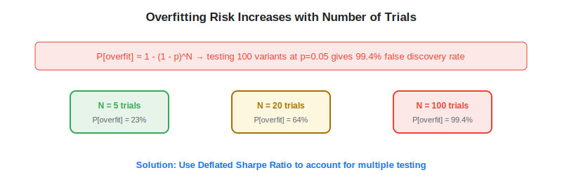
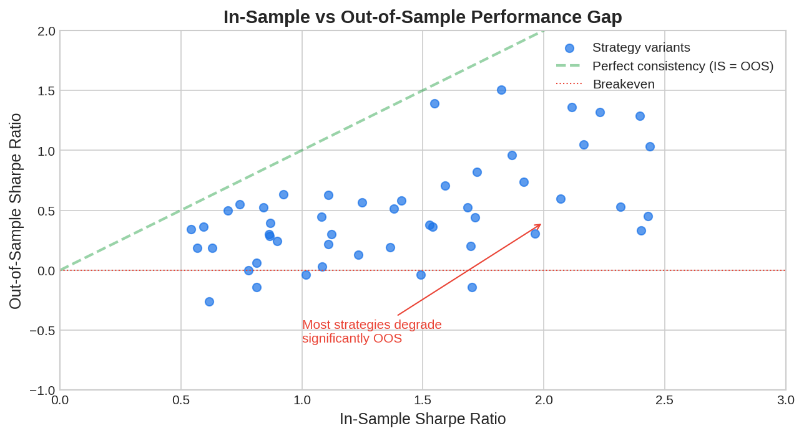

Overfitting is the single biggest risk when building algo trading strategies with [alternative data](https://paperswithbacktest.com/wiki/best-alternative-data). With limited historical samples (most alternative datasets start after 2015), a large number of potential features, and the temptation to data-mine for patterns, it is alarmingly easy to build a strategy that looks spectacular in backtests but fails completely in live trading. This article covers the most common overfitting traps, statistical tools for detection, and best practices from Marcos Lopez de Prado's research on building robust quantitative strategies.

## What Is Overfitting in Alternative Data?

Overfitting occurs when a model captures noise rather than genuine signal in historical data. The result is a strategy that appears profitable in backtests but generates no alpha — or negative alpha — out of sample. Alternative data is particularly prone to overfitting for several reasons.

**Short history**: Most alternative datasets span 5–10 years. With only ~40 quarterly observations per company, there are far more potential features than independent data points. This is a fundamentally different regime from traditional quant finance, where 30+ years of daily price data provides ~7,500+ observations per stock. The statistical power available for validating alternative data signals is an order of magnitude smaller, making overfitting not just a risk but the default outcome unless active measures are taken to prevent it.

**Dimensionality curse**: Alternative data often comes with high dimensionality — a satellite imagery feed might produce thousands of features per location, a web scraping pipeline might generate dozens of metrics per company, and an [NLP](https://paperswithbacktest.com/wiki/nlp-sentiment-analysis-trading) model might output hundreds of embedding dimensions. When the number of features approaches or exceeds the number of independent observations, standard statistical methods break down and spurious correlations become nearly inevitable.

**Multiple testing**: Traders typically test dozens — sometimes hundreds — of signal definitions, parameter combinations, and universe filters before selecting one. Each test inflates the probability of finding a spuriously significant result. This problem is far more severe than most practitioners realize. As Marcos Lopez de Prado argues in *Advances in Financial Machine Learning* (2018), the quant finance industry has a systemic "backtest overfitting" problem: most published backtests are the result of exhaustive parameter searches, and the reported Sharpe ratios represent the *best* outcome from many trials rather than a realistic expectation of future performance. Lopez de Prado's solution — the Deflated Sharpe Ratio and Combinatorial Purged Cross-Validation (CPCV) — has become the gold standard for rigorous strategy validation in quantitative finance.

**Non-stationarity**: The relationship between alternative data and financial outcomes changes over time. A signal that worked from 2016–2020 may not work from 2021–2025 if the market regime or data vendor methodology changed.

## The Multiple Testing Problem

Bailey and Lopez de Prado (2014) formalized this with the **Deflated Sharpe Ratio**. If you test $N$ strategy variants and select the best one, the probability that the selected strategy's Sharpe ratio is genuinely above zero depends on $N$:

$$P[\text{overfit}] \approx 1 - (1 - p)^N$$

Where $p$ is the significance level. Testing 100 variants at $p = 0.05$ gives a 99.4% chance of finding at least one spuriously significant result.

The minimum backtest Sharpe ratio required to be confident at significance level $\alpha$ given $N$ trials is:

$$SR_{min} \approx \sqrt{\frac{2 \ln(N)}{T}}$$

Where $T$ is the number of independent observations.



## Common Overfitting Pitfalls with Alternative Data

### Pitfall 1: Feature Engineering on Full Sample

Building features (moving averages, z-scores, threshold parameters) using the entire historical sample leaks future information into training. Always split data into train/validation/test sets *before* any feature engineering.

### Pitfall 2: Optimizing Signal Parameters

If you test "transaction data with 7-day lookback," "10-day lookback," "14-day lookback," etc., and select the best performer, you are data-mining. The chosen parameter will likely be the most overfit, not the most robust.

### Pitfall 3: Survivorship Bias in the Stock Universe

Using only currently listed stocks excludes the losers that delisted. This inflates backtest returns because you never hold the stocks that went to zero.

### Pitfall 4: Ignoring Transaction Costs

Alternative data signals often have high turnover. A signal that generates 2% annual alpha with 200% annual turnover may be unprofitable after accounting for realistic transaction costs (bid-ask spread, market impact, commissions).

### Pitfall 5: Confusing Correlation with Causation

A dataset may correlate with returns during a specific period due to a confounding variable (both driven by the same macro factor). Without a clear economic mechanism, the signal is likely spurious.

## Python Implementation: Overfitting Detection Tools

```python
import numpy as np
from scipy import stats

def deflated_sharpe_ratio(
    observed_sr: float,
    n_trials: int,
    n_observations: int,
    skewness: float = 0.0,
    kurtosis: float = 3.0
) -> dict:
    """
    Compute the Deflated Sharpe Ratio (Bailey & Lopez de Prado, 2014).
    
    Tests whether the best Sharpe ratio from n_trials is genuine
    or a result of multiple testing.
    """
    # Expected maximum SR under null (all trials have SR=0)
    euler_mascheroni = 0.5772
    e_max_sr = np.sqrt(2 * np.log(n_trials)) - (
        np.log(np.pi) + euler_mascheroni
    ) / (2 * np.sqrt(2 * np.log(n_trials)))
    
    # Standard error of SR estimate
    sr_std = np.sqrt(
        (1 - skewness * observed_sr + (kurtosis - 1) / 4 * observed_sr**2) / n_observations
    )
    
    # Deflated test statistic
    if sr_std > 0:
        test_stat = (observed_sr - e_max_sr) / sr_std
        p_value = 1.0 - stats.norm.cdf(test_stat)
    else:
        test_stat = 0
        p_value = 1.0
    
    return {
        "observed_sr": f"{observed_sr:.3f}",
        "expected_max_sr_null": f"{e_max_sr:.3f}",
        "deflated_test_stat": f"{test_stat:.3f}",
        "p_value": f"{p_value:.4f}",
        "is_significant": p_value < 0.05,
    }

def combinatorial_purged_cv(
    returns: np.ndarray,
    n_splits: int = 5,
    embargo_pct: float = 0.02
) -> dict:
    """
    Simplified Combinatorial Purged Cross-Validation (CPCV).
    Tests strategy robustness using non-overlapping folds
    with embargo periods to prevent information leakage.
    """
    T = len(returns)
    fold_size = T // n_splits
    embargo_size = max(1, int(fold_size * embargo_pct))
    
    fold_sharpes = []
    for i in range(n_splits):
        # Test fold
        test_start = i * fold_size
        test_end = min(test_start + fold_size, T)
        
        # Add embargo after test fold
        test_returns = returns[test_start:test_end]
        
        if len(test_returns) > 0 and test_returns.std() > 0:
            sr = test_returns.mean() / test_returns.std() * np.sqrt(252)
            fold_sharpes.append(sr)
    
    fold_sharpes = np.array(fold_sharpes)
    
    return {
        "n_folds": n_splits,
        "mean_oos_sharpe": f"{fold_sharpes.mean():.3f}",
        "std_oos_sharpe": f"{fold_sharpes.std():.3f}",
        "min_fold_sharpe": f"{fold_sharpes.min():.3f}",
        "pct_positive_folds": f"{(fold_sharpes > 0).mean():.0%}",
        "likely_overfit": fold_sharpes.mean() < 0.3 or (fold_sharpes > 0).mean() < 0.6,
    }

# Example: Evaluate a strategy after testing 50 variants
print("=== Deflated Sharpe Ratio Analysis ===")
result = deflated_sharpe_ratio(
    observed_sr=1.8,       # Best backtest SR from 50 trials
    n_trials=50,           # Number of variants tested
    n_observations=252 * 5 # 5 years of daily data
)
for k, v in result.items():
    print(f"  {k}: {v}")

print("\n=== Cross-Validation Robustness ===")
np.random.seed(42)
strategy_returns = np.random.normal(0.0002, 0.01, 252 * 5)
cv_result = combinatorial_purged_cv(strategy_returns, n_splits=5)
for k, v in cv_result.items():
    print(f"  {k}: {v}")
```



## Best Practices Checklist

| Practice | Why It Matters |
|---|---|
| Hold out 30%+ data for out-of-sample testing | OOS performance is the ground truth |
| Report the Deflated Sharpe Ratio | Accounts for multiple testing |
| Use Combinatorial Purged CV (CPCV) | Lopez de Prado's gold standard for validation |
| Limit parameter optimization | Fewer knobs = less overfitting risk |
| Require economic rationale | Signals without a story are likely spurious |
| Test across market regimes | Bull/bear, high/low vol, different sectors |
| Account for realistic transaction costs | 30–50% of gross alpha typically lost to costs |
| Use [IC analysis](https://paperswithbacktest.com/wiki/information-coefficient-signal-quality) | IC is harder to overfit than full backtest PnL |

## Conclusion

Overfitting is the most common reason alternative data strategies fail in production. The antidote is rigorous statistical discipline: limit the number of variants tested, use the Deflated Sharpe Ratio to assess significance, validate with combinatorial cross-validation, and always require a clear economic mechanism for why the signal should work. These practices separate profitable quant teams from data-mining operations.

---

**Explore further on PapersWithBacktest:**
- Browse [backtested trading strategies](https://paperswithbacktest.com/strategies) with Python code and performance metrics
- Access [clean historical market data](https://paperswithbacktest.com/datasets) for equities, crypto, and futures
- Take the [algo trading course](https://paperswithbacktest.com/course) — 60+ video lessons and notebooks
- Related wiki pages: [The Information Coefficient](https://paperswithbacktest.com/wiki/information-coefficient-signal-quality) · [The Horizon Effect](https://paperswithbacktest.com/wiki/alternative-data-horizon-effect)
