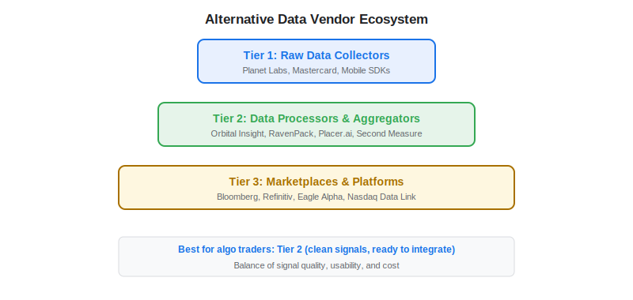
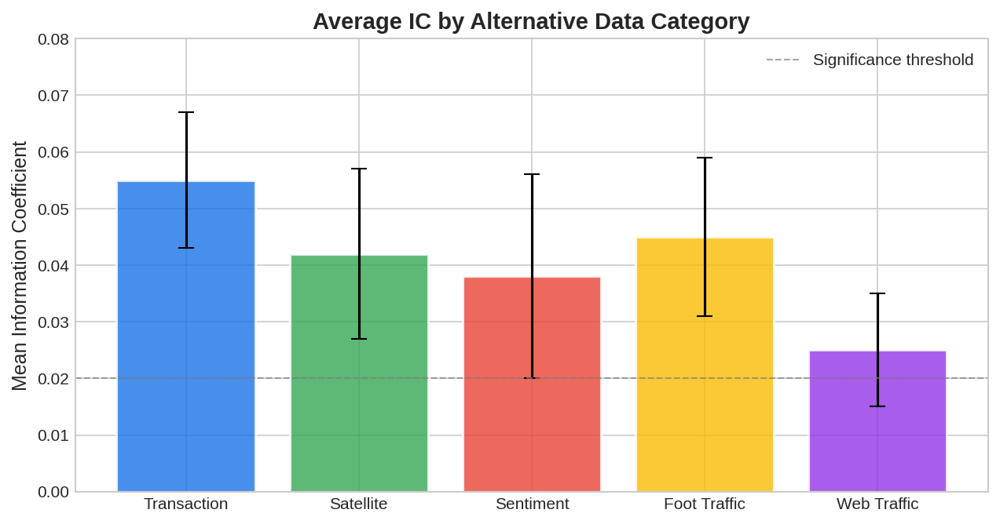

Choosing the right alternative data vendor is one of the most consequential decisions an algo trader makes. The [alternative data](https://paperswithbacktest.com/wiki/best-alternative-data) market has grown into a multi-billion dollar industry with hundreds of providers, each offering different data types, coverage, latency, and price points. This guide provides a systematic framework for evaluating vendors and compares the major providers across key categories.

## The Alternative Data Vendor Landscape

The alternative data industry can be segmented into three tiers based on how close the vendor is to the raw data source:

**Tier 1 — Raw Data Collectors**: Companies that own the data collection infrastructure. Examples include Planet Labs (satellite constellation), Mastercard (payment network), and mobile SDK companies that collect GPS signals directly.

**Tier 2 — Data Processors and Aggregators**: Companies that license raw data, clean it, and package it into analytics. Examples include Orbital Insight (processes satellite imagery), RavenPack (processes news into sentiment), and Placer.ai (processes mobile location into foot traffic).

**Tier 3 — Data Marketplaces and Platforms**: Aggregators that offer multiple data types through a single platform. Examples include Bloomberg Enterprise Data, Refinitiv, and Eagle Alpha.

For algo traders, Tier 2 vendors typically offer the best balance of signal quality and usability — the data is clean enough to integrate directly into models without requiring specialized engineering teams.



## Vendor Comparison by Data Category

### Transaction and Consumer Spending Data

| Vendor | Panel Size | Latency | Geographic Coverage | Approximate Annual Cost |
|---|---|---|---|---|
| Bloomberg Second Measure | Large | T+3-5 days | US | $150K–$400K |
| Earnest Research | Large | T+5-7 days | US | $100K–$300K |
| Facteus | 15M+ consumers | T+2-4 days | US | $75K–$200K |
| CE Vision (Mastercard) | Network-level | T+7-14 days | Global | $200K–$500K |

### Satellite and Geospatial Data

| Vendor | Resolution | Revisit Frequency | Key Application | Approximate Annual Cost |
|---|---|---|---|---|
| Planet Labs | 3-5m optical | Daily | Agriculture, retail | $50K–$200K |
| Orbital Insight | Processed analytics | Daily-weekly | Oil, retail | $100K–$400K |
| Kayrros | SAR + optical | Daily | Energy, emissions | $100K–$300K |
| Sentinel Hub (ESA) | 10m optical | 5-day | Agriculture, macro | Free |

### NLP and Sentiment Data

| Vendor | Sources | Latency | Model Type | Approximate Annual Cost |
|---|---|---|---|---|
| RavenPack | News, social, filings | Real-time | Proprietary NLP | $100K–$500K |
| Alexandria Technology | News, transcripts | Real-time | Deep learning | $50K–$200K |
| Amenity Analytics | Filings, transcripts | Near real-time | NLP extraction | $50K–$150K |
| Quandl (Nasdaq) | Multiple sources | Varies | Platform | $20K–$100K |

## How to Evaluate an Alternative Data Vendor

### Step 1: Define Your Use Case

Before evaluating vendors, clarify what you need. A framework for assessment:

```python
def evaluate_vendor_fit(
    strategy_horizon: str,
    target_universe: str,
    signal_type: str,
    budget_annual_usd: float
) -> dict:
    """
    Framework for evaluating alternative data vendor fit.
    
    Parameters:
    - strategy_horizon: 'intraday', 'days', 'weeks', 'months'
    - target_universe: 'us_equities', 'global_equities', 'commodities', 'macro'
    - signal_type: 'transaction', 'satellite', 'sentiment', 'foot_traffic'
    - budget_annual_usd: Maximum annual data spend
    """
    requirements = {
        "latency_needed": {
            "intraday": "real-time", "days": "T+1 to T+3",
            "weeks": "T+3 to T+7", "months": "T+7 to T+30"
        }.get(strategy_horizon, "unknown"),
        "coverage_needed": target_universe,
        "signal_type": signal_type,
        "budget": f"${budget_annual_usd:,.0f}",
    }
    
    # Vendor recommendations based on criteria
    recommendations = []
    if signal_type == "transaction" and budget_annual_usd >= 100000:
        recommendations.append("Bloomberg Second Measure or Earnest Research")
    elif signal_type == "transaction":
        recommendations.append("Facteus (lower cost entry point)")
    
    if signal_type == "satellite" and budget_annual_usd < 50000:
        recommendations.append("Sentinel Hub (free) + custom processing")
    elif signal_type == "satellite":
        recommendations.append("Planet Labs or Orbital Insight")
    
    if signal_type == "sentiment":
        recommendations.append("RavenPack (premium) or Alexandria (mid-tier)")
    
    requirements["recommendations"] = recommendations
    return requirements

# Example evaluation
result = evaluate_vendor_fit("weeks", "us_equities", "transaction", 150000)
for k, v in result.items():
    print(f"  {k}: {v}")
```

### Step 2: Request a Trial and Backtest

Never commit to a vendor without backtesting the signal. Most vendors offer 30–90 day trials or historical data samples. Key metrics to evaluate during the trial:

$$IC = \text{corr}(\text{signal}_t, \text{return}_{t+h})$$

Where $IC$ is the [information coefficient](https://paperswithbacktest.com/wiki/information-coefficient-signal-quality), measuring rank correlation between the vendor's signal and forward stock returns at your target horizon $h$.

### Step 3: Assess Data Quality

Check for coverage gaps (missing tickers or dates), panel stability over time, and consistency with known financial outcomes (does the data correctly flag known earnings surprises in historical data?).



## Build vs. Buy Decision

| Factor | Build (Scrape/Collect) | Buy (Vendor) |
|---|---|---|
| Cost | Low upfront, high maintenance | High annual fee, low maintenance |
| Time to signal | Months | Days to weeks |
| Data quality | Variable, requires QA | Generally high, vendor maintains |
| Uniqueness | Potentially high | Shared with other clients |
| Legal risk | Higher (scraping ToS issues) | Lower (vendor handles licensing) |
| Scalability | Engineering-intensive | Turnkey |

For most algo traders, the optimal approach is to **buy core data** (transaction, sentiment) from established vendors and **build supplementary signals** through targeted [web scraping](https://paperswithbacktest.com/wiki/web-scraping-algo-trading-python) of niche sources.

## Limitations and Risks

**Vendor lock-in** is a real concern. Once you build a strategy around a specific vendor's data, switching costs are high — different panels, different methodologies, different signal characteristics.

**Shared alpha**: If fifty hedge funds all use the same vendor's transaction data, the signal gets crowded and alpha decays faster. Ask vendors about their client count and consider exclusivity arrangements for premium data.

**Cost escalation**: Vendors often increase prices annually as data becomes more valuable and adoption grows. Budget for 10–20% annual price increases.

## Conclusion

The alternative data vendor market is mature enough to offer high-quality signals across every major data category, but fragmented enough that choosing the right provider requires careful evaluation. Start with a clear use case, run a rigorous backtest during the trial period, and prioritize vendors whose data is both high-quality and differentiated enough to avoid rapid alpha decay.

---

**Explore further on PapersWithBacktest:**
- Browse [backtested alternative data strategies](https://paperswithbacktest.com/strategies) with Python code and performance metrics
- Access [clean historical market data](https://paperswithbacktest.com/datasets) for equities, crypto, and futures
- Take the [algo trading course](https://paperswithbacktest.com/course) — 60+ video lessons and notebooks
- Related wiki pages: [Best Alternative Data Sources](https://paperswithbacktest.com/wiki/best-alternative-data) · [Financial Data Vendors](https://paperswithbacktest.com/wiki/financial-data-vendor)
