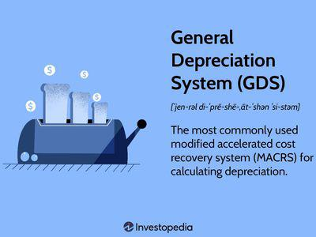

In today's complex financial landscape, understanding the Alternative Depreciation System (ADS) and its counterpart, the General Depreciation System (GDS), is essential for businesses aiming for strategic financial planning. These depreciation methods significantly impact tax liabilities, cash flow, and financial reporting, influencing the overall financial health and operational efficiency of a business. By comprehending these systems, companies can align their financial strategies with regulatory requirements and optimize their fiscal outcomes.

Depreciation, as defined by the Internal Revenue Service (IRS), allows businesses to recover the cost of assets over time. The choice between ADS and GDS can lead to varying depreciation schedules, which in turn affect the timing and amount of tax deductions a business can claim. While GDS is typically used in scenarios allowing accelerated depreciation, providing higher deductions in the initial years of an asset's life, ADS mandates a more gradual recognition of asset depreciation over extended periods. This systematic approach offers a steady depreciation expense and long-term alignment with an asset's endurance.



Strategic application of ADS or GDS involves not only understanding their differences but also evaluating how each method supports a company's overall financial objectives. In industries such as real estate, for example, selecting ADS might lead to more predictable results, especially for international properties or those financed with tax-exempt bonds. Conversely, GDS might be advantageous for businesses seeking immediate tax relief through accelerated deductions.

Furthermore, these depreciation systems have implications beyond traditional financial management, extending into algorithmic trading strategies. As algorithmic trading relies on precise financial data and asset valuations, understanding the impact of depreciation methods is crucial. By factoring in how ADS and GDS influence asset valuations and financial metrics, businesses can refine their trading algorithms, enhancing decision-making processes when buying or selling assets.

This article explores the differences between ADS and GDS, their strategic application in business, and their implications for algorithmic trading strategies. An understanding of how these depreciation systems interact with financial analysis tools and trading algorithms can provide a competitive edge, allowing businesses to navigate financial and taxation challenges effectively in the evolving marketplace.

## Table of Contents

## Understanding the Alternative Depreciation System (ADS)

The Alternative Depreciation System (ADS) is a method prescribed by the Internal Revenue Service (IRS) for depreciation of certain assets. It is often required in cases where properties are predominantly used outside the United States or for those with tax-exempt purposes. Unlike other depreciation methods that allow for rapid asset value reduction, ADS emphasizes a prolonged recovery period, thereby aligning more closely with the actual revenue generation cycles of businesses.

Under ADS, the recovery periods are generally longer compared to the General Depreciation System (GDS). This extended timeline contributes to a steadier recognition of asset value depletion. For instance, where GDS might allow accelerated depreciation—enabling significant deductions in the early years—ADS employs a straight-line method, offering uniform depreciation throughout the asset's useful life. 

This systematic approach to accounting for asset value is particularly beneficial for organizations seeking to maintain consistency in their financial reporting. By spreading the depreciation deduction evenly over the asset's lifespan, ADS minimizes fluctuations in yearly tax deductions, aiding in stable financial planning. This steadiness is crucial for businesses focusing on long-term financial strategies, as it aligns depreciation with economic wear and tear more accurately.

While ADS might not offer the immediate tax relief afforded by more aggressive depreciation schedules, its long-term predictability is advantageous for entities looking for consistent financial outcomes. It also ensures compliance with various regulatory frameworks encountered by assets used outside conventional settings or those involving tax-exempt usage. 

Overall, the rational and calculated nature of ADS makes it a strategic choice for businesses prioritizing accuracy and uniformity in asset depreciation, providing a framework that closely mirrors ongoing revenue streams.

## Comparison Between ADS and GDS

GDS (General Depreciation System) and ADS (Alternative Depreciation System) offer distinct frameworks for calculating depreciation, each suited to different strategic financial and tax planning needs. GDS allows businesses to leverage accelerated depreciation methods, such as the 200% declining balance method, which can significantly front-load depreciation expenses. This approach leads to larger deductions early in the asset's lifespan, which can be advantageous for businesses seeking immediate tax relief and reduced taxable income during the initial years of asset use. This method can be particularly beneficial for industries where technological obsolescence is rapid, allowing companies to recover investment costs quickly.

In contrast, the ADS employs a straight-line method to calculate depreciation over a longer recovery period. This technique apportions the depreciation expense evenly across the asset's useful life, reflecting a gradual and consistent expense pattern. The ADS is often utilized for assets with extended useful lives or when required by regulatory circumstances, such as properties used predominantly outside the United States or in tax-exempt activities. By spreading the depreciation deductions evenly over more years, ADS aligns more closely with assets generating stable revenue streams over time.

These contrasting approaches impact financial strategy significantly. Understanding these differences empowers businesses to make informed decisions regarding which system aligns better with their financial objectives and regulatory compliance requirements. For example, companies focused on maximizing short-term cash flow might prefer GDS, while organizations prioritizing long-term fiscal consistency and compliance with international rules might opt for ADS.

Selecting the appropriate system is crucial, as it influences both the timing and magnitude of tax liabilities and can have profound implications for balance sheets and financial reporting. Ultimately, the choice between GDS and ADS should reflect a comprehensive analysis of the company's financial strategy, asset type, and applicable regulations, ensuring optimal alignment with overarching business objectives.

## Strategic Applications of ADS

Businesses may choose to adopt the Alternative Depreciation System (ADS) to align their asset depreciation methods with broader financial strategies and international tax obligations. Such voluntary usage is often aimed at achieving a more stable financial trajectory and can be particularly advantageous in specific sectors.

In industries like real estate, where the lifespan of an asset tends to stretch over longer periods, ADS's longer recovery periods offer significant strategic benefits. Real estate properties generally benefit from a prolonged and stable depreciation schedule, which can match the companies' long-term revenue expectations and reduce annual tax [volatility](/wiki/volatility-trading-strategies). This stability is crucial for real estate firms that require predictable cash flows for accurate financial planning and investment decision-making.

Similarly, companies utilizing assets financed with tax-exempt bonds may find ADS beneficial. Tax-exempt bonds often come with stringent tax regulations, and the systematic depreciation under ADS can ensure compliance while synchronizing asset valuation with fiscal policies. By adopting a methodical depreciation approach, businesses can maintain congruency between asset depreciation and bond financing requirements, benefiting from the tax-exemption advantages these bonds provide.

Additionally, using ADS facilitates the alignment of depreciation expenses with international tax regulations, which can be complex due to variations in global tax codes. ADS simplifies compliance by providing a consistent method of asset depreciation that conforms with cross-border financial strategies. This consistency supports multinational companies in harmonizing their international tax positions and ensures that financial reports accurately reflect global operational realities.

Overall, leveraging ADS can lead to predictable financial outcomes and significantly enhance strategic financial planning. When businesses consistently apply the longer depreciation periods of ADS, they not only meet regulatory constraints but also create a stable financial environment conducive to long-term investment and growth strategies.

## Benefits and Challenges of ADS

The Alternative Depreciation System (ADS) provides several advantages for businesses considering long-term financial strategies. One of the primary benefits of ADS is its capability to deliver stable annual tax deductions, allowing businesses to better predict their tax liabilities. By aligning asset depreciation with the prolonged economic use of asset properties, ADS facilitates more accurate long-term planning. This methodology is particularly suitable for assets with a longer useful life, ensuring the depreciation schedule matches the extended revenue-generating potential of such assets. This alignment can enhance a company's financial stability by smoothing the expense recognition over the asset's entire useful life, contributing to a consistent financial narrative critical for investors and stakeholders.

However, the ADS is not without its challenges. The system mandates a slower depreciation rate compared to the General Depreciation System (GDS), which can lead to higher taxable income in the earlier years of an asset's life. Consequently, businesses might experience reduced cash flows initially, posing a potential drawback for those seeking prompt tax relief. This can be particularly taxing for cash-strapped companies that prioritize [liquidity](/wiki/liquidity-risk-premium).

In addition to financial implications, the adoption of ADS can introduce complexities in tax compliance and financial reporting. Businesses must maintain detailed records to justify the use of ADS, often necessitating more sophisticated accounting systems and expertise. These requirements could lead to increased administrative costs and efforts to ensure compliance with tax regulations.

Overall, while ADS offers strategic benefits for businesses focused on maintaining financial consistency over the long term, it requires careful consideration of the immediate cash flow impacts and the complexities involved in compliance and reporting. The decision to adopt ADS should be informed by a comprehensive analysis of a company’s financial objectives and tax position.

## Algorithmic Trading and Depreciation Methods

Algorithmic trading is fundamentally dependent on the accuracy and timeliness of financial data, where an in-depth understanding of depreciation methods proves critical. Depreciation carries significant weight in asset valuation, a key [factor](/wiki/factor-investing) that trading algorithms leverage for executing buy or sell decisions. 

In the context of [algorithmic trading](/wiki/algorithmic-trading), the balance between utilizing the Alternative Depreciation System (ADS) and the General Depreciation System (GDS) can be pivotal. ADS, with its prolonged depreciation period, allows assets to be valued more consistently over time, which is beneficial for strategies focusing on long-term investments. In contrast, GDS, through accelerated depreciation methods like the 200% declining balance, results in higher deductions and lower taxable income in the initial years of an asset’s life cycle. This accelerated depreciation can artificially enhance short-term financial health, making assets appear more lucrative to algorithms that prioritize short-term gains.

Consider an asset initially worth $100,000 that under GDS could depreciate 40% in the first year, reducing its book value to $60,000. The same asset under ADS, depreciating 10% annually, would maintain a book value of $90,000 after the first year. An algorithm optimized for rapid value changes might prefer the depreciation trajectory of GDS, interpreting the rapid reduction in book value as an opportunity for strategic tax positions and asset management.

Python code can demonstrate such financial simulations. Here’s a basic example of how depreciation might be implemented in Python:

```python
def gds_depreciation(initial_value, rate, years):
    value = initial_value
    for year in range(years):
        depreciation = value * rate
        value -= depreciation
        print(f"Year {year+1}: Depreciation = {depreciation}, Book Value = {value}")

def ads_depreciation(initial_value, years):
    rate = 1 / years
    value = initial_value
    depreciation = value * rate
    for year in range(years):
        value -= depreciation
        print(f"Year {year+1}: Depreciation = {depreciation}, Book Value = {value}")

initial_value = 100000
gds_depreciation(initial_value, 0.4, 5)
ads_depreciation(initial_value, 10)
```

Balancing these systems, businesses can align their tax positions with strategic objectives, considering how each system influences not only tax outcomes but also financial metrics crucial for trading algorithms. The choice between ADS and GDS should carefully reflect the company’s broader strategic goals, the nature of their assets, and the trading models in use, ensuring these decisions complement the overarching financial strategy rather than hinder it.

## Conclusion

Mastering the nuances of both the Alternative Depreciation System (ADS) and the General Depreciation System (GDS) can significantly enhance a business's ability to navigate financial and taxation landscapes. A comprehensive understanding of these depreciation systems enables businesses to effectively align their asset management with financial and regulatory strategies. On one hand, ADS offers a more gradual approach to depreciation, ensuring that asset value depreciation is slow and stable. This can lead to predictability in financial outcomes which is crucial for long-term planning and adherence to international tax regulations. However, the slower depreciation rate associated with ADS might result in initially higher taxable income, introducing complexities to tax compliance and reporting. 

On the other hand, GDS allows for accelerated depreciation, providing higher immediate tax deductions which are advantageous for businesses seeking quick tax relief. The strategic application of either method can also influence algorithmic trading strategies. In these automated financial markets, precise financial data and forecasts are vital. An in-depth understanding of how different depreciation methods affect asset valuation can provide businesses with a competitive edge. For instance, the choice of depreciation method could significantly impact how trading algorithms assess the value of assets, ultimately influencing buy or sell decisions.

To illustrate how such understanding might be implemented in a practical financial strategy, a Python script could simulate the impact of ADS versus GDS on financial projections:

```python
def depreciation_schedule(cost, life_years, method='ADS'):
    if method == 'ADS':
        rate = 1 / life_years
        return [cost * rate] * life_years
    elif method == 'GDS':
        rate = 2 / life_years
        schedule = []
        remaining_value = cost
        for year in range(1, life_years + 1):
            deduction = remaining_value * rate
            schedule.append(deduction)
            remaining_value -= deduction
        return schedule

initial_cost = 100000
life_span = 10

ads_schedule = depreciation_schedule(initial_cost, life_span, 'ADS')
gds_schedule = depreciation_schedule(initial_cost, life_span, 'GDS')

print(f"ADS Depreciation Schedule: {ads_schedule}")
print(f"GDS Depreciation Schedule: {gds_schedule}")
```

This script simulates simple depreciation schedules for both ADS and GDS, highlighting differences that could inform strategic decisions. By mastering these systems, businesses can optimize their financial outcomes, leverage tax advantages, and enhance the accuracy of their financial analytics, providing a distinct advantage in the competitive landscape of automated trading.

## FAQs

### FAQs

**What types of assets qualify for ADS?**  
The Alternative Depreciation System (ADS) is typically used for specific types of assets as mandated by the IRS. Assets that qualify for ADS include those used predominantly outside the United States, assets used for tax-exempt purposes, and property financed with tax-exempt bonds. Certain elected farming or horticultural assets and assets in foreign countries are also subject to ADS requirements.

**Can a business switch from ADS to GDS?**  
Switching from the Alternative Depreciation System (ADS) to the General Depreciation System (GDS) can be complex and is generally subject to specific IRS regulations. Once a method has been chosen for depreciation, switching is typically not allowed within the same asset class unless certain conditions are met. Businesses must file Form 3115, Application for Change in Accounting Method, and gain approval from the IRS to alter their depreciation method.

**How does ADS affect short-term and long-term financial planning?**  
ADS impacts both short-term and long-term financial planning by altering how depreciation expenses are recognized. In the short term, using ADS results in lower depreciation expenses compared to GDS, leading to higher taxable income and tax liabilities. Consequently, there is an immediate effect on cash flow, as businesses may face higher tax payments. In the long term, ADS provides steadier, more predictable depreciation expenses, aligning closer with an asset's economic life. This can aid in consistent financial forecasting and facilitate long-term strategic planning.

**What are the implications of ADS on multinational companies?**  
For multinational companies, ADS has significant implications, particularly concerning international taxation. Assets used primarily outside the U.S. are required to use ADS, which can affect the depreciation schedules and tax obligations in various jurisdictions. This system allows multinational enterprises to align asset depreciation across different countries with varying tax regimes. However, navigating these complexities can introduce challenges in compliance and financial reporting. Furthermore, ADS can influence transfer pricing strategies, cross-border cash flow management, and overall tax planning for multinational entities, necessitating a nuanced understanding and strategic approach.

## References & Further Reading

[1]: IRS. (2021). ["Publication 946: How to Depreciate Property."](https://www.irs.gov/pub/irs-prior/p946--2021.pdf) Internal Revenue Service.

[2]: Lipatov, V. M. (2019). ["Depreciation and Investment Incentives."](https://onlinelibrary.wiley.com/doi/abs/10.1002/aelm.201670068) Springer.

[3]: Keller, E. S. (2022). ["Understanding the Depreciation of Real Estate Holdings."](https://www.forbes.com/councils/forbesrealestatecouncil/2020/03/31/understanding-real-estate-tax-benefits-depreciation-accelerated-depreciation-bonus-depreciation/) National Association of Real Estate Investment Trusts.

[4]: ["Tax Cuts and Jobs Act: The impact on U.S. depreciation."](https://taxfoundation.org/research/all/federal/2017-tax-cuts-jobs-act-analysis/) PwC Analysis, 2021.

[5]: Alexander, G. J., & Sharpe, W. F. (1982). ["A Simplified Model of Pension Fund Valuation Using Dynamic Depreciation."](https://books.google.com/books/about/Investments.html?id=12UPAQAAMAAJ) Management Science, 28(4), 394-410. 

[6]: ["Principles of Quantitative Equity Investing: A Complete Guide to Creating Value Through Factor Exposures"](https://ptgmedia.pearsoncmg.com/images/9780134192796/samplepages/9780134192796.pdf) by Sugata Ray

[7]: ["Depreciation Toolbox - Making Informed Real Estate Investments"](https://cpastreet.com/real-estate-depreciation-methods/) by Certified Commercial Investment Member (CCIM) Institute.