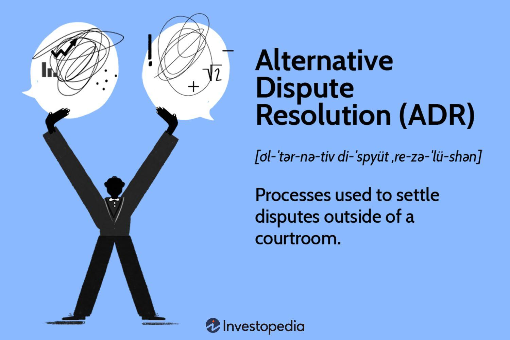

Conflict management and dispute resolution are integral components across various domains, including personal, organizational, and financial sectors. These processes aim to address disputes efficiently, ensuring optimal outcomes with minimal confrontation. Traditional methods of resolving conflicts have often been cumbersome and time-consuming, necessitating innovative approaches like Alternative Dispute Resolution (ADR). ADR encompasses techniques such as mediation, arbitration, and negotiation, which offer more streamlined, effective resolutions compared to conventional litigation. These methods not only expedite the process but also foster more amicable settlements.

As technology permeates every aspect of modern life, its impact is also evident in conflict management. Specifically, automated online dispute resolution mechanisms, supported by advances in technology, have started to transform how conflicts are addressed. Simultaneously, the financial domain has experienced a technological revolution through algorithmic trading. This modern trading method leverages computer algorithms to automate trading, enhancing speed, accuracy, and efficiency in executing transactions. By minimizing human intervention, algorithmic trading also reduces biases and emotional influences, limiting human errors.



This article explores the intersection of conflict management, ADR, and algorithmic trading, emphasizing their growing importance and interconnectedness in evolving financial and legal environments. The convergence of these domains, supported by technological advancements, holds promise for more efficient, unbiased, and effective management of disputes and trading activities. As these sectors continue to evolve, understanding their interplay becomes crucial in harnessing their collective strengths for improved efficacy and fairness in conflict resolution and financial operations.

## Table of Contents

## Understanding Conflict Management and ADR

Conflict management is an essential practice that involves the implementation of strategies designed to prevent, manage, and resolve disputes efficiently and effectively. It typically encompasses a combination of preventive measures and responsive tactics aimed at addressing interpersonal, organizational, or financial conflicts before they escalate into more severe confrontations. The primary goal of conflict management is to reach a resolution that satisfies all parties involved, fostering a cooperative environment and maintaining productive relationships.

Alternative Dispute Resolution (ADR) is a critical component within the broader framework of conflict management. ADR provides a set of methodologies including mediation, arbitration, and negotiation, which serve as alternatives to traditional courtroom litigation. These methods offer several benefits, such as reduced costs, quicker resolution times, and the potential for more personalized and amicable outcomes. Mediation involves a neutral third party who facilitates communication between disputing entities to help them reach a voluntary agreement. Arbitration, on the other hand, involves a binding decision made by an arbitrator after considering both sides' arguments. Negotiation is a more direct approach where the parties involved communicate directly with each other to find a mutually acceptable solution.

In the United States, the federal government has recognized the efficacy of ADR and has widely implemented it across various sectors. This adoption stems from ADR's ability to ease the burden on the judicial system by resolving conflicts outside the traditional court system. Government agencies utilize ADR to address disputes ranging from contractual disagreements to labor conflicts, often resulting in more efficient and satisfactory resolutions for the involved parties. The emphasis on ADR reflects a growing acknowledgment of its potential to facilitate not only quicker but also more beneficial outcomes while preserving relationships and promoting a spirit of collaboration.

Overall, understanding conflict management and the role of ADR highlights the importance of innovative approaches to conflict resolution, offering structured, efficient, and often more amicable solutions than conventional litigation processes.

## Algorithmic Trading: Revolutionizing Financial Markets

Algorithmic trading, often referred to as algo-trading, represents a significant advancement in the financial markets by automating trading decisions through the use of sophisticated computer algorithms. This approach leverages mathematical models and computations to decide on the optimal timing, price, and quantity for buying or selling stocks, commodities, or other financial instruments. The automation offered by [algorithmic trading](/wiki/algorithmic-trading) facilitates rapid transaction execution, which greatly enhances the speed and accuracy of trading activities compared to traditional manual methods.

One of the core advantages of algorithmic trading is its ability to analyze massive datasets much faster than any human trader could. By processing historical and real-time market data, these algorithms identify complex patterns and correlations that might not be immediately apparent to human analysts. This capability enables them to develop more informed and strategic trading decisions, thereby improving the likelihood of achieving desired investment outcomes.

A crucial benefit of algorithmic trading stems from its capacity to execute trades at optimal prices, significantly minimizing the negative impacts of human emotions and errors. Emotional decision-making can lead to irrational market behaviors such as panic selling or greed-driven buying, often resulting in substantial losses. By relying on pre-defined algorithms, trades are executed based on objective criteria, reducing the potential for such biases and errors.

In practice, an algorithm used in trading might incorporate various financial models such as mean reversion or [momentum](/wiki/momentum) strategies. For instance, a basic momentum trading algorithm could be outlined in Python as follows:

```python
import pandas as pd

def compute_momentum(prices, window=10):
    return prices.pct_change(window).dropna()

def backtest_momentum_strategy(prices, window=10):
    signal = compute_momentum(prices, window)
    returns = prices.pct_change().shift(-1)
    strategy_returns = returns[signal > 0].mean()
    return strategy_returns

# Example prices data
prices_data = pd.Series([100, 101, 102, 104, 107, 110, 115, 113])
backtest_momentum_strategy(prices_data)
```

In this example, the algorithm calculates momentum by assessing the percentage change in asset prices over a specified window. Based on the momentum signal, a trading strategy is generated, which indicates buying when a positive momentum is detected. This is a simplified illustration of how algorithms can be employed to automate the decision-making process in trading.

Overall, the emergence of algorithmic trading is transforming financial markets by enabling highly efficient and unbiased trading operations. As technology continues to evolve, the role of algorithmic trading is expected to expand, offering even greater sophistication and potential for profit optimization while maintaining market stability.

## ADR in the Context of Algorithmic Trading

As financial markets continue to evolve with the integration of algorithmic trading, the complexity of transactions increases, occasionally resulting in disputes related to execution errors, ownership ambiguities, and breaches of contract. Traditional litigation is often ill-suited to address these issues efficiently, given the dynamic and highly technical nature of algorithmic trading. Implementing Alternative Dispute Resolution (ADR) methods becomes an optimal approach to manage such conflicts, providing more agility and specificity than conventional courtroom procedures.

ADR encompasses various processes like negotiation, mediation, and arbitration, each offering tailored solutions suited to the distinct challenges posed by algorithmic trading. These methods can facilitate resolutions without the extensive timeframes and costs associated with formal litigation.

1. **Negotiation**: This process involves the conflicting parties working collaboratively to reach a mutually acceptable solution. In algorithmic trading scenarios, negotiation can focus on technical clarifications and potential recalibrations of trading algorithms to prevent future errors.

2. **Mediation**: A neutral third-party mediator assists the disputing entities in reaching a voluntary and consensual agreement. The mediator's role is crucial in algorithmic trading disputes as it requires an understanding of both the financial and technological intricacies involved. The mediator can guide parties through a constructive dialogue aimed at resolving complex technical issues that are often central to these disputes.

3. **Arbitration**: More formal than negotiation or mediation, arbitration involves a binding decision from an arbitrator with expertise in financial markets and technology. For algorithmic trading disputes, arbitration can provide a definitive resolution backed by a thorough examination of trading algorithms, market data, and transaction records. Arbitration is particularly useful when parties seek a legally enforceable decision based on intricate factual and technical analyses.

The adaptability of ADR processes to the specific circumstances of algorithmic trading highlights their relevance. By resolving disputes through these specialized and efficient mechanisms, financial institutions can maintain business relationships and continue to innovate within their trading practices, fostering a competitive and stable market environment.

## Technology's Role in ADR and Algorithmic Trading

Technological advancements, particularly in [artificial intelligence](/wiki/ai-artificial-intelligence) (AI) and blockchain, are significantly enhancing both Alternative Dispute Resolution (ADR) and algorithmic trading systems. AI technology plays a pivotal role in dispute resolution by predicting potential outcomes and automating routine administrative tasks, thereby increasing efficiency and reducing human error. For instance, AI algorithms can analyze past dispute resolution data to forecast resolution paths and outcomes, enabling mediators and arbitrators to make well-informed decisions. Moreover, AI-powered tools can facilitate virtual mediation sessions, automate documentation, and manage communication between parties, streamlining the entire ADR process.

In the context of algorithmic trading, AI algorithms are crucial for processing large datasets swiftly and accurately, leading to more effective trading strategies. These algorithms can identify trends and make trading decisions much faster than human counterparts, optimizing trade execution to capitalize on favorable market conditions.

Blockchain technology further enhances these domains by providing unprecedented levels of transparency and security. In ADR, blockchain can be used to create immutable records of all transactional data, ensuring that all parties have access to a trusted and verifiable trail of evidence. This technology diminishes the risk of data manipulation and guarantees the integrity of the information used in dispute resolution.

Similarly, in algorithmic trading, blockchain ensures transparency across financial transactions by recording every trade on a decentralized ledger. This not only reduces the possibility of fraudulent activities but also aids in regulatory compliance by maintaining a clear and traceable audit trail. Additionally, smart contracts—self-executing contracts with terms directly written into code—can autonomously enforce trading agreements and settlements, significantly reducing the potential for disputes.

In conclusion, by integrating AI and blockchain technologies, both ADR and algorithmic trading systems can be significantly optimized. These technologies facilitate efficient, transparent, and fair processes, which are crucial in handling the complexities of modern financial and legal environments.

## Case Studies: Successful Integration of ADR and Algorithmic Trading

Several financial institutions have demonstrated effective integration of Alternative Dispute Resolution (ADR) approaches within algorithmic trading environments, thereby mitigating disputes efficiently and minimizing the time and costs typically associated with traditional litigation. This section outlines notable examples and the strategies employed.

One prominent case involves a global investment bank that faced frequent disputes regarding the execution and timing of algorithmic trades. By implementing a structured ADR framework, including mediation and arbitration clauses in their trading agreements, the bank was able to resolve disputes more swiftly and maintain healthy relationships with their clients and counterparties. The implementation of ADR provided a neutral platform for parties to negotiate and settled conflicts without resorting to lengthy legal processes. This approach not only saved significant legal costs but also preserved the integrity and continuity of trading relationships, thereby bolstering market confidence.

In another example, a financial services firm specializing in high-frequency trading ([HFT](/wiki/high-frequency-trading-strategies)) integrated ADR mechanisms to address disputes arising from algorithm-triggered market anomalies. The firm established a streamlined dispute resolution process leveraging technology-driven mediation tools to facilitate transparent dialogue between parties. By prioritizing transparency and collaboration, the institution was capable of swiftly addressing conflicts involving algorithmic errors or contentious trade outcomes. This mechanism fostered a culture of accountability and trust, reducing the need for litigation and promoting a cooperative market environment.

Moreover, a study conducted on a consortium of financial institutions using ADR in algorithmic trading identified significant reductions in dispute resolution times. By employing AI-enhanced mediation platforms, these institutions could automate clerical tasks, analyze dispute patterns, and predict settlement outcomes. This technological integration not only accelerated the resolution process but also reduced operational risks and improved stakeholder relationships.

These case studies underscore the critical role of ADR as a practical solution for conflict resolution in technology-driven financial markets. By adopting ADR strategies tailored for algorithmic trading, institutions can mitigate legal risks while enhancing operational efficiency and maintaining robust business partnerships. This successful integration exemplifies how ADR can function as a crucial mechanism, adapting to complex financial systems and contributing to the stability and reliability of modern trade infrastructures.

## Future Prospects and Challenges

The future of conflict management, Alternative Dispute Resolution (ADR), and algorithmic trading is anticipated to be increasingly shaped by technological advancements. Yet, this shift is accompanied by challenges such as regulatory frameworks, data privacy concerns, and the risks of algorithmic biases. The integration of technology into these fields holds promise, but it necessitates careful navigation to maximize benefits and minimize downsides.

One of the primary challenges is regulatory compliance. As algorithmic trading and ADR systems become more sophisticated, regulators must develop robust frameworks to ensure fairness, transparency, and accountability. The decentralized nature of technologies such as blockchain complicates traditional regulatory approaches, necessitating innovative solutions that can effectively address cross-jurisdictional issues.

Data privacy is another critical concern. The effectiveness of both ADR methods and algorithmic trading relies heavily on data analysis. Protecting sensitive information while ensuring access to necessary data is a delicate balance. Compliance with data privacy regulations, such as the General Data Protection Regulation (GDPR) in the European Union, requires ongoing attention and adaptation.

Algorithmic biases also present significant risks, particularly as Artificial Intelligence (AI) is employed to predict outcomes and automate decisions in both ADR and trading contexts. Biases in algorithms can lead to unfair advantages or resolutions that undermine trust. Ensuring that AI systems are transparent and subject to regular audits can mitigate these risks.

Future prospects for overcoming these challenges rest heavily on advancements in AI and blockchain technologies. AI can enhance the precision and efficiency of dispute resolution methods by learning from vast datasets to recommend optimal resolution strategies. Meanwhile, blockchain can offer greater transparency and security, essential for building trust in automated systems. For example, blockchain's immutable ledger can record transactions and dispute resolutions, providing accessible and tamper-proof documentation.

Moreover, smart contracts—self-executing contracts with the terms of the agreement directly written into code—could revolutionize how both trades and disputes are managed. By automatically executing actions when pre-defined conditions are met, smart contracts reduce the potential for human error and accelerate resolution processes.

In Python, a smart contract might look like this:

```python
def execute_contract(condition_met, action):
    if condition_met:
        action()
```

This simple representation shows how a condition can trigger an action, illustrating the potential for automation.

Ultimately, the successful integration of these technologies will hinge on collaboration between technologists, legal professionals, regulators, and industry stakeholders. By fostering such cooperation, the future of conflict management, ADR, and algorithmic trading can be guided towards a more efficient, fair, and technologically enhanced landscape.

## Conclusion

The intersection of conflict management, alternative dispute resolution (ADR), and algorithmic trading signifies a significant advancement in financial and legal sectors. This convergence is driven by the need for efficient, effective, and fair mechanisms to handle disputes and automate trading processes. By embracing technological innovations, such as artificial intelligence (AI) and blockchain, both fields can greatly benefit from enhanced accuracy, speed, and transparency.

Technological advancements facilitate the refinement of ADR processes. AI, for instance, can predict outcomes of disputes and streamline administrative duties, allowing human mediators to focus on complex aspects of conflict resolution. Blockchain technology supports transparency and verifiable records of transactions, significantly reducing the ambiguity and mistrust that may lead to disputes. These innovations enable stakeholders to resolve conflicts with greater confidence and neutrality, mitigating potential biases inherent in human-led negotiations.

Similarly, algorithmic trading is enhanced by technological innovations that provide real-time data processing and increased computational power, allowing for trades to occur at optimal times and prices. This reduces the influence of human emotions and errors, promoting fairer trading outcomes. However, the implementation of these technologies requires stakeholders to remain alert to evolving regulations and ethical concerns. Algorithms and AI systems must be designed and monitored to prevent biases, ensuring they adhere to ethical standards and legal requirements.

As regulations continue to adapt to these rapid technological changes, stakeholders must consider data privacy and security, ensuring that sensitive information is protected within both ADR and algorithmic trading platforms. Addressing these concerns while leveraging technological capabilities is essential for the successful integration and application of these innovations in managing conflicts and executing trades. This strategic approach promises to reshape how disputes are resolved and financial transactions are conducted, leading to a more streamlined and equitable environment.

## References & Further Reading

[1]: Kauffman, S., & Bessen, J. (2006). ["Online Dispute Resolution: Resolving Conflicts in Cyberspace"](https://www.semanticscholar.org/paper/Online-Dispute-Resolution%3A-Resolving-Conflicts-in-Katsh-Katsh/665bd0ff9780a12d81506134db27ac8b1ec81ec9). Jossey-Bass.

[2]: Held, V., & Moffitt, M. (2007). ["The Handbook of Dispute Resolution"](https://www.semanticscholar.org/paper/The-handbook-of-dispute-resolution-Moffitt-Bordone/af72d58ab35fdb36c8a67d66567f90e55a4e1a0a). Jossey-Bass.

[3]: ["Algorithmic Trading: Winning Strategies and Their Rationale"](https://www.wiley.com/en-us/Algorithmic+Trading%3A+Winning+Strategies+and+Their+Rationale-p-9781118460146) by Ernest P. Chan

[4]: Keshav, N. (2018). ["High-Frequency Trading: A Practical Guide to Algorithmic Strategies and Trading Systems"](https://onlinelibrary.wiley.com/doi/pdf/10.1002/9781119203803.fmatter) by Irene Aldridge and Steven Krawciw

[5]: Menkel-Meadow, C. (2001). ["What's Fair: Ethics for Negotiators"](https://www.wiley.com/en-us/What%27s+Fair%3A+Ethics+for+Negotiators-p-9781118009253). Jossey-Bass.

[6]: de Prado, Marcos Lopez. (2018). ["Advances in Financial Machine Learning"](https://www.amazon.com/Advances-Financial-Machine-Learning-Marcos/dp/1119482089). Wiley.

[7]: Gomber, P., Arndt, B., Lutat, M., & Uhle, T. (2011). ["High-Frequency Trading"](https://www.semanticscholar.org/paper/High-Frequency-Trading-Gomber-Arndt/3d0ba8179934e0a45e85a184d1ec526616e2e213). SSRN Electronic Journal.