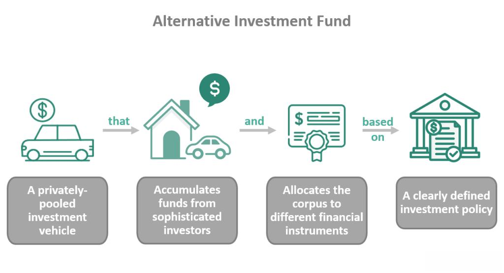

The Alternative Investment Fund Managers Directive (AIFMD) holds a pivotal role in the regulation of alternative investment funds (AIFs), serving as a cornerstone for financial stability and investor protection within the European Union. AIFs, distinct from traditional mutual funds, encompass a broad range of investment vehicles, including hedge funds, private equity funds, and real estate funds. Their significance has been steadily growing in global markets, driven by their ability to offer diversified investment opportunities and potentially higher returns. This rise in prominence underscores the necessity for a robust regulatory framework to safeguard market integrity and protect investors.

Simultaneously, technological advancements have introduced algorithmic trading to AIFs, transforming the approach to investment management. Algorithmic trading involves using computer algorithms to automate trading decisions, offering the potential for increased efficiency, improved liquidity, and reduced human error. However, these technological advancements also present new challenges and risks, necessitating a re-evaluation of regulatory measures.

The purpose of this article is to explore the regulatory landscape established by AIFMD and its implications for algorithmic trading within AIFs. By examining the directives and amendments of AIFMD, this discussion aims to provide clarity on how regulations are structured to address the unique challenges posed by algorithmic trading strategies in the context of alternative investment funds. The insights presented will guide fund managers and stakeholders in understanding and navigating the complex regulatory environment, ultimately fostering a balanced financial ecosystem.

## Table of Contents

## Understanding the Alternative Investment Fund Managers Directive (AIFMD)

The Alternative Investment Fund Managers Directive (AIFMD) is a pivotal regulation established by the European Union with objectives aimed at overseeing alternative investment funds (AIFs). Its formulation was a direct response to the 2008 financial crisis, which exposed significant regulatory shortcomings, particularly in areas involving systemic risk and investor protection. This directive provides a comprehensive framework intended to ensure transparency, stability, and integrity within the financial markets affecting AIFs.

The 2008 financial crisis underscored the vulnerability of global financial systems and highlighted the significant roles that hedge funds and other alternative investment vehicles played in exacerbating systemic risks. AIFMD was implemented to address these concerns by providing a cohesive regulatory structure that targets the operation, management, and oversight of AIFs. Essentially, AIFMD works to mitigate the risks posed by these funds and ensures that they do not threaten the financial stability of markets.

AIFMD applies to various funds, including hedge funds, private equity funds, real estate funds, and other investment structures traditionally outside the scope of conventional collective investment regulations. Generally, the directive covers any fund that is not regulated under the Undertakings for Collective Investment in Transferable Securities (UCITS) framework, thereby casting a wide net over diverse fund types that engage in alternative investment strategies.

The primary objectives of AIFMD are twofold: investor protection and systemic risk reduction. Investor protection is achieved through stringent disclosure requirements, managing conflicts of interest, and developing robust valuation processes. AIFMs must provide investors with comprehensive information frameworks, ensuring transparency and fairness in operations. Furthermore, they must conduct themselves with integrity, particularly concerning valuations and the mitigation of any potential conflicts that may arise in the management of their funds.

In terms of systemic risk mitigation, AIFMD imposes regulations on leverage and remuneration within AIFs. These regulations are designed to prevent excessive leveraging, which could potentially lead to financial instability. By setting limits and requiring consistent monitoring, the directive ensures that the leverage employed by these funds does not compromise the financial stability of broader markets. Additionally, remuneration policies are scrutinized to align the interests of fund managers and investors, discouraging excessive risk-taking behaviors.

Overall, the AIFMD stands as a critical regulatory structure in the European financial landscape. It embodies a strategic effort to safeguard investors while simultaneously curbing systemic risks that could have profound impacts on global financial stability.

## The Core Objectives of AIFMD

The Alternative Investment Fund Managers Directive (AIFMD) primarily aims to enhance investor protection and mitigate systemic risk. These objectives are integral to ensuring a secure and transparent alternative investment landscape.

**Investor Protection**

To safeguard investors, AIFMD mandates several key requirements:

1. **Disclosure**: Fund managers must provide comprehensive information to investors to facilitate informed decision-making. This includes detailed disclosures about investment strategies, risk profiles, and fund performance. Regular reporting requirements help maintain transparency, ensuring investors are well-informed about their investments.

2. **Conflicts of Interest**: Managers are required to identify and manage potential conflicts of interest. Effective conflict management policies must be in place to ensure the fund's operations are unbiased and in investors' best interests. This involves maintaining a clear separation between decision-making roles and instituting mechanisms to mitigate potential conflicts.

3. **Valuation**: Accurate asset valuation is critical. AIFMD prescribes frameworks for the consistent and fair valuation of assets, necessitating the deployment of independent valuation processes where possible. These measures prevent asset mispricing, which could mislead investors and compromise market integrity.

**Systemic Risk Mitigation**

AIFMD also focuses on curtailing systemic risks, particularly those linked to leverage and remuneration:

1. **Leverage**: The directive imposes limits on leverage to control the risks that high leverage ratios can introduce. By restricting excessive borrowing, AIFMD strives to prevent the amplification of market volatility and potential cascading financial failures.

2. **Remuneration**: Sound remuneration policies align the interests of fund managers with those of investors, ensuring that compensation structures do not incentivize excessive risk-taking. Guidelines under AIFMD require balanced bonus structures, deferred pay, and other mechanisms to foster sustainable growth and risk management.

**Balance Between Regulation and Market Efficiency**

AIFMD seeks to strike a delicate balance between stringent regulation and the promotion of market efficiency. While robust regulations protect investors and stabilize the financial system, the directive also recognizes the need for innovation and market competitiveness. This balance is crucial for ensuring that regulation does not stifle financial innovation or hinder the efficient allocation of capital — the cornerstone of vibrant financial markets.

## Algorithmic Trading in Alternative Investment Funds

Algorithmic trading, also known as algo trading, refers to the use of computer algorithms to automate trading decisions in financial markets. In the context of Alternative Investment Funds (AIFs), [algorithmic trading](/wiki/algorithmic-trading) has become increasingly significant due to its ability to enhance efficiency, reduce transaction costs, and capitalize on market opportunities quickly. AIFs, which typically encompass hedge funds, private equity funds, and other non-traditional investment portfolios, leverage algorithmic trading to optimize their investment strategies.

### Benefits and Challenges of Incorporating Algorithmic Trading in AIFs

Algorithmic trading provides several benefits for AIFs. Firstly, it enables fund managers to process vast amounts of market data rapidly, allowing them to execute trades at optimal prices. This capacity to analyze and respond to market changes swiftly can result in improved investment performance. Additionally, algorithmic trading minimizes human intervention, thereby reducing the risk of emotional decision-making and human errors.

However, integrating algorithmic trading into AIFs also presents challenges. One significant challenge is ensuring the security and reliability of the algorithmic systems. These systems must be resilient to cyber threats and technical malfunctions, which could result in substantial financial losses. Moreover, the complexity of developing and maintaining sophisticated algorithms requires significant expertise and technological resources, which can be costly.

### Current Trends in Algorithmic Trading within the Context of AIFs

Recent trends in algorithmic trading within AIFs highlight the growing importance of [machine learning](/wiki/machine-learning) and [artificial intelligence](/wiki/ai-artificial-intelligence) (AI) techniques. These advanced technologies are increasingly used to develop predictive models that can identify trading opportunities based on historical and real-time data. Moreover, there is a shift towards the use of [alternative data](/wiki/best-alternative-data) sources, such as social media sentiment and satellite imagery, to gain a competitive edge.

Another trend is the focus on high-frequency trading ([HFT](/wiki/high-frequency-trading-strategies)), where algorithms execute a large number of orders at extremely fast speeds. This strategy takes advantage of minute price discrepancies and [liquidity](/wiki/liquidity-risk-premium) imbalances in the market. While HFT strategies can be highly profitable, they demand advanced infrastructure and low-latency technology.

### Impact of Regulations on Algorithmic Strategies Employed by Fund Managers

Regulatory frameworks, including the Alternative Investment Fund Managers Directive (AIFMD), play a crucial role in shaping the algorithmic strategies employed by fund managers. Regulations mandate stringent requirements for risk management, compliance, and reporting, which can influence the design and implementation of algo trading systems in AIFs.

For instance, regulations impose leverage limits on AIFs, affecting the extent to which algorithms can utilize borrowed funds to enhance returns. Compliance with these leverage limits requires fund managers to devise strategies that optimize returns without violating regulatory thresholds. Additionally, regulations necessitate robust mechanisms for monitoring and managing systemic risks posed by algorithmic trading activities.

The regulatory landscape also impacts the transparency and accountability of algorithmic trading processes. Fund managers are required to disclose their trading strategies and risk management practices to regulators, necessitating the creation of comprehensive documentation and auditing procedures. These requirements ensure that algorithmic trading activities align with the broader objectives of investor protection and systemic risk reduction mandated by the AIFMD.

## Regulations Impacting Algorithmic Trading

The Alternative Investment Fund Managers Directive (AIFMD) significantly shapes how algorithmic trading operates within Alternative Investment Funds (AIFs). This directive establishes a regulatory framework designed to oversee various aspects of investment activities, including those involving sophisticated trading strategies like algorithmic trading.

### Compliance Requirements for Algorithmic Trading Strategies

Under AIFMD, fund managers utilizing algorithmic trading must adhere to stringent compliance requirements. These provisions focus on risk management, transparency, and investor protection. AIF managers are required to maintain detailed documentation of their trading algorithms, including their design, functionality, and potential market impact. This includes monitoring and testing algorithms regularly to ensure they function as intended and do not contribute to market disorder or abuse.

Algorithmic trading strategies must also account for potential conflicts of interest, particularly when executing large [volume](/wiki/volume-trading-strategy) trades that could influence market prices. Fund managers must implement systems to detect and mitigate these conflicts, ensuring trading practices are aligned with the fiduciary responsibilities to their investors.

### Regulation of Financial Instruments

AIFMD also governs the financial instruments employed in algorithmic trading. It requires a comprehensive understanding of the instruments used, alongside robust systems for valuation and risk assessment. Fund managers must evaluate the liquidity, pricing models, and risk factors associated with these instruments, ensuring that their use aligns with the broader investment strategy and risk appetite of the fund.

The directive obliges managers to maintain adequate capital reserves to cover the risks associated with the trading activities and the instruments used. This financial prudence aims to mitigate systemic risk and protect investor interests.

### Leverage Limits and Their Impact

Leverage is a crucial [factor](/wiki/factor-investing) in algorithmic trading as it can amplify returns and losses. AIFMD imposes specific leverage limits to control the risk levels within AIFs, requiring managers to calculate and report the fund's leverage on both a gross and commitment basis. The formulae for these calculations are outlined by the directive to ensure standardized reporting across funds.

For example, the gross leverage calculation considers the sum of all positions held by the fund, whereas the commitment approach nets certain offsetting positions and derivative instruments.

Fund managers must consider these leverage constraints when designing and implementing algorithmic strategies, as exceeding leverage limits can lead to regulatory penalties and increased scrutiny. Compliance with these limits helps prevent excessive risk-taking, which could potentially destabilize the financial system.

In summary, AIFMD makes a profound impact on algorithmic trading within AIFs by mandating rigorous compliance measures that address documentation, instrument usage, and leverage limits. These regulations are designed to ensure that algorithmic trading strategies are executed responsibly and align with the broader objectives of investor protection and financial stability.

## The AIFMD II: New Developments in Regulation

The Alternative Investment Fund Managers Directive II (AIFMD II) represents significant regulatory changes aimed at refining and expanding the scope of the original AIFMD. These amendments focus on enhancing the framework governing Alternative Investment Funds (AIFs), emphasizing transparency, investor protection, and market stability. The implementation timeline for AIFMD II amendments has been set to provide fund managers and industry stakeholders with a clear schedule to adapt to these changes, with most reforms coming into effect gradually over the next few years.

A pivotal aspect of AIFMD II is the introduction of new frameworks directly impacting algorithmic trading within AIFs. These frameworks are designed to manage the complexities associated with high-frequency and algorithmic trading practices prevalent among AIFs. With algorithmic trading strategies often employing advanced data analytics and real-time processing, the directive seeks to ensure these practices align with broader market stability and investor protection goals.

The AIFMD II includes provisions that directly regulate algorithmic trading strategies. Key among these is the requirement for rigorous testing and validation of algorithms used in trading to prevent market abuse and enhance transparency. Fund managers must ensure these algorithms are robust, regularly reviewed, and comply with specific risk management criteria.

One of the notable areas of focus in the AIFMD II is the loan origination framework. This framework establishes clear guidelines for AIFs engaged in loan origination activities, ensuring they maintain sound credit assessment processes and adequate risk management systems. This addition highlights the EU's intent to extend regulatory oversight to practices that previously had less stringent regulation, placing importance on the quality of credit assessments and monitoring of credit risk.

The delegation rules within AIFMD II have also undergone significant revisions. These rules address the operational arrangements between AIF managers and third-party service providers. The amendments clarify conditions under which delegation is permissible, aiming to improve oversight and accountability. This is particularly pertinent for algorithmic trading, where various functions may be outsourced to specialized technology providers. The updated delegation rules ensure that ultimate responsibility for compliance and risk management remains with the AIF manager.

Experts analyzing these updates suggest that AIFMD II will shape the future of algorithmic trading through increased regulatory scrutiny and a stronger emphasis on risk management. The amended regulations will require AIF managers to adopt more rigorous compliance frameworks and enhance their technological infrastructure to support enhanced reporting and monitoring requirements. While these changes may entail increased costs and operational adjustments, they are anticipated to foster a more resilient and transparent market environment.

In conclusion, AIFMD II represents a comprehensive regulatory update with significant implications for algorithmic trading within AIFs. Its focus on risk management, transparency, and accountability is expected to contribute positively to the stability and integrity of global financial markets.

## Best Practices for Compliance and Risk Management

To ensure compliance with the Alternative Investment Fund Managers Directive (AIFMD) and effectively manage the risks associated with algorithmic trading, Alternative Investment Funds (AIFs) should adopt a structured approach.

### Meeting AIFMD Compliance Requirements

AIFs need to establish a comprehensive compliance program that addresses the specificities of their algorithmic trading operations. This includes regular audits and documentation to demonstrate adherence to AIFMD stipulations. Fundamental compliance elements comprise:

1. **Robust Internal Controls**: AIFs should implement strong internal frameworks to oversee algorithmic trading activities. This ensures transactions align with stated investment strategies and regulatory requirements.

2. **Detailed Record-Keeping**: Maintaining comprehensive records of all trading algorithms and strategies used is essential. This includes documenting their design, modification history, and operational assessments.

3. **Disclosure Policies**: Effective disclosure practices should be in place to inform investors adequately about how algorithms are used, the risks involved, and the controls that are implemented to mitigate those risks.

### Managing Risks Associated with Algorithmic Trading

Algorithmic trading within AIFs carries unique risks, including system failures and market manipulation. To manage these risks, consider the following strategies:

- **Stress Testing and Simulations**: Regular stress testing of trading algorithms under varied market conditions can help identify vulnerabilities. Simulation techniques can also assist in anticipating the effects of market shocks.

- **Dynamic Risk Assessment**: Continuous evaluation of risk profiles ensures that any emerging threats are promptly identified and managed. This might involve recalibrating risk models to adapt to changing market dynamics.

- **Incident Management Frameworks**: Establishing protocols to handle algorithmic failures or unexpected market behavior is crucial. This includes predefined actions for halting trading operations if thresholds are exceeded.

### Importance of a Strong Compliance Department

A dedicated compliance department is pivotal in ensuring that AIFs meet AIFMD requirements and manage risks effectively. The department should:

- **Stay Informed of Regulatory Changes**: Keeping abreast of any amendments in regulations helps the fund preemptively adapt its strategies and operations.

- **Conduct Regular Training**: Staff involved in algorithm design and deployment should be regularly trained on compliance issues and the implications of their work.

- **Internal Audits and Compliance Checks**: Routine internal audits of trading activities help identify compliance breaches early, allowing for quick corrective actions.

### Case Studies of Successful Compliance Strategies

Several AIFs have successfully navigated the challenges posed by stringent regulations, providing valuable insights:

- **Fund A** adopted machine learning models to predict potential compliance breaches before they occur. These predictive analytics tools efficiently scan trading data for anomalies, significantly enhancing their compliance capability.

- **Fund B** established a dual-layer risk management framework, which integrates quantitative risk models with qualitative assessments by human experts, combining technical precision with experiential insight.

In conclusion, by understanding and implementing these best practices, AIFs can effectively meet AIFMD compliance, manage risks of algorithmic trading, and build a robust governance framework. These steps ensure both regulatory adherence and the sustenance of market integrity in the fast-evolving landscape of alternative investment funds.

## Conclusion

In summarizing the key points discussed, the Alternative Investment Fund Managers Directive (AIFMD) emerges as a critical framework for regulating alternative investment funds. It is designed to ensure investor protection and reduce systemic risk by imposing rigorous disclosure, valuation, and leverage requirements. These regulations are especially significant in the context of algorithmic trading within Alternative Investment Funds (AIFs), as they directly influence the strategies and operations employed by fund managers.

The AIFMD plays a pivotal role in maintaining a balanced financial ecosystem. Its regulations help mitigate the risks associated with alternative investment strategies, ensuring that they contribute positively to market stability and investor confidence. This is particularly important given the growing reliance on algorithmic trading, which, while offering speed and efficiency, entails unique risks such as market manipulation and technical failures.

Looking towards the future, algorithmic trading in alternative investment funds is anticipated to grow both in complexity and prevalence. As technological advancements continue to shape the financial landscape, the ability of fund managers to integrate sophisticated algorithms while adhering to regulatory standards will be crucial. This evolution presents opportunities for innovation in trading strategies, though it necessitates an ongoing commitment to compliance and risk management.

Navigating the regulatory challenges posed by the AIFMD requires proactive and adaptive strategies. Fund managers must remain vigilant, leveraging advanced systems for compliance monitoring and risk management. By fostering robust compliance departments and investing in technology that aligns with regulatory requirements, fund managers can effectively balance the pursuit of algorithmic trading opportunities with the need to adhere to AIFMD standards. Through these efforts, the integration of algorithmic trading within AIFs can be effectively managed, supporting a resilient and well-regulated financial ecosystem.

## References & Further Reading

[1]: Bergstra, J., Bardenet, R., Bengio, Y., & Kégl, B. (2011). ["Algorithms for Hyper-Parameter Optimization."](https://dl.acm.org/doi/10.5555/2986459.2986743) Advances in Neural Information Processing Systems 24.

[2]: ["Advances in Financial Machine Learning"](https://www.amazon.com/Advances-Financial-Machine-Learning-Marcos/dp/1119482089) by Marcos Lopez de Prado

[3]: ["Evidence-Based Technical Analysis: Applying the Scientific Method and Statistical Inference to Trading Signals"](https://www.amazon.com/Evidence-Based-Technical-Analysis-Scientific-Statistical/dp/0470008741) by David Aronson

[4]: ["Machine Learning for Algorithmic Trading"](https://github.com/stefan-jansen/machine-learning-for-trading) by Stefan Jansen

[5]: ["Quantitative Trading: How to Build Your Own Algorithmic Trading Business"](https://www.amazon.com/Quantitative-Trading-Build-Algorithmic-Business/dp/1119800064) by Ernest P. Chan