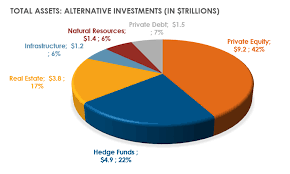

## Table of Contents

## What is an alternative investment?

An alternative investment is a type of investment that is different from the usual stocks, bonds, and cash. These can include things like real estate, commodities, hedge funds, private equity, and even art or wine. People often choose alternative investments to spread out their risk and try to get a better return on their money. 

Alternative investments can be more complicated and harder to buy and sell than regular investments. They often need more money to start and can be riskier. But, they can also offer chances to make money in ways that traditional investments might not. For example, investing in a piece of real estate could give you rental income and the chance for the property to grow in value over time.

## What are the common types of alternative investments?

Alternative investments are different from the usual stocks and bonds. Some common types include real estate, where you can buy buildings or land to rent out or sell later for a profit. Commodities are another type, like gold, oil, or agricultural products. You can invest in these directly or through funds that trade them. Hedge funds are also popular; they are managed pools of money that use different strategies to earn returns, often for wealthy investors.

Another type of alternative investment is private equity, where you invest in private companies that are not listed on public stock exchanges. These can be startup companies or established businesses looking to expand. Art and collectibles, like paintings, vintage cars, or rare wines, are also considered alternative investments. They can increase in value over time, but they can be tricky to sell and their value can be hard to predict.

Lastly, there are investments like cryptocurrencies, such as Bitcoin and Ethereum, which are digital currencies that can be very volatile but also offer high potential returns. Peer-to-peer lending is another option, where you lend money to individuals or small businesses online and earn interest on the loans. Each of these alternative investments has its own risks and potential rewards, so it's important to understand them well before investing.

## How does the Alternative Investment Market (AIM) differ from traditional stock markets?

The Alternative Investment Market (AIM) is different from traditional stock markets like the New York Stock Exchange or the London Stock Exchange's main market. AIM is a sub-market of the London Stock Exchange, and it is designed for smaller, growing companies that might not meet the strict requirements of the main market. This means that companies on AIM can be younger and riskier than those on traditional stock markets. Because of this, AIM can offer investors a chance to get in on the ground floor of potentially fast-growing businesses.

Another big difference is that AIM has less strict rules and regulations compared to traditional stock markets. This makes it easier and cheaper for companies to list on AIM, but it also means that there is less oversight and potentially more risk for investors. While traditional stock markets have lots of rules to protect investors, AIM allows for more flexibility, which can be good for companies but requires investors to do more research and be more cautious.

## What are the benefits of investing in the AIM?

Investing in the AIM can give you a chance to find and invest in small, growing companies that might not be available on bigger stock markets. These companies could grow a lot and make you more money than if you just invested in big, well-known companies. Because AIM is for smaller companies, you might find some hidden gems that others haven't noticed yet.

Another benefit is that AIM has fewer rules for companies to follow, which means it's easier and cheaper for them to list there. This can be good for you because you might find new investment opportunities sooner than on traditional markets. But remember, with fewer rules, there's also more risk, so you need to be careful and do your homework before investing.

## What are the risks associated with investing in the AIM?

Investing in the AIM can be riskier than putting your money in bigger stock markets. One big reason is that the companies on AIM are usually smaller and newer. This means they might not have a long history of making money, and they could fail more easily than bigger companies. Also, because these companies are smaller, they might not have as much information available about them, which makes it harder to know if they're a good investment.

Another risk is that AIM has fewer rules than traditional stock markets. This means there's less protection for investors. If a company on AIM gets into trouble, it might be harder to get your money back. The prices of stocks on AIM can also go up and down a lot more than on bigger markets. This is because there are fewer people buying and selling, so the price can change a lot with just a few trades. So, while you might make more money, you could also lose more if things don't go well.

## How can a beginner start investing in the AIM?

To start investing in the AIM, a beginner should first do some research. You can find information about AIM companies on the London Stock Exchange's website or through financial news websites. It's a good idea to read about different companies and see which ones look promising. You might want to talk to a financial advisor, too, because they can help you understand the risks and pick good investments.

Once you've picked some companies, you need to open a brokerage account that lets you trade on the AIM. Some popular brokers in the UK, like Hargreaves Lansdown or Interactive Investor, offer access to AIM. After setting up your account, you can start buying shares. Remember to start small, because AIM can be risky. Keep learning and watching how your investments do, and don't be afraid to ask for help if you need it.

## What are the tax implications of investing in the AIM?

Investing in the AIM can have some special tax benefits. One big benefit is that if you hold onto your AIM shares for at least two years, you might not have to pay any inheritance tax on them. This can be a big help if you want to pass on your investments to your family. Also, if you invest through something called an Enterprise Investment Scheme (EIS) or a Seed Enterprise Investment Scheme (SEIS), you might get some tax breaks. These schemes are meant to help small companies grow, and they can lower the amount of income tax you pay or give you some money back if you lose money on your investment.

But, there are some things to watch out for too. If you make money from selling your AIM shares, you'll usually have to pay capital gains tax on the profit. The tax rules can be tricky, so it's a good idea to talk to a tax advisor to make sure you understand everything. Remember, while the tax benefits can be nice, they shouldn't be the only reason you invest in the AIM. You should always think about the risks and make sure it fits with your overall investment plan.

## How do liquidity and volatility affect investments in the AIM?

Liquidity and [volatility](/wiki/volatility-trading-strategies) can really change how you invest in the AIM. Liquidity means how easy it is to buy or sell shares. On the AIM, there are usually fewer people buying and selling shares compared to bigger markets. This means it can be harder to sell your shares quickly if you need to. You might have to wait longer or sell them for less money than you wanted. So, if you need your money back fast, AIM might not be the best place to invest.

Volatility is about how much the price of shares goes up and down. AIM shares can be more volatile because the companies are smaller and newer. Their prices can jump around a lot more than bigger, more stable companies. This means you could make more money if the price goes up, but you could also lose more if it goes down. So, if you don't like big swings in your investments, you might want to be careful with AIM.

## What role do alternative investments play in portfolio diversification?

Alternative investments can help you spread out your money in different ways. When you put all your money in just stocks or bonds, you might lose a lot if those markets go down. But if you also invest in things like real estate, commodities, or even art, you're not putting all your eggs in one basket. These different kinds of investments might go up or down at different times, so they can help balance out your portfolio. This means that if one part of your investments loses value, another part might still be doing well, which can help protect your overall money.

Using alternative investments can also give you a chance to make more money. Some alternative investments, like private equity or hedge funds, might offer higher returns than regular stocks and bonds. But remember, with the chance to make more money comes more risk. Alternative investments can be harder to understand and more complicated to buy and sell. So, it's important to learn about them and maybe talk to a financial advisor before you start. By adding alternative investments to your portfolio, you can try to grow your money in new ways while also spreading out your risk.

## How do regulatory frameworks impact the AIM?

The Alternative Investment Market (AIM) has less strict rules than bigger stock markets. This makes it easier and cheaper for smaller companies to list their shares on AIM. But, with fewer rules, there's also less protection for people who invest their money. This means investors need to be careful and do more research before they buy shares on AIM. The government and financial watchdogs still keep an eye on AIM, but they don't check as closely as they do with bigger markets.

These lighter rules can be good for companies because they can grow and raise money more easily. But it can be risky for investors because they might not get all the information they need to make good choices. If a company on AIM gets into trouble, it might be harder for investors to get their money back. So, while AIM offers chances to invest in new and growing businesses, it's important for investors to understand the risks that come with fewer regulations.

## What advanced strategies can be used to maximize returns in the AIM?

To maximize returns in the AIM, one strategy is to focus on [picking](/wiki/asset-class-picking) the right companies. Since AIM is for smaller and newer businesses, you can look for companies that have strong growth potential. This means doing a lot of research to find companies with good business plans, strong management teams, and a clear path to making more money in the future. You might also want to pay attention to companies that are in industries that are growing fast. By finding these hidden gems early, you can buy their shares at a lower price and then sell them for a lot more later when they grow bigger.

Another strategy is to use tax benefits to your advantage. If you hold onto your AIM shares for at least two years, you might not have to pay inheritance tax on them. Also, investing through schemes like the Enterprise Investment Scheme (EIS) or Seed Enterprise Investment Scheme (SEIS) can give you tax breaks. These can help you keep more of the money you make from your investments. But remember, these strategies come with risks because AIM shares can be harder to sell quickly and their prices can go up and down a lot. So, it's important to balance the chance of making more money with the risk of losing it.

## How can one evaluate the performance of alternative investments in the AIM?

To evaluate the performance of alternative investments in the AIM, you need to look at a few things. First, check how much the price of the shares has gone up or down over time. This tells you if the company is doing well and if your investment is growing. You can also look at the company's financial reports to see if they are making more money and growing their business. It's helpful to compare the company's performance with others in the same industry to see if it's doing better or worse than its competitors.

Another way to evaluate performance is by looking at how much money you're making from your investment. This includes any dividends the company pays out and any profit you make when you sell the shares. Remember to think about the risks too. Since AIM companies can be more volatile, you need to see if the potential reward is worth the risk. Keeping an eye on news and updates about the company can also help you understand if it's on the right track or if there are problems you should know about.

## References & Further Reading

[1]: Bergstra, J., Bardenet, R., Bengio, Y., & Kégl, B. (2011). ["Algorithms for Hyper-Parameter Optimization."](https://papers.nips.cc/paper/4443-algorithms-for-hyper-parameter-optimization) Advances in Neural Information Processing Systems 24.

[2]: ["Advances in Financial Machine Learning"](https://www.amazon.com/Advances-Financial-Machine-Learning-Marcos/dp/1119482089) by Marcos Lopez de Prado

[3]: ["Evidence-Based Technical Analysis: Applying the Scientific Method and Statistical Inference to Trading Signals"](https://www.amazon.com/Evidence-Based-Technical-Analysis-Scientific-Statistical/dp/0470008741) by David Aronson

[4]: ["Machine Learning for Algorithmic Trading"](https://github.com/stefan-jansen/machine-learning-for-trading) by Stefan Jansen

[5]: ["Quantitative Trading: How to Build Your Own Algorithmic Trading Business"](https://www.amazon.com/Quantitative-Trading-Build-Algorithmic-Business/dp/1119800064) by Ernest P. Chan