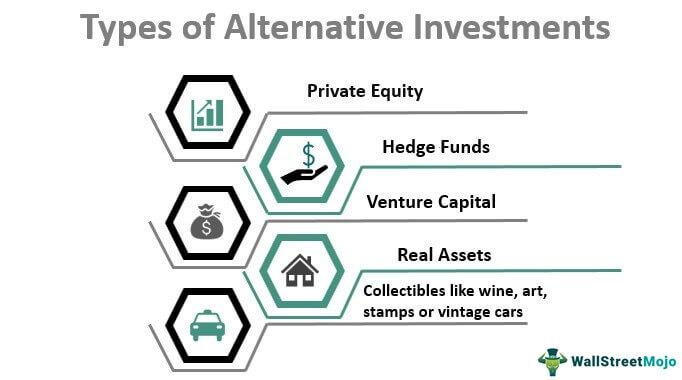

## Table of Contents

## What are alternative investments?

Alternative investments are types of investments that are different from the usual stocks, bonds, and cash. They can include things like real estate, commodities, hedge funds, private equity, and even art or wine. People might choose alternative investments to spread out their risk and possibly get higher returns than they would from traditional investments. However, these investments can also be riskier and harder to sell quickly.

These investments often need more money to start with and can be harder to understand than stocks and bonds. For example, investing in a piece of art or a startup company can be exciting but also uncertain. Because they are less common, alternative investments might not be as easy to buy or sell, which means they are less "liquid." This can be a problem if you need your money back quickly. Despite these challenges, many investors find that adding some alternative investments to their portfolio can help balance out the ups and downs of the stock market.

## How do alternative investments differ from traditional investments?

Alternative investments are different from traditional investments like stocks, bonds, and cash. Traditional investments are things you can buy and sell easily on public markets, like the stock market. They are well-known and lots of people understand how they work. On the other hand, alternative investments include things like real estate, commodities, hedge funds, private equity, and even art or wine. These are not as easy to buy and sell because they are not traded on public markets. They often need more money to get started and can be harder to understand.

Another big difference is how risky they are. Traditional investments can go up and down, but they are usually seen as less risky because there is more information available about them. Alternative investments can be riskier because they are less common and harder to predict. However, they can also offer the chance for higher returns. Because of this, people might add alternative investments to their portfolio to spread out their risk and possibly earn more money. But, they need to be ready for the fact that these investments might be harder to turn into cash quickly if they need to.

## What are the main types of alternative investments?

Alternative investments include many different types of assets that are not traditional stocks, bonds, or cash. Some of the main types are real estate, which means buying property like houses or buildings to rent out or sell later for a profit. Commodities are another type, like gold, oil, or agricultural products that people buy and sell. Hedge funds are also alternative investments; these are like private clubs where rich investors pool their money to be managed in ways that can be risky but might make a lot of money.

Private equity is another big type of alternative investment. This is when investors put money into private companies that are not listed on public stock markets. They hope these companies will grow and become more valuable. Art and collectibles, like paintings or rare wines, are also alternative investments. People buy these hoping their value will go up over time. Each of these types of alternative investments can be exciting but also comes with its own risks and challenges.

## Why might someone consider investing in alternatives?

Someone might consider investing in alternatives because they want to spread out their risk. Traditional investments like stocks and bonds can go up and down a lot. By adding different types of investments, like real estate or commodities, people can balance out the ups and downs of the stock market. This can make their overall investment plan more stable. Plus, alternative investments can sometimes offer the chance to make more money than traditional investments, which can be exciting for people looking to grow their wealth.

Another reason to consider alternatives is that they can give investors a chance to invest in things they are passionate about, like art or wine. These investments can be fun and rewarding beyond just making money. However, people need to remember that alternative investments can be riskier and harder to sell quickly. They often need more money to start with and can be more complicated to understand. So, it's important for anyone thinking about alternatives to do their homework and maybe talk to a financial advisor to make sure it's a good fit for their goals and how much risk they are willing to take.

## What are the risks associated with alternative investments?

Alternative investments can be riskier than traditional ones. They often need a lot more money to start with, which means if things go wrong, you could lose a big chunk of your savings. Also, they can be hard to understand. For example, figuring out if a piece of art or a startup company will go up in value is not easy. There's a lot of guesswork involved, and if you guess wrong, you might lose money.

Another big risk is that alternative investments are not as easy to sell quickly. This is called low [liquidity](/wiki/liquidity-risk-premium). If you need your money back in a hurry, you might not be able to sell your alternative investment fast enough. This can be a problem if you have an emergency and need cash right away. Plus, because these investments are not as common, there might not be many people wanting to buy them when you're ready to sell.

Lastly, alternative investments can be affected by things that are hard to predict, like changes in the economy, new laws, or even natural disasters. For example, if you invest in real estate, a big storm could damage your property and lower its value. Or if you invest in commodities like oil, a new law could change how much people use it. These unpredictable events can make alternative investments even riskier.

## How can alternative investments be used to diversify a portfolio?

Alternative investments can help diversify a portfolio by adding different kinds of assets that don't move up and down with the stock market. When you put your money into different things, like real estate, commodities, or art, you spread out your risk. If the stock market goes down, your alternative investments might not go down as much, or they might even go up. This can help keep your overall investment plan more stable and protect your money from big losses.

Adding alternative investments can also give you a chance to make more money. Sometimes, these investments can grow in value faster than traditional stocks and bonds. By having a mix of different types of investments, you can balance out the risk and reward. It's like not putting all your eggs in one basket. However, you need to be careful and do your homework because alternative investments can be riskier and harder to sell quickly if you need your money back.

## What are some common examples of alternative investments?

Some common examples of alternative investments include real estate, where people buy properties like houses or buildings to rent out or sell later for a profit. Commodities are another example, like gold, oil, or crops that people buy and sell. Hedge funds are also popular; these are like private clubs where rich people put their money together to be managed in ways that can be risky but might make a lot of money.

Another common type of alternative investment is private equity. This is when people invest in private companies that are not on the public stock market, hoping the companies will grow and become more valuable. Art and collectibles, like paintings or rare wines, are also alternative investments. People buy these hoping their value will go up over time. Each of these types of alternative investments can be exciting but also comes with its own risks and challenges.

## How do you evaluate the performance of alternative investments?

Evaluating the performance of alternative investments can be tricky because they are different from stocks and bonds. You can't just look at a price on a screen like you can with stocks. Instead, you need to think about how much money you made or lost over time. For example, if you bought a piece of real estate, you would look at how much rent you collected and how much the property's value went up or down. If you invested in a private company, you would think about how much the company grew and if it paid you any money back.

Another way to evaluate alternative investments is by comparing them to other investments. You might look at how much money you could have made if you put your money in the stock market instead. This helps you see if your alternative investment was worth the risk. Also, you need to think about how easy or hard it was to sell your investment if you needed to. Some alternative investments, like art or collectibles, can be hard to sell quickly, which is something to consider when judging their performance.

## What are the liquidity considerations for alternative investments?

Liquidity means how easy it is to turn an investment into cash. Alternative investments often have lower liquidity than stocks and bonds. This means if you need your money back quickly, it might be hard to sell things like real estate, art, or shares in a private company. These investments can take a long time to sell, and you might not get as much money as you hoped.

For example, if you own a piece of art, you can't just sell it on a stock market. You need to find someone who wants to buy it, and that can take a while. The same goes for real estate; selling a house or a building can take months. This low liquidity can be a problem if you have an emergency and need cash right away. So, when thinking about alternative investments, it's important to consider how quickly you might need your money back.

## How do regulations affect alternative investments?

Regulations can have a big impact on alternative investments. They are rules made by the government to make sure investments are fair and safe. These rules can change how easy or hard it is to invest in things like real estate, hedge funds, or private companies. For example, some regulations might say who can invest in certain types of alternative investments, like only letting rich people put money into hedge funds. Other rules might make it harder to buy or sell these investments, which can affect how much money you can make or lose.

Different countries have different regulations, which can make alternative investments even more complicated. For example, some places might have strict rules about buying and selling real estate, which can slow down the process and affect the price. Also, regulations can change over time. If a new law comes out that changes how a certain type of investment works, it could make that investment more or less valuable. So, it's important to keep an eye on these rules and understand how they might affect your alternative investments.

## What role do alternative investments play in institutional portfolios?

Alternative investments play an important role in institutional portfolios because they help spread out risk. Institutions like pension funds or university endowments often use alternative investments to balance out the ups and downs of the stock market. By putting money into things like real estate, commodities, or private companies, they can protect their money from big losses if the stock market goes down. This helps keep the overall value of their portfolio more stable over time.

These investments can also offer a chance to make more money than traditional stocks and bonds. Institutions might invest in hedge funds or private equity because they hope to get higher returns. However, they know that alternative investments can be riskier and harder to sell quickly. So, they carefully choose how much of their money to put into these investments, making sure it fits with their goals and how much risk they are willing to take.

## How can an individual investor gain access to alternative investment opportunities?

An individual investor can gain access to alternative investment opportunities in a few ways. One common way is through investment platforms or funds that specialize in alternatives. These platforms make it easier for regular people to invest in things like real estate, commodities, or private companies without needing a lot of money to start. They often work by pooling money from many investors to buy these investments, which means you can join in without buying a whole property or a big share in a company by yourself.

Another way is by working with a financial advisor who knows about alternative investments. They can help you find opportunities that fit your goals and how much risk you are willing to take. Sometimes, these advisors can connect you with private deals or special funds that you might not find on your own. It's important to do your homework and maybe talk to a few different advisors to make sure you understand what you are getting into.

## References & Further Reading

[1]: Bergstra, J., Bardenet, R., Bengio, Y., & Kégl, B. (2011). ["Algorithms for Hyper-Parameter Optimization."](https://papers.nips.cc/paper/4443-algorithms-for-hyper-parameter-optimization) Advances in Neural Information Processing Systems 24.

[2]: ["Advances in Financial Machine Learning"](https://www.amazon.com/Advances-Financial-Machine-Learning-Marcos/dp/1119482089) by Marcos Lopez de Prado

[3]: ["Evidence-Based Technical Analysis: Applying the Scientific Method and Statistical Inference to Trading Signals"](https://www.amazon.com/Evidence-Based-Technical-Analysis-Scientific-Statistical/dp/0470008741) by David Aronson

[4]: ["Machine Learning for Algorithmic Trading"](https://github.com/PacktPublishing/Machine-Learning-for-Algorithmic-Trading-Second-Edition) by Stefan Jansen

[5]: ["Quantitative Trading: How to Build Your Own Algorithmic Trading Business"](https://www.amazon.com/Quantitative-Trading-Build-Algorithmic-Business/dp/0470284889) by Ernest P. Chan