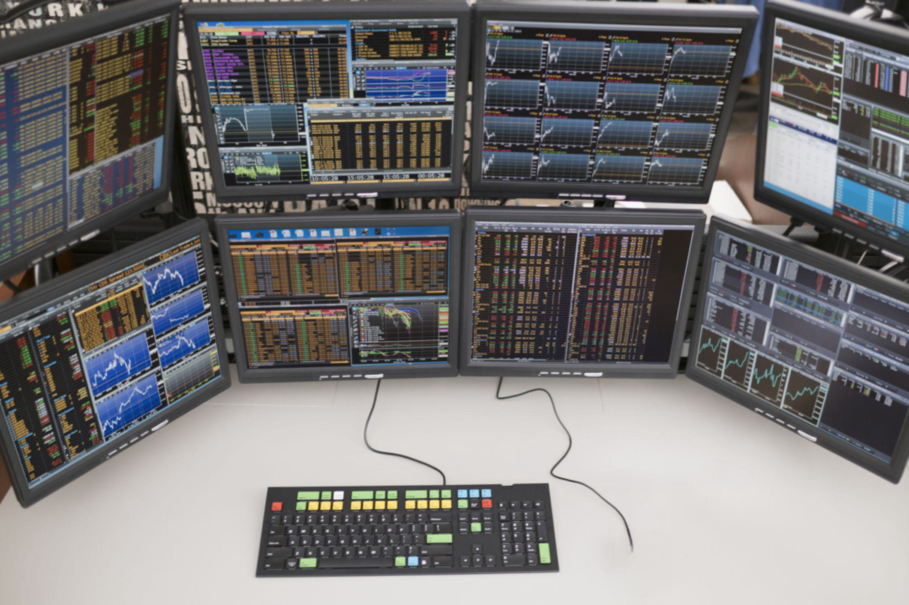

Financial markets have undergone significant transformations over the past few decades, driven by technological advancements and globalization. Central to these changes are stock exchanges, which serve as pivotal platforms for the trading of financial instruments such as stocks and bonds. Traditionally, trading in financial markets involved physical exchanges where human traders conducted transactions in person. However, the advent of technology has drastically redefined this landscape, particularly with the emergence of electronic trading systems that have replaced the conventional open-outcry method in many instances. 

The most noteworthy development in this evolution is algorithmic trading, a sophisticated form of trading that employs algorithms—complex mathematical formulas and computational models—to execute trades more efficiently than human traders. These algorithms are capable of analyzing vast amounts of market data in real-time and executing trades based on predefined criteria at a speed and precision unmatchable by humans. This has not only reshaped trading strategies but has also altered the dynamics of financial markets globally. 



Algorithmic trading is characterized by several strategies, including high-frequency trading, which exploits small price inefficiencies occurring in milliseconds, and arbitrage, which takes advantage of price discrepancies in different markets. The impact of algorithmic trading is profound, offering increased liquidity, tighter spreads, and reduced transaction costs. However, it also poses significant challenges such as increased market volatility and systemic risks due to the interconnectedness of algorithms across the world. 

This article explores these interconnected aspects and the role of algorithmic trading in modern financial markets, providing an overview of how technological advancements are continuing to reshape the financial landscape. Understanding these changes is crucial for both current and prospective market participants aiming to capitalize on new opportunities and navigate emerging risks in this rapidly evolving financial ecosystem.

## Table of Contents

## Overview of Financial Markets

Financial markets are integral components of the global economy, serving as platforms where various entities such as individuals, companies, and governments trade an array of financial instruments. These markets are crucial for facilitating the raising of capital, ensuring the efficient allocation of resources, enabling risk transfer, and supporting international trade. 

Financial markets are broadly categorized into several key components, each serving distinct functions and catering to different types of financial instruments:

1. **Equity Markets**: These markets are where shares of publicly listed companies are issued and traded. Equity markets provide companies with access to capital in exchange for ownership stakes, and they offer investors the opportunity to participate in the company's profits and growth. Major equity markets include stock exchanges like the New York Stock Exchange (NYSE) and NASDAQ.

2. **Bond Markets**: Bond markets are platforms for the issuance and trading of debt securities. Governments, municipalities, and corporations issue bonds to raise funds, and these instruments oblige the issuer to pay back the borrowed amount with interest by a specified date. Bond markets are essential for providing long-term funding and are vital for pricing interest rates and assessing credit risks.

3. **Derivative Markets**: Derivative markets involve the trading of financial contracts whose value is derived from underlying assets such as stocks, bonds, commodities, or currencies. Common derivatives include options, futures, and swaps. These markets are primarily used for hedging, leveraging investment positions, and speculating on future price movements.

4. **Foreign Exchange Markets**: Also known as forex markets, these are global decentralized platforms for currency trading. They facilitate international trade and investment by allowing the conversion of one currency into another. With a daily trading volume exceeding $6 trillion, the forex market is the largest and most liquid financial market in the world.

Each of these components plays a vital role in the overall functionality of financial markets. Equity markets enable wealth creation and capital growth, bond markets provide essential financing for public and private sector projects, derivative markets enhance risk management strategies, and foreign exchange markets support global trade dynamics.

Understanding the structure and function of these markets is crucial for participants seeking to maximize opportunities and manage risks effectively in a complex financial landscape.

## Role and Function of Stock Exchanges

Stock exchanges are integral components of financial markets, serving as organized platforms for the trading of financial instruments such as stocks, bonds, options, and futures. By providing a regulated and secure environment, stock exchanges facilitate the efficient functioning of financial markets, ensuring that the interests of all participants are protected.

One of the primary functions of stock exchanges is to ensure [liquidity](/wiki/liquidity-risk-premium), which refers to the ease with which an asset can be bought or sold in the market without affecting its price. By aggregating buy and sell orders, exchanges ensure that there are always counterparties ready to transact, thus reducing transaction costs and enabling market participants to quickly convert their assets into cash.

Another essential role of stock exchanges is price discovery. This is the process through which the prices of securities are determined, based on supply and demand dynamics among investors. Stock exchanges continuously collect and show bid and ask prices from buyers and sellers, respectively, providing a transparent system for all market participants to see the current market conditions. This function helps investors make informed decisions about their trading strategies.

Transparency is also a significant characteristic that stock exchanges bring to financial markets. By listing stocks and other securities, exchanges require companies to adhere to stringent disclosure requirements, ensuring that investors have access to significant financial information. This transparency strengthens investor confidence and supports the fairness and integrity of the market.

Exchanges also play a regulatory role, ensuring that all trading activities comply with existing laws and regulations. By monitoring trading activities, exchanges can detect and address fraudulent practices or manipulative behavior, thereby maintaining fair market conditions. This is vital to prevent market abuse and protect the interests of investors.

Furthermore, stock exchanges support capital formation, by enabling companies to raise funds through the initial public offering (IPO) process or subsequent offerings. This process allows companies to obtain the necessary capital to expand and innovate while providing investment opportunities to public investors.

In summary, stock exchanges perform critical functions in financial markets, including providing liquidity, facilitating price discovery, enhancing transparency, enforcing regulation, and supporting capital formation. These aspects are fundamental to ensuring that financial markets function efficiently and effectively.

## Emergence and Types of Trading Systems

Trading systems have significantly evolved from the traditional floor trading model to the sophisticated electronic trading platforms used today. Historically, trading was conducted on physical exchange floors where brokers and traders gathered to execute buy and sell orders through open outcry. This method, while effective at the time, was hampered by its reliance on human interaction, leading to inefficiencies and delays.

The advent of electronic trading platforms marked a transformative shift in the trading landscape. These platforms utilize computer networks to match buy and sell orders for securities, allowing trades to be executed with increased speed and accuracy. Electronic trading has enabled traders to access markets globally, at any time, significantly enhancing market liquidity and efficiency.

A critical development in the sphere of electronic trading has been the emergence of Alternative Trading Systems (ATS). ATS are non-exchange trading venues that have become integral to modern trading environments. Unlike traditional exchanges, which facilitate trading of listed securities in a public market, ATS offer more private, flexible trading solutions and typically operate as broker-dealer regulated systems. By using electronic platforms, ATS provide a venue for matching buy and sell orders, often anonymously, which can attract institutional investors looking to execute large trades without impacting the market price.

One of the primary advantages of ATS is their ability to bypass traditional broker roles, thereby reducing transaction costs for participants. These systems support various asset types, including equities, fixed income, and derivatives, providing market participants with diverse trading opportunities. High-frequency trading ([HFT](/wiki/high-frequency-trading-strategies)), a subset of [algorithmic trading](/wiki/algorithmic-trading) that relies on complex algorithms and high-speed data networks, often takes place on ATS due to their efficient execution capabilities.

The operational framework of electronic trading systems is primarily governed by sophisticated algorithms that optimize order execution and pricing. To illustrate, consider this basic Python snippet representing an algorithmic strategy:

```python
def execute_trade(order_book, strategy):
    """
    Simulates trade execution based on a predefined strategy.

    Parameters:
    - order_book: a dictionary containing buy and sell orders
    - strategy: a function defining the trading strategy

    Returns:
    - executed_trades: a list of executed trades
    """
    executed_trades = []
    for order in order_book:
        if strategy(order):
            executed_trades.append(order)
            # Assume orders are removed from order_book once executed
    return executed_trades

# Example usage
order_book = [{'type': 'buy', 'price': 100}, {'type': 'sell', 'price': 105}]
strategy = lambda order: order['type'] == 'buy' and order['price'] <= 102
executed = execute_trade(order_book, strategy)
```

This simple example demonstrates how an algorithm might be used to automate trade execution based on predetermined rules, highlighting the systematic and deterministic nature of algorithmic trading systems.

Overall, the transition from floor trading to electronic platforms and the introduction of ATS have not only increased the speed and efficiency of trade execution but also reshaped the dynamics of global financial markets by enhancing liquidity, reducing costs, and enabling more sophisticated trading strategies.

## Understanding Algorithmic Trading

Algorithmic trading, commonly known as algo trading, utilizes sophisticated algorithms to automate the execution of trades in financial markets. These algorithms are pre-programmed with specific instructions based on time, price, [volume](/wiki/volume-trading-strategy), and other market-related parameters. The primary advantage of algorithmic trading is its ability to process vast amounts of data and execute trades at speeds and efficiencies far beyond human capabilities.

One of the most widely used strategies in algorithmic trading is [trend following](/wiki/trend-following). This strategy involves identifying and capitalizing on market trends, leveraging statistical models and historical data to predict future price movements. For example, a simple trend-following strategy might involve buying a stock when its price crosses above its 50-day moving average and selling when it drops below.

Another prevalent strategy is [arbitrage](/wiki/arbitrage), which involves exploiting price discrepancies between related market instruments. This could be, for instance, the price difference between a stock listed on two different exchanges. Algorithmic trading systems can identify and act on these discrepancies in milliseconds, securing profit before the market corrects the imbalance.

Market making is another strategy where liquidity is provided to the market by simultaneously offering buy and sell quotes for a financial instrument. The aim is to profit from the bid-ask spread. Algorithmic systems constantly adjust quotes in response to market conditions, maintaining tight spreads and high turnover rates.

Mean reversion strategies are based on the statistical premise that the price of a stock will tend to return to its average over time. These algorithms identify deviations from the mean, executing trades that bet on prices moving back toward their historical average. This approach requires a robust understanding of the statistical properties of asset prices.

Algorithmic trading methods often combine these strategies or adapt them to specific market conditions. Code implementation is crucial, and Python is a preferred language due to its extensive libraries for data analysis and quantitative finance. Here is a simple example in Python illustrating a basic trend-following strategy:

```python
import pandas as pd
import numpy as np

# Load historical data for a stock
data = pd.read_csv('stock_data.csv')
data['Moving_Average'] = data['Close'].rolling(window=50).mean()

# Define the trend-following strategy
def trend_following_strategy(data):
    signals = np.where(data['Close'] > data['Moving_Average'], 1, -1)
    return signals

# Apply the strategy
data['Position'] = trend_following_strategy(data)

# Evaluate the strategy
data['Returns'] = data['Close'].pct_change() * data['Position'].shift(1)
data['Cumulative_Returns'] = (1 + data['Returns']).cumprod()

print(data[['Date', 'Close', 'Moving_Average', 'Position', 'Cumulative_Returns']].tail())
```

Though algorithmic trading provides significant advantages in terms of speed and precision, it also necessitates a robust understanding of the models and algorithms employed, as well as the ability to manage and mitigate associated risks such as potential system failures and regulatory challenges.

## Advantages and Disadvantages of Algorithmic Trading

Algorithmic trading, also known as algo trading, offers several advantages that have significantly enhanced the efficiency and effectiveness of trading in financial markets. One of the primary benefits is speed. Algorithmic trading programs can analyze vast amounts of data and execute orders in milliseconds, far surpassing the capability of human traders. This rapid execution is crucial in markets where prices can change instantaneously.

Another advantage is accuracy. By specifying the exact rules for trade execution, algorithms eliminate human error from the trading process. This precision allows for the seamless execution of complex trading strategies that would be challenging to implement manually. Additionally, algorithmic trading removes emotional biases from trading decisions. Human traders often make decisions based on fear or greed, which can lead to suboptimal trading outcomes. Algorithms act strictly according to the pre-set rules, thus minimizing these emotional biases.

Despite these benefits, algorithmic trading carries certain disadvantages and risks. System failures pose a significant risk, as technology is not infallible. Hardware malfunctions, software glitches, or network connectivity issues can lead to considerable financial losses. Regulatory challenges also arise, as the rapid pace of algo trading can sometimes surpass the oversight capabilities of regulatory bodies, leading to concerns about market manipulation and fairness.

Moreover, algorithmic trading can increase market [volatility](/wiki/volatility-trading-strategies). The presence of numerous hyper-responsive algorithms in the market can lead to sudden and unexplained price movements. These algorithms can react to market data in unexpected ways, potentially amplifying market trends and causing flash crashes, as seen in past financial market disruptions.

In summary, while algorithmic trading offers speed, accuracy, and the elimination of emotional biases, it also introduces challenges such as system failures, regulatory scrutiny, and increased market volatility. Understanding these factors is essential for anyone considering integrating algorithmic trading into their investment strategy.

## Steps to Start with Algorithmic Trading

To effectively engage with algorithmic trading, it is essential to establish a solid foundation comprising key steps and practices designed to mitigate risks and enhance the execution of trading strategies. The following outlines the fundamental steps to embark on a journey in algorithmic trading:

### 1. Acquire Programming Skills

The cornerstone of algorithmic trading is proficiency in programming languages. Python is particularly popular due to its simplicity and abundance of libraries tailored for financial analysis, [machine learning](/wiki/machine-learning), and algorithmic trading. Learning Python involves understanding basic concepts such as variables, loops, functions, and libraries. Libraries such as NumPy, Pandas, and Matplotlib are crucial for data manipulation and visualization, whereas libraries like SciPy offer advanced mathematical tools.

Example in Python:
```python
import pandas as pd
# Example of loading a dataset
data = pd.read_csv('historical_data.csv')
print(data.head())
```

### 2. Develop a Trading Strategy

Formulating a robust trading strategy is a critical step. Strategies can be as straightforward or complex as desired, aiming to capitalize on various market dynamics such as price trends, mean reversion, or arbitrage. A typical process begins with defining entry and [exit](/wiki/exit-strategy) signals based on predetermined criteria, which may involve technical indicators such as moving averages, Bollinger Bands, or RSI (Relative Strength Index).

Example strategy component:
```python
# Example of a simple moving average crossover strategy
short_window = 40
long_window = 100

data['short_mavg'] = data['Close'].rolling(window=short_window, min_periods=1).mean()
data['long_mavg'] = data['Close'].rolling(window=long_window, min_periods=1).mean()

signal = (data['short_mavg'] > data['long_mavg']).astype(int)
```

### 3. Backtesting with Historical Data

Backtesting involves testing a trading strategy on historical data to assess its potential effectiveness. This process helps verify the performance of a strategy before its actual application in live markets. Leveraging [backtesting](/wiki/backtesting) frameworks like Zipline or BT backtesting in Python can streamline the evaluation process. Key performance metrics such as Sharpe ratio, drawdown, and profit and loss must be scrutinized to gauge a strategy's robustness.

Example of a backtest setup:
```python
# Placeholder for backtesting implementation
def backtest_strategy(data, signals):
    initial_capital = 100000.0
    positions = pd.DataFrame(index=signals.index).fillna(0.0)
    positions['Asset'] = 100 * signals
    return positions

portfolio = backtest_strategy(data, signal)
```

### 4. Start with Paper Trading

Paper trading, or simulated trading, enables traders to execute their strategies in a risk-free environment. Platforms such as QuantConnect or TradingView offer paper trading functionalities that replicate real-market conditions without financial risk. This step is critical for adjusting strategies based on practical insights gained from simulated trading experiences.

### 5. Transition to Live Markets

After refining strategies through backtesting and paper trading, one can cautiously transition to live markets. Initial trades should be conservative, gradually scaling up as confidence in the strategy’s performance grows. Continuous monitoring and iterative improvement of the strategy, based on market feedback and emerging trends, are imperative to maintaining its efficacy.

These steps outline a systematic approach to starting with algorithmic trading, emphasizing programming competence, strategic development, and risk-managed introduction to live trading environments. Understanding and applying these principles can significantly enhance one's trading acumen and pave the way for successful algorithmic trading ventures.

## The Future of Algorithmic Trading and Financial Markets

The trajectory of financial markets is distinctly pointing toward an increased integration of advanced technologies, notably Artificial Intelligence (AI), within trading algorithms. This integration promises to transform algorithmic trading further by enhancing the capability to process and analyze vast datasets in real-time, thus facilitating more informed and precise trading decisions. AI algorithms, such as machine learning models, can adapt to new data patterns, learn from historical data, and improve the prediction accuracy of market movements, leading to more effective strategies for executing trades.

Moreover, the advent of AI-driven trading systems is set to amplify the speed and volume of trade executions. High-frequency trading (HFT), for instance, leverages AI to execute orders within microseconds, exploiting minute market inefficiencies that are imperceptible to human traders. This capacity for rapid response is increasingly becoming a critical component of competitive trading strategies.

As markets evolve with these technological advancements, they may experience enhanced efficiencies, including reduced transaction costs, tighter bid-ask spreads, and improved market liquidity. However, the rapid evolution of algorithmic trading also necessitates potential regulatory adjustments. Market regulators are increasingly focused on ensuring that the opacity and complexity of AI-driven trading systems do not compromise market stability. There is a growing need for sophisticated regulatory frameworks capable of monitoring algorithmic trading activities to prevent systemic risks, such as flash crashes and market manipulation.

Furthermore, ethical considerations surrounding AI in financial markets are gaining prominence. Ensuring algorithm accountability, data privacy, and impartial decision-making processes are becoming essential components of the regulatory discourse. The future may witness the development of guidelines to standardize the testing, deployment, and operation of AI in trading systems to safeguard against biases and unintended consequences.

Overall, the future of algorithmic trading and financial markets indicates an era characterized by increased reliance on AI and other innovative technologies, potentially leading to unprecedented efficiencies and new challenges that necessitate a balanced approach in regulatory oversight. As technology continues to reshape the trading landscape, understanding and adapting to these changes will be vital for market participants and regulators alike.

## Conclusion

Financial markets are experiencing transformative shifts, primarily driven by the integration of sophisticated technologies such as algorithmic trading. This modern approach to trading leverages advanced computational techniques, enabling trades to be executed at speeds and accuracies that surpass human capabilities. These advancements have not only enhanced the efficiency of the markets but have also introduced new dynamics that market participants must understand.

Algorithmic trading, in particular, has redefined how trading is conducted, creating an ecosystem where trades are executed based on data-driven strategies rather than human intuition. This approach reduces human emotional biases, enhances speed, and increases precision. Market participants who can harness these technologies effectively are positioned to capitalize on new opportunities, whether through faster execution, improved risk management, or innovative trading strategies.

However, with these opportunities come substantial risks. The complexity and speed of algorithmic trading can lead to system failures or unintended market impacts, as seen in events like the "Flash Crash" of 2010. Additionally, the regulatory landscape is continually evolving to address these new challenges, requiring traders to stay informed and compliant with the latest rules to avoid penalties and market disruptions.

For participants navigating this changing landscape, a deep understanding of both the risks and rewards associated with these technological advancements is critical. This knowledge extends beyond the technical aspects of algorithmic trading to include regulatory considerations and market dynamics. As technologies like [artificial intelligence](/wiki/ai-artificial-intelligence) and machine learning become increasingly integrated into trading algorithms, market participants must also anticipate and adapt to further changes in the financial markets. This adaptability is key to leveraging new opportunities while effectively managing potential risks within the financial ecosystem.

## References & Further Reading

[1]: Aldridge, I. (2013). ["High-Frequency Trading: A Practical Guide to Algorithmic Strategies and Trading Systems."](https://www.amazon.com/High-Frequency-Trading-Practical-Algorithmic-Strategies/dp/1118343506) Wiley.

[2]: Kissell, R. (2014). ["The Science of Algorithmic Trading and Portfolio Management."](https://www.sciencedirect.com/book/9780124016897/the-science-of-algorithmic-trading-and-portfolio-management) Academic Press.

[3]: Narang, R. (2013). ["Inside the Black Box: The Simple Truth About Quantitative Trading."](https://www.amazon.com/Inside-Black-Box-Quantitative-Trading/dp/0470432063) Wiley.

[4]: Hendershott, T., & Riordan, R. (2013). ["Algorithmic Trading and the Market for Liquidity."](https://www.jstor.org/stable/43303831) The Review of Financial Studies, 26(3), 711-741.

[5]: MacKenzie, D., & Spears, T. (2012). ["'The Formula That Killed Wall Street'? The Gaussian copula and modelling practices in investment banking."](https://journals.sagepub.com/doi/10.1177/0306312713517157) Economy and Society, 41(1), 71-102.

[6]: Lopez de Prado, M. (2018). ["Advances in Financial Machine Learning."](https://www.amazon.com/Advances-Financial-Machine-Learning-Marcos/dp/1119482089) Wiley.
