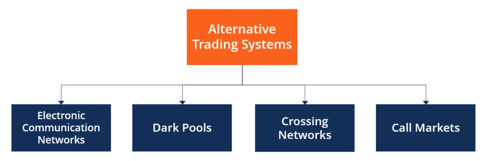

## Table of Contents

## What are alternative trading platforms?

Alternative trading platforms, also known as dark pools or electronic communication networks (ECNs), are private venues for trading securities that are not accessible through public exchanges like the New York Stock Exchange or NASDAQ. These platforms allow investors to trade large blocks of shares anonymously, which can help minimize the market impact of their trades. This is particularly useful for institutional investors, like pension funds or mutual funds, who need to buy or sell large quantities of stock without causing significant price movements.

The main advantage of using alternative trading platforms is the ability to execute large trades with less price slippage. When big trades are placed on public exchanges, they can drive the price up or down, making it more expensive for the buyer or less profitable for the seller. By using a dark pool, traders can keep their intentions hidden from the market until the trade is completed, which can result in better prices and lower transaction costs. However, these platforms also have their drawbacks, such as less transparency and potential conflicts of interest, which can make them riskier for some investors.

## How do alternative trading platforms differ from traditional stock exchanges?

Alternative trading platforms and traditional stock exchanges are different in how they work and who can use them. Traditional stock exchanges, like the New York Stock Exchange or NASDAQ, are public places where anyone can buy and sell stocks. They have clear rules and show all the trades happening in real time. This means everyone can see the prices and how many shares are being traded. It's like a big, open market where everyone can see what's going on.

On the other hand, alternative trading platforms, also called dark pools, are private places where only certain people can trade. These platforms are used mostly by big investors like pension funds or mutual funds who want to trade large amounts of stocks without everyone knowing. In these platforms, trades are hidden from the public until they are done. This helps big investors get better prices because their trades don't affect the market as much. But, because these platforms are private, they can be less transparent and sometimes riskier.

## What types of assets can be traded on alternative trading platforms?

Alternative trading platforms let you trade different kinds of assets. Mostly, you'll find stocks on these platforms. Big investors use them to buy and sell large amounts of shares without affecting the market price too much. But it's not just stocks; you can also trade bonds, which are like loans to companies or governments, and other fixed-income securities.

Some platforms even let you trade things like currencies and commodities, like gold or oil. These are less common but still available on certain alternative trading platforms. The main idea is that these platforms give big investors a private way to trade big amounts of different assets without everyone knowing what they're doing.

## What are the benefits of using alternative trading platforms for beginners?

For beginners, using alternative trading platforms can be helpful because they can see how big investors trade. These platforms let big investors buy and sell large amounts of stocks without making the prices go up or down too much. By watching this, beginners can learn about how the market works and what big investors are doing. This can be a good way to learn about trading without jumping right into the busy public exchanges.

Also, alternative trading platforms can be less scary for beginners because they are quieter and less public. On public exchanges, everyone can see what you're doing, which can be nerve-wracking if you're new to trading. On these platforms, you can trade in a more private way, which might make you feel more comfortable as you start to learn and grow as a trader. Just remember, these platforms can be a bit more complicated and riskier, so it's important to learn about them before you start using them.

## How can one get started with trading on an alternative platform?

To get started with trading on an alternative platform, first, you need to do some research. Find out which alternative trading platforms are available and what kinds of assets they let you trade. Some platforms might focus on stocks, while others might also let you trade bonds or even commodities like gold. Once you've picked a platform, you'll need to sign up for an account. This usually involves filling out an application and maybe talking to someone from the platform to make sure you understand how it works.

After you've got your account set up, you'll need to add money to it. This is called funding your account. You can usually do this by transferring money from your bank. Once your account is funded, you can start trading. Remember, alternative platforms can be a bit more complicated than public exchanges, so take your time to learn how to use the platform's tools and features. It's also a good idea to start small and get comfortable with the platform before you start making bigger trades.

## What are the risks associated with alternative trading platforms?

Alternative trading platforms can be riskier than public exchanges because they are not as open and clear. On these platforms, you can't see all the trades happening like you can on public exchanges. This means you might not know if you're getting a good price or if someone is trying to trick you. Also, because these platforms are private, there might be conflicts of interest where the people running the platform could be making decisions that are good for them but bad for you.

Another risk is that alternative trading platforms can be harder to use, especially if you're new to trading. They have different rules and ways of doing things, which can be confusing. If you don't understand how the platform works, you could make mistakes that cost you money. It's also important to know that because these platforms are used by big investors, the trades can be very large, and if something goes wrong, it could have a big impact on your money.

## How do regulations affect alternative trading platforms?

Regulations play a big role in how alternative trading platforms work. Governments and financial watchdogs make rules to keep trading fair and safe for everyone. These rules can say who can use the platforms, what they can trade, and how they have to report their trades. For example, in the United States, the SEC (Securities and Exchange Commission) makes sure that alternative trading platforms follow the rules to protect investors and keep the market honest. If a platform doesn't follow these rules, it could get into trouble and might have to stop working.

These regulations can also affect how much information is shared on alternative trading platforms. Because these platforms are private, they don't have to show all their trades to the public like public exchanges do. But the rules can still make them share some information to keep things transparent. This helps make sure that no one is cheating or doing things that could hurt other investors. So, while alternative trading platforms can be more private, they still have to follow rules to make sure trading is fair and safe.

## What advanced features do some alternative trading platforms offer?

Some alternative trading platforms have special tools that help big investors trade better. One of these tools is called [algorithmic trading](/wiki/algorithmic-trading). This means the platform uses smart computer programs to buy and sell stocks very quickly, based on rules set by the investor. This can help them make trades faster and sometimes get better prices. Another cool feature is the ability to set up different kinds of orders, like iceberg orders. These let big investors hide part of their order so other people can't see how big it really is. This can help them buy or sell a lot of shares without making the price move too much.

Also, some platforms let investors see data about how other people are trading. This is called market data, and it can help investors make smarter choices about when to buy or sell. For example, they might see that a lot of people are buying a certain stock, so they decide to buy it too. Some platforms even have tools to help investors test out their trading ideas before they actually do them. This is called [backtesting](/wiki/backtesting), and it lets them see how their strategy would have worked in the past. All these features can make trading on alternative platforms more powerful and helpful for big investors.

## How do alternative trading platforms impact market liquidity?

Alternative trading platforms can affect how easy it is to buy and sell stocks, which is called market [liquidity](/wiki/liquidity-risk-premium). These platforms let big investors trade large amounts of stocks without everyone knowing. This can make the market seem less liquid because these trades don't show up on public exchanges right away. If lots of big trades happen in these private platforms, it might make it harder for people on public exchanges to find someone to trade with, because the big trades are hidden.

On the other hand, alternative trading platforms can also help make the market more liquid in some ways. When big investors use these platforms to trade large amounts without causing big price changes, it can make the market more stable. This stability can encourage more people to trade, knowing that big trades won't suddenly make prices go crazy. So, while these platforms can hide some trading activity, they can also help keep the market calm and make it easier for everyone to trade in the long run.

## What role do alternative trading platforms play in high-frequency trading?

Alternative trading platforms are important for high-frequency trading, which is when computers make a lot of trades very quickly. These platforms let high-frequency traders use special computer programs, called algorithms, to buy and sell stocks fast. Because these platforms are private, high-frequency traders can do their trades without everyone else seeing what they're doing. This can help them get better prices and make more money.

High-frequency trading can affect how the market works. When these traders use alternative platforms, they can trade without causing big price changes that everyone can see. This can make the market more stable because big trades don't suddenly make prices go up or down. But it can also make the market seem less busy because these trades are hidden from public exchanges. So, alternative platforms help high-frequency traders do their job better, but they also change how the market looks to everyone else.

## How can traders optimize their strategies specifically for alternative trading platforms?

To optimize their strategies for alternative trading platforms, traders need to understand how these platforms work differently from public exchanges. Since these platforms are private, traders can use them to hide their big trades from the public. This means they can buy or sell a lot of stocks without making the price move too much. One way to do this is by using special orders like iceberg orders, where only part of the order shows up at a time. This can help traders get better prices because other people won't know how big their trade really is.

Another way to optimize strategies is by using the advanced tools that some alternative platforms offer. For example, algorithmic trading lets traders use computer programs to make trades very quickly based on rules they set. This can help them make trades faster and sometimes get better prices. Traders can also use market data to see how other people are trading and make smarter choices. By testing their strategies with backtesting tools, traders can see how their ideas would have worked in the past and make changes before they start trading for real.

## What future trends are expected in the development of alternative trading platforms?

In the future, alternative trading platforms are expected to become even more advanced and useful for traders. One big trend will be the use of more technology, like [artificial intelligence](/wiki/ai-artificial-intelligence) and [machine learning](/wiki/machine-learning). These technologies can help the platforms make smarter decisions and find better prices for traders. They can also make trading faster and more efficient. Another trend is that these platforms might become more open to smaller investors, not just the big ones. This could mean more people will be able to use them to trade in a private way, which can be less scary and more helpful for beginners.

Also, rules and regulations about alternative trading platforms might change. Governments and financial watchdogs might make new rules to make sure these platforms are fair and safe for everyone. This could mean the platforms have to share more information about their trades, which can help keep things transparent. At the same time, these platforms might find new ways to help traders hide their big trades even better, so they can keep getting good prices without affecting the market too much. Overall, the future of alternative trading platforms looks like it will be more tech-savvy, more open to everyone, and more carefully watched by regulators.

## References & Further Reading

[1]: Aldridge, I. (2013). ["High-Frequency Trading: A Practical Guide to Algorithmic Strategies and Trading Systems."](https://www.amazon.com/High-Frequency-Trading-Practical-Algorithmic-Strategies/dp/1118343506) Wiley.

[2]: Kissell, R. (2014). ["The Science of Algorithmic Trading and Portfolio Management."](https://www.sciencedirect.com/book/9780124016897/the-science-of-algorithmic-trading-and-portfolio-management) Academic Press.

[3]: Narang, R. (2013). ["Inside the Black Box: The Simple Truth About Quantitative Trading."](https://www.amazon.com/Inside-Black-Box-Quantitative-Trading/dp/0470432063) Wiley.

[4]: Hendershott, T., & Riordan, R. (2013). ["Algorithmic Trading and the Market for Liquidity."](https://www.jstor.org/stable/43303831) The Review of Financial Studies, 26(3), 711-741.

[5]: MacKenzie, D., & Spears, T. (2012). ["'The Formula That Killed Wall Street'? The Gaussian copula and modelling practices in investment banking."](https://journals.sagepub.com/doi/10.1177/0306312713517157) Economy and Society, 41(1), 71-102.

[6]: Lopez de Prado, M. (2018). ["Advances in Financial Machine Learning."](https://www.amazon.com/Advances-Financial-Machine-Learning-Marcos/dp/1119482089) Wiley.
