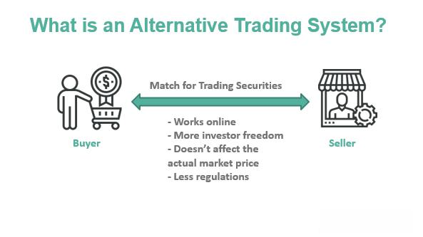

## Table of Contents

## What is an Alternative Trading System (ATS)?

An Alternative Trading System (ATS) is a type of trading platform that allows people to buy and sell securities, like stocks or bonds, without using a traditional stock exchange. ATSs are often used by big investors and institutions to trade large amounts of securities without affecting the market prices too much. They are regulated by the Securities and Exchange Commission (SEC) in the United States, but they have less strict rules than regular stock exchanges.

ATSs can be helpful because they offer more privacy and can be faster for trading. They also allow for more flexible trading rules, which can be good for certain types of trades. However, because they are not as transparent as regular exchanges, it can be harder to know what's happening in the market. This can make some people feel less safe about using them.

## How does an ATS differ from traditional stock exchanges?

An ATS is different from traditional stock exchanges because it's not a physical place where people meet to trade. Instead, it's a computer system that connects buyers and sellers directly. Traditional stock exchanges, like the New York Stock Exchange, have set rules and times for trading, and everyone can see what's happening. But with an ATS, the rules can be more flexible, and it might be harder to see all the trades happening.

Another big difference is that ATSs are often used for big trades that could move the market if they happened on a traditional exchange. This means big investors can trade without worrying about causing big price changes. Traditional exchanges, on the other hand, are more open to everyone, and all trades are visible, which helps keep the market fair and transparent. So, while an ATS can be faster and more private, it might not be as open and clear as a traditional exchange.

## What are the basic regulatory requirements for an ATS in the United States?

In the United States, an Alternative Trading System (ATS) must follow rules set by the Securities and Exchange Commission (SEC). One main rule is that an ATS needs to register with the SEC as a broker-dealer and also file a special form called Form ATS. This form gives the SEC important information about how the ATS works. The ATS must also make sure it has enough money and good systems to keep running smoothly and safely.

Another important rule is that an ATS has to be fair to everyone who uses it. This means they can't let some people see trade information before others, which would be unfair. The ATS also has to keep good records of all trades and report them to the SEC. This helps the SEC make sure the ATS is following the rules and that the market stays honest.

## Who oversees the regulation of Alternative Trading Systems?

The Securities and Exchange Commission (SEC) is the main group that watches over Alternative Trading Systems (ATS) in the United States. The SEC makes sure that ATSs follow the rules and are fair to everyone who uses them. They do this by requiring ATSs to register as broker-dealers and file a form called Form ATS, which tells the SEC how the ATS works.

The Financial Industry Regulatory Authority (FINRA) also helps with the regulation of ATSs. FINRA checks that ATSs have enough money and good systems to keep running safely. Both the SEC and FINRA work together to make sure that ATSs keep good records of trades and report them correctly. This helps keep the market honest and fair for everyone.

## What is the role of the SEC in regulating ATSs?

The Securities and Exchange Commission (SEC) is in charge of making sure Alternative Trading Systems (ATSs) follow the rules in the United States. The SEC requires ATSs to register as broker-dealers and fill out a special form called Form ATS. This form tells the SEC how the ATS works, which helps them keep an eye on things and make sure the ATS is doing what it's supposed to do. The SEC wants to make sure that ATSs have enough money and good systems to run safely and fairly.

The SEC also makes sure that ATSs treat everyone the same and don't let some people see trade information before others. This is important because it keeps the market fair for everyone. The SEC also checks that ATSs keep good records of all trades and report them correctly. By doing all these things, the SEC helps make sure that ATSs are honest and that the market stays safe and fair for everyone who uses them.

## What are the key provisions of Regulation ATS?

Regulation ATS is a set of rules made by the Securities and Exchange Commission (SEC) to make sure Alternative Trading Systems (ATSs) work fairly and safely. One important part of these rules is that ATSs need to register with the SEC as a broker-dealer and fill out a special form called Form ATS. This form tells the SEC how the ATS works, which helps them keep an eye on things and make sure the ATS is doing what it's supposed to do. The SEC also wants to make sure that ATSs have enough money and good systems to run safely and fairly.

Another key part of Regulation ATS is making sure that everyone who uses an ATS is treated the same. ATSs can't let some people see trade information before others because that would be unfair. The SEC also wants ATSs to keep good records of all trades and report them correctly. This helps the SEC check that the ATS is following the rules and that the market stays honest and fair for everyone. By having these rules, the SEC helps make sure that ATSs work in a way that keeps the market safe and fair for everyone who uses them.

## How do ATSs report their activities and what information must they disclose?

ATSs have to report their activities to the SEC to make sure everything is fair and open. They do this by keeping good records of all the trades that happen on their system. These records include details like who bought and sold the securities, what kind of securities they were, and how much they cost. ATSs also have to send these records to the SEC regularly so the SEC can check that the ATS is following the rules.

Besides keeping records, ATSs have to fill out a special form called Form ATS when they start up. This form tells the SEC how the ATS works, including things like how it matches buyers and sellers, what kinds of securities it trades, and who can use the system. The SEC uses this information to make sure the ATS is set up in a way that treats everyone fairly and doesn't let some people get special information before others. By reporting their activities and disclosing this information, ATSs help the SEC keep the market safe and honest for everyone.

## What are the compliance challenges faced by operators of ATSs?

Running an Alternative Trading System (ATS) can be tough because there are a lot of rules to follow. One big challenge is making sure everything is fair for everyone who uses the ATS. The SEC wants to make sure no one gets special information before others, so ATS operators have to be very careful about how they share information. They also have to keep really good records of all trades and send these records to the SEC on time. If they mess up, they could get in trouble with the SEC, which could mean big fines or even having to shut down the ATS.

Another challenge is making sure the ATS has enough money and good systems to keep running smoothly. This means spending a lot of time and money on things like computer systems and security to make sure everything works well and stays safe. It's also hard to keep up with all the new rules and changes that the SEC might make. ATS operators have to stay on top of these changes and make sure they're always following the latest rules. All these things can make running an ATS a lot of work and can be stressful for the people in charge.

## How have recent regulatory changes impacted the operation of ATSs?

Recent regulatory changes have made it harder for ATSs to operate. The SEC has been making more rules to make sure ATSs are fair and safe for everyone. One big change is that ATSs now have to give more information about how they work and who can use them. This means they have to fill out more forms and report more details to the SEC. It's more work for ATSs, and it can be harder for them to keep everything in order.

These new rules also mean ATSs have to be more careful about who they let trade on their system. They have to check more closely to make sure everyone is following the rules. This can slow things down and make it harder for ATSs to do big trades quickly. But these changes are meant to keep the market honest and fair, so even though it's more work for ATSs, it's good for everyone who uses them.

## What are the international regulations concerning ATSs and how do they compare to U.S. regulations?

Internationally, rules for Alternative Trading Systems (ATSs) can be different from country to country. In the European Union, ATSs are called Multilateral Trading Facilities (MTFs) and are regulated by the Markets in Financial Instruments Directive (MiFID). MiFID has rules to make sure MTFs are fair and open, kind of like the SEC rules in the U.S. But, the EU rules might focus more on protecting investors and making sure the markets are transparent. In Canada, ATSs are overseen by the Investment Industry Regulatory Organization of Canada (IIROC), which has its own set of rules that are similar to the U.S. but might have different details about how ATSs need to report trades and keep records.

Compared to the U.S., international regulations can be stricter in some ways and more relaxed in others. For example, the EU's MiFID has very detailed rules about how MTFs need to show information to the public, which can be more strict than U.S. rules. On the other hand, some countries might not require ATSs to report as much information to regulators as the U.S. does. This can make it easier for ATSs to operate in those countries, but it might also mean less oversight and protection for investors. Overall, while the goal of making markets fair and safe is the same everywhere, the way countries go about it can be quite different.

## How do ATSs handle conflicts of interest and ensure fair trading practices?

ATSs handle conflicts of interest and ensure fair trading by following strict rules set by the SEC. They have to make sure no one person or group gets special treatment. This means they can't let some people see trade information before others. ATSs also have to keep good records of all trades and report them to the SEC. This helps the SEC check that the ATS is treating everyone fairly and not letting any conflicts of interest affect the trading.

To make sure trading is fair, ATSs use computer systems that match buyers and sellers without letting people know who they are trading with. This helps keep things secret and fair. ATSs also have rules about who can trade on their system and how they can trade. They check to make sure everyone follows these rules. By doing all these things, ATSs try to make sure the market stays honest and fair for everyone who uses them.

## What future regulatory trends might affect the development and operation of ATSs?

In the future, regulators might focus more on making sure ATSs are even more transparent and fair. They might ask for more detailed reports about the trades happening on ATSs. This could mean ATSs have to share more information about who is trading and what they are trading. The goal would be to make sure everyone can see what's happening in the market and that no one gets special treatment. This could make it harder for ATSs to keep things private, but it would help keep the market fair for everyone.

Another trend might be more rules about how ATSs use technology. As more trading happens on computers, regulators might want to make sure the technology is safe and can't be hacked. They might also want to know more about how ATSs use things like [artificial intelligence](/wiki/ai-artificial-intelligence) and algorithms to match trades. This could mean more checks and rules for ATSs to follow, which might slow things down but would make the market safer. Overall, these trends would aim to keep the market honest and protect everyone who uses ATSs.

## References & Further Reading

[1]: Domowitz, I., & Steil, B. (1999). ["Automation, trading costs, and the structure of the securities trading industry."](https://www.semanticscholar.org/paper/Automation%2C-Trading-Costs%2C-and-theStructure-of-the-Domowitz-Steil/27c2fd34c4240ac61f15de7959a5f6ea28ea36e5) Brookings-Wharton Papers on Financial Services.

[2]: O’Hara, M., & Ye, M. (2011). ["Is Market Fragmentation Harming Market Quality?"](https://www.sciencedirect.com/science/article/pii/S0304405X11000390) The Review of Financial Studies, 24(11), 3614-3650.

[3]: Staff of the U.S. Securities and Exchange Commission. (2015). ["Regulation of NMS Stock Alternative Trading Systems: Proposed Rule."](https://www.sec.gov/comments/s7-23-15/s72315-23.pdf) U.S. Securities and Exchange Commission.

[4]: Budish, E., Cramton, P., & Shim, J. (2015). ["The High-Frequency Trading Arms Race: Frequent Batch Auctions as a Market Design Response."](https://academic.oup.com/qje/article/130/4/1547/1916146) The Quarterly Journal of Economics, 130(4), 1547-1628.

[5]: Hasbrouck, J., & Saar, G. (2009). ["Technology and liquidity provision: The blurring of traditional definitions."](https://www.sciencedirect.com/science/article/pii/S1386418108000220) Journal of Financial Markets, 12(2), 143-172.