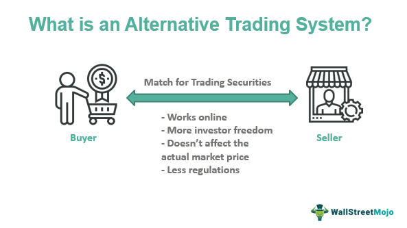

## Table of Contents

## What is an alternative trading system (ATS)?

An alternative trading system (ATS) is a platform where people can buy and sell securities, like stocks or bonds, without using a traditional stock exchange. Think of it as a private marketplace where trades happen away from big public exchanges like the New York Stock Exchange. ATSs are often used by big investors who want to trade large amounts of securities without affecting the market prices too much.

These systems are regulated by the Securities and Exchange Commission (SEC) in the United States, but they have more flexibility than traditional exchanges. This means they can set their own rules about who can trade and how trades are made. Because of this, ATSs can be a good option for investors looking for more privacy and control over their trades.

## How does an ATS differ from traditional stock exchanges?

An ATS is different from traditional stock exchanges because it's like a private club where only certain people can trade. Traditional exchanges, like the New York Stock Exchange, are big public places where anyone can buy and sell stocks. ATSs are more exclusive and often used by big investors who want to keep their trades secret and not affect the market too much.

Another difference is that ATSs have more freedom to set their own rules. Traditional exchanges have strict rules that everyone must follow. With an ATS, the people running it can decide who gets to trade and how trades are done. This makes ATSs more flexible, but they still have to follow some rules set by the SEC to make sure everything is fair and safe.

## What are the main types of alternative trading systems?

There are mainly two types of alternative trading systems: Electronic Communication Networks (ECNs) and dark pools. ECNs are like online marketplaces where buyers and sellers can trade directly with each other without using a traditional stock exchange. They show the prices and the number of shares people want to buy or sell, so everyone can see what's happening. This makes trading faster and more transparent, which means everyone can see the trades.

Dark pools, on the other hand, are more secretive. They are used by big investors who want to trade large amounts of stocks without other people knowing. In a dark pool, the prices and the number of shares people want to buy or sell are hidden until the trade is done. This helps big investors keep their trades secret and not affect the market too much. Both types of ATSs help people trade in different ways, depending on what they need.

## What are the benefits of using an ATS for traders?

Using an ATS can help traders in many ways. One big benefit is privacy. When you use an ATS like a dark pool, you can trade without other people knowing what you're doing. This is really helpful if you're trading a lot of stocks and don't want to affect the market prices. It's like buying something secretly without everyone watching you.

Another benefit is flexibility. ATSs can set their own rules, so they can be more open to different kinds of trades than traditional exchanges. This means you can trade in ways that work best for you. Also, ATSs often have lower fees than big exchanges, so you can save money. This makes trading easier and cheaper for many people.

## What are the potential risks associated with trading on an ATS?

Trading on an ATS can have some risks. One big risk is less transparency. In dark pools, you can't see what prices others are trading at until after your trade is done. This can make it hard to know if you're getting a good deal. Also, because ATSs are not as regulated as big exchanges, there might be more chance for unfair practices or mistakes.

Another risk is [liquidity](/wiki/liquidity-risk-premium). Sometimes, there might not be enough people trading on an ATS, so it can be hard to buy or sell what you want quickly. This can be a problem if you need to make a trade fast. Also, because ATSs are often used by big investors, smaller traders might find it harder to compete and get the trades they want.

## How is an ATS regulated, and who oversees its operations?

An ATS is regulated by the Securities and Exchange Commission (SEC) in the United States. The SEC makes sure that ATSs follow certain rules to keep trading fair and safe. ATSs have to register with the SEC and tell them about their operations, like who can trade on their platform and how they handle orders. This helps the SEC keep an eye on things and make sure everything is done right.

Even though ATSs are regulated, they have more freedom than big exchanges. This means they can set their own rules about who can trade and how trades are done. But they still have to follow some basic rules set by the SEC to protect investors and keep the market honest. So, while ATSs can be more flexible, they are still watched closely to make sure they don't cause problems.

## Can anyone access an ATS, or are there specific requirements?

Not everyone can use an ATS. These platforms often have specific rules about who can trade on them. Usually, ATSs are set up for big investors like banks, hedge funds, and other institutions. They might ask you to meet certain financial requirements or have a certain level of trading experience before you can join.

This is different from big public exchanges where almost anyone can trade. ATSs are more like private clubs, so they can pick and choose who gets to use them. This helps them keep things private and control how trades happen, which is important for the big investors who use these systems.

## What kind of securities can be traded on an ATS?

An ATS lets you trade many different kinds of securities. You can trade stocks, which are shares in a company, and bonds, which are loans you give to a company or government. These are the most common, but you can also trade other things like exchange-traded funds (ETFs), which are baskets of stocks or other assets, and options, which give you the right to buy or sell a stock at a certain price.

Some ATSs might focus on certain types of securities more than others. For example, one ATS might be good for trading stocks, while another might be better for bonds or ETFs. This depends on what the ATS is set up to do and who uses it. But overall, ATSs give you a lot of choices for what you can trade, making them useful for different kinds of investors.

## How do ATSs impact market liquidity and price discovery?

ATSs can affect market liquidity in different ways. On one hand, they can make it easier for big investors to trade large amounts of securities without affecting the market too much. This can help keep the market stable and add to overall liquidity. But on the other hand, if too many trades happen away from public exchanges and in dark pools, it can take liquidity away from those big exchanges. This means there might be fewer people trading on the public exchanges, which can make it harder for everyone to buy and sell quickly.

When it comes to price discovery, ATSs can make things a bit tricky. Price discovery is how the market figures out what a stock or bond is worth based on all the buying and selling. In public exchanges, everyone can see the prices and trades, which helps set fair prices. But in dark pools, trades are hidden until they're done, so they don't help with price discovery as much. This can lead to less information for everyone and might make it harder to know what a security is really worth.

## What technological infrastructure is required to operate an ATS?

To run an ATS, you need a strong computer system that can handle lots of trades quickly and safely. This includes powerful servers that can process orders fast, and a good internet connection so everyone can trade without delays. You also need software that can match buyers and sellers, keep track of all the trades, and make sure everything follows the rules. This software has to be very secure to protect everyone's information and prevent any cheating.

Another important part is the user interface, which is what people see and use when they trade on the ATS. It needs to be easy to use so traders can quickly buy and sell what they want. You also need systems to keep records of all the trades and report them to the regulators like the SEC. This helps make sure the ATS is working fairly and following the law. Overall, running an ATS takes a lot of technology to make trading smooth, safe, and fair for everyone.

## How do ATSs handle order matching and execution?

ATSs use special computer programs to match orders and make trades happen. When someone wants to buy or sell a security, they put in an order. The ATS's software looks at all the orders it has and tries to find a match. If someone wants to sell at a price that someone else is willing to buy at, the ATS can make the trade happen right away. This is called order matching. The ATS makes sure that trades are done quickly and fairly, so everyone gets a good deal.

Sometimes, an ATS might use different ways to match orders. For example, in a dark pool, the prices are hidden until the trade is done. This means the ATS has to find a way to match buyers and sellers without showing the prices to everyone. It might use special rules or algorithms to decide which orders get matched first. This helps big investors keep their trades secret and not affect the market too much. No matter how it's done, the goal is always to make trading smooth and fair for everyone using the ATS.

## What are some examples of successful alternative trading systems and their unique features?

One well-known ATS is Instinet, which was one of the first ECNs. Instinet helps big investors trade stocks without using big public exchanges. It shows prices and the number of shares people want to buy or sell, which makes trading faster and more open. Instinet is great for people who want to see what's happening in the market and make quick trades.

Another example is Liquidnet, which is a dark pool. Liquidnet is used by big investors who want to trade large amounts of stocks without other people knowing. In Liquidnet, the prices and the number of shares people want to buy or sell are hidden until the trade is done. This helps keep the trades secret and not affect the market too much. Liquidnet is perfect for big investors who need privacy and control over their trades.

Both Instinet and Liquidnet show how ATSs can be different and help different kinds of investors. Instinet is all about speed and transparency, while Liquidnet focuses on privacy and big trades. These ATSs make trading easier and more flexible for the people who use them.

## References & Further Reading

[1]: Narang, R. (2013). ["Inside the Black Box: A Simple Guide to Quantitative and High-Frequency Trading."](https://www.amazon.com/Inside-Black-Box-Quantitative-Frequency/dp/1118362411) Wiley.

[2]: Kissell, R. (2014). ["The Science of Algorithmic Trading and Portfolio Management."](https://www.sciencedirect.com/book/9780124016897/the-science-of-algorithmic-trading-and-portfolio-management) Academic Press.

[3]: Aldridge, I. (2013). ["High-Frequency Trading: A Practical Guide to Algorithmic Strategies and Trading Systems."](https://www.amazon.com/High-Frequency-Trading-Practical-Algorithmic-Strategies/dp/1118343506) Wiley.

[4]: Cartea, Á., Jaimungal, S., & Penalva, J. (2015). ["Algorithmic and High-Frequency Trading."](https://assets.cambridge.org/97811070/91146/frontmatter/9781107091146_frontmatter.pdf) Cambridge University Press.

[5]: Lopez de Prado, M. (2018). ["Advances in Financial Machine Learning."](https://books.google.com/books/about/Advances_in_Financial_Machine_Learning.html?id=oU9KDwAAQBAJ) Wiley.

[6]: Chan, E. P. (2008). ["Quantitative Trading: How to Build Your Own Algorithmic Trading Business."](https://github.com/egorpe/EPChan-QuantitativeTrading/blob/master/example7_6.m) Wiley.