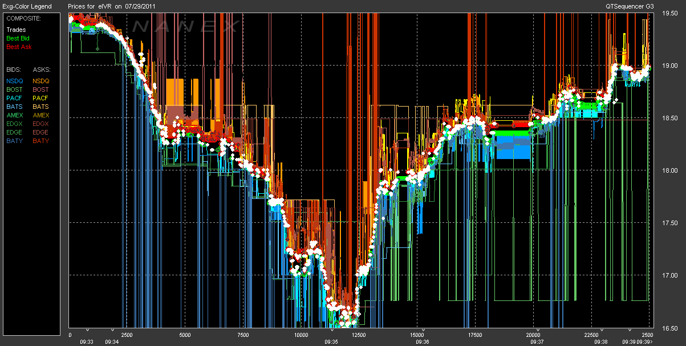

## Table of Contents

## What is high-frequency trading (HFT)?

High-frequency trading (HFT) is a type of trading that uses powerful computers and special programs to buy and sell stocks very quickly. These trades happen in just a few seconds or even less. People who do HFT use math and computer science to find small changes in stock prices and make lots of trades to earn small profits from each one.

HFT is different from regular trading because it happens so fast and uses a lot of technology. It can be good for the market because it helps keep prices fair by making sure there are always people buying and selling. But some people worry that HFT can make the market too risky and hard to understand for regular investors.

## Why might someone look for alternatives to high-frequency trading?

Someone might look for alternatives to high-frequency trading because it can be very risky. High-frequency trading uses computers to make lots of trades very quickly, and if something goes wrong, it can lead to big losses. Also, it needs a lot of money to set up the technology and keep it running. Not everyone has that kind of money, so they might want to try other ways of trading that are less risky and don't cost as much.

Another reason is that high-frequency trading can be hard to understand and control. It uses complicated math and computer programs, and it's not always clear why the computer is making certain trades. Some people prefer trading methods where they can make decisions based on what they know about the market, instead of relying on a computer. These other methods might be slower, but they can feel more in control and understand what's happening with their money.

## What are some basic strategies used in high-frequency trading?

One basic strategy in high-frequency trading is called [market making](/wiki/market-making). This means that the computer program buys and sells stocks very quickly to make sure there are always people willing to trade. The program tries to buy stocks at a slightly lower price and then sell them at a slightly higher price. By doing this many times, it can earn a small profit on each trade, and these small profits can add up to a lot of money.

Another strategy is called statistical [arbitrage](/wiki/arbitrage). This is when the computer looks for small differences in the prices of similar stocks or other things that can be traded. If it finds that one stock is a little cheaper than another one that should be the same price, it will buy the cheaper one and sell the more expensive one. The idea is that the prices will eventually become the same, and the computer can make money from the difference.

A third strategy is called latency arbitrage. This is all about being faster than other traders. The computer program tries to find out about changes in stock prices a tiny bit earlier than everyone else. It then makes trades based on this information before other people can react. By being the fastest, the program can make money from the small changes in prices that happen all the time.

## How do traditional investment strategies differ from high-frequency trading?

Traditional investment strategies are different from high-frequency trading because they usually take a longer time to make decisions and trades. People who use traditional strategies might look at a company's financial reports, news about the company, and what's happening in the economy to decide whether to buy or sell a stock. They might hold onto a stock for weeks, months, or even years, hoping that it will grow in value over time. This approach is often seen as more stable and less risky because it's based on careful research and long-term planning.

High-frequency trading, on the other hand, uses powerful computers to make thousands of trades in just a few seconds. These trades are based on complex math and computer programs that look for tiny changes in stock prices. The goal is to make lots of small profits from each trade, and these small profits can add up to a lot of money. High-frequency trading is much faster and more automated than traditional strategies, but it can also be riskier because it relies so much on technology and can be hard to understand and control.

## What is value investing and how does it serve as an alternative to HFT?

Value investing is a way of buying stocks that focuses on finding companies that are priced lower than they should be. People who do value investing look at a company's financial reports and other information to see if it's a good deal. They try to buy stocks when they think the price is lower than the true value of the company, and then hold onto them until the price goes up. This can take a long time, sometimes years, but the idea is that the stock will eventually be worth more, and they can sell it for a profit.

Value investing is very different from high-frequency trading ([HFT](/wiki/high-frequency-trading-strategies)). While HFT uses computers to make lots of quick trades and tries to make small profits from tiny changes in stock prices, value investing is about taking the time to find good companies and waiting for their value to grow. Value investing can be less risky because it's based on careful research and long-term thinking, instead of relying on fast technology. It's a good alternative for people who want to understand their investments better and don't want to deal with the speed and complexity of HFT.

## Can you explain the concept of long-term investing as an alternative to HFT?

Long-term investing is when you buy stocks or other investments and hold onto them for a long time, like years or even decades. The idea is to pick good companies or funds and let them grow over time. People who do long-term investing look at things like a company's earnings, its future plans, and the overall economy to decide what to buy. They believe that if they choose well, the value of their investments will go up over time, and they can make a good profit when they sell.

This is very different from high-frequency trading (HFT), which uses computers to make lots of quick trades to take advantage of small changes in stock prices. Long-term investing is slower and more patient. It's less risky because it's based on careful research and understanding of the companies you invest in, rather than relying on fast technology and complex math. People who prefer long-term investing often feel more in control and can better understand what's happening with their money, making it a good alternative to the fast-paced world of HFT.

## What role does fundamental analysis play in alternatives to HFT?

Fundamental analysis is a big part of alternatives to high-frequency trading (HFT). It's a way of looking at a company's financial health and future prospects to decide if it's a good investment. People using this method look at things like the company's earnings, its debts, and how it's doing compared to other companies. They also think about what's happening in the world and the economy that might affect the company. This helps them pick stocks that they think will grow in value over time.

In contrast to HFT, which uses computers to make quick trades based on tiny changes in stock prices, [fundamental analysis](/wiki/fundamental-analysis) takes a slower and more thoughtful approach. It's used in strategies like value investing and long-term investing, where the goal is to buy good companies and hold them for a long time. By understanding a company's true value through fundamental analysis, investors can make more informed decisions and feel more confident about their investments. This makes it a good alternative for people who want to avoid the speed and risk of HFT.

## How can algorithmic trading be adjusted to serve as an alternative to HFT?

Algorithmic trading can be adjusted to serve as an alternative to high-frequency trading by changing the speed and focus of the trading strategies. Instead of making thousands of trades in a few seconds like HFT, [algorithmic trading](/wiki/algorithmic-trading) can be set up to make trades less often, maybe over hours or days. This slower pace can help reduce the risks that come with HFT and make the trading process more understandable. The algorithms can be programmed to look at things like a company's financial health or news events, rather than just tiny changes in stock prices, to make more thoughtful trading decisions.

By adjusting the algorithms to focus on long-term trends and fundamental analysis, algorithmic trading can become a good alternative to HFT. This approach can help investors feel more in control because they can see why the computer is making certain trades. It's also less risky because it doesn't rely on being the fastest to make money. People who prefer a more stable and less stressful way of investing might find this adjusted form of algorithmic trading to be a good fit.

## What are the risks associated with moving away from high-frequency trading?

Moving away from high-frequency trading can have some risks. One big risk is that you might miss out on making quick profits. High-frequency trading can make money from tiny changes in stock prices that happen all the time. If you stop doing this, you might not be able to take advantage of these small opportunities. Another risk is that you might lose the edge that comes from using fast technology. High-frequency trading uses powerful computers to be faster than other traders, and without this speed, you might find it harder to compete in the market.

Another risk is that you might not be ready for the sudden changes that can happen in the stock market. High-frequency trading can react very quickly to new information, like news or economic reports. If you switch to a slower trading method, you might not be able to respond as fast, and this could lead to bigger losses if the market moves against you. Also, moving away from high-frequency trading might mean you need to learn new ways of investing, which can take time and might lead to mistakes while you're still figuring things out.

## How do market makers and liquidity providers operate differently from HFT firms?

Market makers and [liquidity](/wiki/liquidity-risk-premium) providers work to make sure there are always people buying and selling in the market. They do this by offering to buy and sell stocks at certain prices, which helps keep the market running smoothly. They make money by buying stocks at a slightly lower price and then selling them at a slightly higher price. This is different from high-frequency trading firms because market makers and liquidity providers focus on keeping the market stable, not on making quick profits from tiny price changes. They often hold onto stocks for a bit longer and are more concerned with making sure there's always someone to trade with.

High-frequency trading firms, on the other hand, use fast computers to make lots of trades very quickly. Their goal is to make small profits from tiny changes in stock prices that happen all the time. They don't care as much about keeping the market stable; they just want to be the fastest to make trades and earn money. This means they might not hold onto stocks for very long at all, sometimes just for a few seconds. So, while market makers and liquidity providers help keep the market running smoothly, high-frequency trading firms are more focused on speed and quick profits.

## What advanced strategies can be used to counter the effects of high-frequency trading?

One advanced strategy to counter the effects of high-frequency trading is called "iceberg orders." This is when a big order to buy or sell stocks is broken into smaller parts, so it's not easy for high-frequency traders to see the whole thing. By hiding the full size of the order, it's harder for high-frequency traders to predict and take advantage of the trade. This can help regular investors make their trades without being affected too much by the fast computers used in high-frequency trading.

Another strategy is to use "dark pools." These are private places where people can trade stocks without other people knowing about it. Because high-frequency traders can't see what's happening in dark pools, it's harder for them to use their speed to make money from these trades. By using dark pools, regular investors can protect their trades from being messed up by high-frequency trading. Both of these strategies help make the market fairer for everyone by reducing the power of high-frequency trading.

## How does regulatory compliance affect the choice between HFT and its alternatives?

Regulatory compliance can make a big difference when choosing between high-frequency trading (HFT) and other ways of investing. HFT uses very fast computers to make lots of trades, and because of this, it has to follow strict rules set by the government. These rules are there to make sure that HFT doesn't cause problems in the market. If someone wants to do HFT, they need to spend time and money to make sure they follow all these rules. This can be hard and expensive, so some people might choose other ways of investing that don't have as many rules to follow.

Alternatives to HFT, like value investing or long-term investing, often have fewer and simpler rules to follow. These methods focus on buying stocks and holding them for a long time, so they don't need the same fast technology that HFT does. Because of this, they might not need to worry as much about the strict rules that come with HFT. People who want to avoid dealing with a lot of regulations might find these other methods easier and less stressful. In the end, the choice between HFT and its alternatives can depend a lot on how much someone is willing to deal with regulatory compliance.

## References & Further Reading

[1]: Bergstra, J., Bardenet, R., Bengio, Y., & Kégl, B. (2011). ["Algorithms for Hyper-Parameter Optimization."](https://dl.acm.org/doi/10.5555/2986459.2986743) Advances in Neural Information Processing Systems 24.

[2]: ["Advances in Financial Machine Learning"](https://www.amazon.com/Advances-Financial-Machine-Learning-Marcos/dp/1119482089) by Marcos Lopez de Prado

[3]: ["Evidence-Based Technical Analysis: Applying the Scientific Method and Statistical Inference to Trading Signals"](https://www.amazon.com/Evidence-Based-Technical-Analysis-Scientific-Statistical/dp/0470008741) by David Aronson

[4]: ["Machine Learning for Algorithmic Trading"](https://github.com/stefan-jansen/machine-learning-for-trading) by Stefan Jansen

[5]: ["Quantitative Trading: How to Build Your Own Algorithmic Trading Business"](https://www.amazon.com/Quantitative-Trading-Build-Algorithmic-Business/dp/1119800064) by Ernest P. Chan